```mermaid
graph TB
    subgraph "Repository: saistemplateprojectrepo"
        direction TB

        subgraph "Developer Workflow"
            DEV["Developer / Claude Code"]
            CB["claude/* branch"]
            DEV -->|"push"| CB
        end

        subgraph "CI/CD — auto-merge-claude.yml [template]"
            direction TB
            TRIGGER{"Push to claude/*?"}
            CB --> TRIGGER
            TRIGGER -->|Yes| SHA_CHECK{"Commit SHA\n= last-processed?"}
            SHA_CHECK -->|Yes| DELETE_STALE["Delete inherited branch\n(skip merge)"]
            SHA_CHECK -->|No| MERGE["Merge into main"]
            MERGE --> UPDATE_SHA["Update\nlast-processed-commit.sha"]
            UPDATE_SHA --> DIFF["Check git diff"]
            DIFF -->|"live-site-pages/ changed"| PAGES_FLAG["pages-changed = true"]
            DIFF -->|".gs changed"| GAS_DEPLOY["Deploy GAS via curl POST\nto doPost(action=deploy)"]
            GAS_DEPLOY --> DELETE_BR
            MERGE --> DELETE_BR["Delete claude/* branch"]
            PAGES_FLAG --> DEPLOY_PAGES
            TRIGGER -->|"Direct push to main"| DEPLOY_PAGES
        end

        subgraph "GitHub Pages Deployment"
            DEPLOY_PAGES["Deploy live-site-pages/ to\nGitHub Pages"]
            LIVE["Live Site\nShadowAISolutions.github.io/saistemplateprojectrepo"]
            DEPLOY_PAGES --> LIVE
        end

        subgraph "live-site-pages/ — Hosted Content [template]"
            direction LR
            NOJEKYLL["[template] .nojekyll"]
            INDEX["[template] index.html"]
            TEST_PAGE["[template] test.html"]
            GASTPL_PAGE["[template] gas-project-creator.html"]
            SND1["[template] sounds/Website_Ready_Voice_1.mp3"]
            SND2["[template] sounds/Code_Ready_Voice_1.mp3"]

            subgraph "html-versions/ [template]"
                VERTXT["[template] indexhtml.version.txt"]
                TEST_VERTXT["[template] testhtml.version.txt"]
                GASTPL_VERTXT["[template] gas-project-creatorhtml.version.txt"]
            end

            subgraph "gs-versions/ [template]"
                INDEX_GSVER["[template] indexgs.version.txt"]
                TEST_GSVER["[template] testgs.version.txt"]
            end

            subgraph "html-changelogs/ [template]"
                INDEX_CL["[template] indexhtml.changelog.md"]
                INDEX_CL_ARCH["[template] indexhtml.changelog-archive.md"]
                TEST_CL["[template] testhtml.changelog.md"]
                TEST_CL_ARCH["[template] testhtml.changelog-archive.md"]
                GASTPL_CL["[template] gas-project-creatorhtml.changelog.md"]
                GASTPL_CL_ARCH["[template] gas-project-creatorhtml.changelog-archive.md"]
            end

            subgraph "gs-changelogs/ [template]"
                INDEX_GCL["[template] indexgs.changelog.md"]
                INDEX_GCL_ARCH["[template] indexgs.changelog-archive.md"]
                TEST_GCL["[template] testgs.changelog.md"]
                TEST_GCL_ARCH["[template] testgs.changelog-archive.md"]
            end
        end

        subgraph "Auto-Refresh Loop (Client-Side)"
            direction TB
            BROWSER["Browser loads index.html"]
            POLL["Poll indexhtml.version.txt\nevery 10s"]
            COMPARE{"Remote version\n≠ loaded version?"}
            RELOAD["Set web-pending-sound\nReload page"]
            SPLASH["Show green 'Website Ready'\nsplash + play sound"]
            BROWSER --> POLL
            POLL --> COMPARE
            COMPARE -->|Yes| RELOAD
            RELOAD --> SPLASH
            COMPARE -->|No| POLL
        end

        subgraph "Google Apps Scripts [template]"
            direction LR
            GAS_INDEX["[template] googleAppsScripts/Index/index.gs"]
            GAS_CFG["[template] index.config.json\n(source of truth for\nTITLE, DEPLOYMENT_ID,\nSPREADSHEET_ID, etc.)"]
            GAS_TEST["[template] googleAppsScripts/Test/test.gs"]
            GAS_TEST_CFG["[template] test.config.json\n(source of truth for\nTITLE, DEPLOYMENT_ID,\nSPREADSHEET_ID, etc.)"]
        end

        subgraph "GAS Self-Update Loop"
            direction TB
            GAS_APP["GAS Web App\n(Apps Script)"]
            GAS_PULL["pullAndDeployFromGitHub()\nfetches .gs from GitHub"]
            GAS_DEPLOY_STEP["Overwrites project +\ncreates new version +\nupdates deployment"]
            GAS_POSTMSG["postMessage\n{type: gas-reload}"]
            GAS_APP --> GAS_PULL
            GAS_PULL --> GAS_DEPLOY_STEP
            GAS_DEPLOY_STEP --> GAS_POSTMSG
        end

        subgraph "live-site-pages/templates/ [template]"
            TPL["[template] HtmlAndGasTemplateAutoUpdate.html.txt\n(HTML page template — never bumped)"]
            TPL_VER["[template] HtmlAndGasTemplateAutoUpdatehtml.version.txt"]
            GASTPL_CODE["[template] gas-project-creator-code.js.txt\n(GAS script template)"]
        end

        subgraph "Project Config [template]"
            CLAUDE_MD["[template] CLAUDE.md\n(project instructions)"]
            RULES["[template] .claude/rules/\n(always-loaded + path-scoped rules)"]
            SKILLS["[template] .claude/skills/\n(invokable workflow skills)"]
            REPO_VER["[template] repository.version.txt"]
            SETTINGS["[template] .claude/settings.json\n(git * auto-allowed)"]
            SHA_FILE["[template] .github/last-processed-commit.sha\n(inherited branch guard)"]
        end

        subgraph "Scripts [template]"
            INIT_SCRIPT["[template] scripts/init-repo.sh\n(one-shot fork initialization)"]
            GAS_SETUP["[template] scripts/setup-gas-project.sh\n(GAS project file creation)"]
            INIT_SCRIPT -.->|"auto-detects org/repo\nreplaces 22 files"| CLAUDE_MD
        end
    end

    TPL -.->|"copy to create\nnew pages"| INDEX
    GAS_CFG -.->|"syncs to\n(Pre-Commit #15)"| GAS_INDEX
    GAS_CFG -.->|"syncs to\n(Pre-Commit #15)"| INDEX
    GAS_TEST_CFG -.->|"syncs to\n(Pre-Commit #15)"| GAS_TEST
    GAS_TEST_CFG -.->|"syncs to\n(Pre-Commit #15)"| TEST_PAGE
    GASTPL_CODE -.->|"template source\n(setup-gas-project.sh)"| GAS_INDEX
    GASTPL_CODE -.->|"template source\n(setup-gas-project.sh)"| GAS_TEST
    TEST_PAGE -.->|"iframes"| GAS_APP
    LIVE -.->|"serves"| BROWSER
    INDEX -.->|"iframes"| GAS_APP
    GAS_POSTMSG -.->|"tells embedding\npage to reload"| BROWSER
    GAS_INDEX -.->|"source of truth\nfor GAS app\n(index.gs)"| GAS_PULL
    GAS_DEPLOY -.->|"curl POST\naction=deploy"| GAS_APP
    SHA_FILE -.->|"read by"| SHA_CHECK
    UPDATE_SHA -.->|"writes"| SHA_FILE

    style DEV fill:#4a90d9,color:#fff
    style LIVE fill:#66bb6a,color:#fff
    style SHA_FILE fill:#ef5350,color:#fff
    style DELETE_STALE fill:#ef9a9a,color:#000
    style SPLASH fill:#1b5e20,color:#fff
    style TPL fill:#ffa726,color:#000
    style GAS_INDEX fill:#ff7043,color:#fff
    style GAS_CFG fill:#ffe082,color:#000
    style GASTPL_PAGE fill:#ffa726,color:#000
    style GAS_APP fill:#42a5f5,color:#fff
    style CLAUDE_MD fill:#ce93d8,color:#000
    style RULES fill:#ce93d8,color:#000
    style SKILLS fill:#ce93d8,color:#000
    style INIT_SCRIPT fill:#78909c,color:#fff
```

# Project Architecture

> [Open in mermaid.live](https://mermaid.live/edit#pako:eNq1WVtz2kYU_is75KFOGwEmsRN7Ju1gkIFGNhokJ82EDLNIK1AtaTVaYUrj_PeevUgIJAFNp7wwszrn07ntuelbw6EuaVyjxiLB8RLZN9MIwY-t5vJg2piQmDI_pcnmGjHss5SEcYBTEif0T-KkCTyeNiQX_7l-Aqc-jQTW9ryA2CdPJKAxSdAnmjx6AV0XAfivr3_8UqRroV6AVy5BPZB22vi6S927AWJHELR-RvMER86yRASQSNN-fZ424hWDx8_AtqUgkVsjbG_U6vXRdNVpn79BeJVSLSTJgmjyfc1NGKAvmUm-7uuxa4ziE3syGgz0ybdpwwRxUEpRpsBv08b3ff245BlLJY5Q7TNhz8gadme9od77ANA9GoZ-yo-m0-g9CjBLNXCbQxgjbvk9OesWra8buq3PLLtr6MIjAUkJ8qMlSfyUuJmxp9EZe_RjJEzzsmT7XeB7-ozu9MmAA95xBsAD_UPsRyVOQSe0fzD7XS7JsAtsD7EL5obX7qqkOULhJlviEtKWX8D1R7e3ANRbEucRLcBIru955aABKhU1gf9ENLgHRIvxgrAWcpY4WhCXR5LZHejW7NboDgBSPNbUU_QepcmKHAJuLlgRa9C1Zn3dNMafhb3jgG74GXryMXJWSYDMsWWD5mAxl5qUpWdYRNh7V9CWjb8FlIpLj95M6gydE2z9fexubfVXCPxtM3FaF62ALm4HitUFkAHwXMNef0MHfjpczZHJ7Y6kxUISpeWcsoXdmrbk1pSCcYuQJW2N0UceugZwIssXYWgtsUvX3ZFFgxV3BmtCSC1X86ZPW7U582u9fMKM_D2n6F9SQSWrIQQHRGCPRimY46QsZexFxf34d_3DZ8MAdbfsqBmBFo-bICjpMLrv63_sEvuRS_5qLtOwTG3rli303eVICUurGSCUbdOoYFlgpinbak5CMFSragTrvn--y8roKnJZ6xOZcxPOJgS7m9lH6jtkdt4M49dVEJ1KCF6bavh3EQq-40JqTyRhPGhaB3zEfx_1if2HXWFejtJUKM30r7Qkc27tKghu75MQlPmrMCoccBRyL6L3LLNgJ9tFRN1sYIFgFcZZsNNMU8HPLXOE_bASwr0yuQd0caIiPaPOxTlSM3QrFckAZt1Jb3gURcOJs4TkUYcmzLIvTR4tR4VR7BWylDGOiaJCb1-YurA7KluOVyHdUdBDwh4N6n8bDYPKcICoPDEYBvXRUAQ5KRYGVcFwiigZd00snCqIMO7xgtjlXfqEeAmBxsKgNEZnvcCHGqhZvsvb01Ob9JvJ-JMlksJNQtcMBpGAYpcdqmnmWFRLkwZBTW6eRjDWJBt03i63Fr3xndmd6N_41BVS6LwUIzBBUe9ctoUAUNTVebmHn-jGuNsHCSySojWZazHYyY8WmihSgDMhHALxVqFc2kyja3H_WEu6RouEkAj9pCojEpXtJ0Bg4Dkw7C8I_jey-JWQlOVEH8NNUjaSeKT0rTTCdgiROlXpKUCk1PUYfN7YleFAL0npIiCoG8cMWU7ixyn7ocaJN90VzdBCwHN0Bd4a8RhpyYBasMrmvXc7qGqpHBp5_qL5JxPhcQZ-SByCqMcHjnSJPJrAsT2yDf2V6i3v9Ht7Nuq_4g2rOdG7fWuo6-IEkdRpVo8O_OoeU8KGO9wSbVuNCrIU7OshOP5nNQ64GoYqiwSeJodJkShOTw1cq65pfpE4cEd4zHAFCqFTbVDzQWSIeBUE3ciVY8htQkM5c5y9BBAP9FjCMMNHQw8eIfnswGgHE7rOhRlDYljz0ZwhVcLQLwAoyhicRWSdpQ5xvhKqM-QWpqYqkWHkvLPEcAszxR3M2jx7TKNv6SYm16JgJiKtfK9kBzuJi5ppX22TnKSg0UF1t5hSvB-ZlbJgPFiMoVPYDdwh5HTw3QAzW53xkiPjSJQFlejPhvadIVItypiz4UwUATRfhTFxy3Gi2uzT33q02c4annH_-Oik8Z0g3MhMCx7hTER0rsapl8xUQdgTt_yAjXtG96Gvz-76u9LJY94LgBxZRPsRg-Qg7iUr227yYIgBvziwqgVGsgrA0xwKB2u8YZqqplDKcLrUmEPBG0hQVSyxPowMowaYPfpBIJH96Ik-4jkUkbVabiL5tEJS3RyX3Zzk-9aDDrV02x7dD-oEImkKVZ_leZWvuH6W-0scgFBVUcfXdLcjYy9A1CqjVb9qE1rvbgTRYoUT99QoOV5pR_cje2b1JiNzrxgxVYL8yE81bjqQiAtEI7jnS5ryAvKI-FMfB_7fmAdNdV4Ggz6Y1eBgzVWsFW6Kegm_GFlQej64XFygyjcUFEBaU6y_hDNckgI3QzRZtMRaaBrBX4DByqjTEahMLKuz-7Fnzz3Dwh3P4CGYN2KvLHI_4PLkH8uN1rMcDiSP6jEyPraJHCbXYGdmQjS1RH5xfvEy20_-MPMeY9YW_ItXc5YfBsgXTjlClhMzgDxNyz5EdCQVzq-xxH9F2yqXS5pB-V6CQ-k6VVIlIV8S5tqT5EmSqPZbkggZj-EU6uhWeshaiIRz4vIJAqSXlYwiWexLL8oNkgu028zxzoYmYpuNZbOU9b25BbbtQXFtrQK6sP3e2XmXlMkSWcYJNwASk6DLP0VIyuJXAUkru6eMlKNkd4ulG7ji_DsS3Mrg-sUbfNV2r145NKDJ9QvP84pkwi-S7vJyPr_ENXS5qJKWeBevL9o1tMWPMTn9Fb7Ksdvt9g62GIwU5fn8gnTqkHnakGSeh992LmsAtw7OiN-237yuwcwyQ0ZK2u869bjZXvdUMXhPqdzQwRfeRY0QedpUxA65eu2-q8EVncMphLIVOIWymPYl-dt3V-0rpyBu4xVqhCQJse_y77Aw-6dLEsJwfj1tuMTDqwCK_3dOxQuGBRkOyPhHJTiR_Xvfx1BJQ3X8_R9_Ehmc) — *interactive editor with pan, zoom, and export*



<details>
<summary>Copy code for mermaid.live</summary>

```
graph TB
    subgraph "Repository: saistemplateprojectrepo"
        direction TB

        subgraph "Developer Workflow"
            DEV["Developer / Claude Code"]
            CB["claude/* branch"]
            DEV -->|"push"| CB
        end

        subgraph "CI/CD — auto-merge-claude.yml [template]"
            direction TB
            TRIGGER{"Push to claude/*?"}
            CB --> TRIGGER
            TRIGGER -->|Yes| SHA_CHECK{"Commit SHA\n= last-processed?"}
            SHA_CHECK -->|Yes| DELETE_STALE["Delete inherited branch\n(skip merge)"]
            SHA_CHECK -->|No| MERGE["Merge into main"]
            MERGE --> UPDATE_SHA["Update\nlast-processed-commit.sha"]
            UPDATE_SHA --> DIFF["Check git diff"]
            DIFF -->|"live-site-pages/ changed"| PAGES_FLAG["pages-changed = true"]
            DIFF -->|".gs changed"| GAS_DEPLOY["Deploy GAS via curl POST\nto doPost(action=deploy)"]
            GAS_DEPLOY --> DELETE_BR
            MERGE --> DELETE_BR["Delete claude/* branch"]
            PAGES_FLAG --> DEPLOY_PAGES
            TRIGGER -->|"Direct push to main"| DEPLOY_PAGES
        end

        subgraph "GitHub Pages Deployment"
            DEPLOY_PAGES["Deploy live-site-pages/ to\nGitHub Pages"]
            LIVE["Live Site\nShadowAISolutions.github.io/saistemplateprojectrepo"]
            DEPLOY_PAGES --> LIVE
        end

        subgraph "live-site-pages/ — Hosted Content [template]"
            direction LR
            NOJEKYLL["[template] .nojekyll"]
            INDEX["[template] index.html"]
            TEST_PAGE["[template] test.html"]
            GASTPL_PAGE["[template] gas-project-creator.html"]
            SND1["[template] sounds/Website_Ready_Voice_1.mp3"]
            SND2["[template] sounds/Code_Ready_Voice_1.mp3"]

            subgraph "html-versions/ [template]"
                VERTXT["[template] indexhtml.version.txt"]
                TEST_VERTXT["[template] testhtml.version.txt"]
                GASTPL_VERTXT["[template] gas-project-creatorhtml.version.txt"]
            end

            subgraph "gs-versions/ [template]"
                INDEX_GSVER["[template] indexgs.version.txt"]
                TEST_GSVER["[template] testgs.version.txt"]
            end

            subgraph "html-changelogs/ [template]"
                INDEX_CL["[template] indexhtml.changelog.md"]
                INDEX_CL_ARCH["[template] indexhtml.changelog-archive.md"]
                TEST_CL["[template] testhtml.changelog.md"]
                TEST_CL_ARCH["[template] testhtml.changelog-archive.md"]
                GASTPL_CL["[template] gas-project-creatorhtml.changelog.md"]
                GASTPL_CL_ARCH["[template] gas-project-creatorhtml.changelog-archive.md"]
            end

            subgraph "gs-changelogs/ [template]"
                INDEX_GCL["[template] indexgs.changelog.md"]
                INDEX_GCL_ARCH["[template] indexgs.changelog-archive.md"]
                TEST_GCL["[template] testgs.changelog.md"]
                TEST_GCL_ARCH["[template] testgs.changelog-archive.md"]
            end
        end

        subgraph "Auto-Refresh Loop (Client-Side)"
            direction TB
            BROWSER["Browser loads index.html"]
            POLL["Poll indexhtml.version.txt\nevery 10s"]
            COMPARE{"Remote version\n≠ loaded version?"}
            RELOAD["Set web-pending-sound\nReload page"]
            SPLASH["Show green 'Website Ready'\nsplash + play sound"]
            BROWSER --> POLL
            POLL --> COMPARE
            COMPARE -->|Yes| RELOAD
            RELOAD --> SPLASH
            COMPARE -->|No| POLL
        end

        subgraph "Google Apps Scripts [template]"
            direction LR
            GAS_INDEX["[template] googleAppsScripts/Index/index.gs"]
            GAS_CFG["[template] index.config.json\n(source of truth for\nTITLE, DEPLOYMENT_ID,\nSPREADSHEET_ID, etc.)"]
            GAS_TEST["[template] googleAppsScripts/Test/test.gs"]
            GAS_TEST_CFG["[template] test.config.json\n(source of truth for\nTITLE, DEPLOYMENT_ID,\nSPREADSHEET_ID, etc.)"]
        end

        subgraph "GAS Self-Update Loop"
            direction TB
            GAS_APP["GAS Web App\n(Apps Script)"]
            GAS_PULL["pullAndDeployFromGitHub()\nfetches .gs from GitHub"]
            GAS_DEPLOY_STEP["Overwrites project +\ncreates new version +\nupdates deployment"]
            GAS_POSTMSG["postMessage\n{type: gas-reload}"]
            GAS_APP --> GAS_PULL
            GAS_PULL --> GAS_DEPLOY_STEP
            GAS_DEPLOY_STEP --> GAS_POSTMSG
        end

        subgraph "live-site-pages/templates/ [template]"
            TPL["[template] HtmlAndGasTemplateAutoUpdate.html.txt\n(HTML page template — never bumped)"]
            TPL_VER["[template] HtmlAndGasTemplateAutoUpdatehtml.version.txt"]
            GASTPL_CODE["[template] gas-project-creator-code.js.txt\n(GAS script template)"]
        end

        subgraph "Project Config [template]"
            CLAUDE_MD["[template] CLAUDE.md\n(project instructions)"]
            RULES["[template] .claude/rules/\n(always-loaded + path-scoped rules)"]
            SKILLS["[template] .claude/skills/\n(invokable workflow skills)"]
            REPO_VER["[template] repository.version.txt"]
            SETTINGS["[template] .claude/settings.json\n(git * auto-allowed)"]
            SHA_FILE["[template] .github/last-processed-commit.sha\n(inherited branch guard)"]
        end

        subgraph "Scripts [template]"
            INIT_SCRIPT["[template] scripts/init-repo.sh\n(one-shot fork initialization)"]
            GAS_SETUP["[template] scripts/setup-gas-project.sh\n(GAS project file creation)"]
            INIT_SCRIPT -.->|"auto-detects org/repo\nreplaces 22 files"| CLAUDE_MD
        end
    end

    TPL -.->|"copy to create\nnew pages"| INDEX
    GAS_CFG -.->|"syncs to\n(Pre-Commit #15)"| GAS_INDEX
    GAS_CFG -.->|"syncs to\n(Pre-Commit #15)"| INDEX
    GAS_TEST_CFG -.->|"syncs to\n(Pre-Commit #15)"| GAS_TEST
    GAS_TEST_CFG -.->|"syncs to\n(Pre-Commit #15)"| TEST_PAGE
    GASTPL_CODE -.->|"template source\n(setup-gas-project.sh)"| GAS_INDEX
    GASTPL_CODE -.->|"template source\n(setup-gas-project.sh)"| GAS_TEST
    TEST_PAGE -.->|"iframes"| GAS_APP
    LIVE -.->|"serves"| BROWSER
    INDEX -.->|"iframes"| GAS_APP
    GAS_POSTMSG -.->|"tells embedding\npage to reload"| BROWSER
    GAS_INDEX -.->|"source of truth\nfor GAS app\n(index.gs)"| GAS_PULL
    GAS_DEPLOY -.->|"curl POST\naction=deploy"| GAS_APP
    SHA_FILE -.->|"read by"| SHA_CHECK
    UPDATE_SHA -.->|"writes"| SHA_FILE

    style DEV fill:#4a90d9,color:#fff
    style LIVE fill:#66bb6a,color:#fff
    style SHA_FILE fill:#ef5350,color:#fff
    style DELETE_STALE fill:#ef9a9a,color:#000
    style SPLASH fill:#1b5e20,color:#fff
    style TPL fill:#ffa726,color:#000
    style GAS_INDEX fill:#ff7043,color:#fff
    style GAS_CFG fill:#ffe082,color:#000
    style GASTPL_PAGE fill:#ffa726,color:#000
    style GAS_APP fill:#42a5f5,color:#fff
    style CLAUDE_MD fill:#ce93d8,color:#000
    style RULES fill:#ce93d8,color:#000
    style SKILLS fill:#ce93d8,color:#000
    style INIT_SCRIPT fill:#78909c,color:#fff
```

</details>

Developed by: ShadowAISolutions
