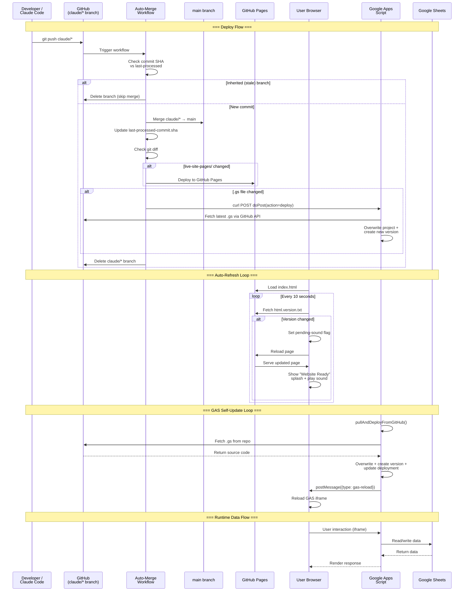
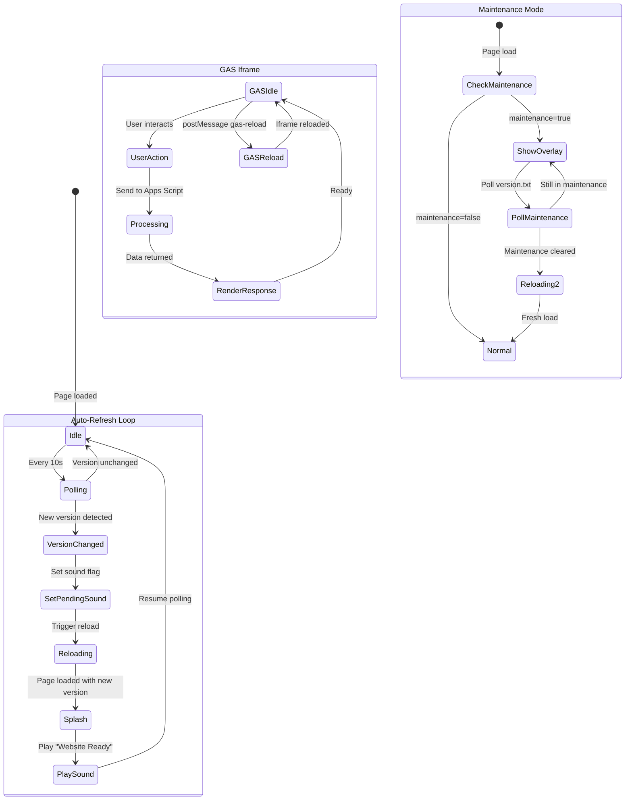
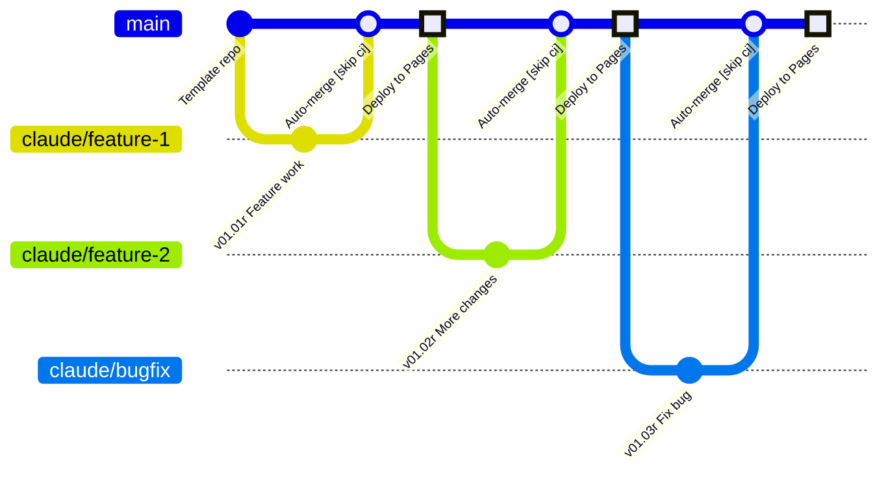
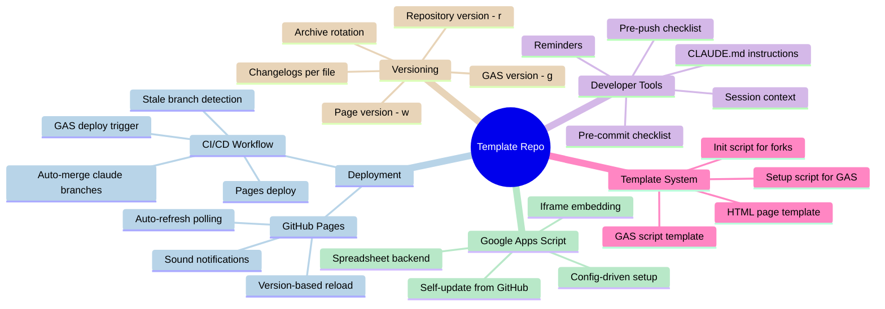
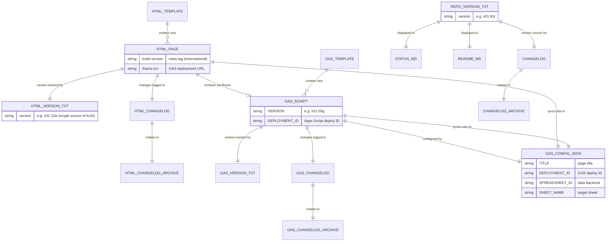
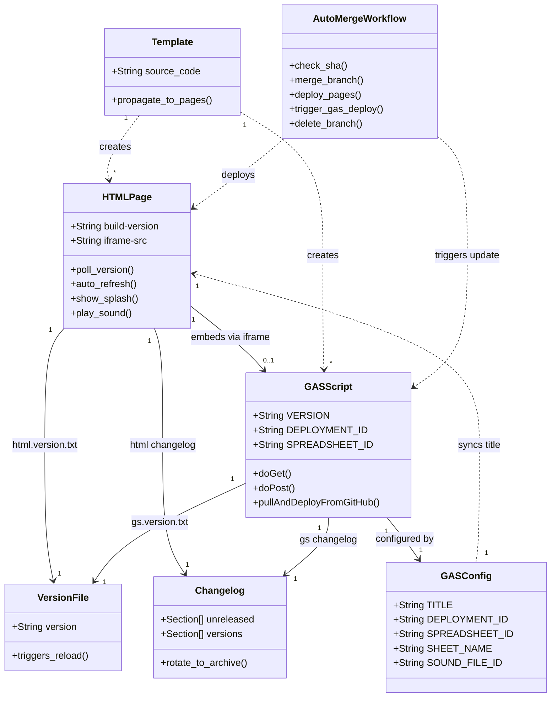

# Project Architecture

## 1. Flowchart — System Overview

> [Open in mermaid.live — Flowchart](https://mermaid.live/edit#pako:eNq1Wd1ym0gWfpUu5WKcGSPZzjiJXZXdwghLmmCLEjiZVJRStaCRGANN0cgabZyqvZ37eYB9tnmSPd0NCAmQmGytb1zVnPP1-evzp68dh7qkc91ZJDheIvtmGiH4Y6u5PJh2JiSmzE9psrlGDPssJWEc4JTECf2NOGkCn6cdycX_XD-BU59GAmt7XkLskycS0Jgk6CNNHr2ArssA_K-vf_hcpushLcArlyANhJ12vuxSazdA7AiC3o9onuDIWVaIABIpyj-ep514xeDzM7BtKUjkNgirjXpaH_317z8RXqVUCUmyIIq8rLsJA_Q5t8eXfSV2LVH-Yk9Gg4E--TrtmCALSinKpf_ntPNtXzkuds5SiyP0-kTYM7KG6kwb6tp7gNZoGPopP5pOo3cowCxVwGcOYYy41XsK1i1aXzd0W59Ztmrowh0BSQnyoyVJ_JS4uaWn0Ql79GMkTPOyYvhd4Hv6jO70yYAD3nEGwAP9Q-xHFU5BJ7R_MPsql2SoAttD7IK54dpdlRRHKNxlS1xB2vILuP7o9haAtCVxHtECjOT6nleNGKDKQibwn4gCj4AoMV4Q1kPOEkcL4vIwMtWBbs1uDXUAkOKzkn1F71CarMgh4O6ClbEGqjXr66Yx_iTsHQd0w8_Qk4-Rs0oCZI4tGzQHi7nUpCw9wSLC3rmCtmr8LaBUXHr0ZtJk6IJg6-9jD2urf4bAb5uJ0-ZoBXTxOlCcPQAZAM8N7M3Pc-Cnw9UcmdzuSFosJFFaTShb2K1pK25NKRi3DFnR1hh94KFrACeyfBGG1hK7dK2OLBqsuDNYF0JquZp3fdprTJhfmuUTZuT3tNG_ogLPVEOIDAg_jUYp2KJVijL2QuJ-_Iv-_pNhgK5bdtSNQIXHTRBUFBjd9_Vfd4n9yCW_d5dpWKW2dcsWyu5ypISl9QwQx7Zp1LAsMFMywypOQjDUqXoE675_vsvK6CpyWe8jmXP7zSYEu5vZB-o7ZHbeDeNXdRAXtRC8KjXw7yKUHMeFVJ5IwnjE9A74iP990Cf2r3aNeTlKN0Pppr-nFZkLa9dBcHu3QsjMX4dR44CjkHvhvGeZBWttFxF1s4EFgtUYZ8HamaaGn1vmCPthJYR7ZWYP6KKlIprR5OICqRu6tYrkADN1og2Poig4cZaQOZrQhFn2pSmi5agwGXuNLFWMY6JkobcvTFPYHZWtwKuR7ijoIWGPBvXfjYZBbThAVLYMhkFzNJRBWsXCoC4Y2oiSczfEQltBhHGPV0OVt-gT4iUEugqD0hidaIEPNVCxfJf3pm079JvJ-KMlksJNQtcMRpCAYpcdqmnmWFRLkwZBQ26eRjDQJBt0flbtK7TxnalO9K983goptF0ZIzD99cd_xO1Q0bPDavc-0Y2x2ofrLZKiNZkrMRjJjxaKqFAAMiEcAvEmoVrXTEO1uHOsJV2jRUJIhH7IyiISZe0HQGDgNrDqTwj-b2TlqyBlZhMdDLdH1ULiU6ZsrQW244fUqU5PASKlbsbgk8auDAe6SEoXAUFqHDNkOYkfp-y7uibebtd0QgsBz9Ez8N6IB0hPRtOC1bbt2u2grp9yaOT5i-5vTMTGCfghcQiiHh810iXyaALH9sg29NOsq7zT7-3ZqH_KW1Vzoqt9a6jr4gSR1OnWDw383R5TwoYH3BM9W4MKsg7s6yE4_s9qHHA1jFMWCTxFjpEiS7TPC1wr1TQ_Sxx4IzxmuAKl0Kk3qPkg0kO8CgI1cuUAcpvQUE4bJy8BxAM9ljDG8KHQg09Ifjsw1MFsrnNhxpAY1nwoZyirX-gnABQ1DM4iss5ThzhfCdUZckvzUp3IMGzeWWKshYHiDqZsnj2m0dd0E5NrUS0TkVa-1bKDncRDzbWvt0lBUtLooLpbTCne90xJeTAerMTQJuwG7hASOvhugJmdnfF6I-NI1IQsy58M7TtDpFqUM4uxTKR_NF-FMXGrQZI12O2vPNpm563OuH98aFL4GhCeY64CD28mwrnQoe0LM7MI1MQTP2BgzVAf-vrsrr8rnTzmXQDIkYezHzHIDOJRsqrtJg-GmOvLo2q2t0hWAbiZQ-FgjTdMyUop1DGcLhXmUPAGElQ1u6v3I8NoAGaPfhBIZD96oo94DhVknS00kfxaI6lujqtuTood60GHWrptj-4HTQKRNIWSz4qkyjdbP8q1JQ5AqLqo49u525GxFyDZBqPXvGETWu8uAtFihRO3bZQcL7Oj-5E9s7TJyNyrRCyrP37kpwo3HUjEBaIRPPIlTXn1eET8q48D_1-YB019UgaDPpj14GDNVayUXkp2CX8YeVB6PrhcPKDaG0oKIKUrtl7CGS5JgZshmix6Yhs0jeBfgMHK6OJCoDKxoM7fx5499wwLbzyHh2DeiHWySPyAyzN_LBdZz3IskDxZg5HzsU3kMLn9OjETomS74xfnly_zteR3M-8x5j3B37ias3w3QLFqKhDynJgDFDlaNiGiHalxfoMl_le0rXKFpDmU7yU4lK7L6qkk5LvBQnuSPEmSrPeWJELGYzilIrqVHrIWIuGcuHx8AOllGaNIVvrKRYVBCoF2Ozne1tBELLGx7JTyprewwLY3KG-rs4AuLb13Vt0VZfJElnPCC4DEJOiKXyAkZfnHAEkrW6eclKPkb4ulG3ji_LcjeJXB9Yuf8dWZe3Xq0IAm1y88zyuTCb9Iutev5_PXuIGuEFXSEu_y1eVZA235N5iC_gpfFdhnZ2c72GIqyijP55fkogmZpw1J5nn4zcXrBsCtg3PiN2c_v2rAzDNDTkrO3l404-Yb3bZi8IYyc8MFvvQuG4Qo0mZG7JCrV-7bBlzRObQhlK1AG8py2pfkb95enV05JXE7p52QJCH23c51B2b-dElCmMuvpx2XeHgVQOn_BjS8WliQ3jrX_Hek047s2_s-hiIaysNv_wWBwxpG) — *interactive editor with pan, zoom, and export*

```mermaid
graph TB
    subgraph "Repository: saistemplateprojectrepo"
        direction TB

        subgraph "Developer Workflow"
            DEV["Developer / Claude Code"]
            CB["claude/* branch"]
            DEV -->|"push"| CB
        end

        subgraph "CI/CD — auto-merge-claude.yml [template]"
            direction TB
            TRIGGER{"Push to claude/*?"}
            CB --> TRIGGER
            TRIGGER -->|Yes| SHA_CHECK{"Commit SHA\n= last-processed?"}
            SHA_CHECK -->|Yes| DELETE_STALE["Delete inherited branch\n(skip merge)"]
            SHA_CHECK -->|No| MERGE["Merge into main"]
            MERGE --> UPDATE_SHA["Update\nlast-processed-commit.sha"]
            UPDATE_SHA --> DIFF["Check git diff"]
            DIFF -->|"live-site-pages/ changed"| PAGES_FLAG["pages-changed = true"]
            DIFF -->|".gs changed"| GAS_DEPLOY["Deploy GAS via curl POST\nto doPost(action=deploy)"]
            GAS_DEPLOY --> DELETE_BR
            MERGE --> DELETE_BR["Delete claude/* branch"]
            PAGES_FLAG --> DEPLOY_PAGES
            TRIGGER -->|"Direct push to main"| DEPLOY_PAGES
        end

        subgraph "GitHub Pages Deployment"
            DEPLOY_PAGES["Deploy live-site-pages/ to\nGitHub Pages"]
            LIVE["Live Site\nShadowAISolutions.github.io/saistemplateprojectrepo"]
            DEPLOY_PAGES --> LIVE
        end

        subgraph "live-site-pages/ — Hosted Content [template]"
            direction LR
            NOJEKYLL["[template] .nojekyll"]
            INDEX["[template] index.html"]
            TEST_PAGE["[template] test.html"]
            GASTPL_PAGE["[template] gas-project-creator.html"]
            SND1["[template] sounds/Website_Ready_Voice_1.mp3"]
            SND2["[template] sounds/Code_Ready_Voice_1.mp3"]

            subgraph "html-versions/ [template]"
                VERTXT["[template] indexhtml.version.txt"]
                TEST_VERTXT["[template] testhtml.version.txt"]
                GASTPL_VERTXT["[template] gas-project-creatorhtml.version.txt"]
            end

            subgraph "gs-versions/ [template]"
                INDEX_GSVER["[template] indexgs.version.txt"]
                TEST_GSVER["[template] testgs.version.txt"]
            end

            subgraph "html-changelogs/ [template]"
                INDEX_CL["[template] indexhtml.changelog.md"]
                INDEX_CL_ARCH["[template] indexhtml.changelog-archive.md"]
                TEST_CL["[template] testhtml.changelog.md"]
                TEST_CL_ARCH["[template] testhtml.changelog-archive.md"]
                GASTPL_CL["[template] gas-project-creatorhtml.changelog.md"]
                GASTPL_CL_ARCH["[template] gas-project-creatorhtml.changelog-archive.md"]
            end

            subgraph "gs-changelogs/ [template]"
                INDEX_GCL["[template] indexgs.changelog.md"]
                INDEX_GCL_ARCH["[template] indexgs.changelog-archive.md"]
                TEST_GCL["[template] testgs.changelog.md"]
                TEST_GCL_ARCH["[template] testgs.changelog-archive.md"]
            end
        end

        subgraph "Auto-Refresh Loop (Client-Side)"
            direction TB
            BROWSER["Browser loads index.html"]
            POLL["Poll indexhtml.version.txt\nevery 10s"]
            COMPARE{"Remote version\n≠ loaded version?"}
            RELOAD["Set web-pending-sound\nReload page"]
            SPLASH["Show green 'Website Ready'\nsplash + play sound"]
            BROWSER --> POLL
            POLL --> COMPARE
            COMPARE -->|Yes| RELOAD
            RELOAD --> SPLASH
            COMPARE -->|No| POLL
        end

        subgraph "Google Apps Scripts [template]"
            direction LR
            GAS_INDEX["[template] googleAppsScripts/Index/index.gs"]
            GAS_CFG["[template] index.config.json\n(source of truth for\nTITLE, DEPLOYMENT_ID,\nSPREADSHEET_ID, etc.)"]
            GAS_TEST["[template] googleAppsScripts/Test/test.gs"]
            GAS_TEST_CFG["[template] test.config.json\n(source of truth for\nTITLE, DEPLOYMENT_ID,\nSPREADSHEET_ID, etc.)"]
        end

        subgraph "GAS Self-Update Loop"
            direction TB
            GAS_APP["GAS Web App\n(Apps Script)"]
            GAS_PULL["pullAndDeployFromGitHub()\nfetches .gs from GitHub"]
            GAS_DEPLOY_STEP["Overwrites project +\ncreates new version +\nupdates deployment"]
            GAS_POSTMSG["postMessage\n{type: gas-reload}"]
            GAS_APP --> GAS_PULL
            GAS_PULL --> GAS_DEPLOY_STEP
            GAS_DEPLOY_STEP --> GAS_POSTMSG
        end

        subgraph "live-site-pages/templates/ [template]"
            TPL["[template] HtmlAndGasTemplateAutoUpdate.html.txt\n(HTML page template — never bumped)"]
            TPL_VER["[template] HtmlAndGasTemplateAutoUpdatehtml.version.txt"]
            GASTPL_CODE["[template] gas-project-creator-code.js.txt\n(GAS script template)"]
        end

        subgraph "Project Config [template]"
            CLAUDE_MD["[template] CLAUDE.md\n(project instructions)"]
            RULES["[template] .claude/rules/\n(always-loaded + path-scoped rules)"]
            SKILLS["[template] .claude/skills/\n(invokable workflow skills)"]
            REPO_VER["[template] repository.version.txt"]
            SETTINGS["[template] .claude/settings.json\n(git * auto-allowed)"]
            SHA_FILE["[template] .github/last-processed-commit.sha\n(inherited branch guard)"]
        end

        subgraph "Scripts [template]"
            INIT_SCRIPT["[template] scripts/init-repo.sh\n(one-shot fork initialization)"]
            GAS_SETUP["[template] scripts/setup-gas-project.sh\n(GAS project file creation)"]
            INIT_SCRIPT -.->|"auto-detects org/repo\nreplaces 22 files"| CLAUDE_MD
        end
    end

    TPL -.->|"copy to create\nnew pages"| INDEX
    GAS_CFG -.->|"syncs to\n(Pre-Commit #15)"| GAS_INDEX
    GAS_CFG -.->|"syncs to\n(Pre-Commit #15)"| INDEX
    GAS_TEST_CFG -.->|"syncs to\n(Pre-Commit #15)"| GAS_TEST
    GAS_TEST_CFG -.->|"syncs to\n(Pre-Commit #15)"| TEST_PAGE
    GASTPL_CODE -.->|"template source\n(setup-gas-project.sh)"| GAS_INDEX
    GASTPL_CODE -.->|"template source\n(setup-gas-project.sh)"| GAS_TEST
    TEST_PAGE -.->|"iframes"| GAS_APP
    LIVE -.->|"serves"| BROWSER
    INDEX -.->|"iframes"| GAS_APP
    GAS_POSTMSG -.->|"tells embedding\npage to reload"| BROWSER
    GAS_INDEX -.->|"source of truth\nfor GAS app\n(index.gs)"| GAS_PULL
    GAS_DEPLOY -.->|"curl POST\naction=deploy"| GAS_APP
    SHA_FILE -.->|"read by"| SHA_CHECK
    UPDATE_SHA -.->|"writes"| SHA_FILE

    style DEV fill:#4a90d9,color:#fff
    style LIVE fill:#66bb6a,color:#fff
    style SHA_FILE fill:#ef5350,color:#fff
    style DELETE_STALE fill:#ef9a9a,color:#000
    style SPLASH fill:#1b5e20,color:#fff
    style TPL fill:#ffa726,color:#000
    style GAS_INDEX fill:#ff7043,color:#fff
    style GAS_CFG fill:#ffe082,color:#000
    style GASTPL_PAGE fill:#ffa726,color:#000
    style GAS_APP fill:#42a5f5,color:#fff
    style CLAUDE_MD fill:#ce93d8,color:#000
    style RULES fill:#ce93d8,color:#000
    style SKILLS fill:#ce93d8,color:#000
    style INIT_SCRIPT fill:#78909c,color:#fff
```

## 2. Sequence Diagram — Interaction Flows

> [Open in mermaid.live — Sequence](https://mermaid.live/edit#pako:eNqNVs1u2zgQfpWBTnYT2e1V2ATwJnVcoGmDuF1ffGGkkcSGJrkkZdcIct0H2EfcJ9khKf_IVtD6Ikuc3-_7ZqSXJFcFJlli8e8GZY63nFWGrZYS6KeZcTznmkkHt7gGZv0FhdJoYPzHkxlf3wjWFAg3FOXc527mXe64mzVPwXqQB_PxO3gyTOb18NxnMfU-k8ap9B5NhcFvocxzKdTm3PyecekdVv4ag54bPbAK7aGUeH9u9qdRG0udkeF3f23ve_qazEM0pSqBMNHahirnueHanZvPa0Rnjzzig6WMpl-UQ1BrSkjgXsazDK6uruheC7WFKXXu73cOZJZeX9_NMqi4A93YGna4RoO7GZ0vphl8M7yqKPCmg99i2h7f1Jg_Q65WK4ozn01CF2sLglmXaqNytBaL6MSEg0-yRsMdFjCwjgkcdhDfh_aV3aJAaiuek_kz17DyfLaUo7AIX3DTZj-J4FnNIPC_bw3---ffQPOJrW_kuy4YZevWncbQI1uzHpfYuwew4GV5MPB9Cr7G1FKjqfZKGUNeM1ntkOiEClLKdkw51SOx0K4suilGlYWSkxbeDk0qyyBvjICHr_NvUKgHZd2A5Y4reVWEhMOuG3m08E_REeyCQLEx15qzXWmTh0-9bj7dV5LhxlMMBOMPzB1cBFHkBj3AkggjC0sVvNHbqQBOBr4l33v8SvxhBTxiaZD0_VkpfTwC7WgeCPisWAFcFvhzVLuViFbCe32k4Fv48B4s5koWR6ScBYmoef9R2-XI_XRd4v6KB_28HSK2_zKYI40oNcxllVrVyAJKwaq33NpCHmnHUj9efV3LcN4Nb9YITdB_n0NfRTWtk2WywCcvccrFiu0yCTRbTSNUwwXQdQuh3B6ef4s-vyPnKMq0nc1TBo9EpxshJrKIMzQ1ahWFOhh2LPeqDqNDVmBQq_3C2wV7RNcY6Ws3Oclv_17qFfkFtMJu6W7VHuGEOGMrlO44xB5HTeN4T5uGMB-8uK1G2sfMpiZw9zo8FereryXXA8RLetfir8F8bKTjK4Rb5tjZ6-CQInQXXl1cOjRxVcAgZumguQvuyR9HLKjldk_Gw1NED-c-RLchmjtDdFitpMXkMqFNT5u6oO-Kl2XiaqQek2yZFFiyRrhl8ko2jOZ7vpV5kjnT4GUSQW-_P-LD1_8B14K_CQ) — *interactive editor with pan, zoom, and export*

## 3. State Diagram — Page Lifecycle

> [Open in mermaid.live — State](https://mermaid.live/edit#pako:eNqFVNuK2zAQ_ZVBj2VT2jwaWgi7bVlotiHu5aHeB9Ua26KKZCQ5aQj5944sx5bTsDUYxOicuZyZ0YmVRiDLmPPc44PkteW7xX5ZaKDv56tnWCzew6NQmMGG1wjKcIGi0BHQs6Bgq86bxRYri66Bz8a0BQPuwA6WU0SHL7jqfW6MUlLXGXzYoz3C2zduAg13SezvaJ00GjpdNlzXIYNb4AF2HzEZPOEB9gNVoMfSp8w5uneQo9-gFuQvN50mD2QAF45QKV5P3CtgT95iUKcv6quVdY2WFAimiTZCYrRWcdfMlIWD9A3oKe8kZI-O4il-HBIMR-rAD_zlJPVii1wcC5bIc4Emam7RdTuENioXsefrnn5a5fBY0ThgbGZNf9JIuh57-c2hXZWess36M0jt0fLSJz2dMLECa0p0rhcrJyHBG1i1rYO8tLL1Sf4jcNBYC7RUQGu0o1IeuOeksu-sxpnOKaxnDglng0T6dil0jj3KSB7n1xQ6NIeKX1z3coTO3UfNhs5fcvpH3TUPGmmuS4Q1rWDUeBesqcqXDbxvsPydcJKZmcDXoDhjjTl8oVmiMcii_3j5ztsO_8N9MnbH1ZxWceUSXuJ-XOt5nmS4zPJr_8fPF_fFbHMviSt1Gv9l-rheywzSu1Iht3hrD5ezQj_2z9Wk6pndsR3SnRT0Rp4K5hsM-5AVTGDFO-ULFjCc3r_8qEuWBVXvWNeK6TmNxvNf5Ie7wA) — *interactive editor with pan, zoom, and export*

## 4. Git Graph — Branching Strategy

> [Open in mermaid.live — Git Graph](https://mermaid.live/edit#pako:eNqVktFqwjAUhl_lcK51s91d7wYyHWwwmHfLLmJy2oY2TYjJZhHffWFx4lBLDeQm58_385HsUBhJWGCl_MJxW7MO4hJGa-VByQIYrkjblnsCR9YwTIm1452oQbQ8SLovifvgaJodrtckGhP8tfEp_WuW3c0yB08pA9_GNX8lR47mqktHmlxFZ9wD6zF4M02Jj02jLAj1eWSdls7JtqYHb-CNV7RhCL63VMDyebF8iXs1JJkPS-bXJHMHryYaipp3v6W3SeYDkjDGEsZprkNVqu1lx3-zM8GH-IpqCzE01i3xhsTGmV1QwwlGVuyV8XfvGPqaNDEsGEoqeWg9w33M8Fj63ncCC-8CTTBYGb_6XPHKcZ0O9z9fQQfz) — *interactive editor with pan, zoom, and export*

## 5. Architecture — System Topology (mermaid.live only)

> [Open in mermaid.live — Architecture](https://mermaid.live/edit#pako:eNp9UstugzAQ_BXLJ5CSH-CWh5QeGqlKWvUAOSx4A1YAo7WdKIry7zV2oKRSyml3dsY7HnzjhRLIEw5UVNJgYSzhPEcDWcvcV5KyHSPsVFTUyoo43UjzZnO2c5CWRtH1MGWWSpU1jlzfsVXfOVogaqSzLJAJPEeyNUgtmjhd4xlr1SEdnlk5QVtUkZD6FKerGqxAtvTYgcnWO3sWXBSdjrW6RD2AFKcLaxTbIpX4QtGAbB8Ltq78__gOStQT3484Pnr4haQEPZrZLPbsG3O26DrPDnk983WFaHQkwEAOGscY9x5_KctJXVw98fblWncbD4_xu9iTJZvP2WcSsg1wqIfJEGKYDd0w7QMLk74aUJ9MgH35u8Ub-HPUrh--Jy6bx_OBURDuP9jy4gmdz3iD5BYL92pvGTcVNpjxJOMCj2Brk_G744D76_trW_DEkMUZt53LE9cSSoImgPcfYI4D2A) — *interactive editor with pan, zoom, and export*
>
> *This diagram type (`architecture-beta`) is not supported by GitHub's mermaid renderer — use the link above to view it.*

## 6. C4 Context — System Boundaries (mermaid.live only)

> [Open in mermaid.live — C4 Context](https://mermaid.live/edit#pako:eNp1VMGO2jAQ_ZVRTrQCcemJG0uqZaVdFRGqvUSqnHgS3DW2ZTuwCK3Uj-gX9ks6trMBtoUL2J437_nNM6es1hyzWbb4stDK46svFdDHCy8RiqPzuIP-BP78-g2OibBnJPNorP6JtbdodKkSboXWaTXiuB9DmeW4R6kNWpjCQrKOI_XiWGbh8NkKjw4C_xhM57a08BrqWDf9DJVlqqbNMvv03j3p-XGnO8WZPY4Cc2h1L_yyq2BNSye8tkfCwClhzrjRQduXRupDgMw7rydPaFuE5347yVo8TBf5DHbhyJ3VCEXadkyoMXA0Uh8dGEYVY_BWtC1dG-7nBXSGkzFJ8wf2vnxQuwrrxLnUzjuQYo8T0o-TWDoF5sB55kUNYRcOwm-BBd0WG4tuC0ZLKVQ7sL3dMqrVupUYyeMvmobu-P9dapm7KJwb46CorTC-HxtWwIwB3FXIOXLYCwaisWxH_R3KZtJ7AI3VO-gvGzPyryl5NaK5o79kLOJGIsuZZ1Cx-gUVh0bb6LGLatzNW3999aPK6oNDG3p8p2-4S-vU9VEzPowveOhi7z0NUWgF9ZapeHTp9VUO1yhTxC8TtUoRroeAt8LHXA8hGhQH_Bk6BCNPwUro3rh57UmTuwHtZ7V5j2CKZmpQd1bC6luxucL2ZBf-FGj3pHu5eXrs07jZrIor0FDd8yUD09BvYWLpebhrJMj0kN485YMl3EW8YL56iB2ycUavj94ap_-lU5n5LQaaWZlxbFgnKYhvVBOmUxxVnc287XCcpdjlgrUkK22-_QUoHp5t) — *interactive editor with pan, zoom, and export*
>
> *This diagram type (`C4Context`) is not supported by GitHub's mermaid renderer — use the link above to view it.*

## 7. Mindmap — Concept Hierarchy

> [Open in mermaid.live — Mindmap](https://mermaid.live/edit#pako:eNp1VF2P2jAQ_CurVIg7CVrujgfEG4KKQ6LSqaHXF14cexMs_CXboUWI_16bpAdJDkuRotnx2js73lNCNcNkmvR6J664n8Kp73cosT_tM8xJKXx_ABX0TiwnmUDXjyyaUiJwFP77X3CSjbNJJFbo0wXNJmyMN-hzjeKE3qAvdQbWyDC-oBG7zbAmGYrqyNFo1MKf7uDPd_CXO_j4Az-fz73eVkmumCRmqyAsq7V_eNigNIJ4hJ9o9ONjFYprgUboo0Tlr1hcS-5fywzeSIGuGYlrVno9tJhbdDswWgiuii7rHa3jWg0z4pCBRaEJ67JSXSoGSnuec0p82NA6cL76Nl_Ab233udB_7lxGoi0QqCAlQ8gsUXT32cVTH1Sr48DQI40HdnmXugMhitONLmdpHQNveVGgvXKWWhfhiJkxDlJquWkJm6LIh6VhsRm51bJWulWyVjkvhszyAypw6EvTymIsEuZ2iB4yQveoWsquckskAsoMGWt0p-5Kp2PRGY57bY9wqCgwBNvkRFluoq1mRFmuwVb6-Y6oIligcGDQQs4FNgkzS3eh3GBYT5pNWeAhbIy7NlqLtjvWs1-L718lA66ctyX9xEFvFodUS8k9BFvQveDOdxmmDGa-E0_RXcqiWnn869vKxRcXCr_CH-8tPTqPssl_3fxYg4lS-prW1dFdrHOHsAqD7z8j1zZ-e9e-cPDMLSckTQZJeCaScBbm52mbXIbkNpluk3pybpNz4JDwntKjosk0yImDpDLrgpMiWKoCz_8AdCCTew) — *interactive editor with pan, zoom, and export*

## 8. Entity Relationship — File Dependencies

> [Open in mermaid.live — ER Diagram](https://mermaid.live/edit#pako:eNqNlduOokAQhl-lw9VMMpqZTHYvvCPSq2w4RZjJbGJCWiixswikaZwY9d23Obg2Bw1cFv3VX_VXNZyUIA1BmSnANEoiRvbrBIln6ZmG76gLjM7nyeR8rgOfeOXqtuV7Xx6aobVyAJbTNEGckeAvhGhzXCuP-PlStRbYsBcVHexIEkGO4jSKBEyTYTg9o4Xq-u58pTu1LOw3EOboQAmiW1EytMCbyKC0r67mS_0TV5lYygkXJfC0TFEnkcSaBGVkfOvD_MjW78C29Utf-L9d26rxNNnSqGA93V7vreCo1mUt2cBqHiWYH5NAYJTH0MAP0M7kavZAWFt3hR275XBDt027Wp6nBQsAbVN2Fe-1PablR8Kup3ofrm9qFRfSPIvJsTWoe-QKq5qJ75HSmnrYdAzVa3b81DE5YFCVmsC37HAX6tjbobq36VQHyifnjCYR2hQ0DidXY9fKHjhBnEToiSbC3z3hIk7i52sNElrfvEnOAsGJOlAIWZwe95Bw9LEyrsRFKkK2q1_LrQqYRlN0eH2bvr1_o6dcvBSr1kw93YorV_Ddc0dAcqKfuhGWU7_-iAaa0rBj2H9MbHm-ronjapblyA0YzXjTH9K1AWV58_vynu4ZWGTLSAT1xRkhfbNUkpTOu065au4S4wYIiZjdpvwaJeHQ-eqkpZplJZywCDjKdwC8005vsUdN6uf7_8t4UV7EHondoaH4r5yE2A7KT_RMlAhbUsRCsTxDCp664nugzMRA4UUpMtEBNH-hOnj5Bw58A9Y) — *interactive editor with pan, zoom, and export*

## 9. Class Diagram — Component Model

> [Open in mermaid.live — Class Diagram](https://mermaid.live/edit#pako:eNqtVduO2jAQ_RXLT70sqH3NQyW0hIvETRu6VVUqy9hDYq0TR7bDFiH-vQ4JEEOW7UPz5MyZM3Myl3iPmeKAA8wkNaYvaKxpusqQe44WNFpOJwsaA9pX1vL5HFktshitCyF5ZwvaCJXdwmLjYkHHaNbAciUlqSkfPjYAWlhFNGw0mMQDTKJeicmdGt_uLDtiVJHxk_nQFD7sRRHTIrdtyp_Dp2g8n90C_XAxmf-chrMlGfdv4WjxFPb60SgMr3CuhmA9eVwtlPFNeSFlL-N9yKXaDbRKh8KOivVb8h9VthFxm_zleDkJ_5_4E35EZr1pS-ho_n3WJ4PxJDxTPbnPVUcHQrZOyu2MOHscO6truVS0vYWPCc1iB1_VAJh1sX79RkXmyEAN8Fa4TmoaoFaWWiBu0qhmidhCa96eG8Up6Bh-KP2ykerVy88SYC_EJNTrbVr6k7WmGfPHlB-7TXK3Q8YD6gqQmBpSOV3xJNjriJ7MJaRuB2xrwd1eaAakXO7mAGrldNQV8BS5wNXhvO8r_HWFUafzrT41OxygxKayWxe4a__YO-Qv3W75ctnHAEG6Bm7QVtD6J_FO7ssgVJkROxkq4iX2fdWxudX8NreZNTb_nvOyugFix0OhgaP17kys4cq92z0Rz98fILPLmEFWWFnX5tzsJumTT2IanId5h9BshMe4HfuS1IhfTeld72bw04qjIucuC37AbklSKri7bvYrbBNwjcfBCnPY0ELaFT44n_IeiNzX48DqAh5wRa5vpsp4-AtUVwV4) — *interactive editor with pan, zoom, and export*

Developed by: ShadowAISolutions
