```mermaid
graph TB
    subgraph "Repository: saistemplateprojectrepo"
        direction TB

        subgraph "Developer Workflow"
            DEV["Developer / Claude Code"]
            CB["claude/* branch"]
            DEV -->|"push"| CB
        end

        subgraph "CI/CD — auto-merge-claude.yml [template]"
            direction TB
            TRIGGER{"Push to claude/*?"}
            CB --> TRIGGER
            TRIGGER -->|Yes| SHA_CHECK{"Commit SHA\n= last-processed?"}
            SHA_CHECK -->|Yes| DELETE_STALE["Delete inherited branch\n(skip merge)"]
            SHA_CHECK -->|No| MERGE["Merge into main"]
            MERGE --> UPDATE_SHA["Update\nlast-processed-commit.sha"]
            UPDATE_SHA --> DIFF["Check git diff"]
            DIFF -->|"live-site-pages/ changed"| PAGES_FLAG["pages-changed = true"]
            DIFF -->|".gs changed"| GAS_DEPLOY["Deploy GAS via curl POST\nto doPost(action=deploy)"]
            GAS_DEPLOY --> DELETE_BR
            MERGE --> DELETE_BR["Delete claude/* branch"]
            PAGES_FLAG --> DEPLOY_PAGES
            TRIGGER -->|"Direct push to main"| DEPLOY_PAGES
        end

        subgraph "GitHub Pages Deployment"
            DEPLOY_PAGES["Deploy live-site-pages/ to\nGitHub Pages"]
            LIVE["Live Site\nShadowAISolutions.github.io/saistemplateprojectrepo"]
            DEPLOY_PAGES --> LIVE
        end

        subgraph "live-site-pages/ — Hosted Content [template]"
            direction LR
            NOJEKYLL["[template] .nojekyll"]
            INDEX["[template] index.html"]
            TEST_PAGE["[template] test.html"]
            GASTPL_PAGE["[template] gas-project-creator.html"]
            SND1["[template] sounds/Website_Ready_Voice_1.mp3"]
            SND2["[template] sounds/Code_Ready_Voice_1.mp3"]

            subgraph "html-versions/ [template]"
                VERTXT["[template] indexhtml.version.txt"]
                TEST_VERTXT["[template] testhtml.version.txt"]
                GASTPL_VERTXT["[template] gas-project-creatorhtml.version.txt"]
            end

            subgraph "gs-versions/ [template]"
                INDEX_GSVER["[template] indexgs.version.txt"]
                TEST_GSVER["[template] testgs.version.txt"]
            end

            subgraph "html-changelogs/ [template]"
                INDEX_CL["[template] indexhtml.changelog.md"]
                INDEX_CL_ARCH["[template] indexhtml.changelog-archive.md"]
                TEST_CL["[template] testhtml.changelog.md"]
                TEST_CL_ARCH["[template] testhtml.changelog-archive.md"]
                GASTPL_CL["[template] gas-project-creatorhtml.changelog.md"]
                GASTPL_CL_ARCH["[template] gas-project-creatorhtml.changelog-archive.md"]
            end

            subgraph "gs-changelogs/ [template]"
                INDEX_GCL["[template] indexgs.changelog.md"]
                INDEX_GCL_ARCH["[template] indexgs.changelog-archive.md"]
                TEST_GCL["[template] testgs.changelog.md"]
                TEST_GCL_ARCH["[template] testgs.changelog-archive.md"]
            end
        end

        subgraph "Auto-Refresh Loop (Client-Side)"
            direction TB
            BROWSER["Browser loads index.html"]
            POLL["Poll indexhtml.version.txt\nevery 10s"]
            COMPARE{"Remote version\n≠ loaded version?"}
            RELOAD["Set web-pending-sound\nReload page"]
            SPLASH["Show green 'Website Ready'\nsplash + play sound"]
            BROWSER --> POLL
            POLL --> COMPARE
            COMPARE -->|Yes| RELOAD
            RELOAD --> SPLASH
            COMPARE -->|No| POLL
        end

        subgraph "Google Apps Scripts [template]"
            direction LR
            GAS_INDEX["[template] googleAppsScripts/Index/index.gs"]
            GAS_CFG["[template] index.config.json\n(source of truth for\nTITLE, DEPLOYMENT_ID,\nSPREADSHEET_ID, etc.)"]
            GAS_TEST["[template] googleAppsScripts/Test/test.gs"]
            GAS_TEST_CFG["[template] test.config.json\n(source of truth for\nTITLE, DEPLOYMENT_ID,\nSPREADSHEET_ID, etc.)"]
        end

        subgraph "GAS Self-Update Loop"
            direction TB
            GAS_APP["GAS Web App\n(Apps Script)"]
            GAS_PULL["pullAndDeployFromGitHub()\nfetches .gs from GitHub"]
            GAS_DEPLOY_STEP["Overwrites project +\ncreates new version +\nupdates deployment"]
            GAS_POSTMSG["postMessage\n{type: gas-reload}"]
            GAS_APP --> GAS_PULL
            GAS_PULL --> GAS_DEPLOY_STEP
            GAS_DEPLOY_STEP --> GAS_POSTMSG
        end

        subgraph "live-site-pages/templates/ [template]"
            TPL["[template] HtmlAndGasTemplateAutoUpdate.html.txt\n(HTML page template — never bumped)"]
            TPL_VER["[template] HtmlAndGasTemplateAutoUpdatehtml.version.txt"]
            GASTPL_CODE["[template] gas-project-creator-code.js.txt\n(GAS script template)"]
        end

        subgraph "Project Config [template]"
            CLAUDE_MD["[template] CLAUDE.md\n(project instructions)"]
            RULES["[template] .claude/rules/\n(always-loaded + path-scoped rules)"]
            SKILLS["[template] .claude/skills/\n(invokable workflow skills)"]
            REPO_VER["[template] repository.version.txt"]
            SETTINGS["[template] .claude/settings.json\n(git * auto-allowed)"]
            SHA_FILE["[template] .github/last-processed-commit.sha\n(inherited branch guard)"]
        end

        subgraph "Scripts [template]"
            INIT_SCRIPT["[template] scripts/init-repo.sh\n(one-shot fork initialization)"]
            GAS_SETUP["[template] scripts/setup-gas-project.sh\n(GAS project file creation)"]
            INIT_SCRIPT -.->|"auto-detects org/repo\nreplaces 22 files"| CLAUDE_MD
        end
    end

    TPL -.->|"copy to create\nnew pages"| INDEX
    GAS_CFG -.->|"syncs to\n(Pre-Commit #15)"| GAS_INDEX
    GAS_CFG -.->|"syncs to\n(Pre-Commit #15)"| INDEX
    GAS_TEST_CFG -.->|"syncs to\n(Pre-Commit #15)"| GAS_TEST
    GAS_TEST_CFG -.->|"syncs to\n(Pre-Commit #15)"| TEST_PAGE
    GASTPL_CODE -.->|"template source\n(setup-gas-project.sh)"| GAS_INDEX
    GASTPL_CODE -.->|"template source\n(setup-gas-project.sh)"| GAS_TEST
    TEST_PAGE -.->|"iframes"| GAS_APP
    LIVE -.->|"serves"| BROWSER
    INDEX -.->|"iframes"| GAS_APP
    GAS_POSTMSG -.->|"tells embedding\npage to reload"| BROWSER
    GAS_INDEX -.->|"source of truth\nfor GAS app\n(index.gs)"| GAS_PULL
    GAS_DEPLOY -.->|"curl POST\naction=deploy"| GAS_APP
    SHA_FILE -.->|"read by"| SHA_CHECK
    UPDATE_SHA -.->|"writes"| SHA_FILE

    style DEV fill:#4a90d9,color:#fff
    style LIVE fill:#66bb6a,color:#fff
    style SHA_FILE fill:#ef5350,color:#fff
    style DELETE_STALE fill:#ef9a9a,color:#000
    style SPLASH fill:#1b5e20,color:#fff
    style TPL fill:#ffa726,color:#000
    style GAS_INDEX fill:#ff7043,color:#fff
    style GAS_CFG fill:#ffe082,color:#000
    style GASTPL_PAGE fill:#ffa726,color:#000
    style GAS_APP fill:#42a5f5,color:#fff
    style CLAUDE_MD fill:#ce93d8,color:#000
    style RULES fill:#ce93d8,color:#000
    style SKILLS fill:#ce93d8,color:#000
    style INIT_SCRIPT fill:#78909c,color:#fff
```

# Project Architecture

> [Open in mermaid.live](https://mermaid.live/edit#pako:tVltb9rIFv4rI_ph090aCG3SJlL3ioADbJ1gYafdqlRosMfgjfFYHhOWm_S_3zMvNgbb4O3q8gVpfM7j8zbnzc8Nh7qkcY0aixhHS2TfTEMEP7aey4NpY0IiyvyExttrxLDPErKKApyQKKZ_ESeJ4fG0Ibn4z_VjOPVpKLB25znEPnkiAY1IjL7Q-NEL6CYPwH99_fO3PF0L9QK8dgnqgbTTxvd96t4NEDuCoPUrmsc4dJYFIoBEmvb7y7QRrRk8fgG2HQUJ3Qphe6NWr4-m6077_B3C64RqKxIviCbf19yuAvQtNcn3Qz32jZF_Yk9Gg4E-eZ42TBAHJRSlCvxn2vhxqB-XPGUpxRGqfSXsBVnD7qw31HufALpHVys_4UfTafgRBZglGrjNIYwRt_iejHWH1tcN3dZnlt01dOGRgCQE-eGSxH5C3NTY0_CMPfoREqZ5XbD9PvA9fUF3-mTAAe84A-CB_ivshwVOQSe0fzD7XS7JsAtsD5EL5obX7qukOULhJlviAtKOX8D1R7e3ANRbEucRLcBIru95xaABKhU1gf9ENLgHRIvwgrAWcpY4XBCXR5LZHejW7NboDgBSPNbUU_QRJfGaHANuLlgea9C1Zn3dNMZfhb2jgG75GXryMXLWcYDMsWWD5mAxl5qUJWdYRNhHV9AWjb8DlIpLj95MqgydEez8fepu7fRXCPxtM3FaHa2ALm4HitQFkAHwUsFefUMHfjJcz5HJ7Y6kxVYkTIo5ZQe7M23BrQkF4-YhC9oao888dA3gRJYvwtBaYpduuiOLBmvuDNaEkFqu502ftipz5vdq-YQZ-Xvq6F9QQSWrIQQHRGCPhgmYo1aWMg6i4n78h_7pq2GAujt21AxBi8dtEBR0GN339T_3if3QJX83l8mqSG3rli303edICEvKGSCUbdMoYVlgpinbak5MMFSrcgTrvn--z8roOnRZ6wuZcxPOJgS729ln6jtkdt5cRW_LIDqlELw2VfDvI-R8x4XUnkjMeNC0jviI_z7rE_tPu8S8HKWpUJrJ30lB5szaZRDc3rUQlPnLMEoccBLyIKIPLLNgte0iom42sECwEuMsWD3TlPBzy5xgP66EcK9M7gFd1FSkZ1S5OENqrtxSRVKAWXfSG55E0XDsLCF5VKEJsxxKk0XLSWEUe4ksRYxToqjQOxSmKuxOypbhlUh3EvSYsCeD-p9Gw6A0HCAqawbDoDoa8iC1YmFQFgx1REm5K2KhriDCuKcLYpd36RPixQQaC4PSCJ31Ah9qoGb5Lm9P6zbpN5PxF0skhZuYbhgMIgHFLjtW08yxqJYmDYKK3DwNYayJt-i8XWwteuM7szvRn_nUtaLQeSlGYIKi3rlsCwGgqKvzYg8_0Y1xtw8SWCRBGzLXIrCTHy40UaQAZ0I4BOKtQrG0mUbX4v6xlnSDFjEhIfpFVUYkKtsvgMDAc2DY3xD8b2XxKyApy4k-hpukaCTxSOlbaoTdECJ1KtNTgEipqzH4vLEvw5FektJFQFA3ihiynNiPEvZTjRNvukuaoYWA5-gKvDXiMdKSAbVgpc1773ZQ1lI5NPT8RfMvJsLjDPwQOwRRjw8cyRJ5NIZje2Qb-hvVW97p9_Zs1H_DG1Zzonf71lDXxQkiidMsHx341T2lhA13uCXatgoVZCk41ENw_J_VOOJqGKosEniaHCZFoqifGrhWXdP8JnHgjvCY4QrkQqfcoOaDyBDROgi6oSvHkNuYruTMcfYaQDzQYwnDDB8NPXiE5LMjox1M6DoXZgyJYcNHc4ZUCUO_AaAoY3AWkk2aOsT5WqjOkJubmspEhpHzzhLDLcwUdzBr8-wxDZ-TbUSuRcGMRVr5UcoOdhIXNdW-3CYZSU6jo-ruMKV4PzMrpcF4tBhDp7AfuEPI6eC7AWa2OuMlR8aRKAsq0Z8N7TtDpFqUMqfDmSgCaL5eRcQtxolqs-u_9WSznTY84_7p0UnjO0G4kakWPMKZiOhMjbqXzFRB2BO3_IiNe0b3oa_P7vr70slj3guAHGlE-yGD5CDuJSvabvJgiAE_P7CqBUa8DsDTHAoHG7xlmqqmUMpwstSYQ8EbSFCVLLE-jQyjApg9-kEgkf3wiT7iORSRjVpuIvm0RFLdHBfdHGf71qMOtXTbHt0PqgQiSQJVn2V5la-4fpX7SxyAUGVRx9d0tyPjIEDUKqNVvWoTWu9vBNFijWO3bpScrrSj-5E9s3qTkXlQjJgqQX7oJxo3HUjEBaIh3PMlTXgBeUT8qY8D_7-YB015XgaDPpjl4GDNdaTlbop6Cb8YaVB6PrhcXKDSN-QUQFpTrL-EM1ySADdDNF60xFpoGsJfgMHKqNMRqEwsq9P7cWDPA8PCHU_hIZi3Yq8scj_g8uQfyY3WixwOJI_qMVI-tg0dJtdgZ2ZMNLVEfnV-8TrdT_408wFj2hb8g1dzlp8GyBZOGUKaE1OALE3LPkR0JCXOr7DEv0XbKZdJmkL5XoxX0nWqpEpCviTMtCfxkyRR7bckETKewsnV0Z30kLUQWc2JyycIkF5WMopksS-8KDNIJtB-M8c7GxqLbTaWzVLa92YW2LUH-bW1Cujc9ntv511QJk1kKSfcAEhMgi77FCEp818FJK3snlJSjpLeLZZs4Yrz70hwK4PrV-_wVdu9euPQgMbXrzzPy5MJv0i6y8v5_BJX0GWiSlriXby9aFfQ5j_GZPRX-CrDbrfbe9hiMFKU5_ML0qlC5mlDknkeft-5rADcOTglft9-97YCM80MKSlpf-hU46Z73bpi8J5SuaGDL7yLCiGytKmIHXL11v1QgSs6hzqEshWoQ5lP-5L8_Yer9pWTE7fxBjVWJF5h3-XfYZ9_8ANeGyxIZnDCvx_BiWzV-z6GorlSxz_-Bw) — *interactive editor with pan, zoom, and export*

Developed by: ShadowAISolutions
