```mermaid
graph TB
    subgraph "Repository: saistemplateprojectrepo"
        direction TB

        subgraph "Developer Workflow"
            DEV["Developer / Claude Code"]
            CB["claude/* branch"]
            DEV -->|"push"| CB
        end

        subgraph "CI/CD — auto-merge-claude.yml [template]"
            direction TB
            TRIGGER{"Push to claude/*?"}
            CB --> TRIGGER
            TRIGGER -->|Yes| SHA_CHECK{"Commit SHA\n= last-processed?"}
            SHA_CHECK -->|Yes| DELETE_STALE["Delete inherited branch\n(skip merge)"]
            SHA_CHECK -->|No| MERGE["Merge into main"]
            MERGE --> UPDATE_SHA["Update\nlast-processed-commit.sha"]
            UPDATE_SHA --> DIFF["Check git diff"]
            DIFF -->|"live-site-pages/ changed"| PAGES_FLAG["pages-changed = true"]
            DIFF -->|".gs changed"| GAS_DEPLOY["Deploy GAS via curl POST\nto doPost(action=deploy)"]
            GAS_DEPLOY --> DELETE_BR
            MERGE --> DELETE_BR["Delete claude/* branch"]
            PAGES_FLAG --> DEPLOY_PAGES
            TRIGGER -->|"Direct push to main"| DEPLOY_PAGES
        end

        subgraph "GitHub Pages Deployment"
            DEPLOY_PAGES["Deploy live-site-pages/ to\nGitHub Pages"]
            LIVE["Live Site\nShadowAISolutions.github.io/saistemplateprojectrepo"]
            DEPLOY_PAGES --> LIVE
        end

        subgraph "live-site-pages/ — Hosted Content [template]"
            direction LR
            NOJEKYLL["[template] .nojekyll"]
            INDEX["[template] index.html"]
            TEST_PAGE["[template] test.html"]
            GASTPL_PAGE["[template] gas-project-creator.html"]
            SND1["[template] sounds/Website_Ready_Voice_1.mp3"]
            SND2["[template] sounds/Code_Ready_Voice_1.mp3"]

            subgraph "html-versions/ [template]"
                VERTXT["[template] indexhtml.version.txt"]
                TEST_VERTXT["[template] testhtml.version.txt"]
                GASTPL_VERTXT["[template] gas-project-creatorhtml.version.txt"]
            end

            subgraph "gs-versions/ [template]"
                INDEX_GSVER["[template] indexgs.version.txt"]
                TEST_GSVER["[template] testgs.version.txt"]
            end

            subgraph "html-changelogs/ [template]"
                INDEX_CL["[template] indexhtml.changelog.md"]
                INDEX_CL_ARCH["[template] indexhtml.changelog-archive.md"]
                TEST_CL["[template] testhtml.changelog.md"]
                TEST_CL_ARCH["[template] testhtml.changelog-archive.md"]
                GASTPL_CL["[template] gas-project-creatorhtml.changelog.md"]
                GASTPL_CL_ARCH["[template] gas-project-creatorhtml.changelog-archive.md"]
            end

            subgraph "gs-changelogs/ [template]"
                INDEX_GCL["[template] indexgs.changelog.md"]
                INDEX_GCL_ARCH["[template] indexgs.changelog-archive.md"]
                TEST_GCL["[template] testgs.changelog.md"]
                TEST_GCL_ARCH["[template] testgs.changelog-archive.md"]
            end
        end

        subgraph "Auto-Refresh Loop (Client-Side)"
            direction TB
            BROWSER["Browser loads index.html"]
            POLL["Poll indexhtml.version.txt\nevery 10s"]
            COMPARE{"Remote version\n≠ loaded version?"}
            RELOAD["Set web-pending-sound\nReload page"]
            SPLASH["Show green 'Website Ready'\nsplash + play sound"]
            BROWSER --> POLL
            POLL --> COMPARE
            COMPARE -->|Yes| RELOAD
            RELOAD --> SPLASH
            COMPARE -->|No| POLL
        end

        subgraph "Google Apps Scripts [template]"
            direction LR
            GAS_INDEX["[template] googleAppsScripts/Index/index.gs"]
            GAS_CFG["[template] index.config.json\n(source of truth for\nTITLE, DEPLOYMENT_ID,\nSPREADSHEET_ID, etc.)"]
            GAS_TEST["[template] googleAppsScripts/Test/test.gs"]
            GAS_TEST_CFG["[template] test.config.json\n(source of truth for\nTITLE, DEPLOYMENT_ID,\nSPREADSHEET_ID, etc.)"]
        end

        subgraph "GAS Self-Update Loop"
            direction TB
            GAS_APP["GAS Web App\n(Apps Script)"]
            GAS_PULL["pullAndDeployFromGitHub()\nfetches .gs from GitHub"]
            GAS_DEPLOY_STEP["Overwrites project +\ncreates new version +\nupdates deployment"]
            GAS_POSTMSG["postMessage\n{type: gas-reload}"]
            GAS_APP --> GAS_PULL
            GAS_PULL --> GAS_DEPLOY_STEP
            GAS_DEPLOY_STEP --> GAS_POSTMSG
        end

        subgraph "live-site-pages/templates/ [template]"
            TPL["[template] HtmlAndGasTemplateAutoUpdate.html.txt\n(HTML page template — never bumped)"]
            TPL_VER["[template] HtmlAndGasTemplateAutoUpdatehtml.version.txt"]
            GASTPL_CODE["[template] gas-project-creator-code.js.txt\n(GAS script template)"]
        end

        subgraph "Project Config [template]"
            CLAUDE_MD["[template] CLAUDE.md\n(project instructions)"]
            RULES["[template] .claude/rules/\n(always-loaded + path-scoped rules)"]
            SKILLS["[template] .claude/skills/\n(invokable workflow skills)"]
            REPO_VER["[template] repository.version.txt"]
            SETTINGS["[template] .claude/settings.json\n(git * auto-allowed)"]
            SHA_FILE["[template] .github/last-processed-commit.sha\n(inherited branch guard)"]
        end

        subgraph "Scripts [template]"
            INIT_SCRIPT["[template] scripts/init-repo.sh\n(one-shot fork initialization)"]
            GAS_SETUP["[template] scripts/setup-gas-project.sh\n(GAS project file creation)"]
            INIT_SCRIPT -.->|"auto-detects org/repo\nreplaces 22 files"| CLAUDE_MD
        end
    end

    TPL -.->|"copy to create\nnew pages"| INDEX
    GAS_CFG -.->|"syncs to\n(Pre-Commit #15)"| GAS_INDEX
    GAS_CFG -.->|"syncs to\n(Pre-Commit #15)"| INDEX
    GAS_TEST_CFG -.->|"syncs to\n(Pre-Commit #15)"| GAS_TEST
    GAS_TEST_CFG -.->|"syncs to\n(Pre-Commit #15)"| TEST_PAGE
    GASTPL_CODE -.->|"template source\n(setup-gas-project.sh)"| GAS_INDEX
    GASTPL_CODE -.->|"template source\n(setup-gas-project.sh)"| GAS_TEST
    TEST_PAGE -.->|"iframes"| GAS_APP
    LIVE -.->|"serves"| BROWSER
    INDEX -.->|"iframes"| GAS_APP
    GAS_POSTMSG -.->|"tells embedding\npage to reload"| BROWSER
    GAS_INDEX -.->|"source of truth\nfor GAS app\n(index.gs)"| GAS_PULL
    GAS_DEPLOY -.->|"curl POST\naction=deploy"| GAS_APP
    SHA_FILE -.->|"read by"| SHA_CHECK
    UPDATE_SHA -.->|"writes"| SHA_FILE

    style DEV fill:#4a90d9,color:#fff
    style LIVE fill:#66bb6a,color:#fff
    style SHA_FILE fill:#ef5350,color:#fff
    style DELETE_STALE fill:#ef9a9a,color:#000
    style SPLASH fill:#1b5e20,color:#fff
    style TPL fill:#ffa726,color:#000
    style GAS_INDEX fill:#ff7043,color:#fff
    style GAS_CFG fill:#ffe082,color:#000
    style GASTPL_PAGE fill:#ffa726,color:#000
    style GAS_APP fill:#42a5f5,color:#fff
    style CLAUDE_MD fill:#ce93d8,color:#000
    style RULES fill:#ce93d8,color:#000
    style SKILLS fill:#ce93d8,color:#000
    style INIT_SCRIPT fill:#78909c,color:#fff
```

# Project Architecture

> [Open in mermaid.live](https://mermaid.live/edit#pako:eNq1Wd1ym0gWfpUu5WKcGSPZzjiJXZXdwghLmmCLEjiZVJRStaCRGANN0cgabZyqvZ37eYB9tnmSPd0NCAmQmGytb1zVnPP1-evzp68dh7qkc91ZJDheIvtmGiH4Y6u5PJh2JiSmzE9psrlGDPssJWEc4JTECf2NOGkCn6cdycX_XD-BU59GAmt7XkLskycS0Jgk6CNNHr2ArssA_K-vf_hcpushLcArlyANhJ12vuxSazdA7AiC3o9onuDIWVaIABIpyj-ep514xeDzM7BtKUjkNgirjXpaH_317z8RXqVUCUmyIIq8rLsJA_Q5t8eXfSV2LVH-Yk9Gg4E--TrtmCALSinKpf_ntPNtXzkuds5SiyP0-kTYM7KG6kwb6tp7gNZoGPopP5pOo3cowCxVwGcOYYy41XsK1i1aXzd0W59Ztmrowh0BSQnyoyVJ_JS4uaWn0Ql79GMkTPOyYvhd4Hv6jO70yYAD3nEGwAP9Q-xHFU5BJ7R_MPsql2SoAttD7IK54dpdlRRHKNxlS1xB2vILuP7o9haAtCVxHtECjOT6nleNGKDKQibwn4gCj4AoMV4Q1kPOEkcL4vIwMtWBbs1uDXUAkOKzkn1F71CarMgh4O6ClbEGqjXr66Yx_iTsHQd0w8_Qk4-Rs0oCZI4tGzQHi7nUpCw9wSLC3rmCtmr8LaBUXHr0ZtJk6IJg6-9jD2urf4bAb5uJ0-ZoBXTxOlCcPQAZAM8N7M3Pc-Cnw9UcmdzuSFosJFFaTShb2K1pK25NKRi3DFnR1hh94KFrACeyfBGG1hK7dK2OLBqsuDNYF0JquZp3fdprTJhfmuUTZuT3tNG_ogLPVEOIDAg_jUYp2KJVijL2QuJ-_Iv-_pNhgK5bdtSNQIXHTRBUFBjd9_Vfd4n9yCW_d5dpWKW2dcsWyu5ypISl9QwQx7Zp1LAsMFMywypOQjDUqXoE675_vsvK6CpyWe8jmXP7zSYEu5vZB-o7ZHbeDeNXdRAXtRC8KjXw7yKUHMeFVJ5IwnjE9A74iP990Cf2r3aNeTlKN0Pppr-nFZkLa9dBcHu3QsjMX4dR44CjkHvhvGeZBWttFxF1s4EFgtUYZ8HamaaGn1vmCPthJYR7ZWYP6KKlIprR5OICqRu6tYrkADN1og2Poig4cZaQOZrQhFn2pSmi5agwGXuNLFWMY6JkobcvTFPYHZWtwKuR7ijoIWGPBvXfjYZBbThAVLYMhkFzNJRBWsXCoC4Y2oiSczfEQltBhHGPV0OVt-gT4iUEugqD0hidaIEPNVCxfJf3pm079JvJ-KMlksJNQtcMRpCAYpcdqmnmWFRLkwZBQ26eRjDQJBt0flbtK7TxnalO9K983goptF0ZIzD99cd_xO1Q0bPDavc-0Y2x2ofrLZKiNZkrMRjJjxaKqFAAMiEcAvEmoVrXTEO1uHOsJV2jRUJIhH7IyiISZe0HQGDgNrDqTwj-b2TlqyBlZhMdDLdH1ULiU6ZsrQW244fUqU5PASKlbsbgk8auDAe6SEoXAUFqHDNkOYkfp-y7uibebtd0QgsBz9Ez8N6IB0hPRtOC1bbt2u2grp9yaOT5i-5vTMTGCfghcQiiHh810iXyaALH9sg29NOsq7zT7-3ZqH_KW1Vzoqt9a6jr4gSR1OnWDw383R5TwoYH3BM9W4MKsg7s6yE4_s9qHHA1jFMWCTxFjpEiS7TPC1wr1TQ_Sxx4IzxmuAKl0Kk3qPkg0kO8CgI1cuUAcpvQUE4bJy8BxAM9ljDG8KHQg09Ifjsw1MFsrnNhxpAY1nwoZyirX-gnABQ1DM4iss5ThzhfCdUZckvzUp3IMGzeWWKshYHiDqZsnj2m0dd0E5NrUS0TkVa-1bKDncRDzbWvt0lBUtLooLpbTCne90xJeTAerMTQJuwG7hASOvhugJmdnfF6I-NI1IQsy58M7TtDpFqUM4uxTKR_NF-FMXGrQZI12O2vPNpm563OuH98aFL4GhCeY64CD28mwrnQoe0LM7MI1MQTP2BgzVAf-vrsrr8rnTzmXQDIkYezHzHIDOJRsqrtJg-GmOvLo2q2t0hWAbiZQ-FgjTdMyUop1DGcLhXmUPAGElQ1u6v3I8NoAGaPfhBIZD96oo94DhVknS00kfxaI6lujqtuTood60GHWrptj-4HTQKRNIWSz4qkyjdbP8q1JQ5AqLqo49u525GxFyDZBqPXvGETWu8uAtFihRO3bZQcL7Oj-5E9s7TJyNyrRCyrP37kpwo3HUjEBaIRPPIlTXn1eET8q48D_1-YB019UgaDPpj14GDNVayUXkp2CX8YeVB6PrhcPKDaG0oKIKUrtl7CGS5JgZshmix6Yhs0jeBfgMHK6OJCoDKxoM7fx5499wwLbzyHh2DeiHWySPyAyzN_LBdZz3IskDxZg5HzsU3kMLn9OjETomS74xfnly_zteR3M-8x5j3B37ias3w3QLFqKhDynJgDFDlaNiGiHalxfoMl_le0rXKFpDmU7yU4lK7L6qkk5LvBQnuSPEmSrPeWJELGYzilIrqVHrIWIuGcuHx8AOllGaNIVvrKRYVBCoF2Ozne1tBELLGx7JTyprewwLY3KG-rs4AuLb13Vt0VZfJElnPCC4DEJOiKXyAkZfnHAEkrW6eclKPkb4ulG3ji_LcjeJXB9Yuf8dWZe3Xq0IAm1y88zyuTCb9Iutev5_PXuIGuEFXSEu_y1eVZA235N5iC_gpfFdhnZ2c72GIqyijP55fkogmZpw1J5nn4zcXrBsCtg3PiN2c_v2rAzDNDTkrO3l404-Yb3bZi8IYyc8MFvvQuG4Qo0mZG7JCrV-7bBlzRObQhlK1AG8py2pfkb95enV05JXE7p52QJCH23c51B2b-dElCmMuvpx2XeHgVQOn_BjS8WliQ3jrX_Hek047s2_s-hiIaysNv_wWBwxpG) — *interactive editor with pan, zoom, and export*



<details>
<summary>Copy code for mermaid.live</summary>

```
graph TB
    subgraph "Repository: saistemplateprojectrepo"
        direction TB

        subgraph "Developer Workflow"
            DEV["Developer / Claude Code"]
            CB["claude/* branch"]
            DEV -->|"push"| CB
        end

        subgraph "CI/CD — auto-merge-claude.yml [template]"
            direction TB
            TRIGGER{"Push to claude/*?"}
            CB --> TRIGGER
            TRIGGER -->|Yes| SHA_CHECK{"Commit SHA\n= last-processed?"}
            SHA_CHECK -->|Yes| DELETE_STALE["Delete inherited branch\n(skip merge)"]
            SHA_CHECK -->|No| MERGE["Merge into main"]
            MERGE --> UPDATE_SHA["Update\nlast-processed-commit.sha"]
            UPDATE_SHA --> DIFF["Check git diff"]
            DIFF -->|"live-site-pages/ changed"| PAGES_FLAG["pages-changed = true"]
            DIFF -->|".gs changed"| GAS_DEPLOY["Deploy GAS via curl POST\nto doPost(action=deploy)"]
            GAS_DEPLOY --> DELETE_BR
            MERGE --> DELETE_BR["Delete claude/* branch"]
            PAGES_FLAG --> DEPLOY_PAGES
            TRIGGER -->|"Direct push to main"| DEPLOY_PAGES
        end

        subgraph "GitHub Pages Deployment"
            DEPLOY_PAGES["Deploy live-site-pages/ to\nGitHub Pages"]
            LIVE["Live Site\nShadowAISolutions.github.io/saistemplateprojectrepo"]
            DEPLOY_PAGES --> LIVE
        end

        subgraph "live-site-pages/ — Hosted Content [template]"
            direction LR
            NOJEKYLL["[template] .nojekyll"]
            INDEX["[template] index.html"]
            TEST_PAGE["[template] test.html"]
            GASTPL_PAGE["[template] gas-project-creator.html"]
            SND1["[template] sounds/Website_Ready_Voice_1.mp3"]
            SND2["[template] sounds/Code_Ready_Voice_1.mp3"]

            subgraph "html-versions/ [template]"
                VERTXT["[template] indexhtml.version.txt"]
                TEST_VERTXT["[template] testhtml.version.txt"]
                GASTPL_VERTXT["[template] gas-project-creatorhtml.version.txt"]
            end

            subgraph "gs-versions/ [template]"
                INDEX_GSVER["[template] indexgs.version.txt"]
                TEST_GSVER["[template] testgs.version.txt"]
            end

            subgraph "html-changelogs/ [template]"
                INDEX_CL["[template] indexhtml.changelog.md"]
                INDEX_CL_ARCH["[template] indexhtml.changelog-archive.md"]
                TEST_CL["[template] testhtml.changelog.md"]
                TEST_CL_ARCH["[template] testhtml.changelog-archive.md"]
                GASTPL_CL["[template] gas-project-creatorhtml.changelog.md"]
                GASTPL_CL_ARCH["[template] gas-project-creatorhtml.changelog-archive.md"]
            end

            subgraph "gs-changelogs/ [template]"
                INDEX_GCL["[template] indexgs.changelog.md"]
                INDEX_GCL_ARCH["[template] indexgs.changelog-archive.md"]
                TEST_GCL["[template] testgs.changelog.md"]
                TEST_GCL_ARCH["[template] testgs.changelog-archive.md"]
            end
        end

        subgraph "Auto-Refresh Loop (Client-Side)"
            direction TB
            BROWSER["Browser loads index.html"]
            POLL["Poll indexhtml.version.txt\nevery 10s"]
            COMPARE{"Remote version\n≠ loaded version?"}
            RELOAD["Set web-pending-sound\nReload page"]
            SPLASH["Show green 'Website Ready'\nsplash + play sound"]
            BROWSER --> POLL
            POLL --> COMPARE
            COMPARE -->|Yes| RELOAD
            RELOAD --> SPLASH
            COMPARE -->|No| POLL
        end

        subgraph "Google Apps Scripts [template]"
            direction LR
            GAS_INDEX["[template] googleAppsScripts/Index/index.gs"]
            GAS_CFG["[template] index.config.json\n(source of truth for\nTITLE, DEPLOYMENT_ID,\nSPREADSHEET_ID, etc.)"]
            GAS_TEST["[template] googleAppsScripts/Test/test.gs"]
            GAS_TEST_CFG["[template] test.config.json\n(source of truth for\nTITLE, DEPLOYMENT_ID,\nSPREADSHEET_ID, etc.)"]
        end

        subgraph "GAS Self-Update Loop"
            direction TB
            GAS_APP["GAS Web App\n(Apps Script)"]
            GAS_PULL["pullAndDeployFromGitHub()\nfetches .gs from GitHub"]
            GAS_DEPLOY_STEP["Overwrites project +\ncreates new version +\nupdates deployment"]
            GAS_POSTMSG["postMessage\n{type: gas-reload}"]
            GAS_APP --> GAS_PULL
            GAS_PULL --> GAS_DEPLOY_STEP
            GAS_DEPLOY_STEP --> GAS_POSTMSG
        end

        subgraph "live-site-pages/templates/ [template]"
            TPL["[template] HtmlAndGasTemplateAutoUpdate.html.txt\n(HTML page template — never bumped)"]
            TPL_VER["[template] HtmlAndGasTemplateAutoUpdatehtml.version.txt"]
            GASTPL_CODE["[template] gas-project-creator-code.js.txt\n(GAS script template)"]
        end

        subgraph "Project Config [template]"
            CLAUDE_MD["[template] CLAUDE.md\n(project instructions)"]
            RULES["[template] .claude/rules/\n(always-loaded + path-scoped rules)"]
            SKILLS["[template] .claude/skills/\n(invokable workflow skills)"]
            REPO_VER["[template] repository.version.txt"]
            SETTINGS["[template] .claude/settings.json\n(git * auto-allowed)"]
            SHA_FILE["[template] .github/last-processed-commit.sha\n(inherited branch guard)"]
        end

        subgraph "Scripts [template]"
            INIT_SCRIPT["[template] scripts/init-repo.sh\n(one-shot fork initialization)"]
            GAS_SETUP["[template] scripts/setup-gas-project.sh\n(GAS project file creation)"]
            INIT_SCRIPT -.->|"auto-detects org/repo\nreplaces 22 files"| CLAUDE_MD
        end
    end

    TPL -.->|"copy to create\nnew pages"| INDEX
    GAS_CFG -.->|"syncs to\n(Pre-Commit #15)"| GAS_INDEX
    GAS_CFG -.->|"syncs to\n(Pre-Commit #15)"| INDEX
    GAS_TEST_CFG -.->|"syncs to\n(Pre-Commit #15)"| GAS_TEST
    GAS_TEST_CFG -.->|"syncs to\n(Pre-Commit #15)"| TEST_PAGE
    GASTPL_CODE -.->|"template source\n(setup-gas-project.sh)"| GAS_INDEX
    GASTPL_CODE -.->|"template source\n(setup-gas-project.sh)"| GAS_TEST
    TEST_PAGE -.->|"iframes"| GAS_APP
    LIVE -.->|"serves"| BROWSER
    INDEX -.->|"iframes"| GAS_APP
    GAS_POSTMSG -.->|"tells embedding\npage to reload"| BROWSER
    GAS_INDEX -.->|"source of truth\nfor GAS app\n(index.gs)"| GAS_PULL
    GAS_DEPLOY -.->|"curl POST\naction=deploy"| GAS_APP
    SHA_FILE -.->|"read by"| SHA_CHECK
    UPDATE_SHA -.->|"writes"| SHA_FILE

    style DEV fill:#4a90d9,color:#fff
    style LIVE fill:#66bb6a,color:#fff
    style SHA_FILE fill:#ef5350,color:#fff
    style DELETE_STALE fill:#ef9a9a,color:#000
    style SPLASH fill:#1b5e20,color:#fff
    style TPL fill:#ffa726,color:#000
    style GAS_INDEX fill:#ff7043,color:#fff
    style GAS_CFG fill:#ffe082,color:#000
    style GASTPL_PAGE fill:#ffa726,color:#000
    style GAS_APP fill:#42a5f5,color:#fff
    style CLAUDE_MD fill:#ce93d8,color:#000
    style RULES fill:#ce93d8,color:#000
    style SKILLS fill:#ce93d8,color:#000
    style INIT_SCRIPT fill:#78909c,color:#fff
```

</details>

Developed by: ShadowAISolutions
