```mermaid
graph TB
    subgraph "Repository: saistemplateprojectrepo"
        direction TB

        subgraph "Developer Workflow"
            DEV["Developer / Claude Code"]
            CB["claude/* branch"]
            DEV -->|"push"| CB
        end

        subgraph "CI/CD — auto-merge-claude.yml [template]"
            direction TB
            TRIGGER{"Push to claude/*?"}
            CB --> TRIGGER
            TRIGGER -->|Yes| SHA_CHECK{"Commit SHA\n= last-processed?"}
            SHA_CHECK -->|Yes| DELETE_STALE["Delete inherited branch\n(skip merge)"]
            SHA_CHECK -->|No| MERGE["Merge into main"]
            MERGE --> UPDATE_SHA["Update\nlast-processed-commit.sha"]
            UPDATE_SHA --> DIFF["Check git diff"]
            DIFF -->|"live-site-pages/ changed"| PAGES_FLAG["pages-changed = true"]
            DIFF -->|".gs changed"| GAS_DEPLOY["Deploy GAS via curl POST\nto doPost(action=deploy)"]
            GAS_DEPLOY --> DELETE_BR
            MERGE --> DELETE_BR["Delete claude/* branch"]
            PAGES_FLAG --> DEPLOY_PAGES
            TRIGGER -->|"Direct push to main"| DEPLOY_PAGES
        end

        subgraph "GitHub Pages Deployment"
            DEPLOY_PAGES["Deploy live-site-pages/ to\nGitHub Pages"]
            LIVE["Live Site\nShadowAISolutions.github.io/saistemplateprojectrepo"]
            DEPLOY_PAGES --> LIVE
        end

        subgraph "live-site-pages/ — Hosted Content [template]"
            direction LR
            NOJEKYLL["[template] .nojekyll"]
            INDEX["[template] index.html"]
            TEST_PAGE["[template] test.html"]
            GASTPL_PAGE["[template] gas-project-creator.html"]
            SND1["[template] sounds/Website_Ready_Voice_1.mp3"]
            SND2["[template] sounds/Code_Ready_Voice_1.mp3"]

            subgraph "html-versions/ [template]"
                VERTXT["[template] indexhtml.version.txt"]
                TEST_VERTXT["[template] testhtml.version.txt"]
                GASTPL_VERTXT["[template] gas-project-creatorhtml.version.txt"]
            end

            subgraph "gs-versions/ [template]"
                INDEX_GSVER["[template] indexgs.version.txt"]
                TEST_GSVER["[template] testgs.version.txt"]
            end

            subgraph "html-changelogs/ [template]"
                INDEX_CL["[template] indexhtml.changelog.md"]
                INDEX_CL_ARCH["[template] indexhtml.changelog-archive.md"]
                TEST_CL["[template] testhtml.changelog.md"]
                TEST_CL_ARCH["[template] testhtml.changelog-archive.md"]
                GASTPL_CL["[template] gas-project-creatorhtml.changelog.md"]
                GASTPL_CL_ARCH["[template] gas-project-creatorhtml.changelog-archive.md"]
            end

            subgraph "gs-changelogs/ [template]"
                INDEX_GCL["[template] indexgs.changelog.md"]
                INDEX_GCL_ARCH["[template] indexgs.changelog-archive.md"]
                TEST_GCL["[template] testgs.changelog.md"]
                TEST_GCL_ARCH["[template] testgs.changelog-archive.md"]
            end
        end

        subgraph "Auto-Refresh Loop (Client-Side)"
            direction TB
            BROWSER["Browser loads index.html"]
            POLL["Poll indexhtml.version.txt\nevery 10s"]
            COMPARE{"Remote version\n≠ loaded version?"}
            RELOAD["Set web-pending-sound\nReload page"]
            SPLASH["Show green 'Website Ready'\nsplash + play sound"]
            BROWSER --> POLL
            POLL --> COMPARE
            COMPARE -->|Yes| RELOAD
            RELOAD --> SPLASH
            COMPARE -->|No| POLL
        end

        subgraph "Google Apps Scripts [template]"
            direction LR
            GAS_INDEX["[template] googleAppsScripts/Index/index.gs"]
            GAS_CFG["[template] index.config.json\n(source of truth for\nTITLE, DEPLOYMENT_ID,\nSPREADSHEET_ID, etc.)"]
            GAS_TEST["[template] googleAppsScripts/Test/test.gs"]
            GAS_TEST_CFG["[template] test.config.json\n(source of truth for\nTITLE, DEPLOYMENT_ID,\nSPREADSHEET_ID, etc.)"]
        end

        subgraph "GAS Self-Update Loop"
            direction TB
            GAS_APP["GAS Web App\n(Apps Script)"]
            GAS_PULL["pullAndDeployFromGitHub()\nfetches .gs from GitHub"]
            GAS_DEPLOY_STEP["Overwrites project +\ncreates new version +\nupdates deployment"]
            GAS_POSTMSG["postMessage\n{type: gas-reload}"]
            GAS_APP --> GAS_PULL
            GAS_PULL --> GAS_DEPLOY_STEP
            GAS_DEPLOY_STEP --> GAS_POSTMSG
        end

        subgraph "live-site-pages/templates/ [template]"
            TPL["[template] HtmlAndGasTemplateAutoUpdate.html.txt\n(HTML page template — never bumped)"]
            TPL_VER["[template] HtmlAndGasTemplateAutoUpdatehtml.version.txt"]
            GASTPL_CODE["[template] gas-project-creator-code.js.txt\n(GAS script template)"]
        end

        subgraph "Project Config [template]"
            CLAUDE_MD["[template] CLAUDE.md\n(project instructions)"]
            RULES["[template] .claude/rules/\n(always-loaded + path-scoped rules)"]
            SKILLS["[template] .claude/skills/\n(invokable workflow skills)"]
            REPO_VER["[template] repository.version.txt"]
            SETTINGS["[template] .claude/settings.json\n(git * auto-allowed)"]
            SHA_FILE["[template] .github/last-processed-commit.sha\n(inherited branch guard)"]
        end

        subgraph "Scripts [template]"
            INIT_SCRIPT["[template] scripts/init-repo.sh\n(one-shot fork initialization)"]
            GAS_SETUP["[template] scripts/setup-gas-project.sh\n(GAS project file creation)"]
            INIT_SCRIPT -.->|"auto-detects org/repo\nreplaces 22 files"| CLAUDE_MD
        end
    end

    TPL -.->|"copy to create\nnew pages"| INDEX
    GAS_CFG -.->|"syncs to\n(Pre-Commit #15)"| GAS_INDEX
    GAS_CFG -.->|"syncs to\n(Pre-Commit #15)"| INDEX
    GAS_TEST_CFG -.->|"syncs to\n(Pre-Commit #15)"| GAS_TEST
    GAS_TEST_CFG -.->|"syncs to\n(Pre-Commit #15)"| TEST_PAGE
    GASTPL_CODE -.->|"template source\n(setup-gas-project.sh)"| GAS_INDEX
    GASTPL_CODE -.->|"template source\n(setup-gas-project.sh)"| GAS_TEST
    TEST_PAGE -.->|"iframes"| GAS_APP
    LIVE -.->|"serves"| BROWSER
    INDEX -.->|"iframes"| GAS_APP
    GAS_POSTMSG -.->|"tells embedding\npage to reload"| BROWSER
    GAS_INDEX -.->|"source of truth\nfor GAS app\n(index.gs)"| GAS_PULL
    GAS_DEPLOY -.->|"curl POST\naction=deploy"| GAS_APP
    SHA_FILE -.->|"read by"| SHA_CHECK
    UPDATE_SHA -.->|"writes"| SHA_FILE

    style DEV fill:#4a90d9,color:#fff
    style LIVE fill:#66bb6a,color:#fff
    style SHA_FILE fill:#ef5350,color:#fff
    style DELETE_STALE fill:#ef9a9a,color:#000
    style SPLASH fill:#1b5e20,color:#fff
    style TPL fill:#ffa726,color:#000
    style GAS_INDEX fill:#ff7043,color:#fff
    style GAS_CFG fill:#ffe082,color:#000
    style GASTPL_PAGE fill:#ffa726,color:#000
    style GAS_APP fill:#42a5f5,color:#fff
    style CLAUDE_MD fill:#ce93d8,color:#000
    style RULES fill:#ce93d8,color:#000
    style SKILLS fill:#ce93d8,color:#000
    style INIT_SCRIPT fill:#78909c,color:#fff
```

# Project Architecture

> [Open in mermaid.live](https://mermaid.live/edit#pako:tVlbc9pGFP4rO+ShThsBJrETeybtYJCBRjYaJCfNhAyzSCtQLWk1WmFK4/z3nr1ICCQBTae8MLM659O57bnpW8OhLmlco8YiwfES2TfTCMGPrebyYNqYkJgyP6XJ5hox7LOUhHGAUxIn9E/ipAk8njYkF/+5fgKnPo0E1va8gNgnTySgMUnQJ5o8egFdFwH4r69//FKka6FegFcuQT2Qdtr4ukvduwFiRxC0fkbzBEfOskQEkEjTfn2eNuIVg8fPwLalIJFbI2xv1Or10XTVaZ+/QXiVUi0kyYJo8n3NTRigL5lJvu7rsWuM4hN7MhoM9Mm3acMEcVBKUabAb9PG9339uOQZSyWOUO0zYc/IGnZnvaHe+wDQPRqGfsqPptPoPQowSzVwm0MYI275PTnrFq2vG7qtzyy7a+jCIwFJCfKjJUn8lLiZsafRGXv0YyRM87Jk+13ge/qM7vTJgAPecQbAA/1D7EclTkEntH8w+10uybALbA+xC+aG1+6qpDlC4SZb4hLSll/A9Ue3twDUWxLnES3ASK7veeWgASoVNYH/RDS4B0SL8YKwFnKWOFoQl0eS2R3o1uzW6A4AUjzW1FP0HqXJihwCbi5YEWvQtWZ93TTGn4W944Bu+Bl68jFyVkmAzLFlg+ZgMZealKVnWETYe1fQlo2/BZSKS4/eTOoMnRNs/X3sbm31Vwj8bTNxWh+tgC5uB4rVBZAB8FzDXn9DB346XM2Rye2OpMVCEqXlnLKF3Zq25NaUgnGLkCVtjdFHHroGcCLLF2FoLbFL192RRYMVdwZrQkgtV/OmT1u1OfNrvXzCjPw9p+hfUkElqyEEB0Rgj0YpmOOkLGXsRcX9+Hf9w2fDAHW37KgZgRaPmyAo6TC67+t/7BL7kUv+ai7TsExt65Yt9N3lSAlLqxkglG3TqGBZYKYp22pOQjBUq2oE675/vsvK6CpyWesTmXMTziYEu5vZR+o7ZHbeDOPXVRCdSghem2r4dxEKvuNCak8kYTxoWgd8xH8f9Yn9h11hXo7SVCjN9K+0JHNu7SoIbu+TEJT5qzAqHHAUci+i9yyzYCfbRUTdbGCBYBXGWbDTTFPBzy1zhP2wEsK9MrkHdHGiIj2jzsU5UjN0KxXJAGbdSW94FEXDibOE5FGHJsyyL00eLUeFUewVspQxjomiQm9fmLqwOypbjlch3VHQQ8IeDep/Gw2DynCAqDwxGAb10VAEOSkWBlXBcIooGXdNLJwqiDDu8YLY5V36hHgJgcbCoDRGZ73AhxqoWb7L29NTm/SbyfiTJZLCTULXDAaRgGKXHapp5lhUS5MGQU1unkYw1iQbdN4utxa98Z3Znejf+NQVUui8FCMwQVHvXLaFAFDU1Xm5h5/oxrjbBwkskqI1mWsx2MmPFpooUoAzIRwC8VahXNpMo2tx/1hLukaLhJAI/aQqIxKV7SdAYOA5MOwvCP43sviVkJTlRB/DTVI2knik9K00wnYIkTpV6SlApNT1GHze2JXhQC9J6SIgqBvHDFlO4scp+6HGiTfdFc3QQsBzdAXeGvEYacmAWrDK5r13O6hqqRwaef6i+ScT4XEGfkgcgqjHB450iTyawLE9sg39leot7/R7ezbqv+INqznRu31rqOviBJHUaVaPDvzqHlPChjvcEm1bjQqyFOzrITj+ZzUOuBqGKosEniaHSZEoTk8NXKuuaX6ROHBHeMxwBQqhU21Q80FkiHgVBN3IlWPIbUJDOXOcvQQQD/RYwjDDR0MPHiH57MBoBxO6zoUZQ2JY89GcIVXC0C8AKMoYnEVknaUOcb4SqjPkFqamKpFh5LyzxHALM8UdzNo8e0yjb+kmJteiYCYirXyvZAc7iYuaaV9tk5ykoNFBdbeYUrwfmZWyYDxYjKFT2A3cIeR08N0AM1ud8ZIj40iUBZXoz4b2nSFSLcqYs+FMFAE0X4Uxcctxotrs0996tNnOGp5x//jopPGdINzITAse4UxEdK7GqZfMVEHYE7f8gI17Rvehr8/u+rvSyWPeC4AcWUT7EYPkIO4lK9tu8mCIAb84sKoFRrIKwNMcCgdrvGGaqqZQynC61JhDwRtIUFUssT6MDKMGmD36QSCR/eiJPuI5FJG1Wm4i+bRCUt0cl92c5PvWgw61dNse3Q/qBCJpClWf5XmVr7h+lvtLHIBQVVHH13S3I2MvQNQqo1W/ahNa724E0WKFE/fUKDleaUf3I3tm9SYjc68YMVWC/MhPNW46kIgLRCO450ua8gLyiPhTHwf+35gHTXVeBoM+mNXgYM1VrBVuinoJvxhZUHo+uFxcoMo3FBRAWlOsv4QzXJICN0M0WbTEWmgawV+Awcqo0xGoTCyrs/uxZ889w8Idz+AhmDdiryxyP+Dy5B/LjdazHA4kj+oxMj62iRwm12BnZkI0tUR+cX7xMttP/jDzHmPWFvyLV3OWHwbIF045QpYTM4A8Tcs+RHQkFc6vscR/Rdsql0uaQflegkPpOlVSJSFfEubak+RJkqj2W5IIGY/hFOroVnrIWoiEc+LyCQKkl5WMIlnsSy/KDZILtNvM8c6GJmKbjWWzlPW9uQW27UFxba0CurD93tl5l5TJElnGCTcAEpOgyz9FSMriVwFJK7unjJSjZHeLpRu44vw7EtzK4PrFG3zVdq9eOTSgyfULz/OKZMIvku7ycj6/xDV0uaiSlngXry/aNbTFjzE5/RW+yrHb7fYOthiMFOX5/IJ06pB52pBknoffdi5rALcOzojftt+8rsHMMkNGStrvOvW42V73VDF4T6nc0MEX3kWNEHnaVMQOuXrtvqvBFZ3DKYSyFTiFspj2Jfnbd1ftK6cgbuMVaoQkCbHv8u+wMPunSxLCcH4NldElHl4FUP2/czJeMSxIcfCIf1WCE9nA930MpTRUx9//AQ==) — *interactive editor with pan, zoom, and export*



<details>
<summary>Copy code for mermaid.live</summary>

```
graph TB
    subgraph "Repository: saistemplateprojectrepo"
        direction TB

        subgraph "Developer Workflow"
            DEV["Developer / Claude Code"]
            CB["claude/* branch"]
            DEV -->|"push"| CB
        end

        subgraph "CI/CD — auto-merge-claude.yml [template]"
            direction TB
            TRIGGER{"Push to claude/*?"}
            CB --> TRIGGER
            TRIGGER -->|Yes| SHA_CHECK{"Commit SHA\n= last-processed?"}
            SHA_CHECK -->|Yes| DELETE_STALE["Delete inherited branch\n(skip merge)"]
            SHA_CHECK -->|No| MERGE["Merge into main"]
            MERGE --> UPDATE_SHA["Update\nlast-processed-commit.sha"]
            UPDATE_SHA --> DIFF["Check git diff"]
            DIFF -->|"live-site-pages/ changed"| PAGES_FLAG["pages-changed = true"]
            DIFF -->|".gs changed"| GAS_DEPLOY["Deploy GAS via curl POST\nto doPost(action=deploy)"]
            GAS_DEPLOY --> DELETE_BR
            MERGE --> DELETE_BR["Delete claude/* branch"]
            PAGES_FLAG --> DEPLOY_PAGES
            TRIGGER -->|"Direct push to main"| DEPLOY_PAGES
        end

        subgraph "GitHub Pages Deployment"
            DEPLOY_PAGES["Deploy live-site-pages/ to\nGitHub Pages"]
            LIVE["Live Site\nShadowAISolutions.github.io/saistemplateprojectrepo"]
            DEPLOY_PAGES --> LIVE
        end

        subgraph "live-site-pages/ — Hosted Content [template]"
            direction LR
            NOJEKYLL["[template] .nojekyll"]
            INDEX["[template] index.html"]
            TEST_PAGE["[template] test.html"]
            GASTPL_PAGE["[template] gas-project-creator.html"]
            SND1["[template] sounds/Website_Ready_Voice_1.mp3"]
            SND2["[template] sounds/Code_Ready_Voice_1.mp3"]

            subgraph "html-versions/ [template]"
                VERTXT["[template] indexhtml.version.txt"]
                TEST_VERTXT["[template] testhtml.version.txt"]
                GASTPL_VERTXT["[template] gas-project-creatorhtml.version.txt"]
            end

            subgraph "gs-versions/ [template]"
                INDEX_GSVER["[template] indexgs.version.txt"]
                TEST_GSVER["[template] testgs.version.txt"]
            end

            subgraph "html-changelogs/ [template]"
                INDEX_CL["[template] indexhtml.changelog.md"]
                INDEX_CL_ARCH["[template] indexhtml.changelog-archive.md"]
                TEST_CL["[template] testhtml.changelog.md"]
                TEST_CL_ARCH["[template] testhtml.changelog-archive.md"]
                GASTPL_CL["[template] gas-project-creatorhtml.changelog.md"]
                GASTPL_CL_ARCH["[template] gas-project-creatorhtml.changelog-archive.md"]
            end

            subgraph "gs-changelogs/ [template]"
                INDEX_GCL["[template] indexgs.changelog.md"]
                INDEX_GCL_ARCH["[template] indexgs.changelog-archive.md"]
                TEST_GCL["[template] testgs.changelog.md"]
                TEST_GCL_ARCH["[template] testgs.changelog-archive.md"]
            end
        end

        subgraph "Auto-Refresh Loop (Client-Side)"
            direction TB
            BROWSER["Browser loads index.html"]
            POLL["Poll indexhtml.version.txt\nevery 10s"]
            COMPARE{"Remote version\n≠ loaded version?"}
            RELOAD["Set web-pending-sound\nReload page"]
            SPLASH["Show green 'Website Ready'\nsplash + play sound"]
            BROWSER --> POLL
            POLL --> COMPARE
            COMPARE -->|Yes| RELOAD
            RELOAD --> SPLASH
            COMPARE -->|No| POLL
        end

        subgraph "Google Apps Scripts [template]"
            direction LR
            GAS_INDEX["[template] googleAppsScripts/Index/index.gs"]
            GAS_CFG["[template] index.config.json\n(source of truth for\nTITLE, DEPLOYMENT_ID,\nSPREADSHEET_ID, etc.)"]
            GAS_TEST["[template] googleAppsScripts/Test/test.gs"]
            GAS_TEST_CFG["[template] test.config.json\n(source of truth for\nTITLE, DEPLOYMENT_ID,\nSPREADSHEET_ID, etc.)"]
        end

        subgraph "GAS Self-Update Loop"
            direction TB
            GAS_APP["GAS Web App\n(Apps Script)"]
            GAS_PULL["pullAndDeployFromGitHub()\nfetches .gs from GitHub"]
            GAS_DEPLOY_STEP["Overwrites project +\ncreates new version +\nupdates deployment"]
            GAS_POSTMSG["postMessage\n{type: gas-reload}"]
            GAS_APP --> GAS_PULL
            GAS_PULL --> GAS_DEPLOY_STEP
            GAS_DEPLOY_STEP --> GAS_POSTMSG
        end

        subgraph "live-site-pages/templates/ [template]"
            TPL["[template] HtmlAndGasTemplateAutoUpdate.html.txt\n(HTML page template — never bumped)"]
            TPL_VER["[template] HtmlAndGasTemplateAutoUpdatehtml.version.txt"]
            GASTPL_CODE["[template] gas-project-creator-code.js.txt\n(GAS script template)"]
        end

        subgraph "Project Config [template]"
            CLAUDE_MD["[template] CLAUDE.md\n(project instructions)"]
            RULES["[template] .claude/rules/\n(always-loaded + path-scoped rules)"]
            SKILLS["[template] .claude/skills/\n(invokable workflow skills)"]
            REPO_VER["[template] repository.version.txt"]
            SETTINGS["[template] .claude/settings.json\n(git * auto-allowed)"]
            SHA_FILE["[template] .github/last-processed-commit.sha\n(inherited branch guard)"]
        end

        subgraph "Scripts [template]"
            INIT_SCRIPT["[template] scripts/init-repo.sh\n(one-shot fork initialization)"]
            GAS_SETUP["[template] scripts/setup-gas-project.sh\n(GAS project file creation)"]
            INIT_SCRIPT -.->|"auto-detects org/repo\nreplaces 22 files"| CLAUDE_MD
        end
    end

    TPL -.->|"copy to create\nnew pages"| INDEX
    GAS_CFG -.->|"syncs to\n(Pre-Commit #15)"| GAS_INDEX
    GAS_CFG -.->|"syncs to\n(Pre-Commit #15)"| INDEX
    GAS_TEST_CFG -.->|"syncs to\n(Pre-Commit #15)"| GAS_TEST
    GAS_TEST_CFG -.->|"syncs to\n(Pre-Commit #15)"| TEST_PAGE
    GASTPL_CODE -.->|"template source\n(setup-gas-project.sh)"| GAS_INDEX
    GASTPL_CODE -.->|"template source\n(setup-gas-project.sh)"| GAS_TEST
    TEST_PAGE -.->|"iframes"| GAS_APP
    LIVE -.->|"serves"| BROWSER
    INDEX -.->|"iframes"| GAS_APP
    GAS_POSTMSG -.->|"tells embedding\npage to reload"| BROWSER
    GAS_INDEX -.->|"source of truth\nfor GAS app\n(index.gs)"| GAS_PULL
    GAS_DEPLOY -.->|"curl POST\naction=deploy"| GAS_APP
    SHA_FILE -.->|"read by"| SHA_CHECK
    UPDATE_SHA -.->|"writes"| SHA_FILE

    style DEV fill:#4a90d9,color:#fff
    style LIVE fill:#66bb6a,color:#fff
    style SHA_FILE fill:#ef5350,color:#fff
    style DELETE_STALE fill:#ef9a9a,color:#000
    style SPLASH fill:#1b5e20,color:#fff
    style TPL fill:#ffa726,color:#000
    style GAS_INDEX fill:#ff7043,color:#fff
    style GAS_CFG fill:#ffe082,color:#000
    style GASTPL_PAGE fill:#ffa726,color:#000
    style GAS_APP fill:#42a5f5,color:#fff
    style CLAUDE_MD fill:#ce93d8,color:#000
    style RULES fill:#ce93d8,color:#000
    style SKILLS fill:#ce93d8,color:#000
    style INIT_SCRIPT fill:#78909c,color:#fff
```

</details>

Developed by: ShadowAISolutions
