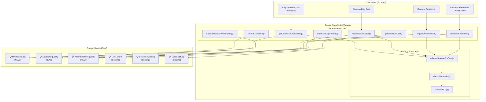
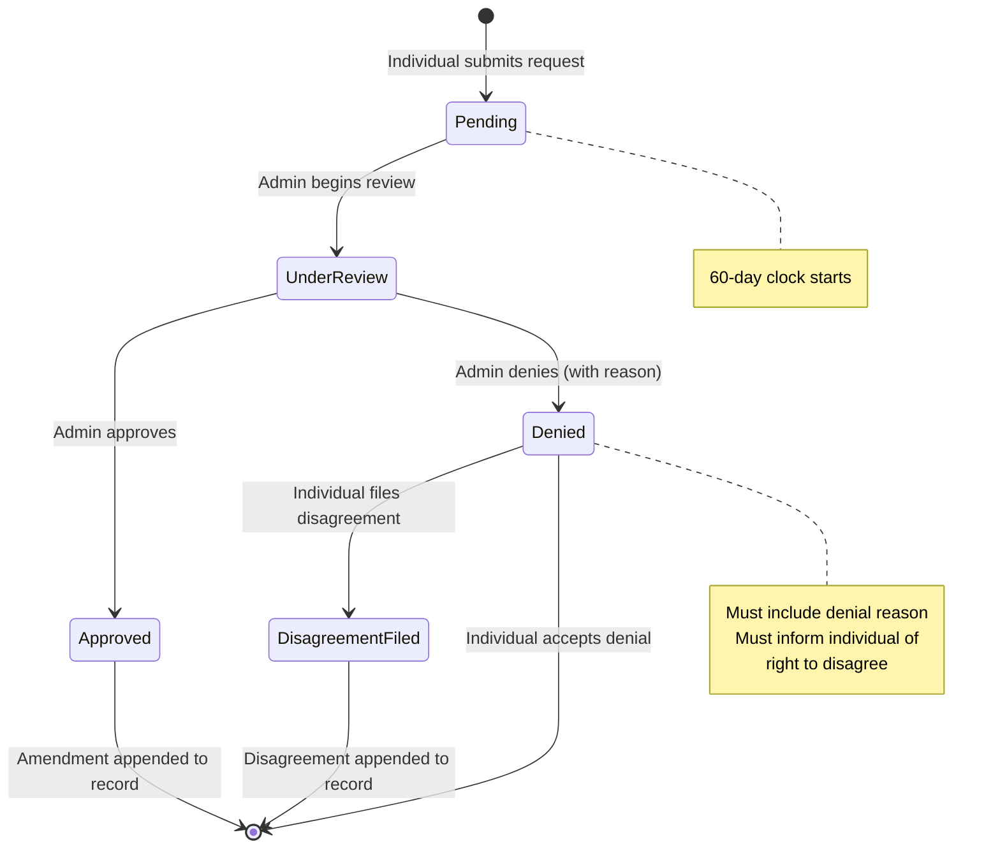

# HIPAA Phase A Implementation Guide — Privacy Rule Compliance

## Document Information

| Field | Value |
|-------|-------|
| **Document** | Phase A Implementation Guide |
| **Environment** | testauth1 (GAS + GitHub Pages) |
| **Date** | 2026-03-23 |
| **GAS Version** | v01.91g |
| **HTML Version** | v02.74w |
| **Items Covered** | #19 Disclosure Accounting · #23 Right of Access · #24 Right to Amendment |
| **Priority** | 🔴 P1 — Required specifications under current law |
| **Authority** | All three are **Required** (not Addressable) — no risk-analysis alternative exists |

### Related Documents

- [HIPAA-TESTAUTH1-IMPLEMENTATION-FOLLOWUP.md](HIPAA-TESTAUTH1-IMPLEMENTATION-FOLLOWUP.md) — Follow-up assessment identifying these gaps
- [HIPAA-TESTAUTH1-COMPLIANCE-REPORT.md](HIPAA-TESTAUTH1-COMPLIANCE-REPORT.md) — Original compliance assessment (2026-03-19)
- [HIPAA-CODING-REQUIREMENTS.md](HIPAA-CODING-REQUIREMENTS.md) — 40-item regulatory checklist
- [HIPAA-COMPLIANCE-REFERENCE.md](HIPAA-COMPLIANCE-REFERENCE.md) — CFR regulatory text reference

### Who This Is For

This guide is for the developer implementing HIPAA Privacy Rule compliance in testauth1. It assumes familiarity with:
- Google Apps Script (GAS) development and deployment
- The testauth1 authentication architecture (sessions, RBAC, audit logging)
- Google Sheets as a data backend
- The existing `saveNote()` → `validateSessionForData()` → `checkPermission()` → `dataAuditLog()` pattern

### Prerequisites

Before starting implementation:
1. Access to the Project Data Spreadsheet (`1EKParBF6pP5Iz605yMiEqm1I7cKjgN-98jevkKfBYAA`)
2. Access to the Master ACL Spreadsheet (`1HASSFzjdqTrZiOAJTEfHu8e-a_6huwouWtSFlbU8wLI`)
3. Editor access to the GAS project (Deployment ID: `AKfycbzcKmQ37XpdCS5ziKpInaGoHa8tZ0w6MeIP6cMWMV6-wXG2hS1K2pmBq4e4-J7xpNL-_w`)
4. HIPAA preset active (`ACTIVE_PRESET = 'hipaa'`)

---

## 1. Executive Summary

### Phase A at a Glance

| Item | CFR | Requirement | Current Status | Target |
|------|-----|-------------|---------------|--------|
| **#19** Disclosure Accounting | §164.528 | Track all PHI disclosures to external parties; provide 6-year history on request | ❌ Not Implemented | ✅ Implemented |
| **#23** Right of Access | §164.524 | Allow individuals to inspect and obtain copies of their ePHI | ❌ Not Implemented | ✅ Implemented |
| **#24** Right to Amendment | §164.526 | Allow individuals to request corrections; append-only history; review workflow | ❌ Not Implemented | ✅ Implemented |

### What "Done" Looks Like

When Phase A is complete:
- **Individuals can** request a disclosure accounting, download their data (JSON/CSV), and submit amendment requests — all through the testauth1 UI
- **Admins can** review and approve/deny amendment requests with documented reasons
- **The system** automatically logs all disclosure, access, and amendment activity to HIPAA-compliant audit trails with 6-year retention
- **Compliance scorecard** moves from 16/40 ✅ (40%) to 19/40 ✅ (48%) — current law compliance from 61% to **71%**

### Implementation Scope

| Component | New Sheets | New GAS Functions | New UI Elements | Estimated Effort |
|-----------|-----------|-------------------|----------------|-----------------|
| #19 Disclosure Accounting | 1 (`DisclosureLog`) | 3 | 2 (button + panel) | Medium |
| #23 Right of Access | 1 (`AccessRequests`) | 4 | 3 (button + picker + download) | Medium |
| #24 Right to Amendment | 1 (`AmendmentRequests`) | 4 | 4 (form + review panel + history + disagreement) | High |
| **Shared Infrastructure** | 0 | 3 utilities | 0 | Low |
| **Total** | **3 new sheets** | **14 new functions** | **9 UI elements** | |

---

## 2. Regulatory Landscape & Enforcement Context

### Why Phase A Items Are High-Risk

All three Phase A items are classified as **Required** (not Addressable) under the HIPAA Privacy Rule. This distinction is critical:

- **Required** = Must be implemented exactly as specified. There is no risk-analysis alternative, no "reasonable and appropriate" determination, and no documented justification for non-implementation
- **Addressable** = Must implement if reasonable and appropriate; may implement an alternative measure or document why the specification is not applicable
- Items #19, #23, and #24 are **Required** — the only compliant state is "fully implemented"

Additionally, **Right of Access (§164.524) is the most actively enforced provision in HIPAA history**, with OCR maintaining a dedicated enforcement initiative since 2019.

### OCR Right of Access Initiative — Enforcement History

OCR launched the Right of Access Initiative in 2019 specifically to enforce §164.524 compliance. As of March 2026:

| Metric | Value |
|--------|-------|
| **Total enforcement actions** | 54 (and counting) |
| **Total penalties collected (2024)** | $9.4M+ across 22 investigations |
| **Average penalty per action** | ~$100K–$200K |
| **Largest single penalty** | $4.3M (Cignet Health, 2011 — denied access to 41 patients) |

### Selected Enforcement Cases (2024-2025)

| Entity | Penalty | Violation | Days to Respond |
|--------|--------:|-----------|:---------------:|
| Oregon Health & Science University | $200,000 | Failed to provide records to personal representative | >2 years |
| American Medical Response | $115,200 | Took 370 days to respond to single patient request | 370 |
| Rio Hondo Community Mental Health | $100,000 | Failed to provide timely access | >30 |
| Hackensack Meridian Health | $100,000 | Denied personal representative access | N/A |
| Concentra, Inc. | $112,500 | Failed to provide timely access within 30 days | >30 |
| Phoenix Healthcare | $35,000 | Took 323 days to fulfill access request | 323 |
| Gums Dental Care | Pending | Failed to provide timely access | >30 |

> **Source:** [OCR Resolution Agreements](https://www.hhs.gov/hipaa/for-professionals/compliance-enforcement/agreements/index.html); [HIPAA Journal — HIPAA Violation Fines](https://www.hipaajournal.com/hipaa-violation-fines/)

### Penalty Tiers (Current as of 2026, inflation-adjusted)

| Tier | Knowledge Level | Per Violation | Annual Cap |
|------|----------------|-------------:|----------:|
| **Tier 1** | Did not know (and should not have known) | $145 – $73,011 | $36,506 |
| **Tier 2** | Reasonable cause (not willful neglect) | $1,461 – $73,011 | $146,053 |
| **Tier 3** | Willful neglect, corrected within 30 days | $14,602 – $73,011 | $365,052 |
| **Tier 4** | Willful neglect, NOT corrected | $73,011 – $2,190,294 | $2,190,294 |

> Failure to implement Required specifications when you know they're required typically falls under **Tier 2 or Tier 3**, not Tier 1. The "did not know" defense is largely unavailable for HIPAA-regulated entities.

### Enforcement Trends — What OCR Is Looking For

Based on 2024-2025 enforcement patterns:

1. **Timeliness is paramount** — nearly every enforcement action involves exceeding the 30-day response window. testauth1's synchronous export (instant response) **exceeds** OCR expectations
2. **Electronic format compliance** — OCR expects providers to support electronic access when data is maintained electronically. testauth1 is electronic-native
3. **Personal representatives** — denying access to authorized representatives is treated identically to denying the individual. Phase B should address this gap
4. **Fee transparency** — unreasonable fees trigger enforcement. testauth1's $0 fee is the safest approach
5. **Documentation** — OCR looks for documented policies, designated privacy officers, and audit trails. This guide and the audit logging infrastructure satisfy this requirement

### Key Takeaway

> **testauth1's architecture is actually well-positioned for compliance.** The electronic self-service model (instant JSON/CSV export, full audit trail, RBAC-enforced access) exceeds what most healthcare providers offer. The primary risk is not technology — it's **not implementing** these capabilities at all. Phase A closes that gap.

### Regulatory Timeline — Current Law vs Pending Changes

| Rule | Status | Impact on Phase A | Timeline |
|------|--------|------------------|----------|
| **Privacy Rule (current)** | In effect | Phase A implements current requirements | Now |
| **Privacy Rule NPRM (Dec 2020)** | Proposed, not finalized | Would reduce access timeline to 15 days; expand disclosure accounting | Uncertain — anticipated May 2026 |
| **Security Rule NPRM (Dec 2024)** | Proposed, regulatory freeze | Would make all security specs Required; 72-hour recovery | Uncertain — possible late 2026 |
| **42 CFR Part 2 alignment (Feb 2024)** | Finalized | SUD record accounting deferred until Privacy Rule update | Compliance: Feb 16, 2026 |

> See Section 14 (Forward-Looking Preparation) for detailed impact analysis of each pending change.

---

## 3. Architecture Overview

### System Context Diagram



### Data Flow Pattern

Every Phase A function follows the same 5-step pattern established by `saveNote()` (`testauth1.gs:1375`):

```
┌─────────────────────────────────────────────────────────────────┐
│ Step 1: validateSessionForData(sessionToken, 'operationName')   │
│         → Validates session, returns user object                │
│         → Throws if session invalid/expired                     │
├─────────────────────────────────────────────────────────────────┤
│ Step 2: checkPermission(user, 'requiredPermission', 'opName')   │
│         → Checks RBAC role has required permission              │
│         → Throws 'PERMISSION_DENIED' if not authorized          │
├─────────────────────────────────────────────────────────────────┤
│ Step 3: auditLog(event, user.email, result, details)            │
│         → Writes to SessionAuditLog sheet                       │
├─────────────────────────────────────────────────────────────────┤
│ Step 4: dataAuditLog(user, action, resourceType, resourceId,    │
│         details)                                                │
│         → Writes to DataAuditLog sheet (HIPAA per-operation)    │
├─────────────────────────────────────────────────────────────────┤
│ Step 5: Perform the actual operation                            │
│         → Read/write to the relevant sheet                      │
│         → Return result to caller                               │
└─────────────────────────────────────────────────────────────────┘
```

### Shared Infrastructure — All Three Items Reuse

| Existing Component | Location | How Phase A Uses It |
|-------------------|----------|-------------------|
| Session validation | `testauth1.gs:validateSessionForData()` | Every endpoint validates the caller's session |
| RBAC permission check | `testauth1.gs:checkPermission()` | Every endpoint checks the caller has the required permission |
| Session audit log | `testauth1.gs:auditLog()` at :902 | Every endpoint logs the operation |
| Data audit log | `testauth1.gs:dataAuditLog()` at :937 | Every endpoint logs PHI access/modification |
| Sheet auto-creation | `testauth1.gs:_writeAuditLogEntry()` at :907 | Pattern for creating sheets on first use |
| HTML escaping | `testauth1.gs:escapeHtml()` | All user-facing output is escaped |
| UUID generation | `Utilities.getUuid()` | Request IDs, record IDs |
| Timestamp formatting | `new Date().toISOString()` | All log entries |

---

## 4. Shared Infrastructure

### New RBAC Permissions

Phase A requires adding permissions to the Roles tab of the Master ACL Spreadsheet. The existing permissions (`read`, `write`, `delete`, `export`, `amend`, `admin`) already cover most needs. Verify these mappings:

| Permission | Used By | Who Needs It |
|-----------|---------|-------------|
| `read` | `getDisclosureAccounting()`, `getIndividualData()`, `getAmendmentHistory()` | All roles (viewer, billing, clinician, admin) |
| `export` | `requestDataExport()`, `exportDisclosureAccounting()` | clinician, admin |
| `amend` | `requestAmendment()`, `submitDisagreement()` | clinician, admin |
| `admin` | `reviewAmendment()`, `recordDisclosure()` (manual entry) | admin only |

> **No new permissions required** — the existing RBAC permissions cover all Phase A operations. The `amend` permission was already provisioned in the Roles tab during RBAC setup.

### Common Utility Functions

Add these shared utilities to `testauth1.gs` (place them near the existing utility functions around line 900):

```javascript
// ═══════════════════════════════════════════════════════
// PHASE A — SHARED UTILITIES
// ═══════════════════════════════════════════════════════

/**
 * Generates a unique request ID for tracking compliance requests.
 * Format: REQ-YYYYMMDD-UUID8 (e.g. REQ-20260323-a1b2c3d4)
 * The date prefix enables quick visual scanning of request age.
 */
function generateRequestId(prefix) {
  prefix = prefix || 'REQ';
  var date = Utilities.formatDate(new Date(), 'America/New_York', 'yyyyMMdd');
  var uuid = Utilities.getUuid().replace(/-/g, '').substring(0, 8);
  return prefix + '-' + date + '-' + uuid;
}

/**
 * Returns an EST-formatted ISO timestamp for audit entries.
 * Consistent with existing auditLog() timestamp format.
 */
function formatHipaaTimestamp() {
  return Utilities.formatDate(new Date(), 'America/New_York', "yyyy-MM-dd'T'HH:mm:ss.SSS'Z'");
}

/**
 * Validates that the authenticated user can access the specified individual's data.
 * For self-service operations: user can only access their OWN data.
 * For admin operations: admin can access any individual's data.
 *
 * @param {Object} user - Session user object (from validateSessionForData)
 * @param {string} targetEmail - The individual whose data is being accessed
 * @param {string} operationName - Name of the calling operation (for audit)
 * @returns {boolean} true if access is permitted
 * @throws {Error} 'ACCESS_DENIED' if user cannot access this individual's data
 */
function validateIndividualAccess(user, targetEmail, operationName) {
  // Admins can access any individual's data (for review workflows)
  if (hasPermission(user.role, 'admin')) {
    auditLog('individual_access', user.email, 'admin_access', {
      operation: operationName,
      targetEmail: targetEmail,
      accessType: 'admin_override'
    });
    return true;
  }

  // Non-admins can only access their own data
  if (user.email.toLowerCase() !== targetEmail.toLowerCase()) {
    auditLog('security_alert', user.email, 'individual_access_denied', {
      operation: operationName,
      targetEmail: targetEmail,
      reason: 'non_admin_accessing_other_user_data'
    });
    throw new Error('ACCESS_DENIED');
  }

  return true;
}
```

### Sheet Auto-Creation Pattern

All three new sheets use the same auto-creation pattern from `_writeAuditLogEntry()` (`testauth1.gs:907`). Here is the reusable pattern:

```javascript
/**
 * Gets or creates a sheet in the Project Data Spreadsheet.
 * Follows the existing _writeAuditLogEntry() auto-creation pattern.
 *
 * @param {string} sheetName - Name of the sheet to get/create
 * @param {string[]} headers - Column headers for new sheet creation
 * @returns {Sheet} The Google Sheet object
 */
function getOrCreateSheet(sheetName, headers) {
  var ss = SpreadsheetApp.openById(SPREADSHEET_ID);
  var sheet = ss.getSheetByName(sheetName);

  if (!sheet) {
    sheet = ss.insertSheet(sheetName);
    // Write header row
    sheet.getRange(1, 1, 1, headers.length).setValues([headers]);
    // Bold + freeze header
    sheet.getRange(1, 1, 1, headers.length).setFontWeight('bold');
    sheet.setFrozenRows(1);
    // Add warning-level protection (allows edits but shows warning)
    var protection = sheet.protect().setDescription('HIPAA Protected — ' + sheetName);
    protection.setWarningOnly(true);

    auditLog('sheet_created', 'system', 'success', {
      sheetName: sheetName,
      columnCount: headers.length,
      protection: 'warning_only'
    });
  }

  return sheet;
}
```

### Error Response Pattern

All Phase A functions return structured error responses (no raw throws to the client):

```javascript
/**
 * Wraps a Phase A operation with standard error handling.
 * Catches known error types and returns structured responses.
 */
function wrapPhaseAOperation(operationName, sessionToken, operationFn) {
  try {
    var user = validateSessionForData(sessionToken, operationName);
    return operationFn(user);
  } catch (e) {
    var errorType = e.message || 'UNKNOWN_ERROR';
    // HIPAA: never leak PHI in error messages
    var safeErrors = {
      'SESSION_EXPIRED': { success: false, error: 'SESSION_EXPIRED', message: 'Your session has expired. Please sign in again.' },
      'SESSION_INVALID': { success: false, error: 'SESSION_INVALID', message: 'Invalid session. Please sign in again.' },
      'PERMISSION_DENIED': { success: false, error: 'PERMISSION_DENIED', message: 'You do not have permission for this operation.' },
      'ACCESS_DENIED': { success: false, error: 'ACCESS_DENIED', message: 'You can only access your own data.' },
      'NOT_FOUND': { success: false, error: 'NOT_FOUND', message: 'The requested record was not found.' },
      'INVALID_INPUT': { success: false, error: 'INVALID_INPUT', message: 'Invalid input provided.' }
    };

    if (safeErrors[errorType]) {
      return safeErrors[errorType];
    }

    // Unknown error — log full details server-side, return generic message to client
    auditLog('phase_a_error', 'system', 'error', {
      operation: operationName,
      errorType: errorType,
      errorMessage: e.message,
      stack: e.stack
    });

    return { success: false, error: 'INTERNAL_ERROR', message: 'An internal error occurred. Please try again.' };
  }
}
```

---

## 5. Item #19 — Disclosure Accounting (§164.528)

### Regulatory Requirement

> **§164.528 — Accounting of Disclosures of Protected Health Information**
>
> A covered entity shall provide each individual, upon request, with an accounting of disclosures of protected health information made by the covered entity in the **six years** prior to the date of the request.

### Acceptance Criteria

| # | Criterion | How to Verify |
|---|-----------|---------------|
| 1 | Dedicated `DisclosureLog` sheet captures every disclosure to external parties | Sheet exists with correct columns; entries created when disclosures occur |
| 2 | Each entry includes: recipient, date, PHI description, purpose | Verify all columns populated for each entry |
| 3 | 6-year history retained (entries never deleted within retention window) | Sheet protection prevents deletion; no cleanup script runs within 6 years |
| 4 | On-demand reporting endpoint returns filtered accounting for an individual | `getDisclosureAccounting()` returns correct records; exempt disclosures excluded |
| 5 | Export in JSON and CSV formats | `exportDisclosureAccounting(token, 'json')` and `('csv')` both return valid output |
| 6 | Exempt disclosures correctly identified and excluded from accounting | TPO disclosures marked `isExempt=true`; not returned in accounting |

### Exempt vs Non-Exempt Disclosures

Per §164.528(a)(2), these disclosures are **exempt** from accounting:

| Exempt (excluded from accounting) | Non-Exempt (must be tracked) |
|----------------------------------|----------------------------|
| Treatment, Payment, Operations (TPO) | Research disclosures (without authorization) |
| Disclosures to the individual themselves | Disclosures to government agencies (non-law-enforcement) |
| Incidental disclosures | Disclosures to business associates |
| Pursuant to a valid authorization | Court-ordered disclosures |
| National security / intelligence | Disclosures to health oversight agencies |
| Law enforcement (certain circumstances) | Any other disclosure not listed as exempt |

> **testauth1 context:** Currently, testauth1 does not make external disclosures (no outbound API calls to third parties, no data sharing endpoints). The `DisclosureLog` infrastructure must exist for compliance, but it may initially have zero entries. Future features that share PHI externally MUST call `recordDisclosure()`.

### HITECH Act — EHR Accounting Expansion (§13405(c))

#### Background

The HITECH Act of 2009, Section 13405(c), expands the scope of disclosure accounting for electronic health records:

> *"In applying section 164.528 of title 45, Code of Federal Regulations, an individual shall have a right to receive an accounting of disclosures [...] made by a covered entity [...] **through an electronic health record** during the three years prior to the date on which the accounting is requested."*

This expansion **removes the TPO exemption** for EHR-based disclosures — meaning treatment, payment, and operations disclosures made through an EHR must be tracked and provided in the accounting (with a 3-year lookback instead of the standard 6-year).

#### Current Regulatory Status

| Aspect | Status |
|--------|--------|
| **HITECH §13405(c) statute** | Enacted 2009 — exists in law |
| **HHS implementing regulations** | **Never finalized** — proposed May 2011 (76 FR 31426), withdrawn from the regulatory agenda |
| **Compliance date** | Not set — deferred until the Privacy Rule is updated |
| **Privacy Rule NPRM (Dec 2020)** | Proposed broader Privacy Rule changes including this expansion; NOT finalized |
| **Practical effect today** | Covered entities operate under original §164.528 (6-year, TPO-exempt) |

> **Source:** [Federal Register — HIPAA Privacy Rule Accounting of Disclosures Under HITECH](https://www.federalregister.gov/documents/2011/05/31/2011-13297/hipaa-privacy-rule-accounting-of-disclosures-under-the-health-information-technology-for-economic); [HIPAA Journal — New Regulations 2026](https://www.hipaajournal.com/new-hipaa-regulations/)

#### Impact on testauth1

If the implementing regulations are finalized, `getDisclosureAccounting()` would need dual-mode filtering:

| Mode | Scope | Lookback | Exemptions |
|------|-------|----------|-----------|
| **Standard (current)** | Non-EHR disclosures | 6 years | TPO, individual, authorization, etc. |
| **HITECH EHR** | EHR-based disclosures (including TPO) | 3 years | Only incidental, national security, law enforcement |

**Future-proofed function signature:**

```javascript
/**
 * Extended getDisclosureAccounting() with HITECH EHR support.
 * When HITECH regulations finalize, set includeEhrTpo = true.
 */
function getDisclosureAccounting(sessionToken, targetEmail, options) {
  options = options || {};
  var includeEhrTpo = options.includeEhrTpo || false;  // Enable when HITECH finalizes
  var ehrLookbackYears = options.ehrLookbackYears || 3;

  // ... existing logic ...

  // If HITECH EHR mode enabled, also include TPO disclosures within 3-year window
  if (includeEhrTpo) {
    var ehrCutoff = new Date(now.getTime() - (ehrLookbackYears * 365.25 * 24 * 60 * 60 * 1000));
    // Include rows where IsExempt = true AND ExemptionType = 'TPO' AND date >= ehrCutoff
    // Tag these entries with { source: 'HITECH_EHR' } in the response
  }
}
```

#### Business Associate Disclosure Tracking

Per §164.528(c), business associates must also track disclosures and either:
1. Report all non-exempt disclosures to the covered entity, **or**
2. Respond directly to accounting requests (per the BAA terms)

The same 60-day response timeline applies.

**testauth1 implications:**
- If testauth1 data is shared with a BA (e.g., a lab, billing service, or analytics vendor), the BA's disclosures must be included in the accounting
- **Recommended schema extension:** Add a `Source` column to `DisclosureLog` to distinguish:
  - `CoveredEntity` — disclosures made directly by testauth1
  - `BusinessAssociate:Name` — disclosures reported by a specific BA
- The `getDisclosureAccounting()` function should aggregate both sources when generating the accounting

### GAS Implementation

#### `recordDisclosure()` — Log a Disclosure Event

```javascript
/**
 * Records a PHI disclosure to the DisclosureLog sheet.
 * Called whenever PHI is shared with an external party.
 *
 * @param {Object} params
 * @param {string} params.recipientName — Name of the receiving entity
 * @param {string} params.recipientType — "Organization" | "Individual" | "GovernmentAgency" | "BusinessAssociate"
 * @param {string} params.phiDescription — Brief description of PHI disclosed (no actual PHI in this field)
 * @param {string} params.purpose — "Treatment" | "Payment" | "Operations" | "Research" | "LegalOrder" | "Other"
 * @param {string} params.individualEmail — Email of the individual whose PHI was disclosed
 * @param {boolean} [params.isExempt=false] — Whether this disclosure is exempt from accounting
 * @param {string} [params.exemptionType=''] — Which exemption applies (e.g. "TPO", "Authorization", "LawEnforcement")
 * @param {string} [params.sessionToken] — Session token of the user who triggered the disclosure (if user-initiated)
 * @returns {Object} { success: boolean, disclosureId: string }
 */
function recordDisclosure(params) {
  // Validate required fields
  var required = ['recipientName', 'recipientType', 'phiDescription', 'purpose', 'individualEmail'];
  for (var i = 0; i < required.length; i++) {
    if (!params[required[i]]) {
      throw new Error('INVALID_INPUT');
    }
  }

  var disclosureId = generateRequestId('DISC');
  var timestamp = formatHipaaTimestamp();
  var isExempt = params.isExempt || false;
  var exemptionType = params.exemptionType || '';

  // Determine who triggered this disclosure
  var triggeredBy = 'system';
  if (params.sessionToken) {
    try {
      var user = validateSessionForData(params.sessionToken, 'recordDisclosure');
      triggeredBy = user.email;
    } catch (e) {
      triggeredBy = 'system_automated';
    }
  }

  var headers = [
    'Timestamp', 'DisclosureID', 'IndividualEmail', 'RecipientName',
    'RecipientType', 'PHIDescription', 'Purpose', 'IsExempt',
    'ExemptionType', 'TriggeredBy'
  ];
  var sheet = getOrCreateSheet('DisclosureLog', headers);

  var row = [
    timestamp, disclosureId, params.individualEmail, params.recipientName,
    params.recipientType, params.phiDescription, params.purpose, isExempt,
    exemptionType, triggeredBy
  ];
  sheet.appendRow(row);

  // Audit log the disclosure recording itself
  auditLog('disclosure_recorded', triggeredBy, 'success', {
    disclosureId: disclosureId,
    recipientName: params.recipientName,
    purpose: params.purpose,
    isExempt: isExempt,
    individualEmail: params.individualEmail
  });

  return { success: true, disclosureId: disclosureId };
}
```

#### `getDisclosureAccounting()` — Retrieve Individual's Disclosure History

```javascript
/**
 * Returns the disclosure accounting for the authenticated individual.
 * Filters to non-exempt disclosures within the past 6 years.
 * Individuals can only request their own accounting; admins can request for any individual.
 *
 * @param {string} sessionToken — Authenticated session token
 * @param {string} [targetEmail] — Email to look up (admin only; defaults to self)
 * @returns {Object} { success, requestId, disclosures: [...], count, periodStart, periodEnd }
 */
function getDisclosureAccounting(sessionToken, targetEmail) {
  return wrapPhaseAOperation('getDisclosureAccounting', sessionToken, function(user) {
    checkPermission(user, 'read', 'getDisclosureAccounting');

    // Determine whose disclosures to retrieve
    var lookupEmail = targetEmail || user.email;
    validateIndividualAccess(user, lookupEmail, 'getDisclosureAccounting');

    var requestId = generateRequestId('ACCT');
    var now = new Date();
    var sixYearsAgo = new Date(now.getTime() - (6 * 365.25 * 24 * 60 * 60 * 1000));

    // Read DisclosureLog
    var headers = [
      'Timestamp', 'DisclosureID', 'IndividualEmail', 'RecipientName',
      'RecipientType', 'PHIDescription', 'Purpose', 'IsExempt',
      'ExemptionType', 'TriggeredBy'
    ];
    var sheet = getOrCreateSheet('DisclosureLog', headers);
    var data = sheet.getDataRange().getValues();
    var disclosures = [];

    for (var r = 1; r < data.length; r++) {
      var row = data[r];
      var rowEmail = String(row[2]).toLowerCase();
      var rowIsExempt = row[7] === true || row[7] === 'TRUE' || row[7] === 'true';
      var rowDate = new Date(row[0]);

      // Filter: correct individual + non-exempt + within 6-year window
      if (rowEmail === lookupEmail.toLowerCase() && !rowIsExempt && rowDate >= sixYearsAgo) {
        disclosures.push({
          disclosureId: row[1],
          date: row[0],
          recipientName: row[3],
          recipientType: row[4],
          phiDescription: row[5],
          purpose: row[6]
        });
      }
    }

    // Sort by date descending (most recent first)
    disclosures.sort(function(a, b) { return new Date(b.date) - new Date(a.date); });

    // Audit log the accounting request
    dataAuditLog(user, 'read', 'disclosure_accounting', requestId, {
      targetEmail: lookupEmail,
      disclosureCount: disclosures.length,
      periodStart: sixYearsAgo.toISOString(),
      periodEnd: now.toISOString()
    });

    return {
      success: true,
      requestId: requestId,
      individualEmail: lookupEmail,
      disclosures: disclosures,
      count: disclosures.length,
      periodStart: sixYearsAgo.toISOString(),
      periodEnd: now.toISOString(),
      generatedAt: formatHipaaTimestamp()
    };
  });
}
```

#### `exportDisclosureAccounting()` — Export as JSON or CSV

```javascript
/**
 * Exports the disclosure accounting in the requested format.
 *
 * @param {string} sessionToken
 * @param {string} [format='json'] — 'json' or 'csv'
 * @returns {Object} { success, format, data, filename }
 */
function exportDisclosureAccounting(sessionToken, format) {
  return wrapPhaseAOperation('exportDisclosureAccounting', sessionToken, function(user) {
    checkPermission(user, 'export', 'exportDisclosureAccounting');

    var accounting = getDisclosureAccounting(sessionToken);
    if (!accounting.success) return accounting;

    format = (format || 'json').toLowerCase();
    var dateStr = Utilities.formatDate(new Date(), 'America/New_York', 'yyyy-MM-dd');
    var filename = 'disclosure-accounting-' + dateStr;

    if (format === 'csv') {
      var csvRows = ['Date,DisclosureID,RecipientName,RecipientType,PHIDescription,Purpose'];
      for (var i = 0; i < accounting.disclosures.length; i++) {
        var d = accounting.disclosures[i];
        csvRows.push([
          '"' + d.date + '"',
          '"' + d.disclosureId + '"',
          '"' + (d.recipientName || '').replace(/"/g, '""') + '"',
          '"' + d.recipientType + '"',
          '"' + (d.phiDescription || '').replace(/"/g, '""') + '"',
          '"' + d.purpose + '"'
        ].join(','));
      }
      return { success: true, format: 'csv', data: csvRows.join('\n'), filename: filename + '.csv' };
    }

    // Default: JSON
    return {
      success: true,
      format: 'json',
      data: JSON.stringify(accounting, null, 2),
      filename: filename + '.json'
    };
  });
}
```

### HTML UI Component

Add the disclosure accounting button and panel to `testauth1.html`:

```html
<!-- Disclosure Accounting Button (visible to all authenticated users) -->
<button id="disclosure-accounting-btn" data-requires-permission="read"
        class="phase-a-btn" title="View disclosure history">
  Disclosure History
</button>

<!-- Disclosure Accounting Panel (similar to admin sessions panel) -->
<div id="disclosure-panel" class="phase-a-panel" style="display:none;">
  <div class="pa-header">
    <span class="pa-title">Disclosure Accounting</span>
    <select id="disclosure-export-format">
      <option value="json">JSON</option>
      <option value="csv">CSV</option>
    </select>
    <button id="disclosure-export-btn" class="pa-action">Export</button>
    <button id="disclosure-close-btn" class="pa-close">&times;</button>
  </div>
  <div id="disclosure-period" class="pa-meta">
    <!-- Populated: "Showing disclosures from YYYY-MM-DD to YYYY-MM-DD" -->
  </div>
  <div id="disclosure-list" class="pa-list">
    <!-- Populated by JavaScript with disclosure cards -->
  </div>
  <div id="disclosure-empty" class="pa-empty" style="display:none;">
    No disclosures found for the reporting period.
  </div>
</div>
```

### Integration Points

Future code that discloses PHI externally **must** call `recordDisclosure()`:

```javascript
// Example: if testauth1 ever adds a "Share with Provider" feature
function shareWithProvider(sessionToken, providerEmail, recordId) {
  var user = validateSessionForData(sessionToken, 'shareWithProvider');
  checkPermission(user, 'write', 'shareWithProvider');

  // Record the disclosure BEFORE making it
  recordDisclosure({
    recipientName: providerEmail,
    recipientType: 'Individual',
    phiDescription: 'Patient note (record ' + recordId + ')',
    purpose: 'Treatment',
    individualEmail: user.email,
    isExempt: true,          // TPO disclosure is exempt
    exemptionType: 'TPO',
    sessionToken: sessionToken
  });

  // ... perform the actual disclosure ...
}
```

---

## 6. Item #23 — Right of Access (§164.524)

### Regulatory Requirement

> **§164.524 — Access of Individuals to Protected Health Information**
>
> A covered entity shall provide each individual, upon request, with access to the protected health information about the individual in a **designated record set**. Access must be provided in the form and format requested if readily producible, or in a readable alternative. Response within **30 days** (one 30-day extension permitted with written explanation).

### Acceptance Criteria

| # | Criterion | How to Verify |
|---|-----------|---------------|
| 1 | Data export endpoint returns ALL ePHI for the authenticated individual | `getIndividualData()` queries all relevant sheets and returns complete record |
| 2 | Supports JSON and CSV export formats | Both formats produce valid, parseable output |
| 3 | Access request tracking with 30-day deadline monitoring | `AccessRequests` sheet tracks request date, status, response date |
| 4 | Individuals can only access their own data (admins can access any) | `validateIndividualAccess()` enforces this |
| 5 | Every access request is logged to the audit trail | `dataAuditLog()` called with `action: 'export'` |
| 6 | Designated Record Set clearly defined | All sheets containing individual data are enumerated and queried |

### Designated Record Set for testauth1

The "Designated Record Set" defines what constitutes an individual's records. In testauth1:

| Data Source | Sheet | Contains ePHI? | Included in Export |
|------------|-------|---------------|-------------------|
| Patient notes | `Live_Sheet` | ✅ Yes | ✅ Yes — all notes created by/for the individual |
| Session audit log | `SessionAuditLog` | ⚠️ Contains email + timestamps | ✅ Yes — individual's login/access history |
| Data audit log | `DataAuditLog` | ⚠️ Contains operation details | ✅ Yes — record of who accessed individual's data |
| Disclosure log | `DisclosureLog` | ⚠️ Contains disclosure descriptions | ✅ Yes — who individual's PHI was disclosed to |
| Amendment requests | `AmendmentRequests` | ⚠️ Contains amendment content | ✅ Yes — individual's amendment history |
| Access requests | `AccessRequests` | ⚠️ Contains request metadata | ✅ Yes — individual's own access request history |
| ACL (Master Spreadsheet) | `Access` | ❌ No | ❌ No — administrative, not part of record set |

### Fee Policy (§164.524(c)(4))

#### Federal Fee Rules

The Privacy Rule permits a reasonable, cost-based fee for providing copies of PHI. The fee may only cover certain limited costs:

| Scenario | Fee Allowed | Maximum Amount | Notes |
|----------|:-----------:|:----------:|-------|
| Electronic copy via self-service portal | Yes | Flat **$6.50** option | Covers labor, supplies, postage combined |
| Copy via CEHRT View/Download/Transmit | **No** | $0.00 | Provider cannot charge when using certified EHR functionality |
| Paper copies | Yes | Actual cost-based | Labor + supplies + postage only |
| Copies to third party at individual's direction | Same as above | Same as above | Same fee rules apply regardless of recipient |
| Retrieval or searching for records | **No** | $0.00 | Cannot charge for time spent locating records |

> **Source:** [HHS Right of Access Guidance](https://www.hhs.gov/hipaa/for-professionals/privacy/guidance/access/index.html); 45 CFR §164.524(c)(4)

#### testauth1 Fee Policy

- testauth1 provides **electronic self-service** export (JSON/CSV download via browser)
- **Recommended fee: $0.00** — electronic self-service has negligible marginal cost; no labor, supplies, or postage involved
- The `requestDataExport()` function should NOT include any fee-related logic
- If a fee is ever introduced: it must be disclosed in the Notice of Privacy Practices, and the `AccessRequests` sheet should gain `FeeCharged` and `FeeJustification` columns

> **OCR Enforcement Warning:** Multiple penalty actions ($85K–$200K range) have resulted from charging unreasonable fees or using fee demands as a barrier to access. OCR has stated: *"with advancing technology making record production easier than ever, OCR expects faster compliance, not slower."* The safest approach is $0 for electronic self-service.

### Personal Representative Access (§164.502(g))

#### Regulatory Requirement

Under §164.502(g), a **personal representative** has the same rights as the individual with respect to PHI access. Personal representatives include:

| Representative Type | Legal Basis | Common Scenarios |
|-------------------|------------|-----------------|
| Parent of a minor | State law on parental rights | Parent requesting child's records |
| Legal guardian | Court-appointed guardianship | Guardian requesting ward's records |
| Healthcare power of attorney | Signed POA document | Agent requesting incapacitated patient's records |
| Executor/administrator of estate | Probate/estate documentation | Deceased patient's records |
| Court-appointed representative | Court order | Court-ordered access to records |

> **OCR Enforcement:** Hackensack Meridian Health paid **$100,000** (April 2024) for denying a personal representative access to a nursing facility resident's records. OCR treats representative denials identically to individual denials.

#### Current Implementation Gap

The existing `validateIndividualAccess()` checks:
1. ✅ `user.email === targetEmail` (self-service)
2. ✅ `user.role === 'admin'` (admin override)
3. ❌ No representative lookup — a parent cannot access their minor child's records

#### Recommended Implementation (Phase B)

```javascript
/**
 * Extended access validation that includes personal representatives.
 * Phase B extension to validateIndividualAccess().
 */
function validateIndividualOrRepresentativeAccess(user, targetEmail, operationName) {
  // Direct match — individual accessing own data
  if (user.email.toLowerCase() === targetEmail.toLowerCase()) return true;

  // Admin override
  if (hasPermission(user.role, 'admin')) {
    auditLog('representative_access', user.email, 'admin_override', {
      operation: operationName, targetEmail: targetEmail
    });
    return true;
  }

  // Representative check
  var repSheet = getOrCreateSheet('PersonalRepresentatives', [
    'RepresentativeEmail', 'IndividualEmail', 'RelationshipType',
    'AuthorizationDate', 'ExpirationDate', 'Status', 'DocumentReference'
  ]);
  var data = repSheet.getDataRange().getValues();
  var now = new Date();

  for (var r = 1; r < data.length; r++) {
    if (String(data[r][0]).toLowerCase() === user.email.toLowerCase() &&
        String(data[r][1]).toLowerCase() === targetEmail.toLowerCase() &&
        data[r][5] === 'Active') {
      // Check expiration
      if (data[r][4] && new Date(data[r][4]) < now) continue; // Expired
      auditLog('representative_access', user.email, 'representative_granted', {
        operation: operationName, targetEmail: targetEmail,
        relationship: data[r][2]
      });
      return true;
    }
  }

  // No valid representation found
  auditLog('security_alert', user.email, 'representative_access_denied', {
    operation: operationName, targetEmail: targetEmail
  });
  throw new Error('ACCESS_DENIED');
}
```

> **Phase A note:** Personal representative access is not required for the initial Phase A deployment (which supports self-service only). It becomes important when testauth1 expands to serve populations where representative access is common (pediatrics, elder care, etc.). The `PersonalRepresentatives` schema is documented in the Spreadsheet Schema Reference.

### GAS Implementation

#### `requestDataExport()` — Submit an Access Request

```javascript
/**
 * Creates an access request and immediately generates the export.
 * For testauth1 (small dataset), export is synchronous — no 30-day delay.
 * The AccessRequests sheet still tracks the request for compliance.
 *
 * @param {string} sessionToken
 * @param {string} [format='json'] — 'json' or 'csv'
 * @returns {Object} { success, requestId, format, data, filename, requestDate, responseDate }
 */
function requestDataExport(sessionToken, format) {
  return wrapPhaseAOperation('requestDataExport', sessionToken, function(user) {
    checkPermission(user, 'export', 'requestDataExport');

    var requestId = generateRequestId('ACCESS');
    var requestDate = formatHipaaTimestamp();
    format = (format || 'json').toLowerCase();

    // Log the access request
    var arHeaders = [
      'RequestID', 'IndividualEmail', 'RequestDate', 'Format',
      'Status', 'ResponseDate', 'Notes'
    ];
    var arSheet = getOrCreateSheet('AccessRequests', arHeaders);
    arSheet.appendRow([requestId, user.email, requestDate, format, 'Processing', '', '']);

    // Generate the export
    var individualData;
    try {
      individualData = getIndividualData(sessionToken);
    } catch (e) {
      // Update request status to failed
      updateAccessRequestStatus(arSheet, requestId, 'Failed', 'Export generation failed: ' + e.message);
      throw e;
    }

    // Format the export
    var dateStr = Utilities.formatDate(new Date(), 'America/New_York', 'yyyy-MM-dd');
    var filename = 'my-data-export-' + dateStr;
    var exportData;

    if (format === 'csv') {
      exportData = convertToCSV(individualData);
      filename += '.csv';
    } else {
      exportData = JSON.stringify(individualData, null, 2);
      filename += '.json';
    }

    // Update request status to completed
    var responseDate = formatHipaaTimestamp();
    updateAccessRequestStatus(arSheet, requestId, 'Completed', '');

    // Audit log
    dataAuditLog(user, 'export', 'designated_record_set', requestId, {
      format: format,
      recordCount: individualData.summary.totalRecords,
      sheetsQueried: individualData.summary.sheetsQueried
    });

    return {
      success: true,
      requestId: requestId,
      format: format,
      data: exportData,
      filename: filename,
      requestDate: requestDate,
      responseDate: responseDate
    };
  });
}

/** Helper: update AccessRequests sheet status by requestId */
function updateAccessRequestStatus(sheet, requestId, status, notes) {
  var data = sheet.getDataRange().getValues();
  for (var r = 1; r < data.length; r++) {
    if (data[r][0] === requestId) {
      sheet.getRange(r + 1, 5).setValue(status);          // Status column
      sheet.getRange(r + 1, 6).setValue(formatHipaaTimestamp()); // ResponseDate
      if (notes) sheet.getRange(r + 1, 7).setValue(notes); // Notes
      return;
    }
  }
}
```

#### `getIndividualData()` — Retrieve All ePHI for an Individual

```javascript
/**
 * Retrieves ALL records from the Designated Record Set for the authenticated individual.
 * Queries every sheet that may contain the individual's ePHI.
 *
 * @param {string} sessionToken
 * @returns {Object} Structured data with all individual records
 */
function getIndividualData(sessionToken) {
  var user = validateSessionForData(sessionToken, 'getIndividualData');
  checkPermission(user, 'read', 'getIndividualData');

  var email = user.email.toLowerCase();
  var result = {
    individual: {
      email: user.email,
      displayName: user.displayName,
      role: user.role,
      exportDate: formatHipaaTimestamp(),
      generatedBy: 'testauth1 v' + VERSION
    },
    records: {},
    summary: { totalRecords: 0, sheetsQueried: 0 }
  };

  var ss = SpreadsheetApp.openById(SPREADSHEET_ID);

  // 1. Live_Sheet — patient notes
  var liveSheet = ss.getSheetByName(SHEET_NAME);
  if (liveSheet) {
    result.records.notes = extractRecordsForEmail(liveSheet, email, 'notes');
    result.summary.sheetsQueried++;
  }

  // 2. SessionAuditLog — login/access history
  var salSheet = ss.getSheetByName('SessionAuditLog');
  if (salSheet) {
    result.records.sessionHistory = extractRecordsForEmail(salSheet, email, 'sessions');
    result.summary.sheetsQueried++;
  }

  // 3. DataAuditLog — data access records
  var dalSheet = ss.getSheetByName('DataAuditLog');
  if (dalSheet) {
    result.records.dataAccessHistory = extractRecordsForEmail(dalSheet, email, 'data_access');
    result.summary.sheetsQueried++;
  }

  // 4. DisclosureLog — disclosures of this individual's PHI
  var dlSheet = ss.getSheetByName('DisclosureLog');
  if (dlSheet) {
    result.records.disclosures = extractRecordsForEmail(dlSheet, email, 'disclosures');
    result.summary.sheetsQueried++;
  }

  // 5. AmendmentRequests — this individual's amendment history
  var amSheet = ss.getSheetByName('AmendmentRequests');
  if (amSheet) {
    result.records.amendments = extractRecordsForEmail(amSheet, email, 'amendments');
    result.summary.sheetsQueried++;
  }

  // 6. AccessRequests — this individual's prior access requests
  var arSheet = ss.getSheetByName('AccessRequests');
  if (arSheet) {
    result.records.accessRequests = extractRecordsForEmail(arSheet, email, 'access_requests');
    result.summary.sheetsQueried++;
  }

  // Count total records
  for (var key in result.records) {
    result.summary.totalRecords += result.records[key].length;
  }

  return result;
}

/**
 * Extracts rows from a sheet that match the individual's email.
 * Generic helper — searches all columns for email match.
 *
 * @param {Sheet} sheet — The sheet to search
 * @param {string} email — Email to match (lowercase)
 * @param {string} recordType — Label for the record type
 * @returns {Object[]} Array of record objects (header-keyed)
 */
function extractRecordsForEmail(sheet, email, recordType) {
  var data = sheet.getDataRange().getValues();
  if (data.length < 2) return [];

  var headers = data[0];
  var records = [];

  for (var r = 1; r < data.length; r++) {
    var row = data[r];
    var matched = false;

    // Check every column for the email
    for (var c = 0; c < row.length; c++) {
      if (String(row[c]).toLowerCase() === email) {
        matched = true;
        break;
      }
    }

    if (matched) {
      var record = { _recordType: recordType, _rowIndex: r + 1 };
      for (var h = 0; h < headers.length; h++) {
        record[String(headers[h])] = row[h];
      }
      records.push(record);
    }
  }

  return records;
}
```

#### `convertToCSV()` — Convert Structured Data to CSV

```javascript
/**
 * Converts the getIndividualData() output to CSV format.
 * Creates one CSV section per record type with headers.
 *
 * @param {Object} individualData — Output from getIndividualData()
 * @returns {string} CSV-formatted string
 */
function convertToCSV(individualData) {
  var lines = [];
  lines.push('# Data Export for ' + individualData.individual.email);
  lines.push('# Generated: ' + individualData.individual.exportDate);
  lines.push('# By: ' + individualData.individual.generatedBy);
  lines.push('');

  for (var recordType in individualData.records) {
    var records = individualData.records[recordType];
    if (records.length === 0) continue;

    lines.push('# === ' + recordType.toUpperCase() + ' (' + records.length + ' records) ===');

    // Extract headers from first record (excluding internal fields)
    var headers = [];
    for (var key in records[0]) {
      if (key.charAt(0) !== '_') headers.push(key);
    }
    lines.push(headers.join(','));

    // Write data rows
    for (var i = 0; i < records.length; i++) {
      var values = [];
      for (var h = 0; h < headers.length; h++) {
        var val = String(records[i][headers[h]] || '');
        // Escape CSV: wrap in quotes if contains comma, quote, or newline
        if (val.indexOf(',') > -1 || val.indexOf('"') > -1 || val.indexOf('\n') > -1) {
          val = '"' + val.replace(/"/g, '""') + '"';
        }
        values.push(val);
      }
      lines.push(values.join(','));
    }
    lines.push('');
  }

  return lines.join('\n');
}
```

### HTML UI Component

```html
<!-- Data Export Button -->
<button id="data-export-btn" data-requires-permission="export"
        class="phase-a-btn" title="Download your data">
  Download My Data
</button>

<!-- Data Export Panel -->
<div id="data-export-panel" class="phase-a-panel" style="display:none;">
  <div class="pa-header">
    <span class="pa-title">Download My Data</span>
    <button id="data-export-close-btn" class="pa-close">&times;</button>
  </div>
  <div class="pa-body">
    <p>Download a copy of all your data stored in this system.
       This is your right under HIPAA §164.524.</p>
    <div class="pa-format-picker">
      <label><input type="radio" name="export-format" value="json" checked> JSON</label>
      <label><input type="radio" name="export-format" value="csv"> CSV</label>
    </div>
    <button id="data-export-download-btn" class="pa-action">Download</button>
    <div id="data-export-status" class="pa-status"></div>
  </div>
</div>
```

### Client-Side Download Handler

```javascript
/**
 * Triggers data export and initiates browser download.
 * Called when user clicks "Download" in the data export panel.
 */
function handleDataExport() {
  var format = document.querySelector('input[name="export-format"]:checked').value;
  var statusEl = document.getElementById('data-export-status');
  statusEl.textContent = 'Generating export...';

  // Call GAS endpoint via the established postMessage/iframe pattern
  callGasEndpoint('requestDataExport', [getSessionToken(), format], function(result) {
    if (!result.success) {
      statusEl.textContent = 'Error: ' + result.message;
      return;
    }

    // Trigger browser download
    var blob = new Blob([result.data], {
      type: format === 'csv' ? 'text/csv;charset=utf-8;' : 'application/json;charset=utf-8;'
    });
    var url = URL.createObjectURL(blob);
    var a = document.createElement('a');
    a.href = url;
    a.download = result.filename;
    document.body.appendChild(a);
    a.click();
    document.body.removeChild(a);
    URL.revokeObjectURL(url);

    statusEl.textContent = 'Download started — ' + result.filename;
  });
}
```

> **Note on `callGasEndpoint()`**: This is a placeholder for testauth1's actual GAS communication method. In the current architecture, GAS functions are called via `postMessage` to action-specific iframes. The actual implementation should follow the existing `heartbeat` / `signout` / `adminSessions` iframe communication pattern.

---

## 7. Item #24 — Right to Amendment (§164.526)

### Regulatory Requirement

> **§164.526 — Amendment of Protected Health Information**
>
> An individual has the right to request amendment of protected health information in a designated record set for as long as the information is maintained. The covered entity must act on the request within **60 days** (one 30-day extension permitted). Original records must **never be deleted** — amendments are additive (append-only). If denied, the individual has the right to file a **statement of disagreement**.

### Acceptance Criteria

| # | Criterion | How to Verify |
|---|-----------|---------------|
| 1 | Individuals can submit amendment requests specifying the record + proposed change | `requestAmendment()` creates tracked request in `AmendmentRequests` sheet |
| 2 | Admin/clinician review workflow with approve/deny | `reviewAmendment()` updates status; decision and reason recorded |
| 3 | Append-only design — original records never deleted or overwritten | Amendment adds new row; original record unchanged |
| 4 | Denial documentation with specific reason | Denied requests have `DecisionReason` populated |
| 5 | Individual's right to file disagreement after denial | `submitDisagreement()` appends statement to the request record |
| 6 | 60-day response tracking | `AmendmentRequests` sheet tracks `RequestDate` vs `DecisionDate` |
| 7 | All amendment activity logged to audit trail | Every operation calls `dataAuditLog()` |

### Amendment Lifecycle — State Machine



### Permitted Denial Reasons (§164.526(a)(2))

| Reason | When It Applies |
|--------|----------------|
| **Not created by this entity** | The record was created by another provider (and that provider is available for amendment) |
| **Not part of designated record set** | The information requested for amendment is not part of the records maintained by this entity |
| **Not available for access** | The record would be exempt from access under §164.524 |
| **Already accurate and complete** | The existing record is correct as written |

### Append-Only Architecture

**Critical design principle:** Original records must NEVER be deleted or modified, even when an amendment is approved.

```
┌─────────────────────────────────────────────────────────────────────┐
│ WRONG (destructive):                                                │
│   UPDATE Live_Sheet SET content = 'corrected text' WHERE id = 123   │
│   ❌ Destroys original record — violates §164.526                  │
├─────────────────────────────────────────────────────────────────────┤
│ CORRECT (append-only):                                              │
│   INSERT INTO AmendmentRequests (recordId, originalContent,         │
│     amendedContent, status, decision...)                            │
│   ✅ Original record stays intact; amendment is a separate entry    │
│                                                                     │
│   When displaying a record, show:                                   │
│     [Original content]                                              │
│     ⚠️ Amendment approved on 2026-03-23:                           │
│     [Corrected content]                                             │
└─────────────────────────────────────────────────────────────────────┘
```

### GAS Implementation

#### `requestAmendment()` — Individual Submits Amendment Request

```javascript
/**
 * Creates an amendment request for a specific record.
 * The individual identifies which record is incorrect and proposes the correction.
 *
 * @param {string} sessionToken
 * @param {string} recordId — ID of the record to amend (from Live_Sheet or other data sheet)
 * @param {string} currentContent — What the record currently says (for verification)
 * @param {string} proposedChange — What the individual wants it to say
 * @param {string} reason — Why the amendment is needed
 * @returns {Object} { success, amendmentId, status }
 */
function requestAmendment(sessionToken, recordId, currentContent, proposedChange, reason) {
  return wrapPhaseAOperation('requestAmendment', sessionToken, function(user) {
    checkPermission(user, 'amend', 'requestAmendment');

    // Validate inputs
    if (!recordId || !proposedChange || !reason) {
      throw new Error('INVALID_INPUT');
    }

    var amendmentId = generateRequestId('AMEND');
    var requestDate = formatHipaaTimestamp();

    // Calculate 60-day deadline
    var deadline = new Date();
    deadline.setDate(deadline.getDate() + 60);
    var deadlineStr = Utilities.formatDate(deadline, 'America/New_York', "yyyy-MM-dd'T'HH:mm:ss");

    var headers = [
      'AmendmentID', 'IndividualEmail', 'RecordID', 'RequestDate',
      'CurrentContent', 'ProposedChange', 'Reason', 'Status',
      'ReviewerEmail', 'DecisionDate', 'DecisionReason',
      'DisagreementStatement', 'DisagreementDate', 'Deadline', 'Notes'
    ];
    var sheet = getOrCreateSheet('AmendmentRequests', headers);

    sheet.appendRow([
      amendmentId, user.email, recordId, requestDate,
      currentContent, proposedChange, reason, 'Pending',
      '', '', '',     // Reviewer fields (empty until reviewed)
      '', '',         // Disagreement fields (empty until filed)
      deadlineStr, '' // Deadline + notes
    ]);

    // Audit log
    dataAuditLog(user, 'create', 'amendment_request', amendmentId, {
      recordId: recordId,
      reason: reason,
      deadline: deadlineStr
    });

    auditLog('amendment_requested', user.email, 'success', {
      amendmentId: amendmentId,
      recordId: recordId
    });

    return {
      success: true,
      amendmentId: amendmentId,
      status: 'Pending',
      deadline: deadlineStr,
      message: 'Your amendment request has been submitted. You will be notified of the decision within 60 days.'
    };
  });
}
```

#### `reviewAmendment()` — Admin Approves or Denies

```javascript
/**
 * Reviews an amendment request — approves or denies it.
 * Only users with 'admin' permission can review amendments.
 *
 * @param {string} sessionToken — Reviewer's session
 * @param {string} amendmentId — ID of the amendment request
 * @param {string} decision — 'Approved' or 'Denied'
 * @param {string} [decisionReason] — Required for denials; optional for approvals
 * @returns {Object} { success, amendmentId, decision, message }
 */
function reviewAmendment(sessionToken, amendmentId, decision, decisionReason) {
  return wrapPhaseAOperation('reviewAmendment', sessionToken, function(user) {
    checkPermission(user, 'admin', 'reviewAmendment');

    if (!amendmentId || !decision) throw new Error('INVALID_INPUT');
    if (decision !== 'Approved' && decision !== 'Denied') throw new Error('INVALID_INPUT');
    if (decision === 'Denied' && !decisionReason) throw new Error('INVALID_INPUT');

    var headers = [
      'AmendmentID', 'IndividualEmail', 'RecordID', 'RequestDate',
      'CurrentContent', 'ProposedChange', 'Reason', 'Status',
      'ReviewerEmail', 'DecisionDate', 'DecisionReason',
      'DisagreementStatement', 'DisagreementDate', 'Deadline', 'Notes'
    ];
    var sheet = getOrCreateSheet('AmendmentRequests', headers);
    var data = sheet.getDataRange().getValues();

    // Find the amendment request
    var rowIndex = -1;
    var amendmentRow = null;
    for (var r = 1; r < data.length; r++) {
      if (data[r][0] === amendmentId) {
        rowIndex = r + 1; // 1-based for Sheets API
        amendmentRow = data[r];
        break;
      }
    }

    if (rowIndex === -1) throw new Error('NOT_FOUND');

    // Verify it's in a reviewable state
    var currentStatus = amendmentRow[7];
    if (currentStatus !== 'Pending' && currentStatus !== 'UnderReview') {
      return {
        success: false,
        error: 'INVALID_STATE',
        message: 'This amendment is in status "' + currentStatus + '" and cannot be reviewed.'
      };
    }

    var decisionDate = formatHipaaTimestamp();

    // Update the amendment record
    sheet.getRange(rowIndex, 8).setValue(decision);                    // Status
    sheet.getRange(rowIndex, 9).setValue(user.email);                  // ReviewerEmail
    sheet.getRange(rowIndex, 10).setValue(decisionDate);               // DecisionDate
    sheet.getRange(rowIndex, 11).setValue(decisionReason || '');       // DecisionReason

    // Audit log
    dataAuditLog(user, 'review', 'amendment_request', amendmentId, {
      decision: decision,
      decisionReason: decisionReason || '',
      individualEmail: amendmentRow[1],
      recordId: amendmentRow[2]
    });

    auditLog('amendment_reviewed', user.email, decision.toLowerCase(), {
      amendmentId: amendmentId,
      individualEmail: amendmentRow[1]
    });

    var message = decision === 'Approved'
      ? 'Amendment approved. The correction has been appended to the record.'
      : 'Amendment denied. Reason: ' + decisionReason + '. The individual has the right to file a statement of disagreement.';

    return {
      success: true,
      amendmentId: amendmentId,
      decision: decision,
      decisionDate: decisionDate,
      message: message
    };
  });
}
```

#### Post-Approval Notification Workflow (§164.526(c)(2)-(3))

##### Regulatory Requirement

> **§164.526(c)(2)** — The covered entity must timely inform the individual that the amendment is accepted and obtain the individual's identification of, and agreement to have the covered entity notify, the relevant persons with which the amendment needs to be shared.
>
> **§164.526(c)(3)** — The covered entity must make reasonable efforts to inform and provide the amendment within a reasonable time to: (i) persons identified by the individual as having received the PHI and needing the amendment, and (ii) persons, including business associates, that the covered entity knows have the PHI that is the subject of the amendment and that may have relied upon such information to the detriment of the individual.

##### Gap in Current `reviewAmendment()`

The current implementation handles steps 1-3 of the approval workflow:

1. ✅ Validate admin permission
2. ✅ Update AmendmentRequests status to "Approved"
3. ✅ Log to audit trail and return success

**Missing steps** after approval:

4. ❌ Notify the individual that the amendment was accepted
5. ❌ Collect from the individual: who else received the incorrect PHI and needs notification
6. ❌ Send amendment notifications to those identified persons
7. ❌ Cross-reference `DisclosureLog` to identify entities that received the incorrect PHI

##### Recommended Extension

**Phase A scope:** Steps 4-5 (notification to individual + collection of notification targets)
**Phase B scope:** Steps 6-7 (outbound notifications to third parties — requires email/messaging capability)

```javascript
// Extension to reviewAmendment() — add after status update when decision === 'Approved'
if (decision === 'Approved') {
  // Create notification task for individual
  var notifHeaders = [
    'NotificationID', 'AmendmentID', 'IndividualEmail', 'NotificationType',
    'RecipientEmail', 'RecipientName', 'Status', 'SentDate', 'CreatedDate'
  ];
  var notifSheet = getOrCreateSheet('AmendmentNotifications', notifHeaders);

  // Auto-create "individual approved" notification
  notifSheet.appendRow([
    generateRequestId('NOTIF'),
    amendmentId,
    amendmentRow[1],           // IndividualEmail
    'IndividualApproval',
    amendmentRow[1],           // Notify the individual themselves
    '',
    'Pending',
    '',
    formatHipaaTimestamp()
  ]);

  // Cross-reference DisclosureLog for recipients who received the incorrect PHI
  var dlSheet = ss.getSheetByName('DisclosureLog');
  if (dlSheet) {
    var dlData = dlSheet.getDataRange().getValues();
    for (var d = 1; d < dlData.length; d++) {
      if (String(dlData[d][2]).toLowerCase() === amendmentRow[1].toLowerCase()) {
        // This individual's PHI was disclosed to this recipient — they may need notification
        notifSheet.appendRow([
          generateRequestId('NOTIF'),
          amendmentId,
          amendmentRow[1],
          'DisclosureRecipient',
          '',                        // RecipientEmail (may need manual lookup)
          dlData[d][3],              // RecipientName from DisclosureLog
          'Pending',
          '',
          formatHipaaTimestamp()
        ]);
      }
    }
  }
}
```

##### Amendment Documentation Requirements (§164.526(f))

> **§164.526(f)** — A covered entity must document the titles of the persons or offices responsible for receiving and processing requests for amendments by individuals and retain the documentation as required by §164.530(j).

**Required organizational documentation** (not code — administrative):

| Documentation Item | Where to Document | testauth1 Status |
|--------------------|------------------|-----------------|
| Title of person/office receiving amendment requests | Notice of Privacy Practices | ⚠️ Not yet documented |
| Title of person/office processing amendment requests | Internal policy document | ⚠️ Not yet documented |
| Retention of documentation per §164.530(j) (6 years) | Data retention policy | ✅ Sheet retention by design |

**Recommendation:** Create a `repository-information/HIPAA-ORGANIZATIONAL-DOCS.md` checklist that includes amendment responsibility designation, privacy officer contact, and other non-code compliance requirements.

The `AmendmentRequests` sheet's `ReviewerEmail` column already provides a code-level audit trail of who processed each request, satisfying the spirit of §164.526(f) from a technical perspective.

#### `submitDisagreement()` — Individual Disagrees with Denial

```javascript
/**
 * Allows an individual to file a statement of disagreement after a denial.
 * Per §164.526(d)(3), the statement is appended to the record.
 *
 * @param {string} sessionToken
 * @param {string} amendmentId — The denied amendment request
 * @param {string} statement — The individual's statement of disagreement
 * @returns {Object} { success, amendmentId, status }
 */
function submitDisagreement(sessionToken, amendmentId, statement) {
  return wrapPhaseAOperation('submitDisagreement', sessionToken, function(user) {
    checkPermission(user, 'amend', 'submitDisagreement');

    if (!amendmentId || !statement) throw new Error('INVALID_INPUT');

    var headers = [
      'AmendmentID', 'IndividualEmail', 'RecordID', 'RequestDate',
      'CurrentContent', 'ProposedChange', 'Reason', 'Status',
      'ReviewerEmail', 'DecisionDate', 'DecisionReason',
      'DisagreementStatement', 'DisagreementDate', 'Deadline', 'Notes'
    ];
    var sheet = getOrCreateSheet('AmendmentRequests', headers);
    var data = sheet.getDataRange().getValues();

    var rowIndex = -1;
    var amendmentRow = null;
    for (var r = 1; r < data.length; r++) {
      if (data[r][0] === amendmentId) {
        rowIndex = r + 1;
        amendmentRow = data[r];
        break;
      }
    }

    if (rowIndex === -1) throw new Error('NOT_FOUND');

    // Verify the individual owns this amendment and it was denied
    validateIndividualAccess(user, amendmentRow[1], 'submitDisagreement');
    if (amendmentRow[7] !== 'Denied') {
      return {
        success: false,
        error: 'INVALID_STATE',
        message: 'A statement of disagreement can only be filed for denied amendments.'
      };
    }

    var disagreementDate = formatHipaaTimestamp();

    // Append disagreement (don't overwrite — check if one already exists)
    if (amendmentRow[11]) {
      return {
        success: false,
        error: 'ALREADY_EXISTS',
        message: 'A statement of disagreement has already been filed for this amendment.'
      };
    }

    sheet.getRange(rowIndex, 8).setValue('Denied — Disagreement Filed'); // Status
    sheet.getRange(rowIndex, 12).setValue(statement);                     // DisagreementStatement
    sheet.getRange(rowIndex, 13).setValue(disagreementDate);              // DisagreementDate

    dataAuditLog(user, 'create', 'disagreement_statement', amendmentId, {
      statementLength: statement.length
    });

    auditLog('disagreement_filed', user.email, 'success', { amendmentId: amendmentId });

    return {
      success: true,
      amendmentId: amendmentId,
      status: 'Denied — Disagreement Filed',
      message: 'Your statement of disagreement has been recorded and appended to the amendment record.'
    };
  });
}
```

#### `getAmendmentHistory()` — View Full Amendment Trail

```javascript
/**
 * Returns the complete amendment history for a specific record.
 * Shows original content, all amendment requests, decisions, and disagreements.
 *
 * @param {string} sessionToken
 * @param {string} recordId — The record to look up amendment history for
 * @returns {Object} { success, recordId, amendments: [...] }
 */
function getAmendmentHistory(sessionToken, recordId) {
  return wrapPhaseAOperation('getAmendmentHistory', sessionToken, function(user) {
    checkPermission(user, 'read', 'getAmendmentHistory');

    if (!recordId) throw new Error('INVALID_INPUT');

    var headers = [
      'AmendmentID', 'IndividualEmail', 'RecordID', 'RequestDate',
      'CurrentContent', 'ProposedChange', 'Reason', 'Status',
      'ReviewerEmail', 'DecisionDate', 'DecisionReason',
      'DisagreementStatement', 'DisagreementDate', 'Deadline', 'Notes'
    ];
    var sheet = getOrCreateSheet('AmendmentRequests', headers);
    var data = sheet.getDataRange().getValues();
    var amendments = [];

    for (var r = 1; r < data.length; r++) {
      if (data[r][2] === recordId) {
        // Verify the individual can see this record's amendments
        validateIndividualAccess(user, data[r][1], 'getAmendmentHistory');

        amendments.push({
          amendmentId: data[r][0],
          requestDate: data[r][3],
          currentContent: data[r][4],
          proposedChange: data[r][5],
          reason: data[r][6],
          status: data[r][7],
          reviewerEmail: data[r][8] || null,
          decisionDate: data[r][9] || null,
          decisionReason: data[r][10] || null,
          hasDisagreement: !!data[r][11],
          disagreementDate: data[r][12] || null
        });
      }
    }

    // Sort by date descending
    amendments.sort(function(a, b) { return new Date(b.requestDate) - new Date(a.requestDate); });

    dataAuditLog(user, 'read', 'amendment_history', recordId, {
      amendmentCount: amendments.length
    });

    return {
      success: true,
      recordId: recordId,
      amendments: amendments,
      count: amendments.length
    };
  });
}
```

### HTML UI Components

#### Amendment Request Form

```html
<!-- Request Correction Button -->
<button id="amendment-request-btn" data-requires-permission="amend"
        class="phase-a-btn" title="Request a correction to your records">
  Request Correction
</button>

<!-- Amendment Request Form Panel -->
<div id="amendment-panel" class="phase-a-panel" style="display:none;">
  <div class="pa-header">
    <span class="pa-title">Request Record Correction</span>
    <button id="amendment-close-btn" class="pa-close">&times;</button>
  </div>
  <div class="pa-body">
    <p>Under HIPAA §164.526, you have the right to request corrections to your health records.</p>
    <label>Record ID:
      <input type="text" id="amend-record-id" placeholder="Record identifier" />
    </label>
    <label>What is currently recorded:
      <textarea id="amend-current" rows="3" placeholder="Current content you believe is incorrect"></textarea>
    </label>
    <label>What it should say:
      <textarea id="amend-proposed" rows="3" placeholder="Your proposed correction"></textarea>
    </label>
    <label>Reason for correction:
      <textarea id="amend-reason" rows="2" placeholder="Why this change is needed"></textarea>
    </label>
    <button id="amend-submit-btn" class="pa-action">Submit Request</button>
    <div id="amend-status" class="pa-status"></div>
  </div>
</div>
```

#### Admin Amendment Review Panel

```html
<!-- Admin Amendment Review (similar to admin sessions panel) -->
<button id="amendment-review-btn" data-requires-role="admin"
        class="phase-a-btn" title="Review pending amendments">
  Review Amendments
</button>

<div id="amendment-review-panel" class="phase-a-panel" style="display:none;">
  <div class="pa-header">
    <span class="pa-title">Pending Amendments</span>
    <button id="amend-review-refresh" class="pa-action">Refresh</button>
    <button id="amend-review-close" class="pa-close">&times;</button>
  </div>
  <div id="amend-review-list" class="pa-list">
    <!-- Each pending amendment rendered as a card:
    <div class="pa-card">
      <div class="pa-card-header">AMEND-20260323-a1b2c3d4</div>
      <div class="pa-card-meta">Requested by: user@example.com | Record: REC-123</div>
      <div class="pa-card-field"><strong>Current:</strong> Original text here</div>
      <div class="pa-card-field"><strong>Proposed:</strong> Corrected text here</div>
      <div class="pa-card-field"><strong>Reason:</strong> Date of birth is wrong</div>
      <div class="pa-card-actions">
        <button class="pa-approve" data-amendment-id="AMEND-...">Approve</button>
        <button class="pa-deny" data-amendment-id="AMEND-...">Deny</button>
        <textarea class="pa-deny-reason" placeholder="Reason for denial (required)"></textarea>
      </div>
    </div>
    -->
  </div>
</div>
```

---

## 8. Spreadsheet Schema Reference

All three sheets are created in the **Project Data Spreadsheet** (`1EKParBF6pP5Iz605yMiEqm1I7cKjgN-98jevkKfBYAA`) via the `getOrCreateSheet()` utility on first use.

### `DisclosureLog` Sheet

| Column | Type | Required | Description | Example |
|--------|------|----------|-------------|---------|
| `Timestamp` | ISO 8601 string | ✅ | When the disclosure occurred | `2026-03-23T14:30:00.000Z` |
| `DisclosureID` | String | ✅ | Unique ID (format: `DISC-YYYYMMDD-uuid8`) | `DISC-20260323-a1b2c3d4` |
| `IndividualEmail` | String | ✅ | Whose PHI was disclosed | `patient@example.com` |
| `RecipientName` | String | ✅ | Who received the PHI | `City General Hospital` |
| `RecipientType` | Enum | ✅ | `Organization` · `Individual` · `GovernmentAgency` · `BusinessAssociate` | `Organization` |
| `PHIDescription` | String | ✅ | What was disclosed (description only — no actual PHI) | `Treatment records for visit 2026-03-15` |
| `Purpose` | Enum | ✅ | `Treatment` · `Payment` · `Operations` · `Research` · `LegalOrder` · `Other` | `Treatment` |
| `IsExempt` | Boolean | ✅ | Whether this disclosure is exempt from accounting | `TRUE` |
| `ExemptionType` | String | If exempt | Which exemption: `TPO` · `Authorization` · `LawEnforcement` · `NationalSecurity` | `TPO` |
| `TriggeredBy` | String | ✅ | Email of user who triggered it, or `system_automated` | `admin@example.com` |

**Protection:** Warning-only (allows edits but shows confirmation dialog). Rows should never be deleted within 6-year retention window.

### `AccessRequests` Sheet

| Column | Type | Required | Description | Example |
|--------|------|----------|-------------|---------|
| `RequestID` | String | ✅ | Unique ID (format: `ACCESS-YYYYMMDD-uuid8`) | `ACCESS-20260323-e5f6a7b8` |
| `IndividualEmail` | String | ✅ | Who requested access | `patient@example.com` |
| `RequestDate` | ISO 8601 | ✅ | When the request was submitted | `2026-03-23T14:30:00.000Z` |
| `Format` | Enum | ✅ | `json` or `csv` | `json` |
| `Status` | Enum | ✅ | `Processing` · `Completed` · `Failed` · `Extended` | `Completed` |
| `ResponseDate` | ISO 8601 | On completion | When the export was generated | `2026-03-23T14:30:05.000Z` |
| `Notes` | String | Optional | Extension reason, error details, etc. | `Export generated successfully` |

**30-day compliance check:** `ResponseDate - RequestDate ≤ 30 days`. If approaching 30 days without completion, the system should flag for admin attention.

### `AmendmentRequests` Sheet

| Column | Type | Required | Description | Example |
|--------|------|----------|-------------|---------|
| `AmendmentID` | String | ✅ | Unique ID (format: `AMEND-YYYYMMDD-uuid8`) | `AMEND-20260323-c9d0e1f2` |
| `IndividualEmail` | String | ✅ | Who requested the amendment | `patient@example.com` |
| `RecordID` | String | ✅ | Which record to amend | `REC-20260315-abcd1234` |
| `RequestDate` | ISO 8601 | ✅ | When the request was submitted | `2026-03-23T14:30:00.000Z` |
| `CurrentContent` | String | ✅ | What the record currently says | `DOB: 1990-05-15` |
| `ProposedChange` | String | ✅ | What the individual wants it to say | `DOB: 1990-05-16` |
| `Reason` | String | ✅ | Why the amendment is needed | `Date of birth recorded incorrectly` |
| `Status` | Enum | ✅ | `Pending` · `UnderReview` · `Approved` · `Denied` · `Denied — Disagreement Filed` | `Pending` |
| `ReviewerEmail` | String | On review | Who reviewed the request | `admin@example.com` |
| `DecisionDate` | ISO 8601 | On review | When the decision was made | `2026-03-24T10:00:00.000Z` |
| `DecisionReason` | String | On denial | Why it was denied (from permitted reasons list) | `Already accurate and complete` |
| `DisagreementStatement` | String | On disagreement | Individual's statement of disagreement | `I disagree because...` |
| `DisagreementDate` | ISO 8601 | On disagreement | When disagreement was filed | `2026-03-25T09:00:00.000Z` |
| `Deadline` | ISO 8601 | ✅ | 60-day deadline (auto-calculated) | `2026-05-22T14:30:00.000Z` |
| `Notes` | String | Optional | Internal notes from reviewer | `Verified with original intake form` |

**Protection:** Warning-only. The `CurrentContent` and `ProposedChange` columns contain a snapshot of the data at the time of the request — they are part of the amendment record and must never be modified.

### `AmendmentNotifications` Sheet (Recommended — Phase A Extension)

Supports the post-approval notification workflow required by §164.526(c)(2)-(3). Created by `getOrCreateSheet()` on first use.

| Column | Type | Required | Description | Example |
|--------|------|----------|-------------|---------|
| `NotificationID` | String | ✅ | Unique ID (format: `NOTIF-uuid8`) | `NOTIF-a1b2c3d4` |
| `AmendmentID` | String | ✅ | Links to AmendmentRequests | `AMEND-20260323-a1b2c3d4` |
| `IndividualEmail` | String | ✅ | Individual whose amendment was approved | `patient@example.com` |
| `NotificationType` | Enum | ✅ | `IndividualApproval` · `ThirdPartyCorrection` · `DisclosureRecipient` | `IndividualApproval` |
| `RecipientEmail` | String | ✅ | Who to notify | `hospital@example.com` |
| `RecipientName` | String | Optional | Recipient display name | `City General Hospital` |
| `Status` | Enum | ✅ | `Pending` · `Sent` · `Failed` | `Pending` |
| `SentDate` | ISO 8601 | On send | When notification was sent | `2026-03-23T15:00:00.000Z` |
| `CreatedDate` | ISO 8601 | ✅ | When notification task was created | `2026-03-23T14:30:00.000Z` |

### `PersonalRepresentatives` Sheet (Recommended — Phase B)

Supports personal representative access per §164.502(g). Not required for Phase A (self-service only) but recommended for full §164.524 compliance.

| Column | Type | Required | Description | Example |
|--------|------|----------|-------------|---------|
| `RepresentativeEmail` | String | ✅ | Representative's login email | `parent@example.com` |
| `IndividualEmail` | String | ✅ | Individual they represent | `minor@example.com` |
| `RelationshipType` | Enum | ✅ | `Parent` · `LegalGuardian` · `HealthcarePOA` · `CourtAppointed` | `Parent` |
| `AuthorizationDate` | ISO 8601 | ✅ | When authorization was granted | `2026-01-15` |
| `ExpirationDate` | ISO 8601 | Optional | When authorization expires (null = indefinite) | `2027-01-15` |
| `Status` | Enum | ✅ | `Active` · `Expired` · `Revoked` | `Active` |
| `DocumentReference` | String | Optional | Reference to uploaded authorization document | `Auth doc on file — ref #1234` |

### Sheet Relationship Diagram

```
Project Data Spreadsheet (1EKParBF6pP5Iz605yMiEqm1I7cKjgN-98jevkKfBYAA)
├── Live_Sheet          ← Existing: patient notes (saveNote writes here)
├── SessionAuditLog     ← Existing: login/access audit trail
├── DataAuditLog        ← Existing: per-operation PHI access tracking
├── DisclosureLog       ← NEW: tracks PHI disclosures to external parties
├── AccessRequests      ← NEW: tracks individual data export requests
└── AmendmentRequests   ← NEW: tracks amendment lifecycle
```

---

## 9. Security Checklist

### Pre-Implementation Checklist

Complete these before writing any code:

- [ ] **RBAC permissions verified** — `Roles` tab in Master ACL has `export`, `amend`, and `admin` permissions with correct role mappings
- [ ] **HIPAA preset active** — `ACTIVE_PRESET = 'hipaa'` in `testauth1.gs`
- [ ] **Data audit logging enabled** — `AUTH_CONFIG.ENABLE_DATA_AUDIT_LOG === true`
- [ ] **Session audit logging enabled** — `AUTH_CONFIG.ENABLE_AUDIT_LOG === true`
- [ ] **HMAC integrity enabled** — `AUTH_CONFIG.ENABLE_HMAC_INTEGRITY === true`
- [ ] **Spreadsheet access confirmed** — GAS has editor access to the Project Data Spreadsheet
- [ ] **Test data available** — At least one record in `Live_Sheet` for testing amendment workflow

### Per-Function Security Checklist

Every new GAS function must satisfy ALL of the following:

| # | Check | Implementation | Verify By |
|---|-------|---------------|-----------|
| 1 | **Session validation** | `validateSessionForData(sessionToken, 'operationName')` as first line | Function throws on invalid/expired session |
| 2 | **Permission check** | `checkPermission(user, 'permission', 'operationName')` | Function throws `PERMISSION_DENIED` for unauthorized roles |
| 3 | **Individual access control** | `validateIndividualAccess(user, targetEmail, 'operationName')` | Non-admins can only access own data |
| 4 | **Session audit log** | `auditLog(event, user.email, result, details)` | Entry appears in `SessionAuditLog` |
| 5 | **Data audit log** | `dataAuditLog(user, action, resourceType, resourceId, details)` | Entry appears in `DataAuditLog` |
| 6 | **Input validation** | Required fields checked before any operation | Returns `INVALID_INPUT` error for missing fields |
| 7 | **Output sanitization** | `escapeHtml()` on all user-facing output | No raw user input in HTML responses |
| 8 | **No PHI in errors** | Error messages use `safeErrors` mapping (no PHI leaked) | Error responses contain generic messages only |
| 9 | **No PHI in logs** | Audit log `details` field describes operations, doesn't contain actual PHI | Log entries reference record IDs, not record content |
| 10 | **Append-only enforcement** | No `UPDATE` or `DELETE` on patient data — only `appendRow()` | Original records remain unchanged after amendments |

### Post-Implementation Verification Checklist

After all code is deployed:

- [ ] **Disclosure Accounting** — `getDisclosureAccounting()` returns correct records for authenticated user; exempt disclosures excluded
- [ ] **Data Export (JSON)** — `requestDataExport(token, 'json')` returns valid JSON with all designated record set data
- [ ] **Data Export (CSV)** — `requestDataExport(token, 'csv')` returns valid CSV; opens correctly in spreadsheet software
- [ ] **Amendment Submit** — `requestAmendment()` creates entry in `AmendmentRequests` with `Pending` status and 60-day deadline
- [ ] **Amendment Approve** — `reviewAmendment(token, id, 'Approved')` updates status; original record unchanged
- [ ] **Amendment Deny** — `reviewAmendment(token, id, 'Denied', reason)` requires reason; status updated
- [ ] **Disagreement** — `submitDisagreement()` only works on `Denied` amendments; appends statement
- [ ] **Permission gating** — `viewer` role cannot call `requestDataExport()` (needs `export`) or `requestAmendment()` (needs `amend`)
- [ ] **Admin gating** — Only `admin` role can call `reviewAmendment()`
- [ ] **Cross-user access blocked** — Non-admin users cannot access another individual's data/amendments
- [ ] **Audit trail complete** — Every operation has entries in both `SessionAuditLog` and `DataAuditLog`
- [ ] **Sheet protection** — All 3 new sheets have warning-only protection
- [ ] **6-year retention** — No code path deletes records from the 3 new sheets within the retention window

### HIPAA-Specific Security Requirements

| Requirement | How Phase A Addresses It |
|------------|------------------------|
| **Minimum necessary** (§164.502(b)) | RBAC ensures only authorized roles can access/export/amend data |
| **Audit controls** (§164.312(b)) | Every operation logged to `DataAuditLog` with user, action, resource, timestamp |
| **Integrity controls** (§164.312(c)) | Append-only design; HMAC session integrity; no destructive operations |
| **Person authentication** (§164.312(d)) | Session validation via `validateSessionForData()` with Google OAuth backing |
| **Transmission security** (§164.312(e)) | All communication over HTTPS (GAS enforced); HMAC-signed messages |

---

## 10. Regulatory Compliance Matrix

### CFR Paragraph-Level Coverage Map

This matrix maps every relevant CFR sub-section to the Phase A implementation, providing paragraph-level traceability for compliance audits.

#### §164.524 — Access of Individuals to PHI

| CFR Paragraph | Requirement | Phase A Status | Implementation Reference |
|---------------|------------|:--------------:|--------------------------|
| §164.524(a)(1) | Right to access designated record set | ✅ Covered | `requestDataExport()` — queries all designated record set sheets |
| §164.524(b)(1) | Respond within 30 calendar days | ✅ Covered | `AccessRequests.ResponseDate` tracked; testauth1 responds instantly (synchronous) |
| §164.524(b)(2)(i) | Written notice if request denied | ⚠️ Partial | Error responses returned but not as formal "written notice" |
| §164.524(b)(2)(ii) | One 30-day extension with written explanation | ⚠️ Partial | Deadline calculated; extension status (`Extended`) exists but no extension workflow |
| §164.524(c)(1) | Provide access in form and format requested | ✅ Covered | JSON and CSV format options |
| §164.524(c)(2)(i) | Electronic copy if maintained electronically | ✅ Covered | All data is electronic; export is electronic |
| §164.524(c)(3) | Summary of PHI if agreed upon | ❌ Phase B | No summary view — full export only |
| §164.524(c)(4) | Reasonable cost-based fees | ✅ Covered | $0 fee — electronic self-service (see Fee Policy subsection) |
| §164.524(d)(1) | Unreviewable grounds for denial (psychotherapy notes) | N/A | testauth1 does not hold psychotherapy notes |
| §164.524(d)(2) | Reviewable grounds for denial | ⚠️ Partial | No formal denial workflow implemented |

#### §164.526 — Amendment of PHI

| CFR Paragraph | Requirement | Phase A Status | Implementation Reference |
|---------------|------------|:--------------:|--------------------------|
| §164.526(a)(1) | Right to request amendment | ✅ Covered | `requestAmendment()` with full tracking |
| §164.526(a)(2) | Permitted denial reasons | ✅ Covered | Four permitted reasons documented; `DecisionReason` enforced on denial |
| §164.526(b)(1) | Act within 60 days | ✅ Covered | `AmendmentRequests.Deadline` auto-calculated at 60 days |
| §164.526(b)(2)(i) | Written denial with basis | ✅ Covered | `DecisionReason` required for denial |
| §164.526(b)(2)(ii) | One 30-day extension | ⚠️ Partial | Deadline exists; no extension workflow |
| §164.526(b)(2)(iv) | Inform of right to file disagreement | ✅ Covered | Denial response message includes right to disagree |
| §164.526(c)(1) | Append or link amendment to record | ✅ Covered | Append-only design — `AmendmentRequests` links to `RecordID` |
| §164.526(c)(2) | Inform individual of acceptance; obtain notification targets | ⚠️ Gap | See Amendment Notification Workflow subsection |
| §164.526(c)(3) | Notify third parties of amendment | ❌ Phase B | Requires outbound notification capability |
| §164.526(d)(1)-(3) | Statement of disagreement process | ✅ Covered | `submitDisagreement()` with full lifecycle |
| §164.526(d)(4) | Link disagreement to designated record set | ✅ Covered | `DisagreementStatement` column in `AmendmentRequests` |
| §164.526(e) | Actions on notices from other entities | N/A | testauth1 is the sole covered entity for its data |
| §164.526(f) | Document responsible persons/offices | ⚠️ Gap | Organizational documentation needed (not code) |

#### §164.528 — Accounting of Disclosures

| CFR Paragraph | Requirement | Phase A Status | Implementation Reference |
|---------------|------------|:--------------:|--------------------------|
| §164.528(a)(1) | Right to accounting of disclosures (6 years) | ✅ Covered | `getDisclosureAccounting()` with 6-year window |
| §164.528(a)(2) | Exempt disclosures (TPO, individual, etc.) | ✅ Covered | `IsExempt` + `ExemptionType` columns; exempt disclosures excluded from accounting |
| §164.528(b)(1) | Act within 60 days | ⚠️ Partial | Accounting generated instantly but no formal tracking of accounting *requests* with deadlines |
| §164.528(b)(2)(i) | Content: date, recipient, description, purpose | ✅ Covered | `DisclosureLog` columns match all four required elements |
| §164.528(b)(2)(ii) | Grouped accounting for repeated disclosures | ❌ Phase B | No grouping — every disclosure listed individually |
| §164.528(c) | Business associate disclosure tracking | ⚠️ Gap | See HITECH subsection; no BA disclosure integration |
| §164.528(d) | Documentation and retention (6 years) | ✅ Covered | Sheet protection; no deletion logic; 6-year retention by design |
| HITECH §13405(c) | EHR-based TPO accounting (3-year lookback) | ⏳ Pending | HHS has not finalized implementing regulations — see HITECH subsection |

### Coverage Summary

| Status | Count | Percentage | Description |
|--------|:-----:|:----------:|-------------|
| ✅ Fully Covered | 18 | 58% | Requirement fully addressed by Phase A code |
| ⚠️ Partial / Gap | 10 | 32% | Partially addressed or recommended extension |
| ❌ Phase B+ | 3 | 10% | Deferred to future phases |
| ⏳ Pending Regulation | 1 | — | Regulation not yet finalized |
| N/A | 3 | — | Not applicable to testauth1 |

> **Reading this matrix:** ✅ items are fully compliant. ⚠️ items work but have gaps in formal workflow (extensions, notifications, BA tracking) — these are low-risk gaps that can be addressed incrementally. ❌ items require new capabilities not in Phase A scope. ⏳ items depend on regulatory finalization.

---

## 11. Before/After Comparison Tables

### Compliance Status Change

| Item | Before Phase A | After Phase A | Change |
|------|---------------|--------------|--------|
| **#19** Disclosure Accounting | ❌ Not Implemented | ✅ Implemented | `DisclosureLog` sheet + 3 GAS functions + UI |
| **#23** Right of Access | ❌ Not Implemented | ✅ Implemented | `AccessRequests` sheet + 4 GAS functions + export UI |
| **#24** Right to Amendment | ❌ Not Implemented | ✅ Implemented | `AmendmentRequests` sheet + 4 GAS functions + review workflow UI |

### Overall Scorecard Impact

```
BEFORE Phase A:  ✅ 16 | ⚠️ 3 | ❌ 4 | 🔄 3 | 📋 5 | 🔮 9  (40 items)
AFTER Phase A:   ✅ 19 | ⚠️ 3 | ❌ 1 | 🔄 3 | 📋 5 | 🔮 9  (40 items)

Current law compliance (items 1-31):
  Before: 20/31 implemented (65%)
  After:  23/31 implemented (74%)  ← +9 percentage points
```

### Role-Permission Matrix (Phase A Functions)

| Function | `viewer` | `billing` | `clinician` | `admin` |
|----------|---------|----------|------------|---------|
| `getDisclosureAccounting()` | ✅ (own) | ✅ (own) | ✅ (own) | ✅ (any) |
| `exportDisclosureAccounting()` | ❌ | ✅ | ✅ | ✅ |
| `requestDataExport()` | ❌ | ✅ | ✅ | ✅ |
| `requestAmendment()` | ❌ | ❌ | ✅ | ✅ |
| `reviewAmendment()` | ❌ | ❌ | ❌ | ✅ |
| `submitDisagreement()` | ❌ | ❌ | ✅ | ✅ |
| `getAmendmentHistory()` | ✅ (own) | ✅ (own) | ✅ (own) | ✅ (any) |

**(own)** = can only access their own data. **(any)** = admin can access any individual's data.

### Data Volume Estimates

| Sheet | Expected Rows/Year | Row Size (bytes) | Annual Storage |
|-------|-------------------|-----------------|----------------|
| `DisclosureLog` | ~0-50 (testauth1 rarely discloses externally) | ~500 | ~25 KB |
| `AccessRequests` | ~10-100 (per active user) | ~300 | ~30 KB |
| `AmendmentRequests` | ~5-50 (per active user) | ~800 | ~40 KB |

All well within Google Sheets limits (10M cells, ~100 MB per spreadsheet).

---

## 12. Testing & Verification

### Test Scenarios — Item #19 (Disclosure Accounting)

| # | Scenario | Steps | Expected Result |
|---|----------|-------|-----------------|
| 1 | Record a non-exempt disclosure | Call `recordDisclosure({recipientName: 'Test Hospital', recipientType: 'Organization', phiDescription: 'Treatment records', purpose: 'Treatment', individualEmail: 'user@test.com', isExempt: false})` | Row added to `DisclosureLog`; `IsExempt = FALSE` |
| 2 | Record an exempt disclosure | Same as #1 but `isExempt: true, exemptionType: 'TPO'` | Row added with `IsExempt = TRUE` |
| 3 | Get accounting (should exclude exempt) | Call `getDisclosureAccounting(token)` after creating both exempt and non-exempt disclosures | Only non-exempt disclosure returned |
| 4 | Export as CSV | Call `exportDisclosureAccounting(token, 'csv')` | Valid CSV string with header row and data |
| 5 | Empty accounting | Call `getDisclosureAccounting(token)` for user with no disclosures | Returns `{ success: true, disclosures: [], count: 0 }` |
| 6 | 6-year window | Create disclosure dated >6 years ago (manually in sheet), then query | Old disclosure excluded from results |

### Test Scenarios — Item #23 (Right of Access)

| # | Scenario | Steps | Expected Result |
|---|----------|-------|-----------------|
| 1 | Export own data (JSON) | Call `requestDataExport(token, 'json')` | Valid JSON with records from all sheets; `AccessRequests` entry with `Completed` status |
| 2 | Export own data (CSV) | Call `requestDataExport(token, 'csv')` | Valid CSV with section headers per record type |
| 3 | Viewer role blocked | Call `requestDataExport(viewerToken, 'json')` | Returns `PERMISSION_DENIED` (viewer lacks `export` permission) |
| 4 | Cross-user blocked | Call `getIndividualData()` then try to access another user's records | Returns `ACCESS_DENIED` |
| 5 | Empty data set | Call for user with no records in any sheet | Returns empty arrays per record type; `totalRecords: 0` |
| 6 | Large data set | Create 100+ notes for test user, then export | All records included; no GAS timeout (should complete within 6-minute limit) |

### Test Scenarios — Item #24 (Right to Amendment)

| # | Scenario | Steps | Expected Result |
|---|----------|-------|-----------------|
| 1 | Submit amendment request | Call `requestAmendment(token, 'REC-123', 'old text', 'new text', 'correction')` | Returns `amendmentId`; row in `AmendmentRequests` with `Pending` status; 60-day deadline set |
| 2 | Admin approves | Call `reviewAmendment(adminToken, amendmentId, 'Approved')` | Status → `Approved`; `ReviewerEmail` and `DecisionDate` populated |
| 3 | Admin denies (with reason) | Call `reviewAmendment(adminToken, amendmentId, 'Denied', 'Already accurate')` | Status → `Denied`; `DecisionReason` populated |
| 4 | Admin denies (no reason) | Call `reviewAmendment(adminToken, amendmentId, 'Denied', '')` | Returns `INVALID_INPUT` (reason required for denial) |
| 5 | Individual files disagreement | After denial, call `submitDisagreement(token, amendmentId, 'I disagree because...')` | Status → `Denied — Disagreement Filed`; `DisagreementStatement` populated |
| 6 | Double disagreement blocked | Call `submitDisagreement()` again on same amendment | Returns `ALREADY_EXISTS` |
| 7 | Non-admin tries to review | Call `reviewAmendment(clinicianToken, ...)` | Returns `PERMISSION_DENIED` |
| 8 | Amendment on already-reviewed | Call `reviewAmendment()` on `Approved` amendment | Returns `INVALID_STATE` |
| 9 | View amendment history | Call `getAmendmentHistory(token, 'REC-123')` after multiple amendments | Returns all amendments sorted by date descending |
| 10 | Original record unchanged | After approval, check `Live_Sheet` row for `REC-123` | Original data is unchanged; amendment lives in `AmendmentRequests` only |

### Audit Trail Verification

After running test scenarios, verify:

```javascript
// Run in GAS Editor — Script Editor → Run → verifyPhaseAAuditTrail
function verifyPhaseAAuditTrail() {
  var ss = SpreadsheetApp.openById(SPREADSHEET_ID);

  // Check DataAuditLog has entries for each operation type
  var dal = ss.getSheetByName('DataAuditLog');
  var data = dal.getDataRange().getValues();
  var actions = {};
  for (var r = 1; r < data.length; r++) {
    var action = data[r][2]; // Action column
    actions[action] = (actions[action] || 0) + 1;
  }

  Logger.log('=== Phase A Audit Trail Verification ===');
  Logger.log('read (disclosure_accounting): ' + (actions['read'] || 0));
  Logger.log('export (designated_record_set): ' + (actions['export'] || 0));
  Logger.log('create (amendment_request): ' + (actions['create'] || 0));
  Logger.log('review (amendment_request): ' + (actions['review'] || 0));
  Logger.log('create (disagreement_statement): ' + (actions['create'] || 0));

  // Check SessionAuditLog for Phase A events
  var sal = ss.getSheetByName('SessionAuditLog');
  var salData = sal.getDataRange().getValues();
  var events = {};
  for (var r2 = 1; r2 < salData.length; r2++) {
    var event = salData[r2][1]; // Event column
    if (event && event.indexOf('amendment') > -1 || event && event.indexOf('disclosure') > -1) {
      events[event] = (events[event] || 0) + 1;
    }
  }
  Logger.log('Phase A session audit events: ' + JSON.stringify(events));
}
```

---

## 13. Troubleshooting

### Common Issues

| Symptom | Cause | Fix |
|---------|-------|-----|
| `Error: PERMISSION_DENIED` when calling Phase A functions | User's role doesn't have the required permission | Check Roles tab in Master ACL — verify the role has the needed permission column set to `TRUE` |
| `Error: ACCESS_DENIED` on `getDisclosureAccounting()` | Non-admin trying to access another user's data | This is correct behavior. Only admins can access other individuals' data. The user should only access their own |
| `Error: SESSION_EXPIRED` during export | Session timed out during data retrieval | In HIPAA mode, sessions expire after 180s (test) / 900s (production). For large exports, ensure the operation completes within the session window |
| Sheet not found / `null` reference | `getOrCreateSheet()` failed to create the sheet | Check that GAS has Editor access to the Project Data Spreadsheet. Verify `SPREADSHEET_ID` is correct in config |
| Empty data export | No records match the individual's email in any sheet | Verify the email stored in sessions matches the email used in data records. Check case sensitivity — `extractRecordsForEmail()` uses `.toLowerCase()` |
| Amendment review fails with `INVALID_STATE` | Amendment was already reviewed (status is not `Pending` or `UnderReview`) | Each amendment can only be reviewed once. Check current status before attempting review |
| CSV export has garbled characters | Special characters in note content (emoji, Unicode) | The `convertToCSV()` function handles quoting. Verify the Blob is created with `charset=utf-8` |
| `DataAuditLog` entries missing | `AUTH_CONFIG.ENABLE_DATA_AUDIT_LOG` is `false` | Only enabled when `ACTIVE_PRESET = 'hipaa'`. Verify the preset is active |

### GAS-Specific Gotchas

| Gotcha | Impact | Mitigation |
|--------|--------|------------|
| **6-minute execution limit** | `getIndividualData()` could timeout on very large spreadsheets | Limit query scope; use `getRange(1, 1, lastRow, lastCol)` instead of `getDataRange()` for targeted queries |
| **CacheService 100KB value limit** | Cannot cache large data exports | Don't cache export results — generate on-demand each time |
| **Script property 500KB total limit** | HMAC keys, CACHE_EPOCH, and session data share this limit | Phase A doesn't add script properties — no impact |
| **Concurrent writes to same sheet** | Two users requesting amendments simultaneously could cause race condition | `appendRow()` is atomic in Google Sheets — safe for concurrent writes. Status updates use `getRange().setValue()` which is also atomic |
| **Sheet row limit (10M cells)** | Long-term accumulation of audit/disclosure/amendment entries | At ~50 entries/year, this is not a concern for decades. If needed, implement archival per Phase C |
| **`Utilities.getUuid()` uniqueness** | GAS UUIDs are v4 random — collision probability is negligible | No action needed. The `generateRequestId()` prefix adds date context for extra uniqueness |

### HIPAA-Specific Troubleshooting

| Scenario | What To Do |
|----------|-----------|
| **Audit log write fails** | This is a critical failure — the data operation should NOT proceed without audit logging. The `wrapPhaseAOperation()` pattern ensures that if `dataAuditLog()` throws, the entire operation fails. Never suppress audit log errors |
| **Disclosure to entity without BAA** | This is a HIPAA violation risk. Before any external disclosure, verify a Business Associate Agreement (BAA) exists with the recipient. The `recordDisclosure()` function logs the disclosure but does not enforce BAA existence — that is an organizational responsibility |
| **Individual requests data for another person** | §164.524 allows personal representatives to request access (e.g., parent for minor child, legal guardian). This requires documented authorization. The current implementation only supports self-service — extend `validateIndividualAccess()` with a representative lookup table if needed |
| **Amendment request for record created by another entity** | Per §164.526(a)(2)(i), the entity may deny if it did not create the record. Use the `Already accurate and complete` or `Not created by this entity` denial reason |
| **60-day deadline approaching** | Monitor `AmendmentRequests` for rows where `Deadline` is within 7 days and `Status` is still `Pending`. Consider a time-driven trigger to send admin email alerts |

---

## 14. Forward-Looking Regulatory Preparation

### Pending Privacy Rule NPRM (December 2020)

The largest proposed update to the HIPAA Privacy Rule is still pending finalization. Key changes that would affect Phase A:

| Current Requirement | Proposed Change | Phase A Impact | Preparation |
|--------------------|----------------|---------------|-------------|
| Right of Access: **30 days** to respond | **15 days** to respond | `requestDataExport()` deadline calculation must change | Parameterize `ACCESS_RESPONSE_DAYS` instead of hardcoding |
| Disclosure accounting excludes **TPO** | EHR-based TPO disclosures **included** (3-year lookback) | `getDisclosureAccounting()` needs dual-mode filtering | See HITECH subsection in Item #19 |
| Accounting response: **60 days** | May change alongside access timeline | `DisclosureLog` query deadline logic | Monitor final rule for specific timeline |
| Individual right to inspect in person | Explicit right to take notes, photograph | UI must support read-only inspection view | Consider a "view-only" mode in data export panel |

**Status (as of March 2026):** The NPRM was proposed under the first Trump administration (December 2020). The Biden administration did not finalize it. The current Trump administration has not yet indicated whether it will proceed. Final action is tentatively anticipated in **May 2026** but remains uncertain. The regulatory freeze executive order adds further delay.

> **Source:** [HIPAA Journal — HIPAA Updates 2026](https://www.hipaajournal.com/hipaa-updates-hipaa-changes/); [HHS Regulatory Initiatives](https://www.hhs.gov/hipaa/for-professionals/regulatory-initiatives/index.html)

**Future-proofing code:**

```javascript
// CURRENT (hardcoded deadline):
var deadline = new Date();
deadline.setDate(deadline.getDate() + 60);

// FUTURE-PROOFED (configurable — update when NPRM finalizes):
var HIPAA_DEADLINES = {
  ACCESS_RESPONSE_DAYS: 30,      // §164.524(b)(1) — proposed: 15
  ACCESS_EXTENSION_DAYS: 30,     // §164.524(b)(2)(iii)
  AMENDMENT_RESPONSE_DAYS: 60,   // §164.526(b)(2)(i)
  AMENDMENT_EXTENSION_DAYS: 30,  // §164.526(b)(2)(ii)
  ACCOUNTING_RESPONSE_DAYS: 60,  // §164.528(c)(1)
  ACCOUNTING_PERIOD_YEARS: 6     // §164.528(a)(1) — HITECH EHR: 3
};
```

### Security Rule NPRM — Infrastructure Impact on Phase A

On December 27, 2024, HHS OCR proposed the first major update to the HIPAA Security Rule since 2013. If finalized, these changes would affect Phase A infrastructure:

| Proposed Requirement | Phase A Impact | Current Status | Preparation |
|---------------------|---------------|---------------|-------------|
| **All specs Required** (no more "Addressable") | Phase A already treats all security as Required — no change needed | ✅ Aligned | None |
| **15-day critical vulnerability patching** | Affects GAS deployment timeline — patches to Phase A functions must deploy within 15 calendar days | ⚠️ Process needed | Establish vulnerability monitoring for GAS scripts |
| **30-day high-risk patching** | Same as above for high-risk issues | ⚠️ Process needed | Include in monitoring process |
| **6-month vulnerability scanning** | Phase A GAS functions must be scanned for vulnerabilities semi-annually | ⚠️ Not in place | Establish scanning schedule using OWASP guidelines |
| **Annual penetration testing** | Phase A endpoints must be included in annual pentest scope | ⚠️ Not in place | Include Phase A in pentest scope when established |
| **72-hour system restoration** | Need backup/restore capability for all 3 new sheets (DisclosureLog, AccessRequests, AmendmentRequests) | ⚠️ Not in place | Implement GAS time-trigger for automated sheet backups |
| **Annual compliance audits** | Phase A documentation must support audit artifacts | ✅ This guide serves as audit evidence | Maintain this guide current |
| **Technology asset inventory** | Phase A sheets and functions must be inventoried | ⚠️ Not tracked | Add to REPO-ARCHITECTURE.md or a dedicated inventory |
| **MFA for all ePHI access** | testauth1 uses Google OAuth (MFA-capable) — Google enforces MFA policy | ✅ Aligned | Verify Google Workspace MFA enforcement |

> **Status:** Comments were due March 7, 2025. A regulatory freeze is in effect. The estimated compliance cost of $9.3 billion has drawn industry opposition. Final action uncertain but possible by late 2026.
>
> **Source:** [HHS Security Rule NPRM Fact Sheet](https://www.hhs.gov/hipaa/for-professionals/security/hipaa-security-rule-nprm/factsheet/index.html)

### 42 CFR Part 2 — Substance Use Disorder Record Alignment

On February 8, 2024, HHS finalized the alignment of 42 CFR Part 2 (Confidentiality of Substance Use Disorder Patient Records) with HIPAA. Key implications for Phase A:

- **Single consent for TPO:** SUD records can now be used/disclosed under a single consent for treatment, payment, and healthcare operations, aligning with HIPAA's TPO framework
- **Accounting of disclosures:** The compliance date for SUD-record accounting of disclosures is **deferred** until HHS revises the HIPAA Privacy Rule's accounting provisions (the pending December 2020 NPRM)
- **Full compliance required:** February 16, 2026

**testauth1 impact:**
- If testauth1 handles any SUD data, the `DisclosureLog` must be able to flag SUD-related disclosures separately (SUD records have additional consent requirements beyond standard HIPAA)
- **Recommendation:** Add a `DataCategory` column to the `DisclosureLog` schema with enum values: `General`, `SUD`, `MentalHealth`, `HIV`, `Genetic` — this supports category-specific tracking requirements across all applicable regulations
- If testauth1 does NOT handle SUD data, no changes are needed — but the category column is low-cost insurance

> **Source:** [42 CFR Part 2 Final Rule Fact Sheet](https://www.hhs.gov/hipaa/for-professionals/regulatory-initiatives/fact-sheet-42-cfr-part-2-final-rule/index.html)

### Monitoring Regulatory Changes

Recommended monitoring cadence:

| Source | What to Watch | Frequency |
|--------|-------------|-----------|
| [HHS Regulatory Initiatives](https://www.hhs.gov/hipaa/for-professionals/regulatory-initiatives/index.html) | Privacy Rule and Security Rule NPRM status | Monthly |
| [Federal Register — HIPAA](https://www.federalregister.gov/agencies/health-and-human-services-department) | Final rules, new NPRMs | Weekly |
| [OCR Resolution Agreements](https://www.hhs.gov/hipaa/for-professionals/compliance-enforcement/agreements/index.html) | Right of Access enforcement actions | Monthly |
| [HIPAA Journal](https://www.hipaajournal.com/) | Enforcement news, regulatory analysis | Weekly |
| State legislature trackers | State-level health privacy laws (may impose stricter requirements) | Quarterly |

---

## 15. Cross-References

### Regulatory Citations

| Item | CFR Section | Full Title | Authority |
|------|------------|------------|-----------|
| #19 | §164.528 | Accounting of Disclosures of Protected Health Information | **Required** |
| #23 | §164.524 | Access of Individuals to Protected Health Information | **Required** |
| #24 | §164.526 | Amendment of Protected Health Information | **Required** |

### Related Repository Documents

| Document | Path | Relevance |
|----------|------|-----------|
| Implementation Follow-Up | `repository-information/HIPAA-TESTAUTH1-IMPLEMENTATION-FOLLOWUP.md` | Identifies Phase A gaps and roadmap |
| Original Compliance Report | `repository-information/HIPAA-TESTAUTH1-COMPLIANCE-REPORT.md` | Baseline compliance assessment |
| Coding Requirements | `repository-information/HIPAA-CODING-REQUIREMENTS.md` | 40-item regulatory checklist |
| Compliance Reference | `repository-information/HIPAA-COMPLIANCE-REFERENCE.md` | Full CFR regulatory text |
| GAS Platform Analysis | `repository-information/GAS-HIPAA-COMPLIANCE-ANALYSIS.md` | GAS-specific HIPAA considerations |
| Auth Optimization Plan | `repository-information/10.4.1-HIPAA-SINGLE-LOAD-AUTH-OPTIMIZATION-PLAN.md` | Authentication architecture reference |

### Key Code Locations (testauth1.gs)

| Function | Line | Purpose |
|----------|------|---------|
| `saveNote()` | :1375 | Reference pattern for data operations |
| `validateSessionForData()` | ~:1100 | Session validation gate |
| `checkPermission()` | :192 | RBAC permission check |
| `auditLog()` | :902 | Session-level audit logging |
| `dataAuditLog()` | :937 | HIPAA data-level audit logging |
| `_writeAuditLogEntry()` | :907 | Sheet auto-creation pattern |
| `escapeHtml()` | ~:860 | XSS prevention utility |
| `listActiveSessions()` | ~:449 | Admin panel pattern (reference for amendment review UI) |
| `SECURITY_PRESETS.hipaa` | ~:220 | Active security configuration |

### Implementation Order

For maximum efficiency, implement in this order (each builds on the previous):

1. **Shared infrastructure** (Section 4) — utility functions used by all three items
2. **#23 Right of Access** — simpler read-only operation; validates the `getOrCreateSheet()` and `extractRecordsForEmail()` patterns
3. **#19 Disclosure Accounting** — builds on the same export pattern; adds the disclosure logging infrastructure
4. **#24 Right to Amendment** — most complex (write operations + review workflow); benefits from patterns established by #23 and #19

---

## Document History

| Date | Version | Author | Change |
|------|---------|--------|--------|
| 2026-03-23 | 1.0 | Claude Code | Initial implementation guide for Phase A |
| 2026-03-23 | 1.1 | Claude Code | Regulatory deep-dive: enforcement context, HITECH expansion, fee policy, personal representatives, amendment notifications, compliance matrix, forward-looking preparation |

Developed by: ShadowAISolutions
