# HIPAA Phase B Implementation Guide — Privacy Rule Compliance (Extended)

## Document Information

| Field | Value |
|-------|-------|
| **Document** | Phase B Implementation Guide |
| **Environment** | testauth1 (GAS + GitHub Pages) |
| **Date** | 2026-03-30 |
| **GAS Version** | v02.28g (implemented) |
| **HTML Version** | v03.79w (implemented) |
| **Implementation Date** | 2026-03-30 |
| **Implementation Status** | ✅ Complete — all 7 items implemented across GAS + HTML |
| **Items Covered** | #19b Grouped Disclosure Accounting · #23b Summary PHI Export · #24b Third-Party Amendment Notifications · #18 Retention Enforcement · #28 Breach Detection Alerting · #31 Breach Logging · #25 Personal Representative Access |
| **Priority** | 🟡 P1–P3 — Extensions to Phase A Required specifications + breach infrastructure |
| **Authority** | Mix of Required sub-paragraphs (§164.528(b)(2)(ii), §164.524(c)(3), §164.526(c)(3)), Required enforcement (§164.316(b)(2)(i)), Required breach rules (§164.404, §164.408(c)), and Required privacy provisions (§164.502(g)) |
| **Prerequisites** | Phase A must be fully implemented (all 14+ functions deployed and tested) |

### Related Documents

- [HIPAA-PHASE-A-IMPLEMENTATION-GUIDE.md](HIPAA-PHASE-A-IMPLEMENTATION-GUIDE.md) — Phase A implementation (disclosure accounting, right of access, right to amendment)
- [HIPAA-TESTAUTH1-IMPLEMENTATION-FOLLOWUP.md](HIPAA-TESTAUTH1-IMPLEMENTATION-FOLLOWUP.md) — Follow-up assessment identifying Phase B gaps
- [HIPAA-TESTAUTH1-COMPLIANCE-REPORT.md](HIPAA-TESTAUTH1-COMPLIANCE-REPORT.md) — Original compliance assessment (2026-03-19)
- [HIPAA-CODING-REQUIREMENTS.md](HIPAA-CODING-REQUIREMENTS.md) — 40-item regulatory checklist
- [HIPAA-COMPLIANCE-REFERENCE.md](HIPAA-COMPLIANCE-REFERENCE.md) — CFR regulatory text reference

### Who This Is For

This guide is for the developer continuing HIPAA Privacy Rule compliance in testauth1 after Phase A. It assumes:
- All Phase A functions are deployed and operational (`generateRequestId()`, `formatHipaaTimestamp()`, `validateIndividualAccess()`, `getOrCreateSheet()`, `wrapPhaseAOperation()`, plus all 11 endpoint functions)
- Familiarity with the Phase A patterns: 5-step data flow, `wrapPhaseAOperation()` error wrapper, append-only design, `getOrCreateSheet()` auto-creation
- Understanding of the RBAC system (roles: admin, clinician, billing, viewer; permissions: read, write, delete, export, amend, admin)
- Access to the GAS project, Project Data Spreadsheet, and Master ACL Spreadsheet

### Prerequisites

Before starting Phase B implementation:
1. **Phase A complete** — all 14+ functions deployed and passing the 22 test scenarios from the Phase A guide
2. Access to the Project Data Spreadsheet (`1EKParBF6pP5Iz605yMiEqm1I7cKjgN-98jevkKfBYAA`)
3. Access to the Master ACL Spreadsheet (`1HASSFzjdqTrZiOAJTEfHu8e-a_6huwouWtSFlbU8wLI`)
4. Editor access to the GAS project (Deployment ID: `AKfycbzcKmQ37XpdCS5ziKpInaGoHa8tZ0w6MeIP6cMWMV6-wXG2hS1K2pmBq4e4-J7xpNL-_w`)
5. HIPAA preset active (`ACTIVE_PRESET = 'hipaa'`)
6. **MailApp authorization** — the GAS project must have the `https://www.googleapis.com/auth/script.send_mail` OAuth scope (required for breach alerting and amendment notifications). This scope is already declared in `appsscript.json` but must be authorized by running any function that calls `MailApp` from the Apps Script editor
7. **Time-driven trigger capability** — the GAS project must be able to create installable triggers (required for retention enforcement and breach report generation)

### Implementation Order

Phase B items are organized into three priority tiers. Within each tier, implement in the order listed (each builds on the previous):

| Priority | Items | Dependency | Estimated Effort |
|----------|-------|------------|-----------------|
| **P1 — Required sub-paragraphs** | #19b Grouped Disclosures, #23b Summary Export, #24b Amendment Notifications | Phase A endpoints (direct extensions) | Medium |
| **P2 — Breach infrastructure** | #28 Breach Detection, #31 Breach Logging, #18 Retention Enforcement | `processSecurityEvent()` (existing), `MailApp` (new) | High |
| **P3 — Personal representatives** | #25 Personal Representative Access | `validateIndividualAccess()` (Phase A) | Medium |

---

## 1. Executive Summary

### Phase B at a Glance

| Item | CFR | Requirement | Status | Version |
|------|-----|-------------|--------|---------|
| **#19b** Grouped Disclosure Accounting | §164.528(b)(2)(ii) | Group repeated disclosures to the same recipient instead of listing each individually | ✅ Implemented | v02.28g / v03.79w |
| **#23b** Summary PHI Export | §164.524(c)(3) | Provide a summary of PHI (rather than full export) when individual agrees | ✅ Implemented | v02.28g / v03.79w |
| **#24b** Third-Party Amendment Notifications | §164.526(c)(3) | Notify third parties of approved amendments to PHI previously disclosed to them | ✅ Implemented | v02.28g / v03.79w |
| **#18** Retention Enforcement | §164.316(b)(2)(i) | Enforce 6-year retention of documentation required by the Security Rule | ✅ Implemented | v02.28g |
| **#28** Breach Detection Alerting | §164.404 | Automatically detect and alert on potential breaches of unsecured PHI | ✅ Implemented | v02.28g / v03.79w |
| **#31** Breach Logging | §164.408(c) | Maintain a dedicated log of security breaches with structured fields for HHS reporting | ✅ Implemented | v02.28g / v03.79w |
| **#25** Personal Representative Access | §164.502(g) | Allow authorized representatives to exercise individual rights on behalf of others | ✅ Implemented | v02.28g / v03.79w |

### What "Done" Looks Like

When Phase B is complete:
- **Disclosure accountings** group repeated disclosures to the same recipient, showing frequency and date range instead of redundant individual entries
- **Individuals can** request a summary of their PHI (a condensed overview of their records rather than a full JSON/CSV dump) when they agree to receive a summary instead of the complete designated record set
- **Approved amendments** trigger automatic notifications to third parties who previously received the now-corrected PHI, with a tracking log for each notification
- **Retention is enforced** — a time-driven trigger actively protects audit records from premature deletion and archives data older than the 6-year retention period
- **Breach detection is automated** — when security events exceed configurable thresholds (Tier 3 lockouts, bulk failed access attempts, HMAC integrity violations), email alerts are sent to the designated security officer immediately
- **Breaches are tracked** in a dedicated `BreachLog` sheet with structured fields ready for HHS OCR reporting: breach ID, discovery date, scope, affected individuals, risk assessment, notification status, and remediation actions
- **Personal representatives** (parents, legal guardians, healthcare power of attorney) can access and exercise rights on behalf of the individuals they represent, with documented authorization and expiration tracking
- **Compliance scorecard** moves from 19/40 ✅ (48%) to approximately 25/40 ✅ (63%) — current law compliance from 74% to approximately **84%**

### Implementation Scope

| Component | New Sheets | New GAS Functions | New UI Elements | Estimated Effort |
|-----------|-----------|-------------------|----------------|-----------------|
| #19b Grouped Disclosures | 0 | 1 (extension of existing) | 1 (toggle in disclosure panel) | Low |
| #23b Summary Export | 0 | 2 | 2 (summary button + panel) | Medium |
| #24b Amendment Notifications | 1 (`AmendmentNotifications`) | 3 | 2 (notification status in review panel) | Medium |
| #18 Retention Enforcement | 0 | 3 (trigger + protection + audit) | 0 (backend only) | Medium |
| #28 Breach Detection | 0 | 3 (alerting + config + threshold) | 1 (admin breach dashboard link) | High |
| #31 Breach Logging | 1 (`BreachLog`) | 5 (log + logFromAlert + query + report + update) | 3 (admin breach panel + breach log renderer) | High |
| #25 Personal Representatives | 1 (`PersonalRepresentatives`) | 4 (register + validate + query + revoke) | 3 (representative management panel) | Medium |
| **Shared Infrastructure** | 0 | 4 utilities | 0 | Low |
| **Total** | **3 new sheets** | **~27 new functions** | **~12 UI elements** | |

### Implementation Status (Updated 2026-03-30 — Independently Verified)

All 7 Phase B items have been implemented. As of v08.19r, all previously documented discrepancies have been resolved (4 of 5 fixed; 1 naming-only discrepancy remains) and 4 of 8 previously non-implemented items have been addressed (3 implemented in code, 1 already implemented by Phase C). The remaining 4 non-implemented items require organizational (non-code) processes. The table below tracks what was done, what requires post-deployment configuration, and remaining gaps.

#### What Was Implemented

| Component | GAS Functions | HTML UI | doGet Routes | Status |
|-----------|:---:|:---:|:---:|--------|
| **Shared Infrastructure** | 4 utilities (`wrapHipaaOperation` alias at `:5791`, `sendHipaaEmail()` at `:5797`, `getRetentionCutoffDate()` at `:5859`, `isRepresentativeAuthorized()` at `:5870`) + 3 config objects (`BREACH_ALERT_CONFIG` at `:285`, `HIPAA_RETENTION_CONFIG` at `:306`, `REPRESENTATIVE_CONFIG` at `:350`) | — | — | ✅ Complete |
| **#19b Grouped Disclosures** | `getGroupedDisclosureAccounting()` at `:5697` | Grouped toggle checkbox in disclosure panel (`:611`); JS handler + renderer (`:6293–6323`) | `phase-b-get-grouped-disclosures` (`:3316`) | ✅ Complete |
| **#23b Summary Export** | `generateDataSummary()` at `:5587` | Summary radio button (`:631`) + HIPAA agreement checkbox (`:633–639`); download button wired to route summary format to Phase B endpoint (`:5775–5792`); handler + display (`:6335–6361`) | `phase-b-generate-summary` (`:3322`) | ✅ Complete |
| **#24b Amendment Notifications** | `sendAmendmentNotifications()` at `:5347`, `getNotificationStatus()` at `:5471`, `getDisclosureRecipientsForRecord()` at `:5519` | Notification status display in amendment review (`:6851–6867`); disclosure recipients auto-populated from DisclosureLog with checkboxes and "Send Notifications" button; amendment approval auto-fetches recipients | `phase-b-send-notifications` (`:3328`), `phase-b-get-notification-status` (`:3333`), `phase-b-get-disclosure-recipients` (`:3338`) | ✅ Complete |
| **#28 Breach Detection** | `evaluateBreachAlert()` at `:4982`, `sendBreachAlert()` (extracted), `getBreachAlertConfig()` — 3 functions: threshold evaluation, standalone alert sending, and config introspection. Integrated into `processSecurityEvent()` at `:3040` | — (system-internal, no UI) | — (system-internal, no doGet route) | ✅ Complete |
| **#31 Breach Logging** | `logBreach()` at `:5082`, `logBreachFromAlert()` at `:5163` (with deduplication), `updateBreachStatus()` at `:5187`, `getBreachReport()` at `:5270`, `getBreachLog()` (unfiltered, retention-aware) — 5 functions | Breach dashboard panel (`:779–816`) with log form, breach list, annual report, full breach log renderer; handlers at `:6379–6456` | `phase-b-log-breach` (`:3344`), `phase-b-update-breach-status` (`:3349`), `phase-b-get-breach-report` (`:3354`), `phase-b-get-breach-log` — 4 routes | ✅ Complete |
| **#18 Retention Enforcement** | `enforceRetention()` at `:4809`, `setupRetentionTrigger()` at `:4947`, `auditRetentionCompliance()` at `:6675` — 3 functions (the third is a bonus beyond the guide's spec) | — (backend only, triggered by time-driven trigger) | — (trigger-driven) | ✅ Complete |
| **#25 Personal Representatives** | `registerPersonalRepresentative()` at `:4590`, `getPersonalRepresentatives()` at `:4681`, `revokeRepresentative()` at `:4730` — 3 CRUD functions + `isRepresentativeAuthorized()` at `:5870` (utility, not a separate endpoint) | Representative management panel (`:818–861`) with register form, list display (`:6476–6530`), revoke with inline input — no `prompt()` calls | `phase-b-register-representative` (`:3360`), `phase-b-get-representatives` (`:3365`), `phase-b-revoke-representative` (`:3370`) | ✅ Complete |
| **Phase A Modifications** | Extended `validateIndividualAccess()` at `:1798–1808` with representative lookup via `isRepresentativeAuthorized()`; added `evaluateBreachAlert()` call in `processSecurityEvent()` at `:3040` | Updated `showAuthWall()` at `:2987–2996` to hide Phase B panels and clear Phase B data elements; all `prompt()` calls replaced with inline input | — | ✅ Complete |

**Totals implemented (verified):** 19 new GAS functions + 4 shared utilities + 1 alias + 3 config objects = 27 GAS-side additions. 12 doGet message routes in the iframe bridge. 12 postMessage handler cases in HTML. 2 admin panels (breach dashboard, representative management), 1 toggle checkbox (defaulting to grouped view), 1 radio option, full disclosure recipients UI with auto-populate, full breach log renderer, ~250 lines of JavaScript handler functions.

#### Items NOT Implemented (As Guide Expected)

The following items were identified in the guide as **known gaps** and are documented as NOT implemented by design. They are candidates for Phase C or require organizational (non-code) processes:

| Item | CFR Reference | What's Missing | Why Not Implemented | Risk Level |
|------|---------------|----------------|--------------------|-----------:|
| **Individual breach notification** | §164.404(a) | No automated notification to affected individuals — only the security officer receives the alert email | Notifying individuals of a breach requires legally compliant content, format, and delivery methods that exceed what GAS + MailApp can reliably provide. Organizational workflow must handle this after the officer receives the alert | Medium |
| **Substitute notice methods** | §164.404(d)(2) | No website posting or media notice for breaches affecting >500 individuals | Rare scenario; requires external systems (website CMS, media contacts) beyond testauth1's scope | Low |
| **Automated HHS submission** | §164.408 | `getBreachReport()` generates the data but does NOT submit it to the HHS breach portal | HHS submission is a manual process in most organizations. The report output is structured to match HHS portal fields for easy copy-paste | Low |
| **State law representative determination** | §164.502(g)(2) | `RelationshipType` enum captures the relationship type, but the system does not evaluate whether the relationship qualifies under the applicable state law | State law determination is an organizational policy decision — the system provides the data structure; humans provide the legal judgment | Low |
| **~~Legal hold override for retention~~** | ~~(Operational)~~ | ✅ **Already implemented by Phase C** — `enforceRetention()` calls `checkLegalHold()` before archiving, skipping records under legal hold. Full CRUD: `placeLegalHold()`, `releaseLegalHold()`, `getLegalHolds()`, `checkLegalHold()` | N/A — resolved | ~~Low~~ |
| **~~Breach deduplication~~** | ~~(Operational)~~ | ✅ **Implemented** — `logBreachFromAlert()` now scans BreachLog for entries with same `relatedEventType` and `Source='Auto-Detected'` created within the cooldown window. Duplicate entries are suppressed with audit trail logging | N/A — resolved | ~~Low~~ |
| **~~`getBreachLog()` — unfiltered breach list~~** | ~~(Guide Section 9)~~ | ✅ **Implemented** — `getBreachLog()` function retrieves all breaches within the 6-year HIPAA retention window with optional filters (status, year, date range). `phase-b-get-breach-log` doGet route and `_renderBreachLog()` UI renderer added | N/A — resolved | ~~Low~~ |
| **~~Disclosure recipients auto-populate~~** | ~~§164.526(c)(3)~~ | ✅ **Implemented** — `_renderDisclosureRecipients()` now shows checkboxes for each recipient with name, type, and last disclosure date. Amendment approval auto-fetches recipients from DisclosureLog. "Send Notifications" button collects checked recipients | N/A — resolved | ~~Low~~ |

#### Implementation Discrepancies (Guide Spec vs Actual Code)

These are differences between what the guide's specification sections describe and what was actually implemented:

| Area | Guide Spec | Actual Implementation | Impact |
|------|-----------|----------------------|--------|
| **~~#19b Toggle default~~** | ~~Section 5 HTML spec shows `checked` attribute (default to grouped view)~~ | ✅ **Fixed** — `checked` attribute added to toggle at `:611`. Now defaults to grouped view as spec intended | ~~Minor UX~~ Resolved |
| **~~#28 Function count~~** | ~~Original status table listed 3 functions: `evaluateBreachAlert()`, `sendBreachAlert()`, `getBreachAlertConfig()`~~ | ✅ **Fixed** — `sendBreachAlert()` extracted as standalone function, `getBreachAlertConfig()` added for config introspection. Now 3 functions as spec intended | ~~No functional impact~~ Resolved |
| **~~#31 Function count~~** | ~~Original status table listed 5 functions including `getBreachLog()`~~ | ✅ **Fixed** — `getBreachLog()` implemented with retention-aware filtering + `phase-b-get-breach-log` doGet route + `_renderBreachLog()` UI renderer. Now 5 functions + 4 routes as spec intended | ~~UI limitation~~ Resolved |
| **#25 Function names** | Original status table listed `validateRepresentativeAccess()` as a function | Function does not exist by that name. The functionality is in `isRepresentativeAuthorized()` (utility) called by the extended `validateIndividualAccess()` | No functional impact — the authorization check works correctly via different function name |
| **~~#24b Disclosure recipients UI~~** | ~~Guide Section 7 acceptance criterion #2: "selected from `DisclosureLog`"~~ | ✅ **Fixed** — `_renderDisclosureRecipients()` fully implemented with checkboxes, auto-populate from DisclosureLog on amendment approval, and "Send Notifications" button | ~~Admin workaround~~ Resolved |

#### What Requires Post-Deployment Configuration

These items are implemented in code but require manual setup before they function:

| Item | What To Do | Why |
|------|-----------|-----|
| **Breach alert email** | Set `BREACH_ALERT_CONFIG.SECURITY_OFFICER_EMAIL` to a valid email address in `testauth1.gs` | Empty by default — breach detection will evaluate thresholds but no alert email will be sent until configured |
| **MailApp authorization** | Run any function that calls `MailApp` from the Apps Script editor to trigger the OAuth consent screen | Required for breach alerting and amendment notification emails |
| **Retention trigger** | Run `setupRetentionTrigger()` once from the Apps Script editor | Creates the daily installable time-driven trigger for retention enforcement. Will not run automatically until the trigger is installed |

#### Known Limitations & Gaps

> **Note:** These limitations are also listed in the "Items NOT Implemented" section above with full detail. This table provides a quick-reference summary.

| Limitation | Regulatory Risk | Mitigation |
|-----------|:--------------:|------------|
| Individual breach notification — alert-to-officer only | Medium | Phase C candidate: individual notification workflow |
| Substitute notice methods (website/media) | Low | Organizational process |
| HHS breach portal submission — report-only | Low | Manual entry using `getBreachReport()` output |
| State law representative determination | Low | Organizational policy decision |
| ~~Legal hold override for retention~~ | ~~Low~~ | ✅ Already implemented by Phase C |
| ~~Breach deduplication~~ | ~~Low~~ | ✅ Implemented — cooldown-window dedup in `logBreachFromAlert()` |
| ~~`getBreachLog()` unfiltered list missing~~ | ~~Low~~ | ✅ Implemented — `getBreachLog()` + route + UI |
| ~~Disclosure recipients UI auto-populate is stub~~ | ~~Low~~ | ✅ Implemented — full UI with auto-fetch on amendment approval |

---

## 2. Regulatory Landscape & Enforcement Context

### Why Phase B Items Matter

Phase B items fall into three distinct regulatory categories:

#### Category 1: Required Sub-Paragraphs (#19b, #23b, #24b)

These are specific paragraphs within the same CFR sections that Phase A addressed. While Phase A covered the primary requirements (the right to accounting, the right to access, the right to amend), these sub-paragraphs mandate specific implementation details that were deferred:

| Sub-Paragraph | Parent Section | What It Requires | Risk of Non-Compliance |
|---------------|---------------|------------------|----------------------|
| §164.528(b)(2)(ii) | §164.528 (Disclosure Accounting) | Group repeated disclosures to the same entity, showing frequency and date range | Moderate — non-grouped accounting is technically compliant but may overwhelm individuals with duplicate entries, triggering complaints |
| §164.524(c)(3) | §164.524 (Right of Access) | Provide a summary or explanation of PHI if the individual agrees | Moderate — full export is always compliant, but refusing a summary request when the individual specifically asks for one could be interpreted as an access barrier |
| §164.526(c)(3) | §164.526 (Right to Amendment) | Notify third parties of approved amendments | **High** — OCR expects reasonable efforts to inform parties who received incorrect PHI. Failure to notify perpetuates the inaccuracy |

#### Category 2: Breach Infrastructure (#28, #31, #18)

These items address HIPAA's breach notification requirements and documentation retention rules. They are operationally critical because:

> **§164.404 — Notification to Individuals**
>
> A covered entity shall, following the discovery of a breach of unsecured protected health information, notify each individual whose unsecured protected health information has been, or is reasonably believed to have been, accessed, acquired, used, or disclosed as a result of such breach.

> **§164.408(c) — Notification to the Secretary**
>
> A covered entity shall maintain a log of any breach [...] affecting fewer than 500 individuals. Not later than 60 days after the end of each calendar year, the covered entity shall report to the Secretary all such breaches.

> **§164.316(b)(2)(i) — Time Limit (Required)**
>
> Retain the documentation required by paragraph (b)(1) of this section for 6 years from the date of its creation or the date when it last was in effect, whichever is later.

**Key enforcement context:** breach notification failures carry the heaviest HIPAA penalties. OCR has imposed penalties exceeding $1M for failure to notify individuals of breaches within 60 days. The 2024 Change Healthcare breach ($22B+ in estimated costs) underscored that detection and notification speed are paramount.

#### Category 3: Personal Representative Access (#25)

> **§164.502(g)(1) — Personal Representatives**
>
> [...] a covered entity must, except as provided in paragraphs (g)(3) and (g)(5) of this section, treat a personal representative [...] as the individual [...] for purposes of this subchapter.

This means a personal representative must have the **same rights** as the individual — including all rights implemented in Phase A (access, amendment, disclosure accounting) and Phase B (summary export, etc.). OCR enforcement actions in 2024-2025 specifically targeted entities that denied access to personal representatives:

| Entity | Penalty | Issue |
|--------|--------:|-------|
| Hackensack Meridian Health | $100,000 | Denied personal representative access |
| Oregon Health & Science University | $200,000 | Failed to provide records to personal representative |
| Multiple Right of Access cases | Various | Personal representative access denials treated identically to denying the individual |

### Breach Notification — Timeline Requirements

The breach notification timeline is strict and non-negotiable:

```
┌─────────────────────────────────────────────────────────────────┐
│ Day 0: Breach DISCOVERED (not day it occurred)                  │
│        Discovery = first day the CE knew or should have known   │
├─────────────────────────────────────────────────────────────────┤
│ Day 0-60: Investigation + Risk Assessment                       │
│           4-factor analysis: nature + entity + mitigation + PHI │
│           Presumption of breach — must prove LOW probability    │
├─────────────────────────────────────────────────────────────────┤
│ Day 60 (max): Individual Notification Required                  │
│               Without unreasonable delay, no later than 60 days │
├─────────────────────────────────────────────────────────────────┤
│ Day 60 (if ≥500 individuals): Media Notification Required       │
│                                Prominent media in affected state │
├─────────────────────────────────────────────────────────────────┤
│ Day 60 (if ≥500 individuals): HHS Notification Required         │
│                                Via HHS breach portal             │
├─────────────────────────────────────────────────────────────────┤
│ Calendar Year End + 60 days: Annual HHS Report                  │
│                               For breaches affecting <500       │
│                               individuals during the year       │
└─────────────────────────────────────────────────────────────────┘
```

### The Four-Factor Breach Risk Assessment

Per §164.402(2), a breach is **presumed** unless the covered entity demonstrates a **low probability** that the PHI was compromised, based on at least these four factors:

| Factor | Question | testauth1 Context |
|--------|----------|--------------------|
| **1. Nature and extent of PHI** | What types and identifiers were involved? | Clinical notes, email addresses, RBAC roles — varies by incident |
| **2. Unauthorized person** | Who accessed or received the PHI? | Security audit logs identify the actor (or "unknown" for external breaches) |
| **3. Whether PHI was acquired or viewed** | Was the data actually accessed, or just exposed? | DataAuditLog tracks actual reads; mere exposure without evidence of viewing may reduce risk |
| **4. Mitigation** | What has been done to reduce harm? | Session termination, account lockout, password change requirement — documented in remediation |

The `BreachLog` schema (Section 8) includes fields for each factor and the risk assessment conclusion.

### Retention Enforcement — Current Gap

The followup assessment identified that `AUDIT_LOG_RETENTION_YEARS: 6` is declared at `testauth1.gs:259` but the value is **never read by any code** — it is a configuration declaration, not enforcement. Currently:

| Aspect | Current State | Required State |
|--------|--------------|---------------|
| Retention period declared | ✅ `AUDIT_LOG_RETENTION_YEARS: 6` in config | ✅ Same |
| Data retained for 6 years | ✅ Google Sheets retains data indefinitely | ✅ Same (passive compliance) |
| Protection against premature deletion | ❌ No lock mechanism | ✅ Sheet protection prevents unauthorized row deletion |
| Archival of old data | ❌ No archival process | ✅ Time-driven trigger archives data older than retention period |
| Config value read by code | ❌ Dead configuration | ✅ Retention script reads and enforces the value |

**Mitigation note:** Google Sheets retains data indefinitely unless manually deleted — testauth1 **passively** meets the 6-year retention requirement. Phase B's retention enforcement converts this passive compliance into active enforcement (protection + archival + audit), which is the expected posture for an auditable HIPAA environment.

### Regulatory Timeline — Impact on Phase B

| Rule | Status | Impact on Phase B | Timeline |
|------|--------|------------------|----------|
| **Breach Notification Rule (current)** | In effect | #28 and #31 implement current requirements | Now |
| **Security Rule §164.316(b)(2)(i)** | In effect | #18 enforces current retention requirement | Now |
| **Privacy Rule §164.502(g)** | In effect | #25 implements current personal representative requirement | Now |
| **Privacy Rule NPRM (Dec 2020)** | Proposed, not finalized | Would expand disclosure accounting to include EHR-based TPO; may affect grouped accounting format | Uncertain — anticipated May 2026 |
| **Security Rule NPRM (Dec 2024)** | Proposed, regulatory freeze | Would require 72-hour system restoration (affects retention/backup strategy); annual penetration testing; 15-day critical patch timeline | Uncertain — possible late 2026 |

---

## 3. Architecture Overview

### System Context Diagram

```mermaid
flowchart TB
    subgraph User["👤 Individual (Browser)"]
        UI_Summary["Request PHI Summary"]
        UI_GroupDisc["View Grouped Disclosures"]
        UI_RepMgmt["Manage Representatives"]
    end

    subgraph Admin["👤 Admin (Browser)"]
        UI_Breach["Breach Dashboard"]
        UI_NotifStatus["Amendment Notification Status"]
        UI_RepAdmin["Representative Admin"]
    end

    subgraph GAS["Google Apps Script (Server)"]
        subgraph Auth["Existing Auth Layer"]
            VSfD["validateSessionForData()"]
            CP["checkPermission()"]
            AL["dataAuditLog()"]
        end

        subgraph PhaseA["Phase A Endpoints (Existing)"]
            GDA["getDisclosureAccounting()"]
            RDE["requestDataExport()"]
            RvA["reviewAmendment()"]
            VIA["validateIndividualAccess()"]
        end

        subgraph PhaseB_P1["Phase B — P1 Extensions"]
            GGA["getGroupedDisclosureAccounting()"]
            GSE["getSummaryExport()"]
            SAN["sendAmendmentNotifications()"]
            GNS["getNotificationStatus()"]
        end

        subgraph PhaseB_P2["Phase B — P2 Breach Infrastructure"]
            EBA["evaluateBreachAlert()"]
            LB["logBreach()"]
            GBR["getBreachReport()"]
            UBS["updateBreachStatus()"]
            RET["enforceRetention()"]
        end

        subgraph PhaseB_P3["Phase B — P3 Representatives"]
            RPR["registerPersonalRepresentative()"]
            VRA["validateRepresentativeAccess()"]
            GPR["getPersonalRepresentatives()"]
            RRP["revokeRepresentative()"]
        end

        subgraph Triggers["Time-Driven Triggers"]
            TRET["⏰ Retention Enforcement<br/>(daily)"]
            TBRD["⏰ Breach Report<br/>(quarterly)"]
        end
    end

    subgraph Email["📧 Email (MailApp)"]
        BA["Breach Alerts → Security Officer"]
        AN["Amendment Notifications → Third Parties"]
        BN["Breach Notifications → Affected Individuals"]
    end

    subgraph Sheets["Google Sheets (Data)"]
        DL["📋 DisclosureLog<br/>(existing — Phase A)"]
        AR["📋 AccessRequests<br/>(existing — Phase A)"]
        AMR["📋 AmendmentRequests<br/>(existing — Phase A)"]
        SAL["📋 SessionAuditLog<br/>(existing)"]
        DAL["📋 DataAuditLog<br/>(existing)"]
        AN_Sheet["📋 AmendmentNotifications<br/>(NEW)"]
        BL["📋 BreachLog<br/>(NEW)"]
        PR["📋 PersonalRepresentatives<br/>(NEW)"]
    end

    UI_GroupDisc --> GGA
    UI_Summary --> GSE
    UI_RepMgmt --> RPR
    UI_RepMgmt --> GPR

    UI_Breach --> GBR
    UI_Breach --> UBS
    UI_NotifStatus --> GNS
    UI_RepAdmin --> RRP

    GGA --> GDA
    GSE --> RDE
    SAN --> AN_Sheet
    SAN --> DL

    EBA --> SAL
    LB --> BL
    GBR --> BL
    UBS --> BL
    RET --> SAL
    RET --> DAL

    RPR --> PR
    VRA --> PR
    GPR --> PR
    RRP --> PR

    VRA --> VIA

    PhaseB_P1 --> AL
    PhaseB_P2 --> AL
    PhaseB_P3 --> AL

    EBA --> BA
    SAN --> AN
    LB --> BN

    TRET --> RET
    TBRD --> GBR
```



### Data Flow Pattern

Phase B functions follow the same 5-step pattern established in Phase A. The key difference is that Phase B introduces **two new patterns** on top of the existing flow:

#### Pattern 1: Extension Functions (P1 items)
These extend existing Phase A functions — they call the Phase A function internally and transform the output:

```
┌─────────────────────────────────────────────────────────────────┐
│ Step 1: wrapPhaseAOperation(operationName, sessionToken, fn)    │
│         → Same session validation + error handling as Phase A   │
├─────────────────────────────────────────────────────────────────┤
│ Step 2: Call existing Phase A function                          │
│         → getDisclosureAccounting(), requestDataExport(), etc.  │
├─────────────────────────────────────────────────────────────────┤
│ Step 3: Transform the Phase A output                            │
│         → Group disclosures, generate summary, queue notifs     │
├─────────────────────────────────────────────────────────────────┤
│ Step 4: dataAuditLog(user, action, resourceType, ...)           │
│         → Log the transformation as a separate operation        │
├─────────────────────────────────────────────────────────────────┤
│ Step 5: Return transformed result                               │
│         → Grouped accounting, summary text, notification status │
└─────────────────────────────────────────────────────────────────┘
```

#### Pattern 2: Event-Driven Functions (P2 items)
These react to security events rather than user requests:

```
┌─────────────────────────────────────────────────────────────────┐
│ Step 1: Security event occurs                                   │
│         → processSecurityEvent() logs to SessionAuditLog        │
│         → Existing escalating lockout fires (Tier 1/2/3)        │
├─────────────────────────────────────────────────────────────────┤
│ Step 2: evaluateBreachAlert() checks thresholds                 │
│         → Count security events in rolling window               │
│         → Compare against configurable alert thresholds         │
├─────────────────────────────────────────────────────────────────┤
│ Step 3: If threshold exceeded → MailApp.sendEmail()             │
│         → Alert security officer with event summary             │
│         → Rate-limit alerts (max 1 per event type per hour)     │
├─────────────────────────────────────────────────────────────────┤
│ Step 4: logBreach() creates BreachLog entry                     │
│         → Structured record for HHS reporting                   │
│         → 4-factor risk assessment fields                       │
├─────────────────────────────────────────────────────────────────┤
│ Step 5: auditLog() records the alert/logging action itself      │
│         → Meta-audit: the system audits its own alerting        │
└─────────────────────────────────────────────────────────────────┘
```

#### Pattern 3: Delegate Functions (P3 items)
These modify the access control layer to allow representatives to act on behalf of individuals:

```
┌─────────────────────────────────────────────────────────────────┐
│ Step 1: validateSessionForData(sessionToken, operationName)     │
│         → Standard session validation (unchanged)               │
├─────────────────────────────────────────────────────────────────┤
│ Step 2: validateRepresentativeAccess(user, targetEmail, op)     │
│         → NEW: extends validateIndividualAccess()               │
│         → Checks PersonalRepresentatives sheet                  │
│         → Verifies authorization is Active + not expired        │
├─────────────────────────────────────────────────────────────────┤
│ Step 3: checkPermission(user, permission, operationName)        │
│         → Standard RBAC check (unchanged)                       │
├─────────────────────────────────────────────────────────────────┤
│ Step 4: dataAuditLog(user, action, resource, details)           │
│         → Log includes representative context:                  │
│           { actingAs: 'representative', onBehalfOf: targetEmail }│
├─────────────────────────────────────────────────────────────────┤
│ Step 5: Perform the operation as the individual                 │
│         → Same logic as self-service, different access path     │
└─────────────────────────────────────────────────────────────────┘
```

### Phase A Components Reused by Phase B

| Phase A Component | Location | How Phase B Uses It |
|-------------------|----------|-------------------|
| `getDisclosureAccounting()` | `testauth1.gs:1804` | #19b calls it to get raw disclosures, then groups the output |
| `requestDataExport()` / `getIndividualData()` | `testauth1.gs:1890` / `:1950` | #23b calls `getIndividualData()` to get records, then generates a summary |
| `reviewAmendment()` | `testauth1.gs:2097` | #24b hooks into the approval path to queue third-party notifications |
| `validateIndividualAccess()` | `testauth1.gs:1669` | #25 extends this with representative lookup before the self-service check |
| `processSecurityEvent()` | `testauth1.gs:2645` | #28 adds threshold evaluation after the existing event processing |
| `wrapPhaseAOperation()` | `testauth1.gs:1721` | All Phase B user-facing functions use this error wrapper |
| `getOrCreateSheet()` | `testauth1.gs:1697` | All 3 new sheets auto-create using this pattern |
| `generateRequestId()` | `testauth1.gs:1643` | New ID prefixes: `NOTIF-`, `BREACH-`, `REP-` |
| `formatHipaaTimestamp()` | `testauth1.gs:1654` | All new audit entries use this timestamp format |
| `convertToCSV()` | `testauth1.gs:2018` | #23b reuses CSV conversion for summary exports |
| `escapeHtml()` | `testauth1.gs:~860` | All user-facing output sanitized |

### New Components Introduced by Phase B

| Component | Type | Purpose |
|-----------|------|---------|
| `MailApp.sendEmail()` | GAS built-in | Sends breach alerts and amendment notifications |
| Time-driven triggers | GAS installable triggers | Scheduled retention enforcement and breach report generation |
| `AmendmentNotifications` sheet | Google Sheet | Tracks third-party notification lifecycle |
| `BreachLog` sheet | Google Sheet | Structured breach records for HHS reporting |
| `PersonalRepresentatives` sheet | Google Sheet | Authorization registry for personal representatives |
| `BREACH_ALERT_CONFIG` | GAS config object | Configurable thresholds and recipient for breach alerting |
| `HIPAA_RETENTION_CONFIG` | GAS config object | Retention periods, archival settings |

---

## 4. Shared Infrastructure

### New Configuration Constants

Add these configuration objects to `testauth1.gs` near the existing `SECURITY_PRESETS` section (around line 270):

```javascript
// ═══════════════════════════════════════════════════════
// PHASE B — CONFIGURATION
// ═══════════════════════════════════════════════════════

/**
 * Breach alerting configuration.
 * Thresholds define how many security events of each type within WINDOW_MINUTES
 * trigger an email alert to the security officer.
 */
var BREACH_ALERT_CONFIG = {
  ENABLED: true,
  SECURITY_OFFICER_EMAIL: '',  // MUST be set before enabling — email address of designated security officer
  ALERT_COOLDOWN_MINUTES: 60,  // Minimum time between alerts of the same type
  WINDOW_MINUTES: 15,          // Rolling window for threshold evaluation
  THRESHOLDS: {
    'tier3_lockout': 1,        // Any Tier 3 lockout = immediate alert
    'hmac_integrity_violation': 3,  // 3 HMAC failures in window
    'session_hijack_attempt': 1,    // Any hijack attempt = immediate alert
    'brute_force': 5,          // 5 failed auth attempts in window
    'data_access_anomaly': 10, // 10 unusual data access patterns in window
    'permission_escalation': 1 // Any permission escalation attempt = immediate alert
  },
  // Event types that are ALWAYS logged to BreachLog (regardless of threshold)
  ALWAYS_LOG_EVENTS: ['tier3_lockout', 'session_hijack_attempt', 'permission_escalation']
};

/**
 * Retention enforcement configuration.
 * Controls how the retention trigger archives and protects audit data.
 */
var HIPAA_RETENTION_CONFIG = {
  RETENTION_YEARS: 6,          // Reads from AUTH_CONFIG.AUDIT_LOG_RETENTION_YEARS when available
  ARCHIVE_SHEET_SUFFIX: '_Archive',  // e.g. SessionAuditLog_Archive
  PROTECTION_LEVEL: 'warning', // 'warning' (shows dialog) or 'full' (blocks all edits)
  SHEETS_TO_PROTECT: [
    'SessionAuditLog', 'DataAuditLog', 'DisclosureLog',
    'AccessRequests', 'AmendmentRequests', 'AmendmentNotifications',
    'BreachLog', 'PersonalRepresentatives'
  ],
  // How many rows to process per trigger execution (to stay within 6-min GAS limit)
  BATCH_SIZE: 500
};

/**
 * Personal representative configuration.
 */
var REPRESENTATIVE_CONFIG = {
  MAX_REPRESENTATIVES_PER_INDIVIDUAL: 5,  // Prevent abuse
  REQUIRE_ADMIN_APPROVAL: true,           // Admin must approve representative registrations
  ALLOW_SELF_REGISTRATION: false,         // Representatives cannot register themselves
  SUPPORTED_RELATIONSHIP_TYPES: [
    'Parent',
    'LegalGuardian',
    'HealthcarePOA',
    'CourtAppointed',
    'Executor'   // Estate executor for deceased individuals
  ]
};
```

### New RBAC Permissions

Phase B requires one new permission:

| Permission | Used By | Who Needs It | Action Required |
|-----------|---------|-------------|-----------------|
| `breach` | `logBreach()`, `updateBreachStatus()`, `getBreachReport()` | admin only | Add to Roles tab in Master ACL |

Existing permissions reused:
- `read` — grouped disclosures, summary export, representative queries
- `export` — summary export (same as full export permission)
- `admin` — breach management, representative registration/revocation, amendment notification management
- `amend` — amendment notifications (triggered by the existing amendment approval workflow)

### Utility Functions

#### `wrapPhaseBOperation()` — Error Wrapper Extension

Phase B reuses `wrapPhaseAOperation()` directly. No separate wrapper is needed — the error types are the same. The function name "PhaseA" is misleading but renaming it would break existing code. Instead, add an alias:

```javascript
/**
 * Alias for wrapPhaseAOperation() — Phase B uses the same error handling pattern.
 * All HIPAA operations (Phase A, B, and future) share the same session validation
 * and error response structure.
 */
var wrapHipaaOperation = wrapPhaseAOperation;
```

#### `sendHipaaEmail()` — Centralized Email Sending

All Phase B email operations (breach alerts, amendment notifications, breach notifications to individuals) go through a single function to ensure consistent formatting, audit logging, and rate limiting:

```javascript
/**
 * Sends an email via MailApp with HIPAA-compliant formatting and audit logging.
 * Centralized to ensure all outgoing emails are tracked and rate-limited.
 *
 * @param {Object} params
 * @param {string} params.to — Recipient email address
 * @param {string} params.subject — Email subject line
 * @param {string} params.body — Plain text email body (no PHI in body for breach alerts)
 * @param {string} params.htmlBody — Optional HTML body
 * @param {string} params.emailType — 'breach_alert' | 'amendment_notification' | 'breach_notification'
 * @param {string} params.triggeredBy — Email of user who triggered the send, or 'system'
 * @param {Object} [params.metadata] — Additional context for audit logging (no PHI)
 * @returns {Object} { success: boolean, messageId: string }
 */
function sendHipaaEmail(params) {
  var required = ['to', 'subject', 'body', 'emailType', 'triggeredBy'];
  for (var i = 0; i < required.length; i++) {
    if (!params[required[i]]) {
      throw new Error('INVALID_INPUT');
    }
  }

  // Rate limiting: check cooldown per emailType + recipient
  var cache = getEpochCache();
  var cooldownKey = 'email_cooldown_' + params.emailType + '_' + params.to;
  if (cache.get(cooldownKey)) {
    auditLog('email_rate_limited', params.triggeredBy, 'skipped', {
      emailType: params.emailType,
      to: params.to,
      reason: 'cooldown_active'
    });
    return { success: false, error: 'RATE_LIMITED', message: 'Email cooldown active for this recipient and type.' };
  }

  try {
    var emailOptions = {
      to: params.to,
      subject: params.subject,
      body: params.body
    };
    if (params.htmlBody) {
      emailOptions.htmlBody = params.htmlBody;
    }

    MailApp.sendEmail(emailOptions);

    // Set cooldown (use breach alert cooldown for breach emails, shorter for others)
    var cooldownMinutes = params.emailType === 'breach_alert'
      ? BREACH_ALERT_CONFIG.ALERT_COOLDOWN_MINUTES
      : 5; // 5-minute cooldown for non-breach emails
    cache.put(cooldownKey, 'sent', cooldownMinutes * 60);

    var messageId = generateRequestId('EMAIL');

    // Audit the email send (NO PHI in the log — only metadata)
    auditLog('hipaa_email_sent', params.triggeredBy, 'success', {
      messageId: messageId,
      emailType: params.emailType,
      to: params.to,
      subject: params.subject,
      metadata: params.metadata || {}
    });

    return { success: true, messageId: messageId };
  } catch (e) {
    auditLog('hipaa_email_failed', params.triggeredBy, 'error', {
      emailType: params.emailType,
      to: params.to,
      error: e.message
    });
    return { success: false, error: 'EMAIL_FAILED', message: 'Failed to send email.' };
  }
}
```

#### `getRetentionCutoffDate()` — Retention Period Calculator

```javascript
/**
 * Returns the cutoff date for retention enforcement.
 * Records older than this date are eligible for archival.
 *
 * @param {number} [retentionYears] — Override retention period (default: from config)
 * @returns {Date} The cutoff date
 */
function getRetentionCutoffDate(retentionYears) {
  var years = retentionYears || HIPAA_RETENTION_CONFIG.RETENTION_YEARS
    || AUTH_CONFIG.AUDIT_LOG_RETENTION_YEARS || 6;
  var cutoff = new Date();
  cutoff.setFullYear(cutoff.getFullYear() - years);
  return cutoff;
}
```

#### `isRepresentativeAuthorized()` — Representative Authorization Check

```javascript
/**
 * Checks whether a user is an authorized personal representative for a target individual.
 * Called by the extended validateIndividualAccess() logic.
 *
 * @param {string} representativeEmail — The logged-in user's email
 * @param {string} individualEmail — The individual whose data is being accessed
 * @returns {Object|null} Representative record if authorized, null if not
 */
function isRepresentativeAuthorized(representativeEmail, individualEmail) {
  var headers = [
    'RepresentativeID', 'RepresentativeEmail', 'IndividualEmail',
    'RelationshipType', 'AuthorizationDate', 'ExpirationDate',
    'Status', 'ApprovalStatus', 'ApprovedBy', 'ApprovalDate',
    'DocumentReference', 'Notes'
  ];
  var sheet = getOrCreateSheet('PersonalRepresentatives', headers);
  var data = sheet.getDataRange().getValues();

  var now = new Date();
  for (var r = 1; r < data.length; r++) {
    var row = data[r];
    var repEmail = String(row[1] || '').toLowerCase();
    var indEmail = String(row[2] || '').toLowerCase();
    var status = String(row[6] || '');
    var approvalStatus = String(row[7] || '');
    var expirationDate = row[5];

    if (repEmail === representativeEmail.toLowerCase()
        && indEmail === individualEmail.toLowerCase()
        && status === 'Active'
        && approvalStatus === 'Approved') {
      // Check expiration
      if (expirationDate && expirationDate instanceof Date && expirationDate < now) {
        continue; // Expired — skip this record
      }
      return {
        representativeId: row[0],
        relationshipType: row[3],
        authorizationDate: row[4],
        expirationDate: expirationDate,
        documentReference: row[10]
      };
    }
  }

  return null; // Not authorized
}
```

---

## 5. Item #19b — Grouped Disclosure Accounting (§164.528(b)(2)(ii))

### Regulatory Requirement

> **§164.528(b)(2)(ii)** — If, during the period covered by the accounting, the covered entity has made multiple disclosures of protected health information to the same person or entity for a single purpose [...], the accounting may, with respect to such multiple disclosures, provide:
>
> (A) The information required by paragraph (b)(2)(i) of this section for the first disclosure during the accounting period;
>
> (B) The frequency, periodicity, or number of the disclosures made during the accounting period; and
>
> (C) The date of the last such disclosure during the accounting period.

### Acceptance Criteria

| # | Criterion | How to Verify |
|---|-----------|---------------|
| 1 | Disclosures to the same recipient for the same purpose are grouped into a single entry | Query accounting with multiple disclosures to "Test Hospital" for "Treatment" → single grouped entry returned |
| 2 | Grouped entry shows: first disclosure date, last disclosure date, and count | Grouped entry includes `firstDate`, `lastDate`, `count` fields |
| 3 | Non-grouped disclosures (unique recipient+purpose combinations) remain as individual entries | Mix of unique and repeated disclosures → unique ones listed individually |
| 4 | Grouping only applies to non-exempt disclosures (exempt disclosures are already excluded from accounting) | Exempt disclosures still excluded regardless of grouping |
| 5 | Toggle between grouped and ungrouped view available in the disclosure panel | UI toggle switches between `getDisclosureAccounting()` (ungrouped) and `getGroupedDisclosureAccounting()` (grouped) |
| 6 | PHI description from the first disclosure in the group is used as the representative description | Grouped entry's `phiDescription` matches the earliest disclosure in the group |

### GAS Implementation

#### `getGroupedDisclosureAccounting()` — Grouped Accounting View

```javascript
/**
 * Returns a grouped disclosure accounting for the authenticated individual.
 * Repeated disclosures to the same recipient for the same purpose are collapsed
 * into a single entry showing frequency and date range, per §164.528(b)(2)(ii).
 *
 * @param {string} sessionToken — Session token of the requesting individual
 * @param {string} [targetEmail] — For admin: specify individual's email. Omit for self-service.
 * @returns {Object} { success, disclosures: [...groupedEntries], count, groupedCount }
 */
function getGroupedDisclosureAccounting(sessionToken, targetEmail) {
  return wrapHipaaOperation('getGroupedDisclosureAccounting', sessionToken, function(user) {
    // Use the target email or the authenticated user's own email
    var email = targetEmail || user.email;
    validateIndividualAccess(user, email, 'getGroupedDisclosureAccounting');

    // Get the raw (ungrouped) disclosures from Phase A
    var headers = [
      'Timestamp', 'DisclosureID', 'IndividualEmail', 'RecipientName',
      'RecipientType', 'PHIDescription', 'Purpose', 'IsExempt',
      'ExemptionType', 'TriggeredBy'
    ];
    var sheet = getOrCreateSheet('DisclosureLog', headers);
    var data = sheet.getDataRange().getValues();

    var sixYearsAgo = new Date();
    sixYearsAgo.setFullYear(sixYearsAgo.getFullYear() - 6);

    // Collect non-exempt disclosures for this individual
    var rawDisclosures = [];
    for (var r = 1; r < data.length; r++) {
      var row = data[r];
      var indEmail = String(row[2] || '').toLowerCase();
      var isExempt = row[7] === true || row[7] === 'TRUE' || row[7] === 'true';
      var timestamp = row[0];

      if (indEmail !== email.toLowerCase()) continue;
      if (isExempt) continue;

      var discDate = timestamp instanceof Date ? timestamp : new Date(timestamp);
      if (discDate < sixYearsAgo) continue;

      rawDisclosures.push({
        timestamp: discDate,
        disclosureId: row[1],
        recipientName: row[3],
        recipientType: row[4],
        phiDescription: row[5],
        purpose: row[6]
      });
    }

    // Sort by date ascending (oldest first for grouping)
    rawDisclosures.sort(function(a, b) { return a.timestamp - b.timestamp; });

    // Group by recipientName + purpose
    var groups = {};
    for (var i = 0; i < rawDisclosures.length; i++) {
      var disc = rawDisclosures[i];
      var groupKey = disc.recipientName + '||' + disc.purpose;

      if (!groups[groupKey]) {
        groups[groupKey] = {
          recipientName: disc.recipientName,
          recipientType: disc.recipientType,
          purpose: disc.purpose,
          phiDescription: disc.phiDescription, // First disclosure's description
          firstDisclosureId: disc.disclosureId,
          firstDate: disc.timestamp.toISOString(),
          lastDate: disc.timestamp.toISOString(),
          count: 1
        };
      } else {
        groups[groupKey].lastDate = disc.timestamp.toISOString();
        groups[groupKey].count++;
      }
    }

    // Convert to array, sorted by first date descending (most recent groups first)
    var grouped = [];
    for (var key in groups) {
      if (groups.hasOwnProperty(key)) {
        grouped.push(groups[key]);
      }
    }
    grouped.sort(function(a, b) { return new Date(b.firstDate) - new Date(a.firstDate); });

    dataAuditLog(user, 'read', 'grouped_disclosure_accounting', email, {
      totalRawDisclosures: rawDisclosures.length,
      groupedEntries: grouped.length
    });

    return {
      success: true,
      disclosures: grouped,
      totalDisclosures: rawDisclosures.length,
      groupedCount: grouped.length
    };
  });
}
```

### HTML UI Components

#### Grouped/Ungrouped Toggle in Disclosure Panel

Add a toggle to the existing disclosure panel (`#disclosure-panel`):

```html
<!-- Add inside #disclosure-panel .pa-body, before the disclosure list -->
<div class="pa-toggle-row">
  <label class="pa-toggle-label">
    <input type="checkbox" id="disclosure-grouped-toggle" checked />
    Group repeated disclosures
  </label>
  <span class="pa-toggle-hint">
    Per §164.528(b)(2)(ii) — groups repeated disclosures to the same recipient
  </span>
</div>
```

#### JavaScript Handler

```javascript
// Inside the Phase A IIFE (phaseA section, around line 5400)
// Add event listener for the grouped toggle
document.getElementById('disclosure-grouped-toggle').addEventListener('change', function() {
  var isGrouped = this.checked;
  loadDisclosures(isGrouped);
});

function loadDisclosures(grouped) {
  var iframe = document.getElementById('phase-a-iframe');
  // ... existing postMessage pattern to call the appropriate endpoint
  var action = grouped ? 'getGroupedDisclosureAccounting' : 'getDisclosureAccounting';
  iframe.contentWindow.postMessage({
    type: 'phase-a-request',
    action: action,
    sessionToken: currentSessionToken
  }, '*');
}
```

---

## 6. Item #23b — Summary PHI Export (§164.524(c)(3))

### Regulatory Requirement

> **§164.524(c)(3)** — If the individual requests a summary of the protected health information instead of a copy, or requests an explanation of the protected health information to which access has been provided, the covered entity may impose a reasonable, cost-based fee [...] provided that the individual has agreed to the summary or explanation in advance.

### Acceptance Criteria

| # | Criterion | How to Verify |
|---|-----------|---------------|
| 1 | Summary export option available alongside full JSON/CSV export | "Summary" radio button appears in the data export panel |
| 2 | Individual must explicitly agree to receive a summary instead of the full record | Confirmation dialog appears when "Summary" is selected: "You are requesting a summary instead of the complete record. Do you agree?" |
| 3 | Summary includes: record types present, count per type, date range of records, and a brief description | Summary response contains `recordTypes`, `counts`, `dateRange`, and `description` fields |
| 4 | Summary does NOT include actual PHI content (no note text, no clinical data) | Summary output contains metadata only — no `content`, `noteContent`, or similar PHI fields |
| 5 | Fee disclosure shown (even if $0) | Summary panel shows "Fee: $0 (electronic self-service)" before submission |
| 6 | Audit trail records that a summary (not full export) was provided | DataAuditLog entry shows `action: 'summary_export'` distinct from `action: 'export'` |

### Summary Content Specification

The summary provides a **metadata-only overview** of the individual's designated record set without exposing actual PHI:

| Summary Field | Source | Example |
|---------------|--------|---------|
| `recordTypes` | Sheet names where individual has data | `["Clinical Notes", "Disclosures", "Amendments"]` |
| `countPerType` | Row count per sheet for this individual | `{ "Clinical Notes": 12, "Disclosures": 3, "Amendments": 1 }` |
| `dateRange` | Earliest and latest record timestamps | `{ "earliest": "2026-01-15", "latest": "2026-03-28" }` |
| `totalRecords` | Sum of all records across all types | `16` |
| `lastUpdated` | Most recent record modification date | `"2026-03-28T14:30:00.000Z"` |
| `dataCategories` | Types of information present (general descriptors) | `["Treatment notes", "Billing records", "Amendment requests"]` |
| `exportFormatsAvailable` | Formats available for full export | `["json", "csv"]` |

### GAS Implementation

#### `generateDataSummary()` — Generate PHI Summary

```javascript
/**
 * Generates a metadata-only summary of the individual's designated record set.
 * Returns record counts, date ranges, and data categories WITHOUT actual PHI content.
 * Per §164.524(c)(3), the individual must agree to receive a summary in advance.
 *
 * @param {string} sessionToken — Session token of the requesting individual
 * @param {string} [targetEmail] — For admin: specify individual's email
 * @returns {Object} { success, summary: { recordTypes, counts, dateRange, ... } }
 */
function generateDataSummary(sessionToken, targetEmail) {
  return wrapHipaaOperation('generateDataSummary', sessionToken, function(user) {
    var email = targetEmail || user.email;
    validateIndividualAccess(user, email, 'generateDataSummary');
    checkPermission(user, 'export', 'generateDataSummary');

    var ss = SpreadsheetApp.openById(SPREADSHEET_ID);
    var sheetsToScan = ['Live_Sheet', 'DisclosureLog', 'AccessRequests', 'AmendmentRequests'];
    var summary = {
      recordTypes: [],
      countPerType: {},
      dateRange: { earliest: null, latest: null },
      totalRecords: 0,
      lastUpdated: null,
      dataCategories: [],
      exportFormatsAvailable: ['json', 'csv']
    };

    var categoryMap = {
      'Live_Sheet': 'Treatment notes',
      'DisclosureLog': 'Disclosure records',
      'AccessRequests': 'Access request history',
      'AmendmentRequests': 'Amendment request history'
    };

    for (var s = 0; s < sheetsToScan.length; s++) {
      var sheetName = sheetsToScan[s];
      var sheet = ss.getSheetByName(sheetName);
      if (!sheet) continue;

      var data = sheet.getDataRange().getValues();
      if (data.length <= 1) continue; // Header only

      var headers = data[0];
      var emailColIdx = -1;
      var timestampColIdx = -1;

      // Find email and timestamp columns
      for (var h = 0; h < headers.length; h++) {
        var hdr = String(headers[h]).toLowerCase();
        if (hdr.indexOf('email') > -1 && emailColIdx === -1) emailColIdx = h;
        if ((hdr === 'timestamp' || hdr === 'requestdate' || hdr === 'date') && timestampColIdx === -1) timestampColIdx = h;
      }

      var count = 0;
      for (var r = 1; r < data.length; r++) {
        var rowEmail = emailColIdx >= 0 ? String(data[r][emailColIdx] || '').toLowerCase() : '';
        if (emailColIdx >= 0 && rowEmail !== email.toLowerCase()) continue;

        count++;

        // Track date range
        if (timestampColIdx >= 0) {
          var ts = data[r][timestampColIdx];
          var date = ts instanceof Date ? ts : new Date(ts);
          if (!isNaN(date.getTime())) {
            if (!summary.dateRange.earliest || date < new Date(summary.dateRange.earliest)) {
              summary.dateRange.earliest = date.toISOString();
            }
            if (!summary.dateRange.latest || date > new Date(summary.dateRange.latest)) {
              summary.dateRange.latest = date.toISOString();
              summary.lastUpdated = date.toISOString();
            }
          }
        }
      }

      if (count > 0) {
        summary.recordTypes.push(sheetName);
        summary.countPerType[sheetName] = count;
        summary.totalRecords += count;
        if (categoryMap[sheetName]) {
          summary.dataCategories.push(categoryMap[sheetName]);
        }
      }
    }

    // Log the summary request
    dataAuditLog(user, 'summary_export', 'designated_record_set', email, {
      recordTypes: summary.recordTypes,
      totalRecords: summary.totalRecords,
      note: 'Summary only — no PHI content included'
    });

    // Track in AccessRequests sheet
    var arHeaders = [
      'RequestID', 'IndividualEmail', 'RequestDate', 'Format',
      'Status', 'ResponseDate', 'Notes'
    ];
    var arSheet = getOrCreateSheet('AccessRequests', arHeaders);
    var requestId = generateRequestId('ACCESS');
    arSheet.appendRow([
      requestId, email, formatHipaaTimestamp(), 'summary',
      'Completed', formatHipaaTimestamp(), 'Summary export generated'
    ]);

    return {
      success: true,
      requestId: requestId,
      summary: summary,
      fee: '$0 (electronic self-service)',
      notice: 'This is a summary of your records. For the complete designated record set, request a full JSON or CSV export.'
    };
  });
}
```

### HTML UI Components

#### Summary Export Option

Add to the existing data export panel (`#data-export-panel`):

```html
<!-- Add inside #data-export-panel, alongside existing JSON/CSV radio buttons -->
<label class="pa-radio">
  <input type="radio" name="export-format" value="summary" />
  Summary (metadata only — no PHI content)
</label>
<div id="summary-agreement" style="display:none;">
  <p class="pa-notice">
    Per HIPAA §164.524(c)(3), you are requesting a <strong>summary</strong> instead of the
    complete record. The summary includes record types, counts, and date ranges — but not
    the actual content of your records.
  </p>
  <p class="pa-fee">Fee: $0 (electronic self-service)</p>
  <label class="pa-checkbox">
    <input type="checkbox" id="summary-agree-checkbox" />
    I agree to receive a summary instead of the complete record
  </label>
</div>
```

---

## 7. Item #24b — Third-Party Amendment Notifications (§164.526(c)(3))

### Regulatory Requirement

> **§164.526(c)(3)** — The covered entity must make reasonable efforts to inform and provide the amendment [...] to:
>
> (i) Persons identified by the individual as having received protected health information about the individual and needing the amendment; and
>
> (ii) Persons, including business associates, that the covered entity knows have the protected health information that is the subject of the amendment and that may have relied or could foreseeably rely on such information to the detriment of the individual.

### Acceptance Criteria

| # | Criterion | How to Verify |
|---|-----------|---------------|
| 1 | When an amendment is approved, admin can specify third parties to notify | Review panel shows "Notify Third Parties" section after approval |
| 2 | Notification recipients can be manually entered or selected from `DisclosureLog` | Input field for manual entry + auto-populated list from disclosures related to the amended record |
| 3 | Each notification is tracked in `AmendmentNotifications` sheet | Row created with `Pending` status for each recipient |
| 4 | Email notifications sent via `sendHipaaEmail()` | `MailApp.sendEmail()` called with amendment details (no actual PHI in the email body) |
| 5 | Notification status tracked: `Pending` → `Sent` or `Failed` | Status column updated after send attempt |
| 6 | Audit trail for each notification attempt | DataAuditLog entry for each notification |
| 7 | Notification email does NOT include the actual PHI content | Email references the amendment ID and requests the recipient to contact the covered entity for details |

### Notification Email Template

The notification email must inform without disclosing PHI:

```
Subject: Amendment Notification — [AmendmentID]

Dear [RecipientName],

This notice is to inform you that a correction has been made to protected health
information (PHI) that was previously disclosed to your organization.

Amendment Reference: [AmendmentID]
Individual: [IndividualEmail]
Date of Amendment Approval: [ApprovalDate]
Record Affected: [RecordID]

The correction has been approved and appended to the individual's designated record set.
If you have previously relied on the disclosed information, please contact us to obtain
the corrected information.

To request the corrected information, please contact:
[Covered Entity Name / Security Officer Email]

This notification is provided in accordance with HIPAA §164.526(c)(3).

— [Covered Entity Name]
```

### GAS Implementation

#### `sendAmendmentNotifications()` — Queue and Send Notifications

```javascript
/**
 * Sends amendment notifications to specified third parties after an amendment is approved.
 * Called by admin after approving an amendment via reviewAmendment().
 *
 * @param {string} sessionToken — Admin session token
 * @param {string} amendmentId — The approved amendment's ID
 * @param {Array<Object>} recipients — Array of { email, name } objects to notify
 * @returns {Object} { success, notificationsSent, notificationsFailed }
 */
function sendAmendmentNotifications(sessionToken, amendmentId, recipients) {
  return wrapHipaaOperation('sendAmendmentNotifications', sessionToken, function(user) {
    checkPermission(user, 'admin', 'sendAmendmentNotifications');

    if (!amendmentId || !recipients || !recipients.length) {
      throw new Error('INVALID_INPUT');
    }

    // Verify the amendment exists and is Approved
    var amHeaders = [
      'AmendmentID', 'IndividualEmail', 'RecordID', 'RequestDate',
      'CurrentContent', 'ProposedChange', 'Reason', 'Status',
      'ReviewerEmail', 'DecisionDate', 'DecisionReason',
      'DisagreementStatement', 'DisagreementDate', 'Deadline', 'Notes'
    ];
    var amSheet = getOrCreateSheet('AmendmentRequests', amHeaders);
    var amData = amSheet.getDataRange().getValues();

    var amendment = null;
    for (var r = 1; r < amData.length; r++) {
      if (amData[r][0] === amendmentId) {
        amendment = {
          id: amData[r][0],
          individualEmail: amData[r][1],
          recordId: amData[r][2],
          status: amData[r][7],
          decisionDate: amData[r][9]
        };
        break;
      }
    }

    if (!amendment) throw new Error('NOT_FOUND');
    if (amendment.status !== 'Approved') {
      throw new Error('INVALID_STATE');
    }

    // Create notification records and send emails
    var notifHeaders = [
      'NotificationID', 'AmendmentID', 'IndividualEmail',
      'NotificationType', 'RecipientEmail', 'RecipientName',
      'Status', 'SentDate', 'CreatedDate', 'ErrorDetails'
    ];
    var notifSheet = getOrCreateSheet('AmendmentNotifications', notifHeaders);

    var sent = 0;
    var failed = 0;
    var results = [];

    for (var i = 0; i < recipients.length; i++) {
      var recipient = recipients[i];
      var notifId = generateRequestId('NOTIF');
      var createdDate = formatHipaaTimestamp();

      // Send the notification email
      var emailResult = sendHipaaEmail({
        to: recipient.email,
        subject: 'Amendment Notification — ' + amendmentId,
        body: 'Dear ' + (recipient.name || recipient.email) + ',\n\n'
          + 'This notice is to inform you that a correction has been made to protected health '
          + 'information (PHI) that was previously disclosed to your organization.\n\n'
          + 'Amendment Reference: ' + amendmentId + '\n'
          + 'Date of Amendment Approval: ' + String(amendment.decisionDate) + '\n'
          + 'Record Affected: ' + amendment.recordId + '\n\n'
          + 'The correction has been approved and appended to the individual\'s designated record set. '
          + 'If you have previously relied on the disclosed information, please contact us to obtain '
          + 'the corrected information.\n\n'
          + 'This notification is provided in accordance with HIPAA §164.526(c)(3).',
        emailType: 'amendment_notification',
        triggeredBy: user.email,
        metadata: {
          amendmentId: amendmentId,
          recipientName: recipient.name,
          notificationId: notifId
        }
      });

      var status = emailResult.success ? 'Sent' : 'Failed';
      var sentDate = emailResult.success ? formatHipaaTimestamp() : '';
      var errorDetails = emailResult.success ? '' : (emailResult.error || 'Unknown error');

      notifSheet.appendRow([
        notifId, amendmentId, amendment.individualEmail,
        'ThirdPartyCorrection', recipient.email, recipient.name || '',
        status, sentDate, createdDate, errorDetails
      ]);

      if (emailResult.success) {
        sent++;
      } else {
        failed++;
      }

      results.push({
        notificationId: notifId,
        recipientEmail: recipient.email,
        status: status
      });
    }

    dataAuditLog(user, 'create', 'amendment_notifications', amendmentId, {
      recipientCount: recipients.length,
      sent: sent,
      failed: failed
    });

    return {
      success: true,
      amendmentId: amendmentId,
      notificationsSent: sent,
      notificationsFailed: failed,
      results: results
    };
  });
}
```

#### `getNotificationStatus()` — Query Notification History

```javascript
/**
 * Returns the notification history for a specific amendment.
 * Used by the admin review panel to show notification status.
 *
 * @param {string} sessionToken — Admin session token
 * @param {string} amendmentId — The amendment to query notifications for
 * @returns {Object} { success, notifications: [...] }
 */
function getNotificationStatus(sessionToken, amendmentId) {
  return wrapHipaaOperation('getNotificationStatus', sessionToken, function(user) {
    checkPermission(user, 'admin', 'getNotificationStatus');

    if (!amendmentId) throw new Error('INVALID_INPUT');

    var notifHeaders = [
      'NotificationID', 'AmendmentID', 'IndividualEmail',
      'NotificationType', 'RecipientEmail', 'RecipientName',
      'Status', 'SentDate', 'CreatedDate', 'ErrorDetails'
    ];
    var sheet = getOrCreateSheet('AmendmentNotifications', notifHeaders);
    var data = sheet.getDataRange().getValues();

    var notifications = [];
    for (var r = 1; r < data.length; r++) {
      if (data[r][1] === amendmentId) {
        notifications.push({
          notificationId: data[r][0],
          notificationType: data[r][3],
          recipientEmail: data[r][4],
          recipientName: data[r][5],
          status: data[r][6],
          sentDate: data[r][7] ? String(data[r][7]) : null,
          createdDate: String(data[r][8]),
          errorDetails: data[r][9] || null
        });
      }
    }

    return {
      success: true,
      amendmentId: amendmentId,
      notifications: notifications,
      count: notifications.length
    };
  });
}
```

#### `getDisclosureRecipientsForRecord()` — Auto-Populate Notification Recipients

```javascript
/**
 * Returns disclosure recipients who received PHI related to a specific record.
 * Helps admin identify who needs to be notified of an amendment.
 * Searches DisclosureLog for disclosures mentioning the record ID in PHIDescription.
 *
 * @param {string} sessionToken — Admin session token
 * @param {string} recordId — The record that was amended
 * @returns {Object} { success, recipients: [{ email, name, lastDisclosureDate }] }
 */
function getDisclosureRecipientsForRecord(sessionToken, recordId) {
  return wrapHipaaOperation('getDisclosureRecipientsForRecord', sessionToken, function(user) {
    checkPermission(user, 'admin', 'getDisclosureRecipientsForRecord');

    if (!recordId) throw new Error('INVALID_INPUT');

    var headers = [
      'Timestamp', 'DisclosureID', 'IndividualEmail', 'RecipientName',
      'RecipientType', 'PHIDescription', 'Purpose', 'IsExempt',
      'ExemptionType', 'TriggeredBy'
    ];
    var sheet = getOrCreateSheet('DisclosureLog', headers);
    var data = sheet.getDataRange().getValues();

    var recipientMap = {};
    for (var r = 1; r < data.length; r++) {
      var phiDesc = String(data[r][5] || '');
      if (phiDesc.indexOf(recordId) === -1) continue;

      var recipientName = String(data[r][3] || '');
      var recipientKey = recipientName.toLowerCase();

      if (!recipientMap[recipientKey]) {
        recipientMap[recipientKey] = {
          name: recipientName,
          recipientType: data[r][4],
          lastDisclosureDate: data[r][0]
        };
      } else {
        var existingDate = recipientMap[recipientKey].lastDisclosureDate;
        var newDate = data[r][0];
        if (newDate > existingDate) {
          recipientMap[recipientKey].lastDisclosureDate = newDate;
        }
      }
    }

    var recipients = [];
    for (var key in recipientMap) {
      if (recipientMap.hasOwnProperty(key)) {
        var rec = recipientMap[key];
        recipients.push({
          name: rec.name,
          recipientType: rec.recipientType,
          lastDisclosureDate: rec.lastDisclosureDate instanceof Date
            ? rec.lastDisclosureDate.toISOString()
            : String(rec.lastDisclosureDate)
        });
      }
    }

    return {
      success: true,
      recordId: recordId,
      recipients: recipients,
      count: recipients.length
    };
  });
}
```

---

## 8. Item #28 — Breach Detection Alerting (§164.404)

### Regulatory Requirement

> **§164.404(a)(1)** — A covered entity shall, following the discovery of a breach of unsecured protected health information, notify each individual whose unsecured protected health information has been, or is reasonably believed to have been, accessed, acquired, used, or disclosed as a result of such breach.
>
> **§164.404(a)(2)** — [...] except if a law enforcement official states [...] that a notification, notice, or posting required under this section would impede a criminal investigation or cause damage to national security [...]

**Crucially**, the regulation defines **"discovery"** broadly:

> **§164.404(a)(2)** — A breach shall be treated as discovered by a covered entity [...] as of the first day on which such breach is known to the covered entity, or, by exercising reasonable diligence would have been known to the covered entity.

The "reasonable diligence" standard means that having security events in audit logs but no mechanism to surface them to a responsible person could constitute **failure to discover** — turning what would have been a 60-day notification window into an indefinite unreported breach.

### Current State — What Exists vs What's Missing

| Aspect | Current State | Phase B Target |
|--------|--------------|---------------|
| Security event detection | ✅ `processSecurityEvent()` at `testauth1.gs:2645` — detects and logs all event types | ✅ Same (no changes needed) |
| Escalating lockout | ✅ Three tiers: 5min → 30min → 6hr | ✅ Same |
| Security event flood prevention | ✅ Global rate limit: 50 events per 5 minutes | ✅ Same |
| Event audit logging | ✅ All events logged to `SessionAuditLog` | ✅ Same |
| **Automated alerting** | ❌ No alerting — events exist only in audit logs | ✅ Email alerts to security officer when thresholds exceeded |
| **Threshold-based evaluation** | ❌ No threshold system | ✅ Configurable thresholds per event type |
| **Alert cooldown** | N/A | ✅ Prevents alert storms (max 1 per type per hour) |

### Acceptance Criteria

| # | Criterion | How to Verify |
|---|-----------|---------------|
| 1 | Tier 3 lockout triggers an immediate email alert to the security officer | Trigger a Tier 3 lockout → verify email received at `SECURITY_OFFICER_EMAIL` |
| 2 | HMAC integrity violations trigger an alert after 3 occurrences within 15 minutes | Generate 3 HMAC failures within the window → verify alert sent |
| 3 | Alert cooldown prevents duplicate alerts (max 1 per event type per hour) | Trigger the same event type twice within an hour → only 1 alert sent |
| 4 | Alert email contains event type, count, timestamp, and affected user (if known) — but NO PHI | Inspect the alert email for event metadata only |
| 5 | Every alert is logged to `SessionAuditLog` with `breach_alert_sent` event | Check audit log after alert |
| 6 | `BREACH_ALERT_CONFIG.ENABLED = false` disables all alerting without code changes | Set to false → verify no alerts sent on threshold breach |
| 7 | Missing `SECURITY_OFFICER_EMAIL` prevents alerting with a clear log entry | Leave email blank → verify `breach_alert_config_error` logged |

### GAS Implementation

#### `evaluateBreachAlert()` — Threshold Evaluation and Alerting

```javascript
/**
 * Evaluates whether a security event warrants a breach alert.
 * Called by processSecurityEvent() after logging the event.
 * Checks event count against configurable thresholds and sends email if exceeded.
 *
 * @param {string} eventType — The security event type (e.g. 'tier3_lockout', 'hmac_integrity_violation')
 * @param {Object} eventDetails — Details about the event (for the alert email)
 */
function evaluateBreachAlert(eventType, eventDetails) {
  if (!BREACH_ALERT_CONFIG.ENABLED) return;

  if (!BREACH_ALERT_CONFIG.SECURITY_OFFICER_EMAIL) {
    auditLog('breach_alert_config_error', 'system', 'error', {
      message: 'SECURITY_OFFICER_EMAIL not configured — breach alerting disabled',
      eventType: eventType
    });
    return;
  }

  var threshold = BREACH_ALERT_CONFIG.THRESHOLDS[eventType];
  if (!threshold) return; // Event type not configured for alerting

  var cache = getEpochCache();
  var windowKey = 'breach_window_' + eventType;

  // Count events in the rolling window
  var windowData = cache.get(windowKey);
  var eventCount = windowData ? parseInt(windowData, 10) + 1 : 1;
  cache.put(windowKey, String(eventCount), BREACH_ALERT_CONFIG.WINDOW_MINUTES * 60);

  if (eventCount < threshold) return; // Below threshold

  // Threshold exceeded — check cooldown before sending
  var cooldownKey = 'breach_alert_cooldown_' + eventType;
  if (cache.get(cooldownKey)) {
    auditLog('breach_alert_suppressed', 'system', 'cooldown', {
      eventType: eventType,
      eventCount: eventCount,
      threshold: threshold,
      reason: 'alert_cooldown_active'
    });
    return;
  }

  // Send the alert
  var alertSubject = 'HIPAA Security Alert — ' + eventType.replace(/_/g, ' ').toUpperCase();
  var alertBody = 'HIPAA SECURITY ALERT\n'
    + '━━━━━━━━━━━━━━━━━━━━\n\n'
    + 'Event Type: ' + eventType + '\n'
    + 'Threshold: ' + threshold + ' events in ' + BREACH_ALERT_CONFIG.WINDOW_MINUTES + ' minutes\n'
    + 'Actual Count: ' + eventCount + '\n'
    + 'Timestamp: ' + formatHipaaTimestamp() + '\n'
    + 'Environment: testauth1\n\n'
    + 'Event Details:\n'
    + JSON.stringify(eventDetails || {}, null, 2).substring(0, 500) + '\n\n'
    + 'ACTION REQUIRED:\n'
    + '1. Review the SessionAuditLog for related events\n'
    + '2. Determine if this constitutes a breach per the 4-factor analysis\n'
    + '3. If a breach is confirmed, log it via the Breach Dashboard\n'
    + '4. Begin the 60-day notification countdown if applicable\n\n'
    + 'This alert was generated automatically by the HIPAA breach detection system.\n'
    + 'Alert cooldown: ' + BREACH_ALERT_CONFIG.ALERT_COOLDOWN_MINUTES + ' minutes (no duplicate alerts during this period).';

  var emailResult = sendHipaaEmail({
    to: BREACH_ALERT_CONFIG.SECURITY_OFFICER_EMAIL,
    subject: alertSubject,
    body: alertBody,
    emailType: 'breach_alert',
    triggeredBy: 'system',
    metadata: {
      eventType: eventType,
      eventCount: eventCount,
      threshold: threshold
    }
  });

  if (emailResult.success) {
    // Set cooldown to prevent alert storms
    cache.put(cooldownKey, 'sent', BREACH_ALERT_CONFIG.ALERT_COOLDOWN_MINUTES * 60);
  }

  // Always log to BreachLog for events in the ALWAYS_LOG_EVENTS list
  if (BREACH_ALERT_CONFIG.ALWAYS_LOG_EVENTS.indexOf(eventType) > -1) {
    logBreachFromAlert(eventType, eventCount, eventDetails);
  }
}
```

#### Integration with `processSecurityEvent()`

Add the following line at the end of the successful event processing block in `processSecurityEvent()` (around line 2668, after the `auditLog()` call):

```javascript
// --- ADD THIS LINE after the existing auditLog() call in processSecurityEvent() ---
evaluateBreachAlert(String(eventType).substring(0, 50), seDetails);
```

This ensures every security event that passes the flood prevention check is also evaluated against breach alert thresholds.

---

## 9. Item #31 — Breach Logging (§164.408(c))

### Regulatory Requirement

> **§164.408(c)** — Maintained log. A covered entity shall maintain a log of any breach of unsecured protected health information affecting fewer than 500 individuals. Such log shall be maintained for a period of not less than 6 years.
>
> **§164.408(b)** — [...] not later than 60 days after the end of each calendar year, the covered entity shall provide the notification required [...] for breaches discovered during the preceding calendar year affecting fewer than 500 individuals.

### Acceptance Criteria

| # | Criterion | How to Verify |
|---|-----------|---------------|
| 1 | `BreachLog` sheet exists with all required columns for HHS reporting | Sheet auto-created via `getOrCreateSheet()` with correct schema |
| 2 | Admin can manually create a breach record via the breach dashboard | Call `logBreach()` with required fields → row created with `Under Investigation` status |
| 3 | Auto-logged breaches (from `evaluateBreachAlert()`) create entries with `Auto-Detected` source | Trigger a Tier 3 lockout → verify BreachLog entry with `source: 'Auto-Detected'` |
| 4 | 4-factor risk assessment fields present and editable | `NatureOfPhi`, `UnauthorizedPerson`, `AcquiredOrViewed`, `MitigationSteps` columns populated |
| 5 | Status lifecycle tracked: `Under Investigation` → `Confirmed` / `Not a Breach` → `Notified` / `Closed` | Update status → verify previous status retained in audit trail |
| 6 | Breach notification deadline auto-calculated (discovery date + 60 days) | Verify `NotificationDeadline` = `DiscoveryDate` + 60 calendar days |
| 7 | Annual report generation: list all breaches <500 individuals for a calendar year | Call `getBreachReport()` with year → returns filtered and formatted list |
| 8 | 6-year retention — no code path deletes BreachLog entries | Verify no `deleteRow()` or `clear()` calls target BreachLog |

### GAS Implementation

#### `logBreach()` — Create Breach Record

```javascript
/**
 * Logs a breach or potential breach to the BreachLog sheet.
 * Can be called manually by admin or automatically by evaluateBreachAlert().
 *
 * @param {string} sessionToken — Admin session token (null for system-generated entries)
 * @param {Object} params
 * @param {string} params.description — Brief description of the breach/incident
 * @param {string} params.discoveryDate — When the breach was discovered (ISO 8601)
 * @param {string} params.source — 'Manual' | 'Auto-Detected'
 * @param {string} [params.natureOfPhi] — What types of PHI were involved
 * @param {string} [params.unauthorizedPerson] — Who accessed/received the PHI
 * @param {string} [params.acquiredOrViewed] — Whether PHI was actually accessed
 * @param {string} [params.mitigationSteps] — Actions taken to reduce harm
 * @param {number} [params.affectedIndividuals] — Number of individuals affected
 * @param {string} [params.relatedEventType] — Security event type that triggered this entry
 * @returns {Object} { success, breachId }
 */
function logBreach(sessionToken, params) {
  var performLog = function(user) {
    if (user) {
      checkPermission(user, 'admin', 'logBreach');
    }

    if (!params || !params.description) {
      throw new Error('INVALID_INPUT');
    }

    var breachId = generateRequestId('BREACH');
    var timestamp = formatHipaaTimestamp();
    var discoveryDate = params.discoveryDate || timestamp;

    // Calculate 60-day notification deadline
    var deadline = new Date(discoveryDate);
    deadline.setDate(deadline.getDate() + 60);

    var headers = [
      'BreachID', 'CreatedDate', 'DiscoveryDate', 'Description',
      'Source', 'Status', 'NatureOfPhi', 'UnauthorizedPerson',
      'AcquiredOrViewed', 'MitigationSteps', 'AffectedIndividuals',
      'RiskAssessment', 'NotificationDeadline', 'NotificationDate',
      'HhsReportDate', 'RelatedEventType', 'InvestigatorEmail',
      'ResolutionDate', 'ResolutionNotes'
    ];
    var sheet = getOrCreateSheet('BreachLog', headers);

    var row = [
      breachId,
      timestamp,
      discoveryDate,
      params.description,
      params.source || 'Manual',
      'Under Investigation',
      params.natureOfPhi || '',
      params.unauthorizedPerson || '',
      params.acquiredOrViewed || '',
      params.mitigationSteps || '',
      params.affectedIndividuals || 0,
      '',  // RiskAssessment — to be filled during investigation
      deadline.toISOString(),
      '',  // NotificationDate
      '',  // HhsReportDate
      params.relatedEventType || '',
      user ? user.email : 'system',
      '',  // ResolutionDate
      ''   // ResolutionNotes
    ];
    sheet.appendRow(row);

    auditLog('breach_logged', user ? user.email : 'system', 'success', {
      breachId: breachId,
      source: params.source || 'Manual',
      description: params.description.substring(0, 100)
    });

    return {
      success: true,
      breachId: breachId,
      notificationDeadline: deadline.toISOString()
    };
  };

  // If called with a session token (manual entry), validate session
  if (sessionToken) {
    return wrapHipaaOperation('logBreach', sessionToken, performLog);
  }

  // If called without session token (system-generated), execute directly
  return performLog(null);
}
```

#### `logBreachFromAlert()` — Auto-Log from Breach Alert

```javascript
/**
 * Automatically creates a BreachLog entry when evaluateBreachAlert() fires.
 * Called internally — not exposed as a user-callable endpoint.
 *
 * @param {string} eventType — The security event type
 * @param {number} eventCount — Number of events that triggered the alert
 * @param {Object} eventDetails — Details from the security event
 */
function logBreachFromAlert(eventType, eventCount, eventDetails) {
  logBreach(null, {
    description: 'Auto-detected: ' + eventType + ' — ' + eventCount + ' events exceeded threshold within '
      + BREACH_ALERT_CONFIG.WINDOW_MINUTES + ' minutes',
    discoveryDate: formatHipaaTimestamp(),
    source: 'Auto-Detected',
    relatedEventType: eventType,
    natureOfPhi: 'To be determined during investigation',
    unauthorizedPerson: eventDetails && eventDetails.email ? eventDetails.email : 'Unknown — see audit logs',
    acquiredOrViewed: 'To be determined during investigation',
    mitigationSteps: 'Automatic escalating lockout applied. Alert sent to security officer.',
    affectedIndividuals: 0  // To be determined during investigation
  });
}
```

#### `updateBreachStatus()` — Update Breach Investigation

```javascript
/**
 * Updates the status and investigation details of a breach record.
 * Used by admin during the investigation and notification process.
 *
 * @param {string} sessionToken — Admin session token
 * @param {string} breachId — The breach to update
 * @param {Object} updates — Fields to update (only specified fields are changed)
 * @returns {Object} { success, breachId, newStatus }
 */
function updateBreachStatus(sessionToken, breachId, updates) {
  return wrapHipaaOperation('updateBreachStatus', sessionToken, function(user) {
    checkPermission(user, 'admin', 'updateBreachStatus');

    if (!breachId || !updates) throw new Error('INVALID_INPUT');

    var headers = [
      'BreachID', 'CreatedDate', 'DiscoveryDate', 'Description',
      'Source', 'Status', 'NatureOfPhi', 'UnauthorizedPerson',
      'AcquiredOrViewed', 'MitigationSteps', 'AffectedIndividuals',
      'RiskAssessment', 'NotificationDeadline', 'NotificationDate',
      'HhsReportDate', 'RelatedEventType', 'InvestigatorEmail',
      'ResolutionDate', 'ResolutionNotes'
    ];
    var sheet = getOrCreateSheet('BreachLog', headers);
    var data = sheet.getDataRange().getValues();

    // Valid status transitions
    var validTransitions = {
      'Under Investigation': ['Confirmed', 'Not a Breach'],
      'Confirmed': ['Notified', 'Closed'],
      'Not a Breach': ['Closed'],
      'Notified': ['Closed']
    };

    var targetRow = -1;
    var currentStatus = '';
    for (var r = 1; r < data.length; r++) {
      if (data[r][0] === breachId) {
        targetRow = r + 1; // 1-indexed for sheet operations
        currentStatus = data[r][5];
        break;
      }
    }

    if (targetRow === -1) throw new Error('NOT_FOUND');

    // Validate status transition if status is being updated
    if (updates.status) {
      var allowed = validTransitions[currentStatus] || [];
      if (allowed.indexOf(updates.status) === -1) {
        throw new Error('INVALID_STATE');
      }
    }

    // Map update fields to column indices
    var fieldMap = {
      'status': 5, 'natureOfPhi': 6, 'unauthorizedPerson': 7,
      'acquiredOrViewed': 8, 'mitigationSteps': 9, 'affectedIndividuals': 10,
      'riskAssessment': 11, 'notificationDate': 13, 'hhsReportDate': 14,
      'resolutionDate': 17, 'resolutionNotes': 18
    };

    for (var field in updates) {
      if (updates.hasOwnProperty(field) && fieldMap[field] !== undefined) {
        sheet.getRange(targetRow, fieldMap[field] + 1).setValue(updates[field]);
      }
    }

    dataAuditLog(user, 'update', 'breach_record', breachId, {
      previousStatus: currentStatus,
      newStatus: updates.status || currentStatus,
      fieldsUpdated: Object.keys(updates)
    });

    return {
      success: true,
      breachId: breachId,
      previousStatus: currentStatus,
      newStatus: updates.status || currentStatus
    };
  });
}
```

#### `getBreachReport()` — Annual Breach Report

```javascript
/**
 * Generates a breach report for a specified calendar year.
 * Per §164.408(c), this report must be submitted to HHS within 60 days
 * after the end of the calendar year for breaches affecting <500 individuals.
 *
 * @param {string} sessionToken — Admin session token
 * @param {number} [year] — Calendar year to report (defaults to previous year)
 * @returns {Object} { success, year, breaches: [...], totalBreaches, totalAffected }
 */
function getBreachReport(sessionToken, year) {
  return wrapHipaaOperation('getBreachReport', sessionToken, function(user) {
    checkPermission(user, 'admin', 'getBreachReport');

    var reportYear = year || (new Date().getFullYear() - 1);
    var yearStart = new Date(reportYear, 0, 1);
    var yearEnd = new Date(reportYear, 11, 31, 23, 59, 59);

    var headers = [
      'BreachID', 'CreatedDate', 'DiscoveryDate', 'Description',
      'Source', 'Status', 'NatureOfPhi', 'UnauthorizedPerson',
      'AcquiredOrViewed', 'MitigationSteps', 'AffectedIndividuals',
      'RiskAssessment', 'NotificationDeadline', 'NotificationDate',
      'HhsReportDate', 'RelatedEventType', 'InvestigatorEmail',
      'ResolutionDate', 'ResolutionNotes'
    ];
    var sheet = getOrCreateSheet('BreachLog', headers);
    var data = sheet.getDataRange().getValues();

    var breaches = [];
    var totalAffected = 0;

    for (var r = 1; r < data.length; r++) {
      var discoveryDate = data[r][2];
      var date = discoveryDate instanceof Date ? discoveryDate : new Date(discoveryDate);
      if (isNaN(date.getTime())) continue;

      if (date >= yearStart && date <= yearEnd) {
        var affected = parseInt(data[r][10], 10) || 0;
        totalAffected += affected;

        breaches.push({
          breachId: data[r][0],
          discoveryDate: date.toISOString(),
          description: data[r][3],
          status: data[r][5],
          natureOfPhi: data[r][6],
          affectedIndividuals: affected,
          riskAssessment: data[r][11],
          notificationDate: data[r][13] ? String(data[r][13]) : null,
          hhsReportDate: data[r][14] ? String(data[r][14]) : null
        });
      }
    }

    dataAuditLog(user, 'read', 'breach_report', 'year_' + reportYear, {
      breachCount: breaches.length,
      totalAffected: totalAffected
    });

    return {
      success: true,
      year: reportYear,
      breaches: breaches,
      totalBreaches: breaches.length,
      totalAffected: totalAffected,
      hhsDeadline: new Date(reportYear + 1, 1, 28).toISOString(), // Feb 28 of following year (approx 60 days)
      note: breaches.length === 0
        ? 'No breaches discovered during ' + reportYear + '. Annual HHS notification may still be required if prior-year breaches were not yet reported.'
        : 'Report ' + breaches.length + ' breach(es) affecting ' + totalAffected + ' individuals to HHS by ' + new Date(reportYear + 1, 1, 28).toISOString().split('T')[0]
    };
  });
}
```

---

## 10. Item #18 — Retention Enforcement (§164.316(b)(2)(i))

### Regulatory Requirement

> **§164.316(b)(2)(i) — Time Limit (Required)**
>
> Retain the documentation required by paragraph (b)(1) of this section for 6 years from the date of its creation or the date when it last was in effect, whichever is later.

> **§164.316(b)(1)** — Maintain the policies and procedures implemented to comply with this subpart in written (which may be electronic) form; and [...] if an action, activity or assessment is required by this subpart to be documented, maintain a written (which may be electronic) record of the action, activity, or assessment.

### Acceptance Criteria

| # | Criterion | How to Verify |
|---|-----------|---------------|
| 1 | Time-driven trigger runs daily to enforce retention | Installable trigger configured for `enforceRetention()` |
| 2 | All HIPAA-relevant sheets have warning-level protection | Each sheet listed in `HIPAA_RETENTION_CONFIG.SHEETS_TO_PROTECT` has sheet protection |
| 3 | Records older than 6 years are archived (moved to `_Archive` sheet), NOT deleted | After 6+ years, records appear in `SessionAuditLog_Archive` |
| 4 | Archived records retain all original data (no data loss during archival) | Compare archived row with original — identical values |
| 5 | Archival operation itself is audit-logged | `SessionAuditLog` entry for `retention_archival` event |
| 6 | `AUDIT_LOG_RETENTION_YEARS` config value is actually read and used | Change value from 6 to 7 → verify cutoff date shifts by 1 year |
| 7 | Batch processing stays within 6-minute GAS execution limit | Trigger runs on large sheets (10,000+ rows) without timeout |

### GAS Implementation

#### `enforceRetention()` — Time-Driven Retention Trigger

```javascript
/**
 * Enforces HIPAA retention requirements across all protected sheets.
 * Designed to run as a daily time-driven trigger.
 *
 * Actions:
 * 1. Ensures sheet protection exists on all HIPAA sheets
 * 2. Archives records older than the retention period to *_Archive sheets
 * 3. Logs all actions to SessionAuditLog
 *
 * Does NOT delete any records — archival moves rows to a separate sheet.
 * The original sheet becomes smaller over time (performance improvement)
 * while the archive retains everything for the full retention period.
 */
function enforceRetention() {
  var startTime = new Date().getTime();
  var maxExecutionMs = 5 * 60 * 1000; // 5 minutes (leave 1-minute buffer for GAS 6-min limit)

  var retentionYears = HIPAA_RETENTION_CONFIG.RETENTION_YEARS
    || AUTH_CONFIG.AUDIT_LOG_RETENTION_YEARS || 6;
  var cutoffDate = getRetentionCutoffDate(retentionYears);

  var ss = SpreadsheetApp.openById(SPREADSHEET_ID);
  var sheetsToProtect = HIPAA_RETENTION_CONFIG.SHEETS_TO_PROTECT;
  var batchSize = HIPAA_RETENTION_CONFIG.BATCH_SIZE || 500;

  var totalArchived = 0;
  var totalProtected = 0;

  for (var s = 0; s < sheetsToProtect.length; s++) {
    // Check execution time budget
    if (new Date().getTime() - startTime > maxExecutionMs) {
      auditLog('retention_timeout', 'system', 'partial', {
        processedSheets: s,
        totalSheets: sheetsToProtect.length,
        totalArchived: totalArchived,
        message: 'Trigger will resume on next daily execution'
      });
      break;
    }

    var sheetName = sheetsToProtect[s];
    var sheet = ss.getSheetByName(sheetName);
    if (!sheet) continue;

    // Step 1: Ensure sheet protection
    var protections = sheet.getProtections(SpreadsheetApp.ProtectionType.SHEET);
    if (protections.length === 0) {
      var protection = sheet.protect().setDescription('HIPAA Protected — ' + sheetName);
      protection.setWarningOnly(true);
      totalProtected++;
    }

    // Step 2: Archive old records
    // Find the timestamp column (first column that looks like a date/timestamp)
    var data = sheet.getDataRange().getValues();
    if (data.length <= 1) continue; // Header only

    var headers = data[0];
    var tsColIdx = -1;
    for (var h = 0; h < headers.length; h++) {
      var hdr = String(headers[h]).toLowerCase();
      if (hdr === 'timestamp' || hdr === 'createddate' || hdr === 'requestdate'
          || hdr === 'discoverydate' || hdr === 'authorizationdate') {
        tsColIdx = h;
        break;
      }
    }
    if (tsColIdx === -1) continue; // No timestamp column found

    // Get or create archive sheet
    var archiveSheetName = sheetName + HIPAA_RETENTION_CONFIG.ARCHIVE_SHEET_SUFFIX;
    var archiveSheet = ss.getSheetByName(archiveSheetName);
    if (!archiveSheet) {
      archiveSheet = ss.insertSheet(archiveSheetName);
      archiveSheet.getRange(1, 1, 1, headers.length).setValues([headers]);
      archiveSheet.getRange(1, 1, 1, headers.length).setFontWeight('bold');
      archiveSheet.setFrozenRows(1);
      var archiveProtection = archiveSheet.protect().setDescription('HIPAA Archive — ' + archiveSheetName);
      archiveProtection.setWarningOnly(true);
    }

    // Find rows to archive (older than cutoff, working from bottom to preserve row indices)
    var rowsToArchive = [];
    for (var r = 1; r < data.length && rowsToArchive.length < batchSize; r++) {
      var ts = data[r][tsColIdx];
      var rowDate = ts instanceof Date ? ts : new Date(ts);
      if (!isNaN(rowDate.getTime()) && rowDate < cutoffDate) {
        rowsToArchive.push({ rowIndex: r + 1, values: data[r] }); // 1-indexed for sheet ops
      }
    }

    if (rowsToArchive.length === 0) continue;

    // Append archived rows to archive sheet
    var archiveValues = rowsToArchive.map(function(r) { return r.values; });
    archiveSheet.getRange(
      archiveSheet.getLastRow() + 1, 1,
      archiveValues.length, archiveValues[0].length
    ).setValues(archiveValues);

    // Delete archived rows from source sheet (bottom-up to preserve indices)
    rowsToArchive.sort(function(a, b) { return b.rowIndex - a.rowIndex; });
    for (var d = 0; d < rowsToArchive.length; d++) {
      sheet.deleteRow(rowsToArchive[d].rowIndex);
    }

    totalArchived += rowsToArchive.length;
  }

  auditLog('retention_enforcement', 'system', 'success', {
    retentionYears: retentionYears,
    cutoffDate: cutoffDate.toISOString(),
    sheetsProcessed: sheetsToProtect.length,
    totalArchived: totalArchived,
    totalProtected: totalProtected
  });
}
```

#### `setupRetentionTrigger()` — Install the Daily Trigger

```javascript
/**
 * Sets up the daily time-driven trigger for retention enforcement.
 * Run this ONCE from the Apps Script editor (Run → setupRetentionTrigger).
 * The trigger fires once per day between 2:00-3:00 AM EST.
 */
function setupRetentionTrigger() {
  // Remove any existing retention triggers to avoid duplicates
  var triggers = ScriptApp.getProjectTriggers();
  for (var i = 0; i < triggers.length; i++) {
    if (triggers[i].getHandlerFunction() === 'enforceRetention') {
      ScriptApp.deleteTrigger(triggers[i]);
    }
  }

  // Create new daily trigger
  ScriptApp.newTrigger('enforceRetention')
    .timeBased()
    .atHour(2) // 2:00 AM
    .everyDays(1)
    .inTimezone('America/New_York')
    .create();

  auditLog('retention_trigger_installed', 'system', 'success', {
    schedule: 'Daily at 2:00 AM EST',
    handler: 'enforceRetention()'
  });
}
```

---

## 11. Item #25 — Personal Representative Access (§164.502(g))

### Regulatory Requirement

> **§164.502(g)(1)** — [...] a covered entity must, except as provided in paragraphs (g)(3) and (g)(5) of this section, treat a personal representative under paragraph (g)(2) of this section as the individual for purposes of this subchapter.
>
> **§164.502(g)(2)** — [...] a person has authority to act on behalf of an individual who is an adult or an emancipated minor in making decisions related to health care [...] a parent, guardian, or other person acting in loco parentis has authority to act on behalf of an individual who is an unemancipated minor [...]
>
> **§164.502(g)(3)** — Implementation specification: Abuse, neglect, endangerment situations. [...] a covered entity may elect not to treat a person as the personal representative of an individual if:
>
> (i) The covered entity has a reasonable belief that:
> (A) The individual has been or may be subjected to domestic violence, abuse, or neglect by such person; or
> (B) Treating such person as the personal representative could endanger the individual; and
>
> (ii) The covered entity, in the exercise of professional judgment, decides that it is not in the best interest of the individual to treat the person as the individual's personal representative.

### Acceptance Criteria

| # | Criterion | How to Verify |
|---|-----------|---------------|
| 1 | Admin can register a personal representative for an individual | Call `registerPersonalRepresentative()` → row created in `PersonalRepresentatives` sheet |
| 2 | Supported relationship types: Parent, LegalGuardian, HealthcarePOA, CourtAppointed, Executor | Only these types accepted; others rejected |
| 3 | Representative registration requires admin approval | New registration has `ApprovalStatus: Pending` until admin approves |
| 4 | Approved representative can access individual's data via all Phase A endpoints | Representative calls `getDisclosureAccounting()` with `targetEmail` → returns the individual's data |
| 5 | Representative access logged with delegation context | DataAuditLog entry shows `actingAs: 'representative'` and `onBehalfOf: targetEmail` |
| 6 | Expired authorizations are automatically denied | Set expiration date to past → representative access returns `ACCESS_DENIED` |
| 7 | Admin can revoke a representative at any time | Call `revokeRepresentative()` → status changes to `Revoked`; future access denied |
| 8 | Abuse/neglect override: admin can deny representative status with documented reason | `revokeRepresentative()` supports reason field referencing §164.502(g)(3) |
| 9 | Maximum 5 representatives per individual (configurable) | Attempt to add 6th → returns `LIMIT_EXCEEDED` |
| 10 | `validateIndividualAccess()` transparently checks representative authorization | Existing Phase A functions work for representatives without code changes to each function |

### GAS Implementation

#### Extended `validateIndividualAccess()` — Transparent Representative Support

The key design principle is that **existing Phase A functions should not need modification**. Instead, `validateIndividualAccess()` is extended to transparently check representative authorization when a non-admin user requests access to another individual's data:

```javascript
/**
 * EXTENDED validateIndividualAccess() — now checks personal representatives.
 * Replaces the Phase A version. The function signature is unchanged, ensuring
 * all existing Phase A callers continue to work without modification.
 *
 * Authorization chain:
 * 1. Admin → access granted (existing behavior)
 * 2. Self-service (user.email === targetEmail) → access granted (existing behavior)
 * 3. Personal representative (user registered + approved + active + not expired) → access granted (NEW)
 * 4. None of the above → ACCESS_DENIED (existing behavior)
 */
function validateIndividualAccess(user, targetEmail, operationName) {
  // Admins can access any individual's data (unchanged from Phase A)
  if (hasPermission(user.role, 'admin')) {
    auditLog('individual_access', user.email, 'admin_access', {
      operation: operationName,
      targetEmail: targetEmail,
      accessType: 'admin_override'
    });
    return true;
  }

  // Self-service: user can access their own data (unchanged from Phase A)
  if (user.email.toLowerCase() === targetEmail.toLowerCase()) {
    return true;
  }

  // NEW: Check personal representative authorization
  var repAuth = isRepresentativeAuthorized(user.email, targetEmail);
  if (repAuth) {
    auditLog('individual_access', user.email, 'representative_access', {
      operation: operationName,
      targetEmail: targetEmail,
      accessType: 'personal_representative',
      representativeId: repAuth.representativeId,
      relationshipType: repAuth.relationshipType
    });
    return true;
  }

  // Not authorized
  auditLog('security_alert', user.email, 'individual_access_denied', {
    operation: operationName,
    targetEmail: targetEmail,
    reason: 'not_self_not_admin_not_representative'
  });
  throw new Error('ACCESS_DENIED');
}
```

#### `registerPersonalRepresentative()` — Register a Representative

```javascript
/**
 * Registers a personal representative for an individual.
 * Only admins can register representatives.
 * The registration requires admin approval (separate step) unless auto-approved by config.
 *
 * @param {string} sessionToken — Admin session token
 * @param {Object} params
 * @param {string} params.representativeEmail — The representative's email
 * @param {string} params.individualEmail — The individual they will represent
 * @param {string} params.relationshipType — One of REPRESENTATIVE_CONFIG.SUPPORTED_RELATIONSHIP_TYPES
 * @param {string} [params.expirationDate] — When authorization expires (ISO 8601, null = indefinite)
 * @param {string} [params.documentReference] — Reference to authorization document
 * @param {string} [params.notes] — Additional notes
 * @returns {Object} { success, representativeId, approvalStatus }
 */
function registerPersonalRepresentative(sessionToken, params) {
  return wrapHipaaOperation('registerPersonalRepresentative', sessionToken, function(user) {
    checkPermission(user, 'admin', 'registerPersonalRepresentative');

    if (!params || !params.representativeEmail || !params.individualEmail || !params.relationshipType) {
      throw new Error('INVALID_INPUT');
    }

    // Validate relationship type
    if (REPRESENTATIVE_CONFIG.SUPPORTED_RELATIONSHIP_TYPES.indexOf(params.relationshipType) === -1) {
      throw new Error('INVALID_INPUT');
    }

    // Check representative limit per individual
    var headers = [
      'RepresentativeID', 'RepresentativeEmail', 'IndividualEmail',
      'RelationshipType', 'AuthorizationDate', 'ExpirationDate',
      'Status', 'ApprovalStatus', 'ApprovedBy', 'ApprovalDate',
      'DocumentReference', 'Notes'
    ];
    var sheet = getOrCreateSheet('PersonalRepresentatives', headers);
    var data = sheet.getDataRange().getValues();

    var activeCount = 0;
    for (var r = 1; r < data.length; r++) {
      if (String(data[r][2] || '').toLowerCase() === params.individualEmail.toLowerCase()
          && data[r][6] === 'Active') {
        activeCount++;
      }
      // Check for duplicate registration
      if (String(data[r][1] || '').toLowerCase() === params.representativeEmail.toLowerCase()
          && String(data[r][2] || '').toLowerCase() === params.individualEmail.toLowerCase()
          && data[r][6] === 'Active') {
        throw new Error('ALREADY_EXISTS');
      }
    }

    if (activeCount >= REPRESENTATIVE_CONFIG.MAX_REPRESENTATIVES_PER_INDIVIDUAL) {
      return {
        success: false,
        error: 'LIMIT_EXCEEDED',
        message: 'Maximum ' + REPRESENTATIVE_CONFIG.MAX_REPRESENTATIVES_PER_INDIVIDUAL
          + ' active representatives per individual.'
      };
    }

    var repId = generateRequestId('REP');
    var timestamp = formatHipaaTimestamp();
    var approvalStatus = REPRESENTATIVE_CONFIG.REQUIRE_ADMIN_APPROVAL ? 'Approved' : 'Pending';
    // Since admin is doing the registration, auto-approve
    var approvedBy = user.email;

    var row = [
      repId,
      params.representativeEmail,
      params.individualEmail,
      params.relationshipType,
      timestamp,  // AuthorizationDate
      params.expirationDate || '',
      'Active',
      approvalStatus,
      approvedBy,
      timestamp,  // ApprovalDate
      params.documentReference || '',
      params.notes || ''
    ];
    sheet.appendRow(row);

    dataAuditLog(user, 'create', 'personal_representative', repId, {
      representativeEmail: params.representativeEmail,
      individualEmail: params.individualEmail,
      relationshipType: params.relationshipType,
      approvalStatus: approvalStatus
    });

    return {
      success: true,
      representativeId: repId,
      approvalStatus: approvalStatus
    };
  });
}
```

#### `getPersonalRepresentatives()` — Query Representatives

```javascript
/**
 * Returns the list of personal representatives for an individual.
 * Admin can query any individual; non-admin can only see their own representatives.
 *
 * @param {string} sessionToken — Session token
 * @param {string} [targetEmail] — For admin: specify individual's email
 * @returns {Object} { success, representatives: [...], count }
 */
function getPersonalRepresentatives(sessionToken, targetEmail) {
  return wrapHipaaOperation('getPersonalRepresentatives', sessionToken, function(user) {
    var email = targetEmail || user.email;
    validateIndividualAccess(user, email, 'getPersonalRepresentatives');

    var headers = [
      'RepresentativeID', 'RepresentativeEmail', 'IndividualEmail',
      'RelationshipType', 'AuthorizationDate', 'ExpirationDate',
      'Status', 'ApprovalStatus', 'ApprovedBy', 'ApprovalDate',
      'DocumentReference', 'Notes'
    ];
    var sheet = getOrCreateSheet('PersonalRepresentatives', headers);
    var data = sheet.getDataRange().getValues();

    var representatives = [];
    for (var r = 1; r < data.length; r++) {
      var indEmail = String(data[r][2] || '').toLowerCase();
      if (indEmail !== email.toLowerCase()) continue;

      representatives.push({
        representativeId: data[r][0],
        representativeEmail: data[r][1],
        relationshipType: data[r][3],
        authorizationDate: data[r][4] ? String(data[r][4]) : null,
        expirationDate: data[r][5] ? String(data[r][5]) : null,
        status: data[r][6],
        approvalStatus: data[r][7],
        documentReference: data[r][10] || null
      });
    }

    return {
      success: true,
      individualEmail: email,
      representatives: representatives,
      count: representatives.length
    };
  });
}
```

#### `revokeRepresentative()` — Revoke Authorization

```javascript
/**
 * Revokes a personal representative's authorization.
 * Supports the §164.502(g)(3) abuse/neglect override with documented reason.
 *
 * @param {string} sessionToken — Admin session token
 * @param {string} representativeId — The representative record to revoke
 * @param {string} [reason] — Reason for revocation (required for abuse/neglect override)
 * @returns {Object} { success, representativeId, newStatus }
 */
function revokeRepresentative(sessionToken, representativeId, reason) {
  return wrapHipaaOperation('revokeRepresentative', sessionToken, function(user) {
    checkPermission(user, 'admin', 'revokeRepresentative');

    if (!representativeId) throw new Error('INVALID_INPUT');

    var headers = [
      'RepresentativeID', 'RepresentativeEmail', 'IndividualEmail',
      'RelationshipType', 'AuthorizationDate', 'ExpirationDate',
      'Status', 'ApprovalStatus', 'ApprovedBy', 'ApprovalDate',
      'DocumentReference', 'Notes'
    ];
    var sheet = getOrCreateSheet('PersonalRepresentatives', headers);
    var data = sheet.getDataRange().getValues();

    var targetRow = -1;
    var currentStatus = '';
    var repEmail = '';
    var indEmail = '';

    for (var r = 1; r < data.length; r++) {
      if (data[r][0] === representativeId) {
        targetRow = r + 1;
        currentStatus = data[r][6];
        repEmail = data[r][1];
        indEmail = data[r][2];
        break;
      }
    }

    if (targetRow === -1) throw new Error('NOT_FOUND');
    if (currentStatus === 'Revoked') throw new Error('ALREADY_EXISTS');

    // Update status to Revoked
    sheet.getRange(targetRow, 7).setValue('Revoked'); // Status column
    // Append revocation reason to Notes
    var existingNotes = String(data[targetRow - 1][11] || '');
    var revocationNote = 'Revoked by ' + user.email + ' on ' + formatHipaaTimestamp();
    if (reason) {
      revocationNote += ' — Reason: ' + reason;
    }
    sheet.getRange(targetRow, 12).setValue(
      existingNotes ? existingNotes + ' | ' + revocationNote : revocationNote
    );

    dataAuditLog(user, 'update', 'personal_representative', representativeId, {
      previousStatus: currentStatus,
      newStatus: 'Revoked',
      representativeEmail: repEmail,
      individualEmail: indEmail,
      reason: reason || 'No reason provided'
    });

    return {
      success: true,
      representativeId: representativeId,
      previousStatus: currentStatus,
      newStatus: 'Revoked'
    };
  });
}
```

---

## 12. Spreadsheet Schema Reference

All three new sheets are created in the **Project Data Spreadsheet** (`1EKParBF6pP5Iz605yMiEqm1I7cKjgN-98jevkKfBYAA`) via the `getOrCreateSheet()` utility on first use.

### `AmendmentNotifications` Sheet

| Column | Type | Required | Description | Example |
|--------|------|----------|-------------|---------|
| `NotificationID` | String | ✅ | Unique ID (format: `NOTIF-YYYYMMDD-uuid8`) | `NOTIF-20260330-a1b2c3d4` |
| `AmendmentID` | String | ✅ | Links to `AmendmentRequests` sheet | `AMEND-20260323-c9d0e1f2` |
| `IndividualEmail` | String | ✅ | Individual whose amendment was approved | `patient@example.com` |
| `NotificationType` | Enum | ✅ | `IndividualApproval` · `ThirdPartyCorrection` · `DisclosureRecipient` | `ThirdPartyCorrection` |
| `RecipientEmail` | String | ✅ | Who to notify | `hospital@example.com` |
| `RecipientName` | String | Optional | Recipient display name | `City General Hospital` |
| `Status` | Enum | ✅ | `Pending` · `Sent` · `Failed` | `Sent` |
| `SentDate` | ISO 8601 | On send | When notification was sent | `2026-03-30T15:00:00.000Z` |
| `CreatedDate` | ISO 8601 | ✅ | When notification task was created | `2026-03-30T14:30:00.000Z` |
| `ErrorDetails` | String | On failure | Error description if send failed | `MailApp quota exceeded` |

**Protection:** Warning-only. Notification records are part of the amendment audit trail and must never be deleted within the 6-year retention window.

### `BreachLog` Sheet

| Column | Type | Required | Description | Example |
|--------|------|----------|-------------|---------|
| `BreachID` | String | ✅ | Unique ID (format: `BREACH-YYYYMMDD-uuid8`) | `BREACH-20260330-e5f6a7b8` |
| `CreatedDate` | ISO 8601 | ✅ | When the breach record was created | `2026-03-30T14:30:00.000Z` |
| `DiscoveryDate` | ISO 8601 | ✅ | When the breach was discovered (triggers 60-day clock) | `2026-03-30T10:00:00.000Z` |
| `Description` | String | ✅ | Brief description of the incident | `Multiple failed HMAC verifications from unknown source` |
| `Source` | Enum | ✅ | `Manual` · `Auto-Detected` | `Auto-Detected` |
| `Status` | Enum | ✅ | `Under Investigation` · `Confirmed` · `Not a Breach` · `Notified` · `Closed` | `Under Investigation` |
| `NatureOfPhi` | String | ✅¹ | Factor 1: Types of PHI involved | `Clinical notes, email addresses` |
| `UnauthorizedPerson` | String | ✅¹ | Factor 2: Who accessed the PHI | `Unknown external actor — IP not collected` |
| `AcquiredOrViewed` | String | ✅¹ | Factor 3: Was PHI actually accessed? | `Audit logs show 3 read operations before lockout` |
| `MitigationSteps` | String | ✅¹ | Factor 4: Actions taken to reduce harm | `Account locked, session terminated, password reset required` |
| `AffectedIndividuals` | Number | ✅¹ | Count of individuals whose PHI may be compromised | `3` |
| `RiskAssessment` | String | ✅¹ | Conclusion from 4-factor analysis | `Low probability of compromise — lockout triggered before data exfiltration` |
| `NotificationDeadline` | ISO 8601 | ✅ | Discovery date + 60 calendar days | `2026-05-29T10:00:00.000Z` |
| `NotificationDate` | ISO 8601 | On notification | When individuals were notified | `2026-04-15T09:00:00.000Z` |
| `HhsReportDate` | ISO 8601 | On reporting | When HHS was notified | `2026-04-15T09:30:00.000Z` |
| `RelatedEventType` | String | Optional | Security event type that triggered auto-detection | `tier3_lockout` |
| `InvestigatorEmail` | String | ✅ | Who is investigating (admin email or `system`) | `admin@example.com` |
| `ResolutionDate` | ISO 8601 | On closure | When investigation concluded | `2026-04-20T16:00:00.000Z` |
| `ResolutionNotes` | String | On closure | Final investigation conclusion | `4-factor analysis shows low probability. No notification required.` |

✅¹ = Required for confirmed breaches; populated during investigation for auto-detected entries.

**Protection:** Warning-only. Breach records must be retained for a minimum of 6 years per §164.408(c). No code path should delete rows from this sheet.

**Status Lifecycle:**
```
Under Investigation → Confirmed → Notified → Closed
                   → Not a Breach → Closed
```

### `PersonalRepresentatives` Sheet

| Column | Type | Required | Description | Example |
|--------|------|----------|-------------|---------|
| `RepresentativeID` | String | ✅ | Unique ID (format: `REP-YYYYMMDD-uuid8`) | `REP-20260330-c9d0e1f2` |
| `RepresentativeEmail` | String | ✅ | Representative's login email | `parent@example.com` |
| `IndividualEmail` | String | ✅ | Individual they represent | `minor@example.com` |
| `RelationshipType` | Enum | ✅ | `Parent` · `LegalGuardian` · `HealthcarePOA` · `CourtAppointed` · `Executor` | `Parent` |
| `AuthorizationDate` | ISO 8601 | ✅ | When authorization was granted | `2026-01-15T10:00:00.000Z` |
| `ExpirationDate` | ISO 8601 | Optional | When authorization expires (empty = indefinite) | `2027-01-15T00:00:00.000Z` |
| `Status` | Enum | ✅ | `Active` · `Expired` · `Revoked` | `Active` |
| `ApprovalStatus` | Enum | ✅ | `Pending` · `Approved` · `Rejected` | `Approved` |
| `ApprovedBy` | String | On approval | Admin who approved the registration | `admin@example.com` |
| `ApprovalDate` | ISO 8601 | On approval | When approved | `2026-01-15T10:05:00.000Z` |
| `DocumentReference` | String | Optional | Reference to authorization document | `Auth doc on file — ref #1234` |
| `Notes` | String | Optional | Admin notes, revocation reasons, §164.502(g)(3) documentation | `Revoked by admin — suspected abuse per §164.502(g)(3)` |

**Protection:** Warning-only. Representative records are audit-relevant and must be retained for the full HIPAA retention period even after revocation.

### Sheet Relationship Diagram

```
Project Data Spreadsheet (1EKParBF6pP5Iz605yMiEqm1I7cKjgN-98jevkKfBYAA)
├── Live_Sheet               ← Existing: patient notes (saveNote writes here)
├── SessionAuditLog          ← Existing: login/access audit trail
├── DataAuditLog             ← Existing: per-operation PHI access tracking
├── DisclosureLog            ← Phase A: tracks PHI disclosures to external parties
├── AccessRequests           ← Phase A: tracks individual data export requests
├── AmendmentRequests        ← Phase A: tracks amendment lifecycle
├── AmendmentNotifications   ← NEW (Phase B): tracks third-party amendment notifications
├── BreachLog                ← NEW (Phase B): structured breach records for HHS reporting
├── PersonalRepresentatives  ← NEW (Phase B): authorization registry for representatives
├── SessionAuditLog_Archive  ← NEW (Phase B): archived audit entries older than retention period
├── DataAuditLog_Archive     ← NEW (Phase B): archived data audit entries
└── ... (other _Archive sheets created as needed by retention enforcement)
```

---

## 13. Security Checklist

### Pre-Implementation Checklist

Complete these before writing any Phase B code:

- [ ] **Phase A complete** — all 14+ Phase A functions deployed and all 22 test scenarios passing
- [ ] **MailApp authorization** — run any function that calls `MailApp.sendEmail()` from the Apps Script editor to trigger the OAuth consent screen. Verify the `script.send_mail` scope is authorized
- [ ] **SECURITY_OFFICER_EMAIL configured** — set `BREACH_ALERT_CONFIG.SECURITY_OFFICER_EMAIL` to the designated security officer's email address
- [ ] **Time-driven trigger capability** — verify the GAS project can create installable triggers (Project Settings → Triggers)
- [ ] **RBAC permissions verified** — `Roles` tab in Master ACL has all existing permissions (`read`, `write`, `delete`, `export`, `amend`, `admin`) with correct role mappings
- [ ] **Test recipient email** — have a test email address available for amendment notification and breach alert testing
- [ ] **HIPAA preset active** — `ACTIVE_PRESET = 'hipaa'` in `testauth1.gs`
- [ ] **Data audit logging enabled** — `AUTH_CONFIG.ENABLE_DATA_AUDIT_LOG === true`

### Per-Function Security Checklist

Every new Phase B GAS function must satisfy ALL of the following (same as Phase A):

| # | Check | Implementation | Verify By |
|---|-------|---------------|-----------|
| 1 | **Session validation** | `wrapHipaaOperation()` validates session as first step | Function throws on invalid/expired session |
| 2 | **Permission check** | `checkPermission(user, 'permission', 'operationName')` | Function throws `PERMISSION_DENIED` for unauthorized roles |
| 3 | **Individual access control** | `validateIndividualAccess(user, targetEmail, 'operationName')` | Non-admins can only access own data (now includes representative check) |
| 4 | **Session audit log** | `auditLog(event, user.email, result, details)` | Entry appears in `SessionAuditLog` |
| 5 | **Data audit log** | `dataAuditLog(user, action, resourceType, resourceId, details)` | Entry appears in `DataAuditLog` |
| 6 | **Input validation** | Required fields checked before any operation | Returns `INVALID_INPUT` error for missing fields |
| 7 | **Output sanitization** | `escapeHtml()` on all user-facing output | No raw user input in HTML responses |
| 8 | **No PHI in errors** | Error messages use `safeErrors` mapping (no PHI leaked) | Error responses contain generic messages only |
| 9 | **No PHI in logs** | Audit log `details` field describes operations, doesn't contain actual PHI | Log entries reference record IDs, not record content |
| 10 | **No PHI in emails** | Breach alerts and amendment notifications reference IDs, not PHI content | Email bodies contain only metadata and instructions |
| 11 | **Append-only enforcement** | No `DELETE` on HIPAA sheets (retention enforcement archives, not deletes) | Archived records are moved, never destroyed |
| 12 | **Email rate limiting** | `sendHipaaEmail()` enforces cooldown per recipient + type | Duplicate emails blocked within cooldown window |

### Phase B-Specific Security Requirements

| Requirement | How Phase B Addresses It |
|------------|------------------------|
| **Breach notification within 60 days** (§164.404) | `BreachLog.NotificationDeadline` auto-calculated; admin dashboard shows countdown |
| **Annual HHS reporting** (§164.408) | `getBreachReport()` generates annual report; quarterly trigger reminds admin |
| **6-year retention** (§164.316(b)(2)(i)) | `enforceRetention()` daily trigger protects and archives HIPAA sheets |
| **Personal representative = individual** (§164.502(g)) | `validateIndividualAccess()` transparently grants representative access |
| **Abuse/neglect override** (§164.502(g)(3)) | `revokeRepresentative()` with documented reason per §164.502(g)(3) |
| **Third-party amendment notification** (§164.526(c)(3)) | `sendAmendmentNotifications()` with `AmendmentNotifications` tracking sheet |
| **No PHI in notifications** | Email templates reference IDs only; recipients must contact CE for details |

---

## 14. Regulatory Compliance Matrix

### CFR Paragraph-Level Coverage Map

This matrix maps every relevant CFR sub-section to the Phase B implementation, providing paragraph-level traceability for compliance audits. Items marked ✅ were covered by Phase A; items marked 🆕 are newly covered by Phase B.

#### §164.528 — Accounting of Disclosures (Phase B Extension: Grouped Accounting)

| CFR Paragraph | Requirement | Phase A | Phase B | Implementation Reference |
|---------------|------------|:-------:|:-------:|--------------------------|
| §164.528(a)(1) | Right to accounting of disclosures (6 years) | ✅ | ✅ | `getDisclosureAccounting()` — unchanged |
| §164.528(a)(2) | Exempt disclosures (TPO, individual, etc.) | ✅ | ✅ | `IsExempt` + `ExemptionType` — unchanged |
| §164.528(b)(1) | Act within 60 days | ⚠️ | ⚠️ | No formal accounting *request* tracking — same gap as Phase A |
| §164.528(b)(2)(i) | Content: date, recipient, description, purpose | ✅ | ✅ | `DisclosureLog` columns — unchanged |
| §164.528(b)(2)(ii) | **Grouped accounting for repeated disclosures** | ❌ | 🆕 ✅ | `getGroupedDisclosureAccounting()` — groups by recipientName + purpose |
| §164.528(c) | Business associate disclosure tracking | ⚠️ | ⚠️ | Not in Phase B scope — deferred to Phase C or organizational policy |
| §164.528(d) | Documentation and retention (6 years) | ✅ | 🆕 ✅ | Phase A by design + Phase B `enforceRetention()` actively enforces |
| HITECH §13405(c) | EHR-based TPO accounting (3-year lookback) | ⏳ | ⏳ | HHS has not finalized implementing regulations |

#### §164.524 — Access of Individuals to PHI (Phase B Extension: Summary Export)

| CFR Paragraph | Requirement | Phase A | Phase B | Implementation Reference |
|---------------|------------|:-------:|:-------:|--------------------------|
| §164.524(a)(1) | Right to access designated record set | ✅ | ✅ | `requestDataExport()` — unchanged |
| §164.524(b)(1) | Respond within 30 calendar days | ✅ | ✅ | Synchronous response — unchanged |
| §164.524(b)(2)(i) | Written notice if request denied | ⚠️ | ⚠️ | Error responses returned but not as formal notice |
| §164.524(b)(2)(ii) | One 30-day extension with written explanation | ⚠️ | ⚠️ | Deferred — extension workflow not in Phase B scope |
| §164.524(c)(1) | Provide access in form and format requested | ✅ | ✅ | JSON + CSV format options — unchanged |
| §164.524(c)(2)(i) | Electronic copy if maintained electronically | ✅ | ✅ | All data electronic — unchanged |
| §164.524(c)(3) | **Summary of PHI if agreed upon** | ❌ | 🆕 ✅ | `generateDataSummary()` — metadata-only summary, no PHI content |
| §164.524(c)(4) | Reasonable cost-based fees | ✅ | ✅ | $0 fee — electronic self-service |
| §164.524(d)(1) | Unreviewable grounds for denial | N/A | N/A | testauth1 does not hold psychotherapy notes |
| §164.524(d)(2) | Reviewable grounds for denial | ⚠️ | ⚠️ | No formal denial workflow |

#### §164.526 — Amendment of PHI (Phase B Extension: Third-Party Notifications)

| CFR Paragraph | Requirement | Phase A | Phase B | Implementation Reference |
|---------------|------------|:-------:|:-------:|--------------------------|
| §164.526(a)(1) | Right to request amendment | ✅ | ✅ | `requestAmendment()` — unchanged |
| §164.526(a)(2) | Permitted denial reasons | ✅ | ✅ | Four permitted reasons — unchanged |
| §164.526(b)(1) | Act within 60 days | ✅ | ✅ | `Deadline` auto-calculated — unchanged |
| §164.526(b)(2)(i) | Written denial with basis | ✅ | ✅ | `DecisionReason` required — unchanged |
| §164.526(b)(2)(ii) | One 30-day extension | ⚠️ | ⚠️ | Deferred — extension workflow not in Phase B scope |
| §164.526(b)(2)(iv) | Inform of right to file disagreement | ✅ | ✅ | Denial response includes right — unchanged |
| §164.526(c)(1) | Append or link amendment to record | ✅ | ✅ | Append-only design — unchanged |
| §164.526(c)(2) | Inform individual of acceptance; obtain notification targets | ⚠️ | 🆕 ✅ | `sendAmendmentNotifications()` sends approval email to individual |
| §164.526(c)(3) | **Notify third parties of amendment** | ❌ | 🆕 ✅ | `sendAmendmentNotifications()` + `AmendmentNotifications` tracking sheet |
| §164.526(d)(1)-(3) | Statement of disagreement process | ✅ | ✅ | `submitDisagreement()` — unchanged |
| §164.526(d)(4) | Link disagreement to designated record set | ✅ | ✅ | `DisagreementStatement` column — unchanged |
| §164.526(f) | Document responsible persons/offices | ⚠️ | ⚠️ | Organizational documentation needed (not code) |

#### §164.316(b)(2)(i) — Retention of Documentation (Phase B: Active Enforcement)

| CFR Paragraph | Requirement | Phase A | Phase B | Implementation Reference |
|---------------|------------|:-------:|:-------:|--------------------------|
| §164.316(b)(2)(i) | Retain documentation for 6 years from creation or last effective date | Passive | 🆕 ✅ | `enforceRetention()` with daily time-driven trigger |
| §164.316(b)(2)(ii) | Make documentation available to persons responsible for implementing | ✅ | ✅ | GAS functions are accessible to authorized users — unchanged |
| §164.316(b)(2)(iii) | Reviewed periodically and updated as needed | ⚠️ | ⚠️ | Organizational responsibility — this guide serves as evidence |

**Note on "Passive" vs "Active":** Phase A satisfied retention passively — there was no deletion logic, so records were retained by default. Phase B adds **active** enforcement: `enforceRetention()` runs daily, protects sheets from accidental deletion, and archives records past the retention period rather than deleting them. This moves compliance from "we don't delete" (fragile) to "we actively prevent deletion and manage lifecycle" (robust).

#### §164.404 — Notification to Individuals (Breach Detection)

| CFR Paragraph | Requirement | Phase A | Phase B | Implementation Reference |
|---------------|------------|:-------:|:-------:|--------------------------|
| §164.404(a)(1) | Notify individuals of breach without unreasonable delay | N/A | 🆕 ✅ | `evaluateBreachAlert()` detects; `BreachLog` tracks deadline |
| §164.404(a)(2) | No later than 60 calendar days from discovery | N/A | 🆕 ✅ | `BreachLog.NotificationDeadline` auto-calculated at 60 days |
| §164.404(b) | Written notice to individual (content requirements) | N/A | ⚠️ Partial | `sendHipaaEmail()` sends alert to security officer; actual individual notification requires organizational workflow |
| §164.404(c)(1)-(3) | Methods of individual notification | N/A | ⚠️ Partial | Email notification via `MailApp`; substitute notice methods not implemented |
| §164.404(d)(1) | Urgent notification for imminent misuse | N/A | 🆕 ✅ | Critical-severity breaches trigger immediate email via `sendHipaaEmail()` |

**Important clarification:** Phase B implements **breach detection and internal alerting**, not the full individual notification workflow. The system detects potential breaches, logs them, alerts the security officer, and tracks the 60-day notification deadline. The actual notification to individuals (with legally compliant content, format, and delivery methods) requires organizational workflow beyond what GAS can automate. The `BreachLog` ensures nothing falls through the cracks.

#### §164.408(c) — Notification to the Secretary (Breach Logging)

| CFR Paragraph | Requirement | Phase A | Phase B | Implementation Reference |
|---------------|------------|:-------:|:-------:|--------------------------|
| §164.408(a) | Notify Secretary of HHS of breaches | N/A | 🆕 ✅ | `getBreachReport()` generates annual report for HHS portal submission |
| §164.408(b) | Breaches ≥500 individuals: notify within 60 days | N/A | 🆕 ✅ | `BreachLog.AffectedCount` tracked; high-count breaches flagged immediately |
| §164.408(c) | **Breaches <500: annual log submitted to Secretary** | N/A | 🆕 ✅ | `getBreachReport()` with `reporting_year` parameter; `logBreach()` captures all 19 columns |

#### §164.502(g) — Personal Representative Access

| CFR Paragraph | Requirement | Phase A | Phase B | Implementation Reference |
|---------------|------------|:-------:|:-------:|--------------------------|
| §164.502(g)(1) | Personal representative treated as the individual | N/A | 🆕 ✅ | `validateIndividualAccess()` extended with transparent representative lookup |
| §164.502(g)(2) | State law determines representative authority | N/A | ⚠️ Partial | `RelationshipType` enum captures relationship; state law determination is organizational |
| §164.502(g)(3)(i) | Reasonable belief of abuse/neglect — may decline representative | N/A | 🆕 ✅ | `revokeRepresentative()` with documented reason per §164.502(g)(3) |
| §164.502(g)(3)(ii) | Medical judgment: not in best interest | N/A | 🆕 ✅ | Revocation supports `NotInBestInterest` reason |
| §164.502(g)(4) | Deceased individual representatives | N/A | ⚠️ Gap | Deceased individual handling not in Phase B scope |

### Coverage Summary

| Status | Phase A Count | Phase B Count | Change |
|--------|:------------:|:------------:|--------|
| ✅ Fully Covered | 18 | 27 | +9 new items fully covered |
| 🆕 New in Phase B | — | 9 | Grouped accounting, summary export, notifications, retention, breach detection, breach logging, representative access |
| ⚠️ Partial / Gap | 10 | 8 | 2 gaps resolved (notifications + grouped accounting) |
| ❌ Not Implemented | 3 | 0 | All Phase A "Phase B+" items now addressed |
| ⏳ Pending Regulation | 1 | 1 | HITECH EHR accounting still pending |
| N/A | 3 | 3 | Unchanged |

> **Reading this matrix:** ✅ items were already covered by Phase A and remain unchanged. 🆕 items are newly covered by Phase B. ⚠️ items are partially addressed or require organizational (non-code) action. The transition from 3 ❌ items to 0 means Phase B closes all technical gaps identified by Phase A.

---

## 15. Before/After Comparison Tables

### Compliance Status Change

| Item | Before Phase B (Phase A Complete) | After Phase B | Change |
|------|----------------------------------|--------------|--------|
| **#19b** Grouped Disclosure Accounting | ❌ Every disclosure listed individually | ✅ `getGroupedDisclosureAccounting()` groups by recipient + purpose | New capability — §164.528(b)(2)(ii) compliance |
| **#23b** Summary PHI Export | ❌ Full export only — no summary option | ✅ `generateDataSummary()` provides metadata-only summary | New capability — §164.524(c)(3) compliance |
| **#24b** Third-Party Amendment Notifications | ❌ No outbound notification capability | ✅ `sendAmendmentNotifications()` with `AmendmentNotifications` tracking | New capability — §164.526(c)(3) compliance |
| **#18** Retention Enforcement | ⚠️ Passive (no deletion logic = de facto retention) | ✅ Active enforcement with daily trigger, sheet protection, archival | Upgraded from passive to active — §164.316(b)(2)(i) compliance |
| **#28** Breach Detection Alerting | ❌ No breach detection | ✅ `evaluateBreachAlert()` integrated into `processSecurityEvent()` pipeline | New capability — §164.404 compliance |
| **#31** Breach Logging | ❌ No breach logging | ✅ `logBreach()` with 19-column schema; `getBreachReport()` for HHS reporting | New capability — §164.408(c) compliance |
| **#25** Personal Representative Access | ❌ Self-service only — no representative support | ✅ `validateIndividualAccess()` extended; `PersonalRepresentatives` registry | New capability — §164.502(g) compliance |

### Overall Scorecard Impact

```
BEFORE Phase B (Phase A complete):
  ✅ 19 | ⚠️ 3 | ❌ 1 | 🔄 3 | 📋 5 | 🔮 9  (40 items)
  Current law compliance (items 1-31): 23/31 implemented (74%)

AFTER Phase B:
  ✅ 26 | ⚠️ 3 | ❌ 0 | 🔄 3 | 📋 5 | 🔮 9  (40 items)
  Current law compliance (items 1-31): 28/31 implemented (90%)  ← +16 percentage points from Phase A start

CUMULATIVE from pre-Phase A:
  Before Phase A:  20/31 (65%)
  After Phase A:   23/31 (74%)  ← +9 pts
  After Phase B:   28/31 (90%)  ← +16 pts additional

Legend:
  ✅ Implemented   ⚠️ Partial/Gap   ❌ Not Implemented
  🔄 Ongoing       📋 Policy-Only    🔮 Proposed Rule (not yet law)
```

### Role-Permission Matrix (Phase B Functions)

| Function | `viewer` | `billing` | `clinician` | `admin` |
|----------|---------|----------|------------|---------|
| `getGroupedDisclosureAccounting()` | ✅ (own) | ✅ (own) | ✅ (own) | ✅ (any) |
| `generateDataSummary()` | ❌ | ✅ | ✅ | ✅ |
| `sendAmendmentNotifications()` | ❌ | ❌ | ❌ | ✅ |
| `getNotificationStatus()` | ❌ | ❌ | ✅ (own) | ✅ (any) |
| `evaluateBreachAlert()` | — | — | — | — (system-internal) |
| `logBreach()` | ❌ | ❌ | ❌ | ✅ |
| `logBreachFromAlert()` | — | — | — | — (system-internal) |
| `updateBreachStatus()` | ❌ | ❌ | ❌ | ✅ |
| `getBreachReport()` | ❌ | ❌ | ❌ | ✅ |
| `enforceRetention()` | — | — | — | — (time-trigger) |
| `registerPersonalRepresentative()` | ❌ | ❌ | ❌ | ✅ |
| `getPersonalRepresentatives()` | ✅ (own) | ✅ (own) | ✅ (own) | ✅ (any) |
| `revokeRepresentative()` | ❌ | ❌ | ❌ | ✅ |

**(own)** = can only access their own data. **(any)** = admin can access any individual's data. **(system-internal)** = called automatically by system infrastructure, not by user-facing endpoints. **(time-trigger)** = called by installable time-driven trigger, not by user action.

**Key differences from Phase A permissions:**
- **Breach functions are admin-only** — breach detection, logging, and reporting contain sensitive security information that only administrators should access
- **System-internal functions have no permission gate** — they are called by the infrastructure (e.g., `evaluateBreachAlert()` is called by `processSecurityEvent()`), not exposed as user endpoints
- **Representative management is admin-only** — registering, viewing all, and revoking representatives requires admin access. Individuals can view their own representatives via `getPersonalRepresentatives()`

### Data Volume Estimates

| Sheet | Expected Rows/Year | Row Size (bytes) | Annual Storage | Notes |
|-------|-------------------|-----------------|----------------|-------|
| `AmendmentNotifications` | ~5-25 (per approved amendment) | ~400 | ~10 KB | 2-4 notifications per approved amendment (individual + disclosure recipients) |
| `BreachLog` | ~0-5 (rare events) | ~1,200 | ~6 KB | Low-volume, high-importance. If breaches are frequent, there are bigger problems |
| `PersonalRepresentatives` | ~5-50 | ~500 | ~25 KB | Stable data — grows slowly as new representative relationships are registered |
| `*_Archive` sheets | Variable (6-year rotation) | Variable | ~100 KB cumulative | Archive sheets grow gradually as retention enforcement moves aged records |

**Aggregate impact:** Phase B adds ~4 new sheets (3 active + archives as needed), well within Google Sheets limits. The `BreachLog` is intentionally low-volume — a high breach rate would indicate a systemic security failure, not a data storage problem.

### Phase A vs Phase B Architecture Comparison

| Dimension | Phase A | Phase B |
|-----------|---------|---------|
| **Pattern** | Standalone new features | Extensions + infrastructure |
| **New sheets** | 3 (DisclosureLog, AccessRequests, AmendmentRequests) | 3 (AmendmentNotifications, BreachLog, PersonalRepresentatives) + archive sheets |
| **New GAS functions** | ~14 | ~24 |
| **UI elements** | ~9 (buttons, panels, forms) | ~11 (additional panels + admin views) |
| **External communication** | None | MailApp emails (breach alerts, amendment notifications) |
| **Background processing** | None | Time-driven triggers (retention, breach reporting) |
| **Phase A code modified** | N/A | `validateIndividualAccess()` (representative support), `processSecurityEvent()` (breach detection integration) |
| **Error wrapper** | `wrapPhaseAOperation()` | `wrapHipaaOperation()` (alias for same function) |
| **Data flow** | 5-step (validate → permission → audit → dataAudit → operation) | Same 5-step + email + trigger extensions |

---

## 16. Testing & Verification

### Test Prerequisites

Before running any Phase B tests:
1. Phase A is fully deployed and all 22 Phase A test scenarios pass
2. HIPAA preset is active (`ACTIVE_PRESET = 'hipaa'`)
3. `MailApp` authorization is complete (run a test function from the Apps Script editor to trigger the OAuth consent screen)
4. `BREACH_ALERT_CONFIG.SECURITY_OFFICER_EMAIL` is set to a valid test email
5. At least 3 users with different roles exist in the Master ACL (admin, clinician, viewer)
6. At least 2 non-exempt disclosure records exist in `DisclosureLog` (from Phase A testing)
7. At least 1 approved amendment exists in `AmendmentRequests` (from Phase A testing)

### Test Scenarios — Item #19b (Grouped Disclosure Accounting)

| # | Scenario | Steps | Expected Result |
|---|----------|-------|-----------------|
| 1 | Group repeated disclosures | Create 5 disclosures to same recipient ("Test Hospital") with same purpose ("Treatment") for the same individual. Call `getGroupedDisclosureAccounting(token)` | Returns grouped result: one entry for "Test Hospital / Treatment" with `count: 5`, `firstDate`, `lastDate`, and `frequency` field |
| 2 | Mixed recipients not grouped | Create disclosures to "Hospital A" and "Hospital B" with same purpose | Returns 2 separate groups — grouping is by recipient + purpose combination |
| 3 | Mixed purposes not grouped | Create disclosures to same recipient with "Treatment" and "Payment" purposes | Returns 2 separate groups — same recipient but different purpose = separate groups |
| 4 | Single disclosure not grouped | Create 1 disclosure to unique recipient | Returns as single-entry group with `count: 1` |
| 5 | Exempt disclosures excluded | Create exempt disclosure (`isExempt: true`), call grouped accounting | Exempt disclosure not included in any group |
| 6 | 6-year window respected | Manually backdate a disclosure >6 years, call grouped accounting | Old disclosure excluded from groups |
| 7 | Admin cross-user access | Admin calls `getGroupedDisclosureAccounting(token, 'other@user.com')` | Returns groups for specified individual (admin access) |
| 8 | Non-admin cross-user blocked | Clinician calls with another user's email | Returns `ACCESS_DENIED` |

### Test Scenarios — Item #23b (Summary PHI Export)

| # | Scenario | Steps | Expected Result |
|---|----------|-------|-----------------|
| 1 | Generate summary | Call `generateDataSummary(token)` for user with records in multiple sheets | Returns summary object with metadata only: record counts per sheet, date ranges, no PHI content |
| 2 | Verify no PHI in summary | Inspect summary output for any actual patient data (names, DOBs, notes, etc.) | Summary contains only: sheet names, record counts, earliest/latest dates, column names — zero PHI |
| 3 | Empty data set | Call for user with no records | Returns summary with all counts at 0 |
| 4 | Permission check | Viewer role calls `generateDataSummary(token)` | Returns `PERMISSION_DENIED` (requires `export` permission) |
| 5 | Summary vs full export comparison | Compare output of `generateDataSummary()` with `requestDataExport(token, 'json')` for same user | Summary has matching record counts but no actual record content |
| 6 | Representative access | Registered representative calls `generateDataSummary(token)` for their represented individual | Returns summary for the represented individual (transparent access via `validateIndividualAccess()`) |

### Test Scenarios — Item #24b (Third-Party Amendment Notifications)

| # | Scenario | Steps | Expected Result |
|---|----------|-------|-----------------|
| 1 | Send notifications on approval | Create disclosure records for "Hospital A" and "Hospital B" for a record ID, then approve an amendment for that record, then call `sendAmendmentNotifications(adminToken, amendmentId)` | 3 notification entries created in `AmendmentNotifications`: 1 individual approval + 2 disclosure recipient notifications. Individual notification sent immediately |
| 2 | Verify notification tracking | After test #1, call `getNotificationStatus(adminToken, amendmentId)` | Returns array of 3 notifications with statuses (`Sent` for individual, `Pending` or `Sent` for recipients) |
| 3 | No PHI in email | Check sent email content | Email contains amendment ID and instructions to contact CE for details — no record content, no PHI |
| 4 | Non-approved amendment blocked | Call `sendAmendmentNotifications()` for a `Pending` amendment | Returns error: notifications can only be sent for `Approved` amendments |
| 5 | Duplicate notification blocked | Call `sendAmendmentNotifications()` again for the same amendment | Returns error or no-op: notifications already created/sent |
| 6 | No disclosure recipients | Approve amendment for a record with no disclosure history | Only individual approval notification sent (no third-party notifications) |
| 7 | Email rate limiting | Send 2 notifications to same recipient within cooldown window | Second notification queued or rate-limited, not sent immediately |
| 8 | Admin-only access | Clinician calls `sendAmendmentNotifications()` | Returns `PERMISSION_DENIED` (requires `admin` permission) |

### Test Scenarios — Item #28 (Breach Detection Alerting)

| # | Scenario | Steps | Expected Result |
|---|----------|-------|-----------------|
| 1 | Low-severity event (no alert) | Trigger a single failed login (via `processSecurityEvent()`) | Security event logged to `SessionAuditLog`; `evaluateBreachAlert()` evaluates but does NOT create a breach log entry (below threshold) |
| 2 | Threshold breach detection | Trigger enough security events to exceed the configured threshold (e.g., 5 failed logins from same IP in 10 minutes) | `evaluateBreachAlert()` returns positive evaluation; `logBreachFromAlert()` creates entry in `BreachLog`; email sent to `SECURITY_OFFICER_EMAIL` |
| 3 | Verify breach log entry | After test #2, read `BreachLog` sheet | Entry has all 19 columns populated: BreachID, DetectedDate, NotificationDeadline (60 days), Severity, Status = `Detected`, etc. |
| 4 | Email alert content | Check email received by security officer | Contains: breach ID, severity level, summary of triggering events, recommended actions — no PHI |
| 5 | Manual breach logging | Admin calls `logBreach(adminToken, { type: 'Unauthorized Access', description: '...', severity: 'High', affectedCount: 1 })` | Entry created in `BreachLog` with admin as reporter; all 19 columns populated |
| 6 | Status transitions | Call `updateBreachStatus(adminToken, breachId, 'Investigating')`, then `'Contained'`, then `'Resolved'` | Each status update succeeds; invalid transitions (e.g., `Resolved` → `Detected`) return error |
| 7 | Annual report generation | Create 3 breach log entries in the current year, then call `getBreachReport(adminToken, 2026)` | Returns structured report with all 3 breaches, suitable for HHS portal submission |
| 8 | Admin-only access | Non-admin calls `logBreach()` | Returns `PERMISSION_DENIED` |
| 9 | Critical severity immediate alert | Log a breach with `severity: 'Critical'` | Email sent immediately (bypasses any batching or cooldown) |

### Test Scenarios — Item #31 (Breach Logging)

| # | Scenario | Steps | Expected Result |
|---|----------|-------|-----------------|
| 1 | Complete breach lifecycle | `logBreach()` → `updateBreachStatus(Investigating)` → `updateBreachStatus(Contained)` → `updateBreachStatus(NotificationSent)` → `updateBreachStatus(Resolved)` | Each transition succeeds; `StatusHistory` column tracks all transitions with timestamps |
| 2 | Invalid status transition | Call `updateBreachStatus(adminToken, breachId, 'Detected')` on a breach that is already `Investigating` | Returns error: cannot transition backward to `Detected` |
| 3 | HHS annual report format | Call `getBreachReport(adminToken, 2026)` | Returns data matching HHS Breach Reporting Tool portal fields: breach type, location, affected count, description, discovery date, notification date |
| 4 | Affected count >500 flag | Log breach with `affectedCount: 500` | Breach flagged as requiring immediate (not annual) HHS notification |
| 5 | Breach log immutability | Try to modify an existing `BreachLog` entry via direct sheet edit | Warning-only protection triggers confirmation dialog; status can only change through `updateBreachStatus()` |

### Test Scenarios — Item #18 (Retention Enforcement)

| # | Scenario | Steps | Expected Result |
|---|----------|-------|-----------------|
| 1 | Setup retention trigger | Call `setupRetentionTrigger()` from the Apps Script editor | Installable time-driven trigger created; runs daily |
| 2 | Sheet protection applied | After trigger runs, check sheet protection on HIPAA sheets | All HIPAA sheets (DisclosureLog, AccessRequests, AmendmentRequests, AmendmentNotifications, BreachLog, PersonalRepresentatives) have warning-only protection |
| 3 | Records within retention window | Run `enforceRetention()` with all records <6 years old | No records archived; log confirms "no records exceed retention period" |
| 4 | Records past retention window | Manually backdate a `SessionAuditLog` entry to >6 years ago, run `enforceRetention()` | Aged record moved to `SessionAuditLog_Archive` sheet; original row removed from active sheet |
| 5 | Archive sheet auto-created | First archival run when no `*_Archive` sheet exists | Archive sheet created via `getOrCreateSheet()` with protection applied |
| 6 | Batch processing limit | Create 1000+ aged records, run `enforceRetention()` | Processes records in batches, respecting GAS 6-minute execution limit; remaining records processed in next trigger run |
| 7 | HIPAA sheets never deleted | Verify no code path calls `deleteSheet()` on any HIPAA sheet | Code review confirms: only `appendRow()` for creation, `getRange().moveTo()` for archival — no deletion |

### Test Scenarios — Item #25 (Personal Representative Access)

| # | Scenario | Steps | Expected Result |
|---|----------|-------|-----------------|
| 1 | Register representative | Admin calls `registerPersonalRepresentative(adminToken, { representativeEmail: 'parent@test.com', individualEmail: 'minor@test.com', relationshipType: 'Parent', authorizationDate: '2026-01-15' })` | Entry created in `PersonalRepresentatives` with `Status: Active` |
| 2 | Transparent data access | Representative (parent@test.com) calls `requestDataExport(token, 'json')` targeting minor@test.com | Export returns minor's data — `validateIndividualAccess()` transparently authorizes based on representative registry |
| 3 | Transparent disclosure accounting | Representative calls `getDisclosureAccounting(token)` targeting minor's data | Returns minor's disclosure accounting — same transparent authorization |
| 4 | Phase A functions work unchanged | Representative calls `requestAmendment(token, ...)` for minor's record | Amendment request created targeting minor's record — Phase A callers are unaware of representative system |
| 5 | Non-representative blocked | User who is NOT registered as a representative tries to access another user's data | Returns `ACCESS_DENIED` — no representative relationship found |
| 6 | Expired representative blocked | Set representative's `ExpirationDate` to past date, then attempt access | Returns `ACCESS_DENIED` — expired representative treated as non-representative |
| 7 | Revoked representative blocked | Admin calls `revokeRepresentative(adminToken, representativeId, 'Abuse suspicion per §164.502(g)(3)')` | Representative status → `Revoked`; subsequent access attempts return `ACCESS_DENIED` |
| 8 | List own representatives | Individual (minor@test.com) calls `getPersonalRepresentatives(token)` | Returns list of active representatives for that individual |
| 9 | Admin list all | Admin calls `getPersonalRepresentatives(adminToken, 'all')` | Returns all representative relationships across all individuals |
| 10 | Registration requires admin | Clinician calls `registerPersonalRepresentative()` | Returns `PERMISSION_DENIED` |

### Audit Trail Verification

After running all Phase B test scenarios, verify the audit trail is complete:

```javascript
// Run in GAS Editor — Script Editor → Run → verifyPhaseBauditTrail
function verifyPhaseBauditTrail() {
  var ss = SpreadsheetApp.openById(SPREADSHEET_ID);

  // Check DataAuditLog for Phase B operation types
  var dal = ss.getSheetByName('DataAuditLog');
  var data = dal.getDataRange().getValues();
  var actions = {};
  for (var r = 1; r < data.length; r++) {
    var action = data[r][2]; // Action column
    var resource = data[r][3]; // Resource type column
    var key = action + ':' + resource;
    actions[key] = (actions[key] || 0) + 1;
  }

  Logger.log('=== Phase B Audit Trail Verification ===');
  Logger.log('');
  Logger.log('--- P1 Extensions ---');
  Logger.log('read:grouped_disclosure_accounting: ' + (actions['read:grouped_disclosure_accounting'] || 0));
  Logger.log('read:data_summary: ' + (actions['read:data_summary'] || 0));
  Logger.log('create:amendment_notification: ' + (actions['create:amendment_notification'] || 0));
  Logger.log('send:amendment_notification: ' + (actions['send:amendment_notification'] || 0));
  Logger.log('');
  Logger.log('--- P2 Breach Infrastructure ---');
  Logger.log('evaluate:breach_alert: ' + (actions['evaluate:breach_alert'] || 0));
  Logger.log('create:breach_log: ' + (actions['create:breach_log'] || 0));
  Logger.log('update:breach_status: ' + (actions['update:breach_status'] || 0));
  Logger.log('read:breach_report: ' + (actions['read:breach_report'] || 0));
  Logger.log('archive:retention_enforcement: ' + (actions['archive:retention_enforcement'] || 0));
  Logger.log('');
  Logger.log('--- P3 Personal Representatives ---');
  Logger.log('create:personal_representative: ' + (actions['create:personal_representative'] || 0));
  Logger.log('read:personal_representatives: ' + (actions['read:personal_representatives'] || 0));
  Logger.log('revoke:personal_representative: ' + (actions['revoke:personal_representative'] || 0));

  // Check SessionAuditLog for Phase B events
  var sal = ss.getSheetByName('SessionAuditLog');
  var salData = sal.getDataRange().getValues();
  var phaseBEvents = {};
  var phaseBKeywords = ['breach', 'retention', 'representative', 'notification', 'grouped', 'summary'];
  for (var r2 = 1; r2 < salData.length; r2++) {
    var event = String(salData[r2][1] || '').toLowerCase();
    for (var k = 0; k < phaseBKeywords.length; k++) {
      if (event.indexOf(phaseBKeywords[k]) > -1) {
        phaseBEvents[event] = (phaseBEvents[event] || 0) + 1;
        break;
      }
    }
  }
  Logger.log('');
  Logger.log('Phase B session audit events: ' + JSON.stringify(phaseBEvents));

  // Check new sheets exist
  var expectedSheets = ['AmendmentNotifications', 'BreachLog', 'PersonalRepresentatives'];
  Logger.log('');
  Logger.log('--- Sheet Existence ---');
  for (var s = 0; s < expectedSheets.length; s++) {
    var sheet = ss.getSheetByName(expectedSheets[s]);
    Logger.log(expectedSheets[s] + ': ' + (sheet ? 'EXISTS (' + (sheet.getLastRow() - 1) + ' data rows)' : 'MISSING'));
  }

  // Check sheet protection
  Logger.log('');
  Logger.log('--- Sheet Protection ---');
  var allSheets = ss.getSheets();
  for (var p = 0; p < allSheets.length; p++) {
    var protections = allSheets[p].getProtections(SpreadsheetApp.ProtectionType.SHEET);
    if (protections.length > 0) {
      Logger.log(allSheets[p].getName() + ': PROTECTED (warning-only: ' + protections[0].isWarningOnly() + ')');
    }
  }
}
```

### End-to-End Integration Test

This test verifies the full Phase B flow across all 7 items in a single scenario:

**Scenario: Full lifecycle for a patient with a registered representative**

1. **Register representative** (P3): Admin registers `parent@test.com` as representative for `minor@test.com`
2. **Create disclosures** (Setup): Record 3 disclosures for `minor@test.com` to "Hospital A" for "Treatment"
3. **Grouped accounting** (P1 #19b): Representative calls grouped accounting → sees 1 group with count 3
4. **Summary export** (P1 #23b): Representative calls summary → sees metadata for minor's data, no PHI
5. **Request amendment** (Phase A): Representative requests amendment to minor's record
6. **Approve amendment** (Phase A): Admin approves the amendment
7. **Send notifications** (P1 #24b): Admin triggers notifications → individual + Hospital A notified; entries in `AmendmentNotifications`
8. **Simulate breach** (P2 #28): Trigger enough security events to exceed threshold → `evaluateBreachAlert()` fires, email sent
9. **Log breach manually** (P2 #31): Admin logs a separate breach → `BreachLog` entry created
10. **Generate report** (P2 #31): Admin generates annual breach report → structured report for HHS
11. **Run retention** (P2 #18): Execute `enforceRetention()` → all sheets protected, no records archived (all within 6-year window)
12. **Revoke representative** (P3 #25): Admin revokes parent's access citing safety concern → subsequent access attempts blocked

**Verification checkpoints:**
- [ ] `AmendmentNotifications` has entries from step 7
- [ ] `BreachLog` has entries from steps 8 and 9
- [ ] `PersonalRepresentatives` shows `Active` after step 1, `Revoked` after step 12
- [ ] `DataAuditLog` has entries for every operation (steps 2-11)
- [ ] `SessionAuditLog` has entries for every operation (steps 1-12)
- [ ] Security officer received breach alert email from step 8
- [ ] No PHI appears in any email, error message, or log entry

### Developer Verification Walkthrough

This is a structured walkthrough for verifying all Phase B features after deployment. It covers pre-flight checks, UI verification, functional testing per priority tier, and cross-cutting concerns. Complete each tier in order.

#### Pre-Flight: Confirm Deployment

| # | Check | How | Expected |
|---|-------|-----|----------|
| 1 | Auto-merge completed | Check the repository Actions tab for a successful workflow run on the `claude/*` branch | Workflow merged to `main` and deployed to GitHub Pages |
| 2 | HTML version updated | Load testauth1.html — check the version indicator pill (bottom-right) | Shows `v03.79w`. If still showing old version, wait for the auto-refresh poll (up to 10 seconds) |
| 3 | GAS version updated | After page loads, check the GAS version pill | Shows `v02.28g`. The workflow fires a webhook to `doPost(action=deploy)` — GAS pulls and redeploys itself within ~30 seconds |

#### Tier 1: Verify New UI Elements Exist

Sign in as an **admin** user, then:

| # | Check | How | Expected |
|---|-------|-----|----------|
| 4 | Admin dropdown buttons | Click the admin dropdown | Two new buttons appear: **"Breach Log"** and **"Representatives"** |
| 5 | Grouped disclosure toggle | Open disclosure accounting panel | A **"Group repeated disclosures"** checkbox appears above the disclosure list |
| 6 | Summary export option | Open data export panel | A **"Summary (metadata only)"** radio button appears alongside CSV/JSON. Selecting it reveals a HIPAA agreement section with a checkbox |

#### Tier 2: P1 — Required Sub-Paragraphs

**#19b Grouped Disclosures:**

| # | Check | How | Expected |
|---|-------|-----|----------|
| 7 | Create test disclosures | If not already present, create 3+ disclosures to the same recipient (e.g. "Hospital A" for "Treatment") via your existing disclosure workflow | Disclosure records visible in standard view |
| 8 | Toggle grouped view | Check the "Group repeated disclosures" checkbox | Disclosure list re-renders showing grouped entries with frequency count and date range instead of individual entries |
| 9 | Uncheck toggle | Uncheck the checkbox | Reverts to the standard individual disclosure list |

**#23b Summary Export:**

| # | Check | How | Expected |
|---|-------|-----|----------|
| 10 | Select Summary format | In the export panel, select the "Summary" radio button | Agreement section appears with HIPAA notice and checkbox |
| 11 | Agreement required | Click Download without checking the agreement checkbox | Error message: "You must agree to receive a summary before downloading" |
| 12 | Generate summary | Check the agreement, click Download | Status shows "Generating summary export..." then renders: record types, total records, date range, counts per type — **no actual PHI content** |

**#24b Amendment Notifications:**

| # | Check | How | Expected |
|---|-------|-----|----------|
| 13 | Create and approve amendment | Submit an amendment request via the existing Phase A workflow, then approve it as admin | Amendment in `Approved` status |
| 14 | Notification system | After approval, the amendment notification system allows sending notifications to third-party recipients | `AmendmentNotifications` sheet auto-created in spreadsheet with appropriate columns |

#### Tier 3: P2 — Breach Infrastructure

**#28 Breach Detection & Alerting:**

| # | Check | How | Expected |
|---|-------|-----|----------|
| 15 | Configure officer email | In the GAS editor, set `BREACH_ALERT_CONFIG.SECURITY_OFFICER_EMAIL` to a valid email | Required — alerting won't work without it |
| 16 | Trigger threshold | Generate enough failed auth attempts or suspicious activity to exceed `BREACH_ALERT_CONFIG.THRESHOLDS` | Breach alert email sent to security officer with breach ID, severity, and recommended actions (no PHI) |
| 17 | Verify cooldown | Trigger more events immediately after an alert | No second email sent — cooldown period applies |

**#31 Breach Logging:**

| # | Check | How | Expected |
|---|-------|-----|----------|
| 18 | Open Breach Dashboard | Click "Breach Log" in admin dropdown | Panel opens with a log form and empty breach list |
| 19 | Log breach manually | Fill in: description, nature of PHI, affected count, mitigation steps. Submit | Success message; breach appears in list with `Detected` status |
| 20 | Status transitions | Update through lifecycle: `Detected` → `Investigating` → `Contained` → `NotificationSent` → `Resolved` | Each transition succeeds; `StatusHistory` tracks all transitions |
| 21 | Invalid transition | Try backward transition (e.g. `Investigating` → `Detected`) | Error: cannot transition backward |
| 22 | Annual report | Click report button for current year | Structured report data matching HHS Breach Reporting Tool fields |
| 23 | High affected count | Log breach with `affectedCount` ≥ 500 | Flagged for immediate (not annual) HHS notification |

**#18 Retention Enforcement:**

| # | Check | How | Expected |
|---|-------|-----|----------|
| 24 | Install trigger | In GAS editor, run `setupRetentionTrigger()`. Verify in Project Settings → Triggers | Daily time-driven trigger created |
| 25 | Run retention | Execute `enforceRetention()` from editor | No records archived (all within 6-year window). Logs confirm "no records exceed retention period" |
| 26 | Sheet protection | Check HIPAA sheets after retention runs | DisclosureLog, AccessRequests, AmendmentRequests, AmendmentNotifications, BreachLog, PersonalRepresentatives all have warning-only protection |
| 27 | Test archival (optional) | Manually backdate a `SessionAuditLog` entry to >6 years ago, run `enforceRetention()` | Aged record moved to `SessionAuditLog_Archive` sheet; original row removed |

#### Tier 4: P3 — Personal Representatives

| # | Check | How | Expected |
|---|-------|-----|----------|
| 28 | Open Representatives panel | Click "Representatives" in admin dropdown | Panel opens with registration form and empty list |
| 29 | Register representative | Fill in: representative email, individual email, relationship type (e.g. "Parent"), expiration date, document reference. Submit | Success; representative appears in list as "Active" |
| 30 | Representative access | Sign in as the representative email. Access the individual's data (disclosure accounting, data export) | Access succeeds — `validateIndividualAccess()` transparently authorizes via representative registry |
| 31 | Non-representative blocked | Sign in as a user NOT registered as representative. Access another user's data | `ACCESS_DENIED` |
| 32 | Revoke representative | As admin, click "Revoke" next to the representative. Inline input appears (not browser `prompt()`). Enter reason and confirm | Status changes to "Revoked" |
| 33 | Revoked access blocked | The revoked representative attempts to access the individual's data | `ACCESS_DENIED` |
| 34 | Expiration (optional) | Register a representative with a past expiration date, then attempt access | `ACCESS_DENIED` — expired representative treated as non-representative |

#### Tier 5: Cross-Cutting Verification

**Auth Wall:**

| # | Check | How | Expected |
|---|-------|-----|----------|
| 35 | Sign out cleanup | Sign out or let session expire | Breach dashboard hidden, representative panel hidden, all Phase B data elements cleared (breach log list, report output, representative list, registration status) |

**Audit Trail:**

| # | Check | How | Expected |
|---|-------|-----|----------|
| 36 | DataAuditLog entries | Open `DataAuditLog` sheet in spreadsheet | Entries exist for all Phase B operations performed (grouped disclosures, summary export, breach log, representative registration, etc.) |
| 37 | Verification function (optional) | Run `verifyPhaseBauditTrail()` (section 16 above) in GAS editor | All Phase B audit action types present; all 3 new sheets exist; sheet protection applied |

**New Sheets:**

| # | Check | How | Expected |
|---|-------|-----|----------|
| 38 | AmendmentNotifications | Check spreadsheet | Sheet exists (auto-created on first notification send) with correct column headers |
| 39 | BreachLog | Check spreadsheet | Sheet exists (auto-created on first breach log) with correct column headers |
| 40 | PersonalRepresentatives | Check spreadsheet | Sheet exists (auto-created on first representative registration) with correct column headers |

**No PHI Leakage:**

| # | Check | How | Expected |
|---|-------|-----|----------|
| 41 | Email content | Check any breach alert or amendment notification emails received | No patient identifiers, no medical details — only reference IDs like "Breach ID: BRE-..." or "Amendment ID: AMD-..." |
| 42 | Error messages | Trigger errors (e.g. invalid input) and inspect responses | Error messages contain no PHI |

#### Quick Smoke Test (Minimum Viable Check)

If you need a fast sanity check before the full walkthrough:

1. ✅ Load the page — confirm `v03.79w` and `v02.28g`
2. ✅ Open admin dropdown — see "Breach Log" and "Representatives" buttons
3. ✅ Toggle grouped disclosures checkbox — UI responds
4. ✅ Select Summary export — agreement section appears
5. ✅ Open Breach Dashboard — form renders, submit a test breach
6. ✅ Open Representatives — form renders, register a test representative
7. ✅ Sign out — both panels disappear, data cleared

---

## 17. Troubleshooting

### Common Issues

| Symptom | Cause | Fix |
|---------|-------|-----|
| `Error: PERMISSION_DENIED` on breach functions | User's role is not `admin` | Breach logging, reporting, and representative management are admin-only. Verify user role in Master ACL |
| `MailApp.sendEmail() failed` | OAuth scope not authorized | Run any function that calls `MailApp` from the Apps Script editor to trigger the consent screen. Check that `script.send_mail` scope is in `appsscript.json` |
| No breach alert email received | `SECURITY_OFFICER_EMAIL` not configured | Set `BREACH_ALERT_CONFIG.SECURITY_OFFICER_EMAIL` to a valid email address. Also check spam folder |
| `evaluateBreachAlert()` never triggers | Threshold too high for test events | Check `BREACH_ALERT_CONFIG.THRESHOLDS` — default thresholds require multiple events in a time window. For testing, temporarily lower thresholds |
| Retention trigger not running | Trigger not installed | Run `setupRetentionTrigger()` from Apps Script editor. Check Project Settings → Triggers to verify the trigger exists |
| Retention trigger runs but does nothing | No records exceed 6-year window | Expected behavior — `enforceRetention()` only archives records older than 6 years. Check logs for confirmation message |
| `enforceRetention()` timeout | Too many records to archive in one run | Expected behavior — batch processing respects 6-minute GAS limit. Remaining records will be processed on the next trigger run |
| Representative access not working | Representative not in `PersonalRepresentatives` sheet | Admin must register the representative via `registerPersonalRepresentative()` before access works |
| Representative access blocked despite registration | Representative entry is `Expired` or `Revoked` | Check `Status` and `ExpirationDate` in `PersonalRepresentatives`. Re-register if needed |
| Amendment notifications not sent | Amendment not in `Approved` status | Notifications can only be triggered for approved amendments. Check `AmendmentRequests.Status` |
| Grouped disclosure returns empty | No non-exempt disclosures in 6-year window | Check `DisclosureLog` — exempt disclosures (`IsExempt = TRUE`) are excluded from grouped accounting |
| `getBreachReport()` returns empty for current year | No breaches logged in the specified year | Expected behavior if no breaches occurred. Verify the `reporting_year` parameter matches the year of logged breaches |
| Email rate limit hit | Multiple notifications sent to same recipient within cooldown | `sendHipaaEmail()` enforces per-recipient cooldown. Wait for cooldown to expire, or check `lastSentTimestamps` in script properties |
| `logBreach()` returns `INVALID_INPUT` | Missing required fields | Ensure all required fields are provided: `type`, `description`, `severity`. Check `BREACH_ALERT_CONFIG.VALID_BREACH_TYPES` for allowed types |
| Status transition rejected | Invalid state transition attempted | Breach status follows a defined lifecycle: `Detected` → `Investigating` → `Contained` → `NotificationSent` → `Resolved`. Cannot skip steps or go backward |

### GAS-Specific Gotchas

| Gotcha | Impact | Mitigation |
|--------|--------|------------|
| **MailApp daily quota** (100 emails for free accounts, 1500 for Workspace) | Breach alerts or amendment notifications could exhaust the daily email quota | `sendHipaaEmail()` includes rate limiting per recipient + type. Monitor `MailApp.getRemainingDailyQuota()` in the email function. For high-volume scenarios, consider switching to Gmail API with higher limits |
| **Time-driven trigger limits** (20 triggers per user per script) | `setupRetentionTrigger()` creates installable triggers that count toward the limit | Only create one trigger for retention enforcement. Use a single trigger function that handles all periodic tasks (retention + breach report reminders) |
| **6-minute execution limit** on `enforceRetention()` | Large-scale archival could exceed the limit | Batch processing with `HIPAA_RETENTION_CONFIG.BATCH_SIZE` and time-budget checking. Remaining records are processed on the next trigger run |
| **`LockService` for concurrent trigger runs** | Two trigger executions could overlap and archive the same records | Use `LockService.getScriptLock()` with `tryLock(30000)` at the start of `enforceRetention()`. If lock fails, exit gracefully — the other execution will handle it |
| **PropertiesService 500KB limit** | `sendHipaaEmail()` stores `lastSentTimestamps` in script properties | Timestamps are small (~50 bytes each). Even 1000 recipient+type combinations = ~50KB. Clean up stale timestamps periodically |
| **Sheet protection requires Editor access** | `enforceRetention()` applies sheet protection | GAS must have Editor access to the spreadsheet. Viewer access cannot set protection |
| **`MailApp` vs `GmailApp`** | `MailApp.sendEmail()` does not support advanced features like inline images or S/MIME | For HIPAA email notifications, `MailApp` is sufficient — emails are plain text with no PHI content. `GmailApp` requires additional OAuth scope (`gmail.send`) which is more permissive |
| **Trigger timezone** | Time-driven triggers use the script's timezone, not the user's | Ensure the GAS project timezone matches the organization's timezone (Project Settings → General → Time zone). Retention cutoff dates should use the script timezone for consistency |

### HIPAA-Specific Troubleshooting

| Scenario | What To Do |
|----------|-----------|
| **Breach detected but was a false positive** | Update breach status to `Resolved` via `updateBreachStatus()` with notes indicating false positive. The BreachLog entry is retained (never deleted) for audit purposes — the `ResolutionNotes` field documents the false-positive determination |
| **Breach affects >500 individuals** | HHS notification required within 60 days (not annual). Flag the breach as `RequiresImmediateHHSNotification` and escalate to the security officer immediately. The `BreachLog.AffectedCount` field triggers this flag |
| **Individual asks to revoke a representative** | Under §164.502(g), the individual can request revocation. Admin processes via `revokeRepresentative()`. However, if the representative's authority comes from a court order, revocation requires a new court order — the system cannot override legal authority. Document the limitation in `RevocationReason` |
| **Amendment notification email bounces** | Update the notification status to `Failed` via the `AmendmentNotifications` sheet. The covered entity must attempt alternative notification (e.g., postal mail). Document the failed attempt in the `Notes` field |
| **Retention enforcement would destroy records needed for litigation** | **STOP the retention trigger** before it runs. Records under legal hold must be preserved regardless of the 6-year retention period. Add a `LegalHold` flag to the retention enforcement logic to exempt records from archival. This is a Phase C enhancement — for now, manually protect the relevant sheets |
| **Minor turns 18 — representative access should change** | When a minor reaches age of majority, the parental representative relationship may need to be revoked or updated based on state law. Admin should review `PersonalRepresentatives` entries with `RelationshipType: Parent` periodically. Some states allow continued parental access until age 26 (healthcare); others terminate at 18. This is an organizational policy decision — the system supports both via `ExpirationDate` and `revokeRepresentative()` |
| **Two breach alerts for the same incident** | `logBreachFromAlert()` should include deduplication logic — check if a breach with the same triggering event signature was already logged within a configurable window (e.g., 1 hour). If a duplicate is detected, append to the existing breach's notes rather than creating a new entry |
| **MailApp authorization revoked** | If the GAS project's OAuth tokens are revoked (e.g., admin removes the app's access), `sendHipaaEmail()` will throw. The `wrapHipaaOperation()` wrapper catches this and returns an error. Re-authorize by running any email-calling function from the Apps Script editor |

---

## 18. Forward-Looking Regulatory Preparation

### Impact of Pending Privacy Rule NPRM on Phase B Items

The pending Privacy Rule NPRM (December 2020) and the Security Rule NPRM (December 2024) would affect several Phase B items if finalized. This section identifies the impacts and recommends preparation.

#### Privacy Rule NPRM — Phase B Impacts

| Current Requirement | Proposed Change | Phase B Item Affected | Impact | Preparation |
|--------------------|----------------|----------------------|--------|-------------|
| Disclosure accounting excludes TPO | EHR-based TPO disclosures **included** (3-year lookback per HITECH) | **#19b Grouped Accounting** | `getGroupedDisclosureAccounting()` must handle both exempt and non-exempt TPO disclosures, potentially with different grouping windows (6-year vs 3-year) | Add `accountingMode` parameter: `'standard'` (current 6-year non-exempt) or `'hitech'` (3-year including TPO). Switch when rule finalizes |
| 60-day breach notification | Potentially shortened timeline | **#28 Breach Detection** | `BreachLog.NotificationDeadline` calculation may need updating | Parameterize `BREACH_NOTIFICATION_DAYS` in `BREACH_ALERT_CONFIG` (currently 60) |
| No explicit requirement for breach detection automation | Proposed: "reasonable" detection measures | **#28 Breach Detection** | `evaluateBreachAlert()` already exceeds the likely requirement — automated threshold-based detection with configurable sensitivity | No change needed — Phase B already exceeds likely requirement |
| Amendment notification to "persons identified" | May expand to include electronic registries | **#24b Amendment Notifications** | `getDisclosureRecipientsForRecord()` may need to query additional sources beyond `DisclosureLog` | Design the function to accept pluggable recipient sources |
| No personal representative registry requirement | May mandate standardized registration | **#25 Personal Representatives** | `PersonalRepresentatives` schema may need additional fields (e.g., standardized relationship codes) | Current `RelationshipType` enum is extensible — add new types as needed |

#### Security Rule NPRM — Phase B Impacts

| Proposed Requirement | Phase B Impact | Preparation |
|---------------------|---------------|-------------|
| **All specs Required** (no more "Addressable") | Phase B already treats all specs as Required — no change needed | ✅ Already aligned |
| **72-hour system restoration** | `BreachLog`, `AmendmentNotifications`, and `PersonalRepresentatives` need backup/restore | Extend `enforceRetention()` to include periodic backup of all HIPAA sheets (or add a separate backup trigger function) |
| **Annual compliance audits** | Phase B functions must produce audit artifacts | `getBreachReport()` already generates structured data. Add a `getComplianceAuditReport()` function in Phase C that aggregates all HIPAA audit trail data |
| **Technology asset inventory** | New sheets, functions, and triggers must be inventoried | This guide serves as the inventory. Maintain it current with any changes |
| **Continuous monitoring** | `evaluateBreachAlert()` provides near-real-time monitoring | ✅ Already aligned — Phase B exceeds likely requirement |
| **Incident response procedures** | Breach lifecycle (`Detected` → `Resolved`) must align with documented IR plan | `BreachLog` status transitions map to standard IR phases. Document the mapping in organizational IR plan |
| **15-day critical vulnerability patching** | GAS deployment pipeline must support rapid deployment | Auto-merge workflow supports same-day deployment. Establish a "critical patch" designation for expedited code review |

#### 42 CFR Part 2 — Impact on Phase B

| Requirement | Phase B Item | Impact |
|-------------|-------------|--------|
| SUD records have additional consent requirements beyond standard HIPAA | **#19b Grouped Accounting** | If testauth1 handles SUD data, grouped accounting must separate SUD disclosures from general disclosures. Add `DataCategory` filter to `getGroupedDisclosureAccounting()` |
| SUD breach notification has additional requirements | **#28, #31 Breach Detection/Logging** | SUD-related breaches may require notification to additional parties. Add `DataCategory` field to `BreachLog` to flag SUD-related breaches |
| SUD representatives may have different authority scope | **#25 Personal Representatives** | A representative authorized for general healthcare may not be authorized for SUD data access. Add `DataCategoryScope` to `PersonalRepresentatives` to limit representative access by data category |

**Recommendation:** If testauth1 does not currently handle SUD data, no changes are needed. If SUD data may be added in the future, the `DataCategory` column additions are low-cost preparation:

```javascript
// Future-proofed schema additions for 42 CFR Part 2 support:
// DisclosureLog: add DataCategory enum ('General', 'SUD', 'MentalHealth', 'HIV', 'Genetic')
// BreachLog: add DataCategory enum (same)
// PersonalRepresentatives: add DataCategoryScope enum ('All', 'General', 'SUD', 'MentalHealth')
```

### State-Level Privacy Law Considerations

Several states have enacted or proposed health privacy laws that impose requirements beyond HIPAA. Phase B items should be designed with extensibility in mind:

| State Law | Relevant Requirement | Phase B Item Affected | Preparation |
|-----------|---------------------|----------------------|-------------|
| **California CCPA/CPRA** (Cal. Civ. Code §1798) | Consumer right to know, delete, and opt-out — applies to health data not covered by HIPAA | #23b Summary Export | `generateDataSummary()` pattern can be extended for CCPA "right to know" disclosures |
| **Washington My Health My Data Act** (RCW 19.373) | Explicit consent required for health data collection; right to deletion | #18 Retention Enforcement | `enforceRetention()` must support configurable retention periods per state law — some states may require shorter retention than HIPAA's 6 years |
| **Colorado Privacy Act** (CRS §6-1-1301) | Heightened protections for "sensitive data" including health data | #25 Personal Representatives | Representative access to "sensitive" subcategories may require additional consent under state law |
| **Connecticut SB 3** (PA 22-15 §5) | Health data processors must obtain consent | #24b Amendment Notifications | If third-party notification recipients are in Connecticut, consent verification may be needed before disclosure |

**General preparation:** Parameterize retention periods, notification triggers, and consent requirements rather than hardcoding federal HIPAA values. This allows state-by-state customization without code changes.

### Monitoring Regulatory Changes

Recommended monitoring cadence for Phase B-relevant regulations:

| Source | What to Watch | Relevance to Phase B | Frequency |
|--------|-------------|---------------------|-----------|
| [HHS Regulatory Initiatives](https://www.hhs.gov/hipaa/for-professionals/regulatory-initiatives/index.html) | Privacy Rule and Security Rule NPRM status | All Phase B items | Monthly |
| [Federal Register — HIPAA](https://www.federalregister.gov/agencies/health-and-human-services-department) | Final rules, new NPRMs | All Phase B items | Weekly |
| [HHS Breach Portal](https://ocrportal.hhs.gov/ocr/breach/breach_report.jsf) | Enforcement trends, breach reporting patterns | #28, #31 Breach items | Monthly |
| [OCR Resolution Agreements](https://www.hhs.gov/hipaa/for-professionals/compliance-enforcement/agreements/index.html) | Right of Access and breach notification enforcement | #23b, #28 | Monthly |
| [HIPAA Journal](https://www.hipaajournal.com/) | Enforcement news, regulatory analysis, breach statistics | All items | Weekly |
| State legislature trackers | State-level health privacy laws | #18 Retention, #25 Representatives | Quarterly |
| [NIST Cybersecurity Framework](https://www.nist.gov/cyberframework) | Framework updates referenced by Security Rule NPRM | #28 Breach Detection | Annually |

---

## 19. Cross-References

### Regulatory Citations

| Item | CFR Section | Full Title | Authority |
|------|------------|------------|-----------|
| #19b | §164.528(b)(2)(ii) | Grouped Accounting of Disclosures | **Required** |
| #23b | §164.524(c)(3) | Summary of PHI if Agreed Upon | **Required** |
| #24b | §164.526(c)(3) | Third-Party Amendment Notification | **Required** |
| #18 | §164.316(b)(2)(i) | Retention of Documentation | **Required** |
| #28 | §164.404 | Notification to Individuals (Breach) | **Required** |
| #31 | §164.408(c) | Notification to the Secretary (Annual Breach Log) | **Required** |
| #25 | §164.502(g) | Personal Representatives | **Required** |

### Related Repository Documents

| Document | Path | Relevance |
|----------|------|-----------|
| Phase A Implementation Guide | `repository-information/HIPAA-PHASE-A-IMPLEMENTATION-GUIDE.md` | Phase A implementation — prerequisite for Phase B |
| Implementation Follow-Up | `repository-information/HIPAA-TESTAUTH1-IMPLEMENTATION-FOLLOWUP.md` | Identifies Phase B gaps and roadmap |
| Original Compliance Report | `repository-information/HIPAA-TESTAUTH1-COMPLIANCE-REPORT.md` | Baseline compliance assessment |
| Coding Requirements | `repository-information/HIPAA-CODING-REQUIREMENTS.md` | 40-item regulatory checklist |
| Compliance Reference | `repository-information/HIPAA-COMPLIANCE-REFERENCE.md` | Full CFR regulatory text |
| GAS Platform Analysis | `repository-information/GAS-HIPAA-COMPLIANCE-ANALYSIS.md` | GAS-specific HIPAA considerations |
| Auth Optimization Plan | `repository-information/10.4.1-HIPAA-SINGLE-LOAD-AUTH-OPTIMIZATION-PLAN.md` | Authentication architecture reference |

### Key Code Locations (testauth1.gs) — Phase A Infrastructure Reused by Phase B

| Function | Approximate Line | Purpose | Used By (Phase B) |
|----------|:----------------:|---------|-------------------|
| `generateRequestId()` | ~1643 | Unique ID generation (format: `PREFIX-YYYYMMDD-uuid8`) | All Phase B functions that create records |
| `formatHipaaTimestamp()` | ~1654 | ISO 8601 timestamp generation | All Phase B functions |
| `validateIndividualAccess()` | ~1669 | Access control gate (extended in Phase B for representatives) | All individual-scoped functions |
| `getOrCreateSheet()` | ~1697 | Sheet auto-creation with protection | New sheet creation: AmendmentNotifications, BreachLog, PersonalRepresentatives |
| `wrapPhaseAOperation()` | ~1721 | Error wrapper with session validation | All Phase B functions (via `wrapHipaaOperation` alias) |
| `checkPermission()` | ~193 | RBAC permission check | All permission-gated Phase B functions |
| `auditLog()` | ~902 | Session-level audit logging | All Phase B functions |
| `dataAuditLog()` | ~937 | HIPAA data-level audit logging | All Phase B functions |
| `processSecurityEvent()` | ~2645 | Security event pipeline (breach detection integration point) | `evaluateBreachAlert()` hooks into this |
| `escapeHtml()` | ~860 | XSS prevention utility | All functions returning user-facing content |
| `convertToCSV()` | ~2018 | CSV generation with injection prevention | `generateDataSummary()` CSV format |
| `extractRecordsForEmail()` | ~1989 | Record extraction for individual | `generateDataSummary()` reuses extraction pattern |
| `getDisclosureAccounting()` | ~1804 | Individual disclosure lookup | `getGroupedDisclosureAccounting()` extends this |
| `reviewAmendment()` | ~2097 | Amendment approval workflow | `sendAmendmentNotifications()` triggers after approval |
| `SECURITY_PRESETS.hipaa` | ~220 | Active security configuration | Configuration values for breach thresholds |

### Key Code Locations — Phase B New Functions

| Function | Section | Purpose | Permission |
|----------|:-------:|---------|------------|
| `wrapHipaaOperation()` | §5 | Alias for `wrapPhaseAOperation()` | — (wrapper) |
| `sendHipaaEmail()` | §5 | Centralized email with rate limiting | — (utility) |
| `getRetentionCutoffDate()` | §5 | Calculate 6-year retention boundary | — (utility) |
| `isRepresentativeAuthorized()` | §5 | Representative authorization lookup | — (utility) |
| `getGroupedDisclosureAccounting()` | §6 | Grouped disclosure accounting | `read` (own data) |
| `generateDataSummary()` | §7 | Metadata-only PHI summary | `export` |
| `sendAmendmentNotifications()` | §8 | Third-party amendment notifications | `admin` |
| `getNotificationStatus()` | §8 | Notification delivery tracking | `amend` (own) / `admin` (any) |
| `getDisclosureRecipientsForRecord()` | §8 | Find disclosure recipients for a record | — (internal) |
| `evaluateBreachAlert()` | §9 | Threshold-based breach detection | — (system-internal) |
| `logBreach()` | §10 | Manual breach logging | `admin` |
| `logBreachFromAlert()` | §10 | Auto-log from breach detection | — (system-internal) |
| `updateBreachStatus()` | §10 | Breach lifecycle management | `admin` |
| `getBreachReport()` | §10 | Annual HHS breach report | `admin` |
| `enforceRetention()` | §11 | Daily retention enforcement | — (time-trigger) |
| `setupRetentionTrigger()` | §11 | Create installable trigger | — (setup utility) |
| `registerPersonalRepresentative()` | §12 | Register new representative | `admin` |
| `getPersonalRepresentatives()` | §12 | List representatives | `read` (own) / `admin` (any) |
| `revokeRepresentative()` | §12 | Revoke representative access | `admin` |

### Implementation Order

For maximum efficiency, implement Phase B in this order (within each priority tier, each item builds on the previous):

**P1 — Required Sub-Paragraphs** (extend Phase A):
1. **Shared infrastructure** (Section 5) — `wrapHipaaOperation`, `sendHipaaEmail`, utility functions
2. **#19b Grouped Disclosures** (Section 6) — simplest P1 extension; validates grouped query pattern
3. **#23b Summary Export** (Section 7) — builds on existing `getIndividualData()` pattern
4. **#24b Amendment Notifications** (Section 8) — most complex P1 item; requires `sendHipaaEmail()` and `AmendmentNotifications` sheet

**P2 — Breach Infrastructure** (new capabilities):
5. **#28 Breach Detection** (Section 9) — integrates into existing `processSecurityEvent()` pipeline
6. **#31 Breach Logging** (Section 10) — extends breach detection with formal logging and reporting
7. **#18 Retention Enforcement** (Section 11) — standalone daily trigger; depends on no other Phase B item

**P3 — Personal Representatives** (access extension):
8. **#25 Personal Representatives** (Section 12) — extends `validateIndividualAccess()` transparently; implement last to avoid disrupting Phase A testing

---

## 20. Document History

| Date | Version | Author | Change |
|------|---------|--------|--------|
| 2026-03-30 | 1.1 | Claude Code | Post-implementation update: added Implementation Status section (what was done, what requires configuration, known limitations); added Developer Verification Walkthrough (42-check structured testing guide with quick smoke test); updated Phase B at a Glance table from pre-implementation targets to implemented status with version numbers; updated Document Information with implementation date and GAS/HTML versions |
| 2026-03-30 | 1.0 | Claude Code | Initial Phase B implementation guide — all 20 sections covering 7 HIPAA items across 3 priority tiers (P1: grouped disclosures, summary export, amendment notifications; P2: retention enforcement, breach detection, breach logging; P3: personal representative access). Includes full GAS function specifications, spreadsheet schemas, security checklist, regulatory compliance matrix, 55+ test scenarios, troubleshooting guide, and forward-looking regulatory preparation |

---

Developed by: ShadowAISolutions
