# HIPAA Phase C Implementation Guide — Retention Enforcement

## Document Information

| Field | Value |
|-------|-------|
| **Document** | Phase C Implementation Guide |
| **Environment** | testauth1 (GAS + GitHub Pages) |
| **Date** | 2026-03-30 |
| **GAS Version** | v02.28g (retention core implemented in Phase B) |
| **HTML Version** | v03.79w |
| **Items Covered** | #18 6-Year Retention Enforcement · #18b Legal Hold Override · Retention Compliance Audit · Archive Integrity Verification · Retention Policy Documentation |
| **Priority** | 🟡 P2 — Required specification under current law, with Phase B core implementation extended |
| **Authority** | **Required** — §164.316(b)(2)(i) is a Required implementation specification; no risk-analysis alternative exists |
| **Prerequisites** | Phase A and Phase B must be fully implemented (all functions deployed and tested) |

### Related Documents

- [HIPAA-PHASE-A-IMPLEMENTATION-GUIDE.md](HIPAA-PHASE-A-IMPLEMENTATION-GUIDE.md) — Phase A implementation (disclosure accounting, right of access, right to amendment)
- [HIPAA-PHASE-B-IMPLEMENTATION-GUIDE.md](HIPAA-PHASE-B-IMPLEMENTATION-GUIDE.md) — Phase B implementation (grouped disclosures, summary export, amendment notifications, breach infrastructure, retention core, personal representatives)
- [HIPAA-TESTAUTH1-IMPLEMENTATION-FOLLOWUP.md](HIPAA-TESTAUTH1-IMPLEMENTATION-FOLLOWUP.md) — Follow-up assessment identifying Phase C roadmap
- [HIPAA-TESTAUTH1-COMPLIANCE-REPORT.md](HIPAA-TESTAUTH1-COMPLIANCE-REPORT.md) — Original compliance assessment (2026-03-19)
- [HIPAA-CODING-REQUIREMENTS.md](HIPAA-CODING-REQUIREMENTS.md) — 40-item regulatory checklist
- [HIPAA-COMPLIANCE-REFERENCE.md](HIPAA-COMPLIANCE-REFERENCE.md) — CFR regulatory text reference

### Who This Is For

This guide is for the developer completing HIPAA retention enforcement in testauth1 after Phase B. It assumes:
- All Phase A and Phase B functions are deployed and operational
- Familiarity with the retention infrastructure implemented in Phase B: `enforceRetention()`, `setupRetentionTrigger()`, `auditRetentionCompliance()`, `HIPAA_RETENTION_CONFIG`, `getRetentionCutoffDate()`
- Understanding of the 5-step data flow pattern, `wrapHipaaOperation()` error wrapper, `getOrCreateSheet()` auto-creation
- Understanding of the RBAC system (roles: admin, clinician, billing, viewer; permissions: read, write, delete, export, amend, admin)
- Access to the GAS project, Project Data Spreadsheet, and Master ACL Spreadsheet

### Prerequisites

Before starting Phase C implementation:
1. **Phase A and Phase B complete** — all functions deployed and passing their respective test scenarios
2. Access to the Project Data Spreadsheet (`1EKParBF6pP5Iz605yMiEqm1I7cKjgN-98jevkKfBYAA`)
3. Access to the Master ACL Spreadsheet (`1HASSFzjdqTrZiOAJTEfHu8e-a_6huwouWtSFlbU8wLI`)
4. Editor access to the GAS project (Deployment ID: `AKfycbzcKmQ37XpdCS5ziKpInaGoHa8tZ0w6MeIP6cMWMV6-wXG2hS1K2pmBq4e4-J7xpNL-_w`)
5. HIPAA preset active (`ACTIVE_PRESET = 'hipaa'`)
6. **Retention trigger installed** — `setupRetentionTrigger()` must have been run from the Apps Script editor (Phase B prerequisite)
7. **Time-driven trigger capability** — the GAS project must be able to create and modify installable triggers

### Implementation Order

Phase C items build on each other sequentially. Implement in this order:

| Step | Item | Dependency | Estimated Effort |
|------|------|------------|-----------------|
| 1 | **Shared Infrastructure** (config extensions, utility functions) | Phase B retention core | Low |
| 2 | **#18 Core Retention** — documentation of Phase B implementation | None (already implemented) | Reference only |
| 3 | **#18b Legal Hold Override** | `enforceRetention()` (Phase B) | Medium |
| 4 | **Retention Compliance Audit** | All HIPAA sheets, `enforceRetention()` | Medium |
| 5 | **Archive Integrity Verification** | Archive sheets from `enforceRetention()` | Medium |
| 6 | **Retention Policy Documentation Generator** | All Phase C functions | Low |

---

## 1. Executive Summary

### Phase C at a Glance

| Item | CFR | Requirement | Current Status | Target |
|------|-----|-------------|---------------|--------|
| **#18** 6-Year Retention | §164.316(b)(2)(i) | Retain all audit logs and security documentation for at least 6 years | ✅ Core implemented (Phase B) | ✅ Comprehensive |
| **#18b** Legal Hold Override | §164.316(b)(2)(i) + litigation best practice | Exempt records under legal hold from routine archival | ❌ Not implemented | ✅ Implemented |
| **Retention Compliance Audit** | §164.308(a)(8) + §164.316(b)(2)(iii) | Periodic review of retention enforcement effectiveness | ❌ Not implemented | ✅ Implemented |
| **Archive Integrity Verification** | §164.312(c)(1) | Verify archived records are complete, unaltered, and retrievable | ❌ Not implemented | ✅ Implemented |
| **Retention Policy Documentation** | §164.316(b)(1) | Generate formal retention policy documentation for organizational compliance | ❌ Not implemented | ✅ Implemented |

### What "Done" Looks Like

When Phase C is complete:
- **Retention enforcement** operates daily via time-driven trigger, archiving records older than 6 years to protected `_Archive` sheets while preserving all original data
- **Legal holds** prevent records under active litigation from being archived — admins can place and release holds on specific sheets or date ranges, with full audit trail
- **Compliance audits** run on demand or on schedule, producing structured reports showing: which sheets are protected, how many records are retained, whether any gaps exist in the audit trail, and overall retention health
- **Archive integrity** is verifiable — checksums ensure that archived records have not been modified, deleted, or corrupted since archival
- **Retention policy documentation** is auto-generated as a formal policy document, ready for regulatory review or OCR audit response
- **Compliance scorecard** — item #18 moves from ✅ Implemented (basic) to ✅ Implemented (comprehensive with legal hold, audit, integrity verification, and policy documentation)

### Implementation Scope

| Component | New Sheets | New GAS Functions | New UI Elements | Estimated Effort |
|-----------|-----------|-------------------|----------------|-----------------|
| Shared Infrastructure | 0 | 2 (config extensions + utilities) | 0 | Low |
| #18 Core Retention (reference) | 0 | 0 (already implemented) | 0 | Reference only |
| #18b Legal Hold Override | 1 (`LegalHolds`) | 4 (place, release, check, query) | 2 (admin hold panel) | Medium |
| Retention Compliance Audit | 0 | 3 (audit, report, schedule) | 1 (admin audit button) | Medium |
| Archive Integrity Verification | 0 | 3 (checksum, verify, repair) | 1 (verification status) | Medium |
| Retention Policy Documentation | 0 | 2 (generate, export) | 1 (export button) | Low |
| **Total** | **1 new sheet** | **~14 new functions** | **~5 UI elements** | |

---

## 2. Regulatory Landscape & Enforcement Context

### Why Retention Enforcement Is High-Risk

Item #18 (6-Year Retention) is classified as **Required** under §164.316(b)(2)(i). Like all Required specifications:

- **Required** = Must be implemented exactly as specified. No risk-analysis alternative, no "reasonable and appropriate" determination
- The 6-year minimum is not negotiable — it applies to all documentation required by the Security Rule, including audit logs, access records, security incident reports, and policy documents
- Failure to retain documentation is a **per-record violation** — every missing audit entry is a separate violation with its own penalty

### The Retention Rule in Context

§164.316(b) has three sub-specifications that work together:

| Sub-specification | Requirement | Type | Phase C Coverage |
|-------------------|-------------|------|-----------------|
| **(b)(2)(i) — Time Limit** | Retain for 6 years from creation or last-in-effect date | **Required** | Core retention enforcement |
| **(b)(2)(ii) — Availability** | Make documentation available to persons responsible for implementing the procedures | **Required** | Retention policy documentation generator |
| **(b)(2)(iii) — Updates** | Review periodically and update in response to environmental or operational changes | **Required** | Retention compliance audit system |

All three are **Required** implementation specifications. Phase C addresses all three as a cohesive system.

### OCR Audit Protocol — Documentation Retention Focus

OCR (Office for Civil Rights) conducts both complaint-driven investigations and proactive audits. In both cases, documentation retention is a foundational evaluation area — if the entity cannot produce records, it cannot demonstrate compliance with *any* other HIPAA requirement.

#### OCR Audit Protocol Areas Related to Retention

| Protocol Area | OCR Inquiry | What They're Looking For | Phase C Response |
|---------------|------------|------------------------|-----------------|
| **Security Management Process** (§164.308(a)(1)) | "Provide documentation of the risk analysis and risk management process" | Written records of risk assessments dating back 6+ years | `getRetentionPolicyDocument()` generates formal policy |
| **Information System Activity Review** (§164.308(a)(1)(ii)(D)) | "Provide audit logs for the past [X] years" | Complete, unaltered audit trail | `enforceRetention()` + `verifyArchiveIntegrity()` |
| **Evaluation** (§164.308(a)(8)) | "Provide evidence of periodic technical and non-technical evaluations" | Regular compliance assessment records | `auditRetentionCompliance()` produces audit artifacts |
| **Documentation** (§164.316(b)) | "Provide all policies, procedures, and documentation required by the Security Rule" | 6-year document trail, organized and retrievable | Complete retention system |
| **Incident Procedures** (§164.308(a)(6)) | "Provide security incident logs for the past 6 years" | Breach logs, security event records | `BreachLog` + `SessionAuditLog` retention |

> **Source:** [HHS HIPAA Audit Protocol](https://www.hhs.gov/hipaa/for-professionals/compliance-enforcement/audit/protocol/index.html); [OCR Phase 2 Audit Program](https://www.hhs.gov/hipaa/for-professionals/compliance-enforcement/audit/index.html)

### Selected Enforcement Cases — Documentation & Retention Failures

Documentation and retention failures appear across OCR enforcement actions. While few actions cite §164.316(b)(2)(i) *exclusively*, the inability to produce documentation is a recurring aggravating factor that increases penalties:

| Entity | Year | Penalty | Primary Violation | Documentation/Retention Factor |
|--------|:----:|--------:|-------------------|-------------------------------|
| **Anthem, Inc.** | 2018 | $16,000,000 | Multiple Security Rule failures (§164.308, §164.312) | Could not produce risk analyses or audit documentation for affected period — absence of records treated as evidence of non-compliance |
| **Premera Blue Cross** | 2020 | $6,850,000 | Failure to implement security measures sufficient to protect ePHI | Insufficient documentation of risk management activities; gaps in audit trail cited as aggravating factor |
| **CHSPSC LLC** | 2020 | $2,300,000 | Failure to implement information system activity review | Audit logs were incomplete — missing entries for critical time periods made breach investigation impossible |
| **Excellus Health Plan** | 2021 | $5,100,000 | Failure to implement sufficient hardware and software controls | Risk analysis and audit documentation gaps spanning multiple years; could not demonstrate consistent compliance during breached period |
| **Banner Health** | 2023 | $1,250,000 | Insufficient audit controls and monitoring | Unable to produce complete audit logs for the period surrounding data breach; gaps attributed to inadequate retention |
| **LA Care Health Plan** | 2023 | $1,300,000 | Multiple Security Rule violations | Failed to produce documentation of corrective actions and ongoing monitoring for required 6-year period |

> **Source:** [HHS Resolution Agreements](https://www.hhs.gov/hipaa/for-professionals/compliance-enforcement/agreements/index.html); [HIPAA Journal — Largest HIPAA Fines](https://www.hipaajournal.com/largest-hipaa-fines/)

### The Documentation Defense — Why Retention Is Strategic

Retention is not merely a compliance checkbox — it is the **foundation of every HIPAA defense**:

1. **"Lack of evidence = non-compliance"** — In OCR investigations, if you cannot produce documentation of a security measure, OCR presumes the measure was not implemented. The burden of proof is on the covered entity
2. **Statute of limitations** — HIPAA has a **6-year statute of limitations** for enforcement actions (42 USC §1320d-5(b)). Not coincidentally, this matches the 6-year documentation retention requirement. OCR can investigate any event within the past 6 years, and you must have documentation for the entire window
3. **Mitigation credit** — When OCR determines a violation, comprehensive documentation *reduces* the penalty. Entities that can show documented policies, audit trails, and corrective action plans receive mitigation credit. Missing documentation *increases* the penalty
4. **Litigation defense** — In civil lawsuits (class actions following breaches), complete audit logs and documentation are essential for demonstrating reasonable security practices. **Legal holds** (Phase C item #18b) ensure litigation-relevant records survive routine archival

### Penalty Context

The penalty tiers for §164.316(b) violations follow the standard HIPAA enforcement framework:

| Tier | Knowledge Level | Per Violation | Annual Cap |
|------|----------------|-------------:|----------:|
| **Tier 1** | Did not know | $145 – $73,011 | $36,506 |
| **Tier 2** | Reasonable cause | $1,461 – $73,011 | $146,053 |
| **Tier 3** | Willful neglect, corrected ≤30 days | $14,602 – $73,011 | $365,052 |
| **Tier 4** | Willful neglect, NOT corrected | $73,011 – $2,190,294 | $2,190,294 |

> **Retention-specific risk:** Each missing audit log entry, each deleted record, and each unprotected sheet can be counted as a separate violation. For a system processing hundreds of sessions daily, 6 years of missing audit logs could represent tens of thousands of violations — rapidly reaching annual caps.

### Key Takeaway

> **Retention enforcement is the most cost-effective HIPAA investment.** Every other compliance measure (access controls, encryption, breach detection, audit logging) is worthless if the evidence of those measures is lost. Phase C ensures testauth1's compliance documentation survives, is verifiable, and is ready for OCR inspection at any time within the 6-year window.

### Regulatory Timeline — Current Law vs Pending Changes

| Rule | Status | Impact on Phase C | Timeline |
|------|--------|------------------|----------|
| **Security Rule (current)** | In effect | §164.316(b)(2)(i) — 6-year retention is Required | Now |
| **Security Rule NPRM (Dec 2024)** | Proposed, regulatory freeze | Would make ALL Security Rule specs Required (already the case for §164.316(b)); proposes annual compliance audits | Uncertain — possible late 2026 |
| **Privacy Rule NPRM (Dec 2020)** | Proposed, not finalized | Expands documentation scope for disclosure accounting (more records to retain) | Uncertain — anticipated May 2026 |
| **HITECH Act §13401(c)** | In effect (2009) | Strengthened enforcement penalties; made documentation evidence mandatory for mitigating factors | Now |

> See Section 16 (Forward-Looking Regulatory Preparation) for detailed impact analysis of each pending change on Phase C items.

---

## 3. Architecture Overview

### System Context Diagram

```mermaid
flowchart TB
    subgraph Trigger["⏰ Time-Driven Trigger (Daily 2 AM EST)"]
        ER["enforceRetention()"]
        ARC["auditRetentionCompliance()"]
        VER["verifyArchiveIntegrity()"]
    end

    subgraph Admin["👤 Admin (Browser)"]
        UI_Hold["Place/Release Legal Hold"]
        UI_Audit["Run Compliance Audit"]
        UI_Verify["Verify Archive Integrity"]
        UI_Policy["Export Retention Policy"]
    end

    subgraph GAS["Google Apps Script (Server)"]
        subgraph Auth["Existing Auth Layer"]
            VSfD["validateSessionForData()"]
            CP["checkPermission()"]
            AL["auditLog()"]
        end

        subgraph PhaseC["Phase C Endpoints"]
            PLH["placeLegalHold()"]
            RLH["releaseLegalHold()"]
            CLH["checkLegalHold()"]
            GLH["getLegalHolds()"]
            AuRC["auditRetentionCompliance()"]
            GCR["getComplianceAuditReport()"]
            VAI["verifyArchiveIntegrity()"]
            CAI["computeArchiveChecksum()"]
            GPD["getRetentionPolicyDocument()"]
            EPD["exportRetentionPolicy()"]
        end

        subgraph PhaseBCore["Phase B Core (Existing)"]
            ERet["enforceRetention()"]
            SRT["setupRetentionTrigger()"]
            GRCD["getRetentionCutoffDate()"]
        end
    end

    subgraph Sheets["Google Sheets (Data)"]
        LH["📋 LegalHolds<br/>(NEW)"]
        SAL["📋 SessionAuditLog<br/>(existing)"]
        DAL["📋 DataAuditLog<br/>(existing)"]
        BL["📋 BreachLog<br/>(existing)"]
        DL["📋 DisclosureLog<br/>(existing)"]
        AR["📋 AccessRequests<br/>(existing)"]
        AMR["📋 AmendmentRequests<br/>(existing)"]
        AN["📋 AmendmentNotifications<br/>(existing)"]
        PR["📋 PersonalRepresentatives<br/>(existing)"]
        SAL_A["📦 SessionAuditLog_Archive"]
        DAL_A["📦 DataAuditLog_Archive"]
        Other_A["📦 *_Archive sheets"]
    end

    ER --> ERet
    ARC --> AuRC
    VER --> VAI

    UI_Hold --> PLH
    UI_Hold --> RLH
    UI_Audit --> AuRC
    UI_Verify --> VAI
    UI_Policy --> GPD

    PLH --> VSfD --> CP --> AL
    RLH --> VSfD
    AuRC --> VSfD
    VAI --> VSfD
    GPD --> VSfD

    PLH --> LH
    RLH --> LH
    CLH --> LH
    GLH --> LH

    ERet -->|"archives old records"| SAL_A
    ERet -->|"archives old records"| DAL_A
    ERet -->|"archives old records"| Other_A
    ERet -->|"checks hold before archival"| CLH

    VAI --> SAL_A
    VAI --> DAL_A
    AuRC --> SAL
    AuRC --> DAL
    AuRC --> BL
    AuRC --> SAL_A
```



### Retention Data Flow — Lifecycle

Every record in testauth1 follows this lifecycle:

```
┌─────────────────────────────────────────────────────────────────────┐
│ CREATION                                                            │
│ Record created in active sheet (SessionAuditLog, DataAuditLog,      │
│ BreachLog, DisclosureLog, etc.)                                     │
│ → Sheet protection: warning-only (prevents accidental deletion)      │
├─────────────────────────────────────────────────────────────────────┤
│ ACTIVE RETENTION (0–6 years)                                        │
│ Record lives in active sheet, queryable by all Phase A/B functions   │
│ → Daily trigger checks: is record older than retention cutoff?       │
│ → Legal hold check: is this sheet/date range under legal hold?       │
│ → If under legal hold: SKIP archival regardless of age               │
├─────────────────────────────────────────────────────────────────────┤
│ ARCHIVAL (>6 years, no legal hold)                                  │
│ Record moved to *_Archive sheet (e.g. SessionAuditLog_Archive)       │
│ → Archive sheet: warning-only protection                            │
│ → Checksum computed at archival time for integrity verification      │
│ → Original row deleted from active sheet (performance improvement)   │
│ → Archival event logged to SessionAuditLog                          │
├─────────────────────────────────────────────────────────────────────┤
│ ARCHIVE RETENTION (indefinite)                                      │
│ Archived records retained indefinitely in *_Archive sheets           │
│ → Integrity verifiable via checksum comparison                       │
│ → Queryable by compliance audit functions                           │
│ → Protected from deletion by sheet protection                       │
│ → Subject to legal holds (if placed after archival)                 │
└─────────────────────────────────────────────────────────────────────┘
```

### Phase C Integration Points

Phase C extends the existing Phase B retention infrastructure without modifying any Phase B functions. All integration is additive:

| Phase B Function | Phase C Extension | Integration Method |
|-----------------|-------------------|-------------------|
| `enforceRetention()` | Legal hold check before archival | `enforceRetention()` calls `checkLegalHold()` before processing each sheet |
| `enforceRetention()` | Checksum computation at archival time | `computeArchiveChecksum()` called after moving rows to archive |
| `setupRetentionTrigger()` | Compliance audit scheduling | `auditRetentionCompliance()` added as a weekly trigger alongside the daily retention trigger |
| `HIPAA_RETENTION_CONFIG` | Extended with legal hold and integrity settings | New config keys added without modifying existing ones |
| `getOrCreateSheet()` | Used for `LegalHolds` sheet creation | Same auto-creation pattern as all previous phases |

### Sheets Protected by Retention Enforcement

The `HIPAA_RETENTION_CONFIG.SHEETS_TO_PROTECT` array defines all sheets under retention enforcement:

| Sheet | Created By | Contains | Retention Period |
|-------|-----------|----------|-----------------|
| `SessionAuditLog` | Original testauth1 | Login/logout events, session lifecycle | 6 years |
| `DataAuditLog` | Original testauth1 | Per-operation PHI access records | 6 years |
| `DisclosureLog` | Phase A | PHI disclosure records | 6 years |
| `AccessRequests` | Phase A | Individual data access request tracking | 6 years |
| `AmendmentRequests` | Phase A | PHI amendment request history | 6 years |
| `AmendmentNotifications` | Phase B | Third-party amendment notifications | 6 years |
| `BreachLog` | Phase B | Security breach records | 6 years |
| `PersonalRepresentatives` | Phase B | Representative authorization records | 6 years |
| `LegalHolds` | Phase C (NEW) | Legal hold records | 6 years |

---

## 4. Shared Infrastructure

### Extended Configuration

Phase C extends `HIPAA_RETENTION_CONFIG` with new keys for legal hold and integrity verification. The existing Phase B keys are unchanged:

```javascript
// ═══════════════════════════════════════════════════════
// PHASE C — RETENTION CONFIGURATION EXTENSIONS
// ═══════════════════════════════════════════════════════

/**
 * Extended HIPAA_RETENTION_CONFIG — adds legal hold and integrity settings.
 * Phase B keys (RETENTION_YEARS, ARCHIVE_SHEET_SUFFIX, PROTECTION_LEVEL,
 * SHEETS_TO_PROTECT, BATCH_SIZE) remain unchanged.
 */

// Add these keys to the existing HIPAA_RETENTION_CONFIG object:
// HIPAA_RETENTION_CONFIG.LEGAL_HOLD_ENABLED = true;
// HIPAA_RETENTION_CONFIG.INTEGRITY_VERIFICATION_ENABLED = true;
// HIPAA_RETENTION_CONFIG.COMPLIANCE_AUDIT_SCHEDULE = 'weekly';

var LEGAL_HOLD_CONFIG = {
  ENABLED: true,
  // Maximum number of concurrent legal holds per sheet
  MAX_HOLDS_PER_SHEET: 10,
  // Whether to allow holds on archive sheets (not just active sheets)
  ALLOW_ARCHIVE_HOLDS: true,
  // Hold types — maps to common litigation scenarios
  HOLD_TYPES: ['Litigation', 'Regulatory', 'InternalInvestigation', 'Audit', 'Preservation'],
  // Notification email for hold events (optional — uses BREACH_ALERT_CONFIG.SECURITY_OFFICER_EMAIL if empty)
  HOLD_NOTIFICATION_EMAIL: ''
};

var INTEGRITY_CONFIG = {
  // Algorithm for checksum computation (SHA-256 via Utilities.computeDigest)
  ALGORITHM: 'SHA_256',
  // How many rows to checksum per batch (to stay within GAS execution limits)
  CHECKSUM_BATCH_SIZE: 1000,
  // Whether to store checksums in a dedicated column or a separate tracking sheet
  STORAGE_MODE: 'tracking_sheet', // 'tracking_sheet' = separate IntegrityChecksums sheet
  // Name of the integrity tracking sheet
  TRACKING_SHEET_NAME: 'RetentionIntegrityLog'
};
```

### New Utility Functions

```javascript
// ═══════════════════════════════════════════════════════
// PHASE C — SHARED UTILITIES
// ═══════════════════════════════════════════════════════

/**
 * Computes a SHA-256 checksum for an array of row values.
 * Used to verify archive integrity — the checksum is stored at archival time
 * and can be recomputed later to detect tampering or corruption.
 *
 * @param {Array[]} rows - Array of row arrays (each row is an array of cell values)
 * @returns {string} Hex-encoded SHA-256 digest
 */
function computeRowsChecksum(rows) {
  // Serialize rows to a deterministic string representation
  var serialized = rows.map(function(row) {
    return row.map(function(cell) {
      if (cell instanceof Date) return cell.toISOString();
      if (cell === null || cell === undefined) return '';
      return String(cell);
    }).join('|');
  }).join('\n');

  var digest = Utilities.computeDigest(
    Utilities.DigestAlgorithm.SHA_256,
    serialized,
    Utilities.Charset.UTF_8
  );

  // Convert byte array to hex string
  return digest.map(function(byte) {
    return ('0' + ((byte + 256) % 256).toString(16)).slice(-2);
  }).join('');
}

/**
 * Wraps a Phase C retention operation with standard error handling.
 * Alias for wrapHipaaOperation() with Phase C-specific logging.
 *
 * @param {string} operationName - Name of the operation
 * @param {string} sessionToken - Session token
 * @param {Function} operationFn - The operation to execute (receives user object)
 * @returns {Object} Operation result or structured error
 */
function wrapRetentionOperation(operationName, sessionToken, operationFn) {
  return wrapHipaaOperation(operationName, sessionToken, function(user) {
    auditLog('retention_operation', user.email, 'started', {
      operation: operationName
    });
    var result = operationFn(user);
    auditLog('retention_operation', user.email, 'completed', {
      operation: operationName
    });
    return result;
  });
}

/**
 * Returns the notification email for legal hold events.
 * Falls back to BREACH_ALERT_CONFIG.SECURITY_OFFICER_EMAIL if not configured.
 *
 * @returns {string} Email address or empty string if not configured
 */
function getHoldNotificationEmail() {
  return LEGAL_HOLD_CONFIG.HOLD_NOTIFICATION_EMAIL
    || BREACH_ALERT_CONFIG.SECURITY_OFFICER_EMAIL
    || '';
}
```

### RBAC Permission Requirements

Phase C operations use existing RBAC permissions:

| Permission | Used By | Who Needs It |
|-----------|---------|-------------|
| `admin` | `placeLegalHold()`, `releaseLegalHold()`, `getLegalHolds()`, `auditRetentionCompliance()`, `verifyArchiveIntegrity()`, `getRetentionPolicyDocument()` | admin only |
| `read` | `getComplianceAuditReport()` (read-only summary) | All roles (filtered by role) |

> **No new permissions required** — all Phase C operations are administrative in nature and use the existing `admin` permission. The compliance audit report has a read-only summary mode accessible to all authenticated users (showing retention health status without detailed records).

---

## 5. Item #18 — Core Retention Enforcement (§164.316(b)(2)(i))

### Regulatory Requirement

> **§164.316(b)(2)(i) — Time Limit (Required)**
>
> Retain the documentation required by paragraph (b)(1) of this section for 6 years from the date of its creation or the date when it last was in effect, whichever is later.

> **§164.316(b)(1) — Documentation**
>
> Maintain the policies and procedures implemented to comply with this subpart in written (which may be electronic) form; and if an action, activity, or assessment is required by this subpart to be documented, maintain a written (which may be electronic) record of the action, activity, or assessment.

### Implementation Status — Phase B Core (Already Implemented)

The core retention enforcement was implemented in Phase B (v02.28g). This section documents the existing implementation as a reference for Phase C extensions.

#### What Phase B Implemented

| Component | Function | Location | Status |
|-----------|----------|----------|--------|
| Configuration | `HIPAA_RETENTION_CONFIG` | `testauth1.gs:306-317` | ✅ Deployed |
| Retention cutoff calculator | `getRetentionCutoffDate()` | `testauth1.gs` (Phase B shared utilities) | ✅ Deployed |
| Daily enforcement trigger | `enforceRetention()` | `testauth1.gs:4460-4600` | ✅ Deployed |
| Trigger installer | `setupRetentionTrigger()` | `testauth1.gs` (Phase B) | ✅ Deployed |
| Retention compliance audit | `auditRetentionCompliance()` | `testauth1.gs` (Phase B) | ✅ Deployed |

#### Acceptance Criteria (Phase B — Verified)

| # | Criterion | Status | Evidence |
|---|-----------|--------|----------|
| 1 | Time-driven trigger runs daily to enforce retention | ✅ | `setupRetentionTrigger()` creates daily trigger at 2:00 AM EST |
| 2 | All HIPAA-relevant sheets have warning-level protection | ✅ | `enforceRetention()` verifies protection on each run |
| 3 | Records older than 6 years are archived, NOT deleted | ✅ | Rows moved to `*_Archive` sheets; originals deleted from active sheet |
| 4 | Archived records retain all original data | ✅ | Archive sheet has identical headers; values copied exactly |
| 5 | Archival operation is audit-logged | ✅ | `retention_enforcement` event logged with counts |
| 6 | `AUDIT_LOG_RETENTION_YEARS` config value is read and used | ✅ | `HIPAA_RETENTION_CONFIG.RETENTION_YEARS` reads from `AUTH_CONFIG` |
| 7 | Batch processing stays within 6-minute GAS execution limit | ✅ | 500-row batch with 5-minute time check |

#### How `enforceRetention()` Works

The daily retention trigger follows this process:

```
1. Calculate retention cutoff date (current date − 6 years)
2. For each sheet in HIPAA_RETENTION_CONFIG.SHEETS_TO_PROTECT:
   a. Check execution time budget (5-minute limit)
   b. If sheet doesn't exist → skip
   c. Ensure sheet has warning-level protection → add if missing
   d. Find timestamp column (Timestamp, CreatedDate, RequestDate, etc.)
   e. Scan rows for records older than cutoff (up to BATCH_SIZE = 500)
   f. [PHASE C: Check legal hold before archival]
   g. Get or create archive sheet (*_Archive)
   h. Copy old rows to archive sheet
   i. Delete archived rows from active sheet (bottom-up for index stability)
   j. [PHASE C: Compute and store archive checksum]
3. Log retention_enforcement event with summary statistics
```

Steps marked `[PHASE C]` are the additions that Phase C introduces to the existing flow.

#### Configuration Reference

```javascript
var HIPAA_RETENTION_CONFIG = {
  RETENTION_YEARS: 6,                  // Minimum per §164.316(b)(2)(i)
  ARCHIVE_SHEET_SUFFIX: '_Archive',    // e.g. SessionAuditLog_Archive
  PROTECTION_LEVEL: 'warning',         // 'warning' = shows dialog; 'full' = blocks edits
  SHEETS_TO_PROTECT: [
    'SessionAuditLog', 'DataAuditLog', 'DisclosureLog',
    'AccessRequests', 'AmendmentRequests', 'AmendmentNotifications',
    'BreachLog', 'PersonalRepresentatives'
  ],
  BATCH_SIZE: 500                      // Rows per trigger execution
};
```

### Phase C Enhancements to Core Retention

Phase C does not modify the core `enforceRetention()` logic. Instead, it adds pre-archival checks and post-archival verification as integration points:

| Enhancement | Integration Point | Effect |
|-------------|------------------|--------|
| Legal hold check | Before step 2e (before scanning rows) | If sheet/date range is under hold, skip archival |
| Checksum computation | After step 2h (after copying to archive) | Store integrity checksum for verification |
| `LegalHolds` sheet | Added to `SHEETS_TO_PROTECT` | Legal hold records themselves are retention-protected |

### "Last in Effect" Rule — Subtle Complexity

§164.316(b)(2)(i) says retention runs from the **later** of:
- Date of **creation**, or
- Date when the document **last was in effect**

For most audit log entries, the creation date is the only relevant date — an audit log entry is created once and never "in effect" again. But for certain record types, the "last in effect" date matters:

| Record Type | Creation Date | Last-in-Effect Date | Which Is Later? |
|-------------|:------------:|:-------------------:|:---------------:|
| Session audit entry | Login event time | Same as creation | Creation |
| Data access entry | Access event time | Same as creation | Creation |
| Breach log entry | Discovery date | Resolution date | **Resolution** |
| Legal hold | Place date | Release date | **Release** |
| Personal representative | Authorization date | Revocation/expiration date | **Revocation** |
| Amendment request | Request date | Approval/denial date | **Approval** |

**Implementation impact:** For records with a "last in effect" date different from the creation date, `enforceRetention()` should use the **later** date when determining archival eligibility. The current Phase B implementation uses only the creation/timestamp column. Phase C should extend this to check for resolution/revocation dates when available.

```javascript
/**
 * Determines the retention-relevant date for a record.
 * Per §164.316(b)(2)(i): 6 years from creation or "last in effect", whichever is later.
 *
 * @param {Object[]} headers - Column headers from the sheet
 * @param {Array} row - Row data
 * @returns {Date} The later of creation date or last-in-effect date
 */
function getRetentionRelevantDate(headers, row) {
  var creationDate = null;
  var lastInEffectDate = null;

  var creationCols = ['timestamp', 'createddate', 'requestdate', 'discoverydate', 'authorizationdate'];
  var lastInEffectCols = ['resolutiondate', 'revocationdate', 'expirationdate', 'approvaldate', 'releasedate', 'completiondate'];

  for (var i = 0; i < headers.length; i++) {
    var hdr = String(headers[i]).toLowerCase().replace(/[^a-z]/g, '');
    var val = row[i];
    if (!val) continue;

    var dateVal = val instanceof Date ? val : new Date(val);
    if (isNaN(dateVal.getTime())) continue;

    if (creationCols.indexOf(hdr) !== -1 && !creationDate) {
      creationDate = dateVal;
    }
    if (lastInEffectCols.indexOf(hdr) !== -1) {
      if (!lastInEffectDate || dateVal > lastInEffectDate) {
        lastInEffectDate = dateVal;
      }
    }
  }

  // Return the later of the two dates
  if (creationDate && lastInEffectDate) {
    return creationDate > lastInEffectDate ? creationDate : lastInEffectDate;
  }
  return creationDate || lastInEffectDate || new Date(0);
}
```

---

## 6. Item #18b — Legal Hold Override

### Regulatory Basis

There is no single HIPAA CFR section that mandates legal hold functionality. However, the requirement emerges from the intersection of multiple obligations:

| Source | Requirement | Why Legal Hold Is Needed |
|--------|-------------|------------------------|
| **§164.316(b)(2)(i)** | 6-year retention of documentation | Records under legal hold must be retained *beyond* 6 years if litigation is ongoing |
| **§164.530(j)** | Retain documentation for 6 years *or as required by state law* | Many states require indefinite retention during active litigation |
| **Federal Rules of Civil Procedure, Rule 37(e)** | Duty to preserve relevant ESI (electronically stored information) | Failure to preserve evidence relevant to litigation = spoliation sanctions |
| **HIPAA Enforcement Rule §160.312** | Covered entities must cooperate with OCR investigations | Records relevant to an OCR investigation cannot be destroyed |
| **Common law duty to preserve** | Once litigation is reasonably anticipated, all relevant records must be preserved | Routine deletion of litigation-relevant records is sanctionable |

### The Spoliation Risk

**Spoliation** is the intentional or negligent destruction of evidence relevant to pending or reasonably anticipated litigation. Sanctions can include:

| Sanction | FRCP Authority | Severity |
|----------|---------------|----------|
| Adverse inference instruction | Rule 37(e)(2)(A) | Jury may presume destroyed evidence was harmful to the spoliating party |
| Dismissal of claims or defenses | Rule 37(e)(2)(C) | Most severe — case outcome changed |
| Monetary sanctions | Rule 37(e)(1) | Cost-shifting for recovery efforts |
| Preclusion of evidence | Rule 37(e)(2)(B) | Party cannot use evidence from the spoiled source |

In the HIPAA context, `enforceRetention()` runs daily and archives (then deletes from the active sheet) records older than 6 years. Without a legal hold mechanism, records relevant to ongoing litigation could be automatically archived and potentially lost to easy discovery.

### Acceptance Criteria

| # | Criterion | How to Verify |
|---|-----------|---------------|
| 1 | Admin can place a legal hold on a specific sheet | Call `placeLegalHold()` → row created in `LegalHolds` sheet with status `Active` |
| 2 | Admin can place a hold on a date range within a sheet | Hold specifies `startDate` and `endDate` → only records in that range are protected |
| 3 | `enforceRetention()` skips records under active legal hold | Place hold → run `enforceRetention()` → held records NOT archived |
| 4 | Admin can release a legal hold | Call `releaseLegalHold()` → hold status changes to `Released`; previously held records become eligible for archival on next trigger run |
| 5 | All hold placements and releases are audit-logged | `SessionAuditLog` entries for `legal_hold_placed` and `legal_hold_released` events |
| 6 | Optional email notification on hold events | If configured, email sent to security officer when holds are placed/released |
| 7 | Hold on archive sheets prevents modification of archived records | When `ALLOW_ARCHIVE_HOLDS = true`, holds apply to `*_Archive` sheets too |
| 8 | Maximum hold limit enforced per sheet | Exceed `MAX_HOLDS_PER_SHEET` → returns `LIMIT_EXCEEDED` error |
| 9 | Hold history retained for 6 years | `LegalHolds` sheet included in `SHEETS_TO_PROTECT` |
| 10 | Compliance audit reports show active holds | `auditRetentionCompliance()` includes legal hold status in output |

### GAS Implementation

#### `placeLegalHold()` — Place a Legal Hold

```javascript
/**
 * Places a legal hold on a specific sheet, preventing records within
 * the specified date range from being archived by enforceRetention().
 *
 * A hold with no date range protects ALL records in the sheet.
 * A hold with a date range protects only records within that range.
 *
 * @param {string} sessionToken — Admin session token
 * @param {Object} params
 * @param {string} params.sheetName — Name of the sheet to hold (must be in SHEETS_TO_PROTECT)
 * @param {string} params.holdType — One of LEGAL_HOLD_CONFIG.HOLD_TYPES
 * @param {string} params.reason — Human-readable reason for the hold (e.g. case number, investigation ID)
 * @param {string} [params.startDate] — ISO 8601 start of protected date range (null = beginning of time)
 * @param {string} [params.endDate] — ISO 8601 end of protected date range (null = end of time)
 * @param {string} [params.caseReference] — External case/docket reference number
 * @param {string} [params.expirationDate] — When the hold auto-expires (null = indefinite until released)
 * @returns {Object} { success, holdId, sheetName, holdType, status }
 */
function placeLegalHold(sessionToken, params) {
  return wrapRetentionOperation('placeLegalHold', sessionToken, function(user) {
    checkPermission(user, 'admin', 'placeLegalHold');

    // Validate required fields
    if (!params || !params.sheetName || !params.holdType || !params.reason) {
      throw new Error('INVALID_INPUT');
    }

    // Validate sheet name is in protected list
    var allProtected = HIPAA_RETENTION_CONFIG.SHEETS_TO_PROTECT.slice();
    if (LEGAL_HOLD_CONFIG.ALLOW_ARCHIVE_HOLDS) {
      // Also allow holds on archive sheets
      for (var i = 0; i < HIPAA_RETENTION_CONFIG.SHEETS_TO_PROTECT.length; i++) {
        allProtected.push(HIPAA_RETENTION_CONFIG.SHEETS_TO_PROTECT[i]
          + HIPAA_RETENTION_CONFIG.ARCHIVE_SHEET_SUFFIX);
      }
    }
    if (allProtected.indexOf(params.sheetName) === -1) {
      return {
        success: false,
        error: 'INVALID_SHEET',
        message: 'Sheet "' + escapeHtml(params.sheetName) + '" is not a HIPAA-protected sheet.'
      };
    }

    // Validate hold type
    if (LEGAL_HOLD_CONFIG.HOLD_TYPES.indexOf(params.holdType) === -1) {
      throw new Error('INVALID_INPUT');
    }

    // Check hold limit
    var headers = [
      'HoldID', 'SheetName', 'HoldType', 'Reason', 'CaseReference',
      'StartDate', 'EndDate', 'PlacedBy', 'PlacedDate', 'ExpirationDate',
      'Status', 'ReleasedBy', 'ReleasedDate', 'ReleaseReason'
    ];
    var sheet = getOrCreateSheet('LegalHolds', headers);
    var data = sheet.getDataRange().getValues();
    var activeHoldsForSheet = 0;

    for (var r = 1; r < data.length; r++) {
      if (String(data[r][1]) === params.sheetName && data[r][10] === 'Active') {
        activeHoldsForSheet++;
      }
    }

    if (activeHoldsForSheet >= LEGAL_HOLD_CONFIG.MAX_HOLDS_PER_SHEET) {
      return {
        success: false,
        error: 'LIMIT_EXCEEDED',
        message: 'Maximum ' + LEGAL_HOLD_CONFIG.MAX_HOLDS_PER_SHEET
          + ' active holds per sheet. Release an existing hold first.'
      };
    }

    var holdId = generateRequestId('HOLD');
    var timestamp = formatHipaaTimestamp();

    var row = [
      holdId,
      params.sheetName,
      params.holdType,
      params.reason,
      params.caseReference || '',
      params.startDate || '',
      params.endDate || '',
      user.email,
      timestamp,
      params.expirationDate || '',
      'Active',
      '',  // ReleasedBy
      '',  // ReleasedDate
      ''   // ReleaseReason
    ];
    sheet.appendRow(row);

    // Audit log
    dataAuditLog(user, 'create', 'legal_hold', holdId, {
      sheetName: params.sheetName,
      holdType: params.holdType,
      reason: params.reason,
      dateRange: (params.startDate || 'beginning') + ' to ' + (params.endDate || 'present')
    });

    // Optional notification
    var notifyEmail = getHoldNotificationEmail();
    if (notifyEmail) {
      sendHipaaEmail(
        notifyEmail,
        'Legal Hold Placed — ' + params.sheetName,
        'Hold ID: ' + holdId + '\n'
          + 'Sheet: ' + params.sheetName + '\n'
          + 'Type: ' + params.holdType + '\n'
          + 'Reason: ' + params.reason + '\n'
          + 'Placed by: ' + user.email + '\n'
          + 'Date: ' + timestamp,
        'legal_hold'
      );
    }

    return {
      success: true,
      holdId: holdId,
      sheetName: params.sheetName,
      holdType: params.holdType,
      status: 'Active'
    };
  });
}
```

#### `releaseLegalHold()` — Release a Legal Hold

```javascript
/**
 * Releases an active legal hold, allowing the previously held records
 * to be processed by the next enforceRetention() trigger run.
 *
 * @param {string} sessionToken — Admin session token
 * @param {string} holdId — ID of the hold to release
 * @param {string} reason — Reason for releasing the hold
 * @returns {Object} { success, holdId, status }
 */
function releaseLegalHold(sessionToken, holdId, reason) {
  return wrapRetentionOperation('releaseLegalHold', sessionToken, function(user) {
    checkPermission(user, 'admin', 'releaseLegalHold');

    if (!holdId || !reason) {
      throw new Error('INVALID_INPUT');
    }

    var headers = [
      'HoldID', 'SheetName', 'HoldType', 'Reason', 'CaseReference',
      'StartDate', 'EndDate', 'PlacedBy', 'PlacedDate', 'ExpirationDate',
      'Status', 'ReleasedBy', 'ReleasedDate', 'ReleaseReason'
    ];
    var sheet = getOrCreateSheet('LegalHolds', headers);
    var data = sheet.getDataRange().getValues();

    for (var r = 1; r < data.length; r++) {
      if (data[r][0] === holdId) {
        if (data[r][10] !== 'Active') {
          return {
            success: false,
            error: 'INVALID_STATE',
            message: 'Hold ' + holdId + ' is not active (current status: ' + data[r][10] + ').'
          };
        }

        // Release the hold
        var timestamp = formatHipaaTimestamp();
        sheet.getRange(r + 1, 11).setValue('Released');     // Status
        sheet.getRange(r + 1, 12).setValue(user.email);     // ReleasedBy
        sheet.getRange(r + 1, 13).setValue(timestamp);      // ReleasedDate
        sheet.getRange(r + 1, 14).setValue(reason);         // ReleaseReason

        dataAuditLog(user, 'update', 'legal_hold', holdId, {
          action: 'released',
          sheetName: data[r][1],
          releaseReason: reason
        });

        // Optional notification
        var notifyEmail = getHoldNotificationEmail();
        if (notifyEmail) {
          sendHipaaEmail(
            notifyEmail,
            'Legal Hold Released — ' + data[r][1],
            'Hold ID: ' + holdId + '\n'
              + 'Sheet: ' + data[r][1] + '\n'
              + 'Released by: ' + user.email + '\n'
              + 'Reason: ' + reason + '\n'
              + 'Date: ' + timestamp,
            'legal_hold'
          );
        }

        return {
          success: true,
          holdId: holdId,
          status: 'Released'
        };
      }
    }

    throw new Error('NOT_FOUND');
  });
}
```

#### `checkLegalHold()` — Check if a Record Is Under Hold

```javascript
/**
 * Checks whether a specific sheet (and optionally a date range) is under
 * an active legal hold. Called by enforceRetention() before archiving.
 *
 * @param {string} sheetName — Name of the sheet to check
 * @param {Date} [recordDate] — Date of the specific record being checked
 * @returns {Object|null} The active hold object if under hold, null otherwise
 */
function checkLegalHold(sheetName, recordDate) {
  if (!LEGAL_HOLD_CONFIG.ENABLED) return null;

  var headers = [
    'HoldID', 'SheetName', 'HoldType', 'Reason', 'CaseReference',
    'StartDate', 'EndDate', 'PlacedBy', 'PlacedDate', 'ExpirationDate',
    'Status', 'ReleasedBy', 'ReleasedDate', 'ReleaseReason'
  ];

  var ss = SpreadsheetApp.openById(SPREADSHEET_ID);
  var holdSheet = ss.getSheetByName('LegalHolds');
  if (!holdSheet) return null; // No holds sheet = no holds

  var data = holdSheet.getDataRange().getValues();
  var now = new Date();

  for (var r = 1; r < data.length; r++) {
    var row = data[r];
    if (String(row[1]) !== sheetName) continue;
    if (row[10] !== 'Active') continue;

    // Check expiration
    if (row[9] && new Date(row[9]) < now) {
      // Auto-expire: mark as Expired (do not release — expired is distinct from released)
      holdSheet.getRange(r + 1, 11).setValue('Expired');
      auditLog('legal_hold_expired', 'system', 'auto_expired', {
        holdId: row[0], sheetName: sheetName
      });
      continue;
    }

    // Check date range (if hold has a date range and record has a date)
    if (recordDate && row[5] && row[6]) {
      var holdStart = new Date(row[5]);
      var holdEnd = new Date(row[6]);
      if (recordDate < holdStart || recordDate > holdEnd) {
        continue; // Record is outside the hold's date range
      }
    }

    // Record is under this hold
    return {
      holdId: row[0],
      sheetName: row[1],
      holdType: row[2],
      reason: row[3],
      caseReference: row[4]
    };
  }

  return null; // No active hold found
}
```

#### `getLegalHolds()` — Query Active and Historical Holds

```javascript
/**
 * Returns all legal holds, optionally filtered by sheet name and/or status.
 *
 * @param {string} sessionToken — Admin session token
 * @param {Object} [filters]
 * @param {string} [filters.sheetName] — Filter by sheet name
 * @param {string} [filters.status] — Filter by status ('Active', 'Released', 'Expired')
 * @returns {Object} { success, holds: [...], count }
 */
function getLegalHolds(sessionToken, filters) {
  return wrapRetentionOperation('getLegalHolds', sessionToken, function(user) {
    checkPermission(user, 'admin', 'getLegalHolds');

    filters = filters || {};
    var headers = [
      'HoldID', 'SheetName', 'HoldType', 'Reason', 'CaseReference',
      'StartDate', 'EndDate', 'PlacedBy', 'PlacedDate', 'ExpirationDate',
      'Status', 'ReleasedBy', 'ReleasedDate', 'ReleaseReason'
    ];
    var sheet = getOrCreateSheet('LegalHolds', headers);
    var data = sheet.getDataRange().getValues();
    var holds = [];

    for (var r = 1; r < data.length; r++) {
      var row = data[r];
      // Apply filters
      if (filters.sheetName && String(row[1]) !== filters.sheetName) continue;
      if (filters.status && row[10] !== filters.status) continue;

      holds.push({
        holdId: row[0],
        sheetName: row[1],
        holdType: row[2],
        reason: row[3],
        caseReference: row[4],
        startDate: row[5],
        endDate: row[6],
        placedBy: row[7],
        placedDate: row[8],
        expirationDate: row[9],
        status: row[10],
        releasedBy: row[11],
        releasedDate: row[12],
        releaseReason: row[13]
      });
    }

    // Sort by placedDate descending
    holds.sort(function(a, b) {
      return new Date(b.placedDate) - new Date(a.placedDate);
    });

    dataAuditLog(user, 'read', 'legal_holds', 'query', {
      filters: JSON.stringify(filters),
      resultCount: holds.length
    });

    return {
      success: true,
      holds: holds,
      count: holds.length
    };
  });
}
```

### Integration with `enforceRetention()`

The legal hold check integrates into the existing `enforceRetention()` flow. In the archival loop (step 2e in the architecture overview), add a hold check before processing each row:

```javascript
// Inside enforceRetention() — modified archival loop
// Replace the existing row-scanning loop with:

var rowsToArchive = [];
var rowsHeld = 0;

for (var r = 1; r < data.length && rowsToArchive.length < batchSize; r++) {
  var ts = data[r][tsColIdx];
  var rowDate = ts instanceof Date ? ts : new Date(ts);
  if (isNaN(rowDate.getTime())) continue;

  // Use retention-relevant date (creation or last-in-effect, whichever is later)
  var retentionDate = getRetentionRelevantDate(headers, data[r]);
  if (retentionDate >= cutoffDate) continue; // Not yet eligible for archival

  // PHASE C: Check legal hold before archiving
  var hold = checkLegalHold(sheetName, rowDate);
  if (hold) {
    rowsHeld++;
    continue; // Skip this record — under legal hold
  }

  rowsToArchive.push({ rowIndex: r + 1, values: data[r] });
}

// Log held records count
if (rowsHeld > 0) {
  auditLog('retention_hold_skipped', 'system', 'info', {
    sheetName: sheetName,
    rowsHeld: rowsHeld,
    holdReason: 'active_legal_hold'
  });
}
```

### HTML UI Component

Add the legal hold management panel to `testauth1.html` (visible to admin-role users only):

```html
<!-- Legal Hold Management Button (admin only) -->
<button id="legal-hold-btn" data-requires-permission="admin"
        class="phase-c-btn" title="Manage legal holds">
  Legal Holds
</button>

<!-- Legal Hold Management Panel -->
<div id="legal-hold-panel" class="phase-c-panel" style="display:none;">
  <div class="pc-header">
    <span class="pc-title">Legal Holds</span>
    <button id="legal-hold-new-btn" class="pc-action">+ New Hold</button>
    <button id="legal-hold-close-btn" class="pc-close">&times;</button>
  </div>

  <!-- New Hold Form (hidden by default) -->
  <div id="legal-hold-form" style="display:none;">
    <select id="hold-sheet-select">
      <!-- Populated dynamically from HIPAA_RETENTION_CONFIG.SHEETS_TO_PROTECT -->
    </select>
    <select id="hold-type-select">
      <option value="Litigation">Litigation</option>
      <option value="Regulatory">Regulatory Investigation</option>
      <option value="InternalInvestigation">Internal Investigation</option>
      <option value="Audit">Audit</option>
      <option value="Preservation">Preservation</option>
    </select>
    <input id="hold-reason" type="text" placeholder="Reason (e.g. case number)" required>
    <input id="hold-case-ref" type="text" placeholder="Case reference (optional)">
    <input id="hold-start-date" type="date" placeholder="Start date (optional)">
    <input id="hold-end-date" type="date" placeholder="End date (optional)">
    <input id="hold-expiration" type="date" placeholder="Expiration (optional)">
    <button id="hold-submit-btn" class="pc-action">Place Hold</button>
    <button id="hold-cancel-btn" class="pc-action-secondary">Cancel</button>
  </div>

  <!-- Active Holds List -->
  <div id="legal-hold-list" class="pc-list">
    <!-- Populated by JavaScript with hold cards -->
  </div>

  <!-- Filter Controls -->
  <div class="pc-filters">
    <select id="hold-status-filter">
      <option value="">All statuses</option>
      <option value="Active" selected>Active</option>
      <option value="Released">Released</option>
      <option value="Expired">Expired</option>
    </select>
  </div>
</div>
```

---

## 7. Retention Compliance Audit System

### Regulatory Basis

> **§164.308(a)(8) — Evaluation (Required)**
>
> Perform a periodic technical and nontechnical evaluation, based initially upon the standards implemented under this rule and subsequently, in response to environmental or operational changes affecting the security of electronic protected health information, that establishes the extent to which a covered entity's or business associate's security policies and procedures meet the requirements of this subpart.

> **§164.316(b)(2)(iii) — Updates (Required)**
>
> Review documentation periodically, and update as needed, in response to environmental or operational changes affecting the security of the electronic protected health information.

The retention compliance audit system satisfies both requirements by providing automated, periodic evaluation of retention enforcement effectiveness and identifying gaps before they become compliance violations.

### Acceptance Criteria

| # | Criterion | How to Verify |
|---|-----------|---------------|
| 1 | Compliance audit produces a structured report covering all HIPAA sheets | Run `auditRetentionCompliance()` → report includes every sheet in `SHEETS_TO_PROTECT` |
| 2 | Report identifies sheets missing protection | Remove protection from one sheet → audit flags it as non-compliant |
| 3 | Report identifies gaps in audit trail continuity | Delete a row from SessionAuditLog → audit detects the gap (date continuity check) |
| 4 | Report shows record counts, date ranges, and archival status per sheet | Each sheet entry includes `rowCount`, `oldestRecord`, `newestRecord`, `archivedCount` |
| 5 | Report includes legal hold status | Active holds listed with sheet name, reason, and date range |
| 6 | Report can be exported as JSON for organizational compliance records | `getComplianceAuditReport(token, 'json')` returns valid JSON |
| 7 | Audit can run on schedule (weekly trigger) alongside daily retention | `setupComplianceAuditTrigger()` creates weekly trigger |
| 8 | Audit results are themselves retained for 6 years | Results logged to `RetentionIntegrityLog` sheet (included in `SHEETS_TO_PROTECT`) |

### GAS Implementation

#### `auditRetentionCompliance()` — Comprehensive Retention Audit

```javascript
/**
 * Performs a comprehensive audit of retention enforcement across all HIPAA sheets.
 * Evaluates: sheet protection, record retention, archival status, legal holds,
 * and audit trail continuity.
 *
 * Can be called on-demand (admin) or via weekly time-driven trigger.
 *
 * @param {string} [sessionToken] — Admin session token (null when triggered)
 * @returns {Object} Structured compliance audit report
 */
function auditRetentionCompliance(sessionToken) {
  var user = null;
  if (sessionToken) {
    user = validateSessionForData(sessionToken, 'auditRetentionCompliance');
    checkPermission(user, 'admin', 'auditRetentionCompliance');
  }

  var ss = SpreadsheetApp.openById(SPREADSHEET_ID);
  var retentionYears = HIPAA_RETENTION_CONFIG.RETENTION_YEARS || 6;
  var cutoffDate = getRetentionCutoffDate(retentionYears);
  var now = new Date();
  var timestamp = formatHipaaTimestamp();

  var report = {
    auditId: generateRequestId('AUDIT'),
    timestamp: timestamp,
    auditor: user ? user.email : 'system_trigger',
    retentionYears: retentionYears,
    cutoffDate: cutoffDate.toISOString(),
    overallStatus: 'COMPLIANT', // Downgraded if any issue found
    sheets: [],
    legalHolds: [],
    findings: [],
    summary: {
      totalSheets: 0,
      protectedSheets: 0,
      unprotectedSheets: 0,
      totalActiveRecords: 0,
      totalArchivedRecords: 0,
      overageRecords: 0, // Records past cutoff not yet archived
      activeHolds: 0,
      continuityGaps: 0
    }
  };

  var sheetsToProtect = HIPAA_RETENTION_CONFIG.SHEETS_TO_PROTECT;

  for (var s = 0; s < sheetsToProtect.length; s++) {
    var sheetName = sheetsToProtect[s];
    var sheet = ss.getSheetByName(sheetName);
    var archiveSheet = ss.getSheetByName(sheetName + HIPAA_RETENTION_CONFIG.ARCHIVE_SHEET_SUFFIX);

    var sheetReport = {
      sheetName: sheetName,
      exists: !!sheet,
      isProtected: false,
      activeRecords: 0,
      archivedRecords: 0,
      oldestActiveRecord: null,
      newestActiveRecord: null,
      overageRecords: 0,
      archiveExists: !!archiveSheet,
      status: 'OK'
    };

    if (!sheet) {
      sheetReport.status = 'MISSING';
      report.findings.push({
        severity: 'INFO',
        sheet: sheetName,
        finding: 'Sheet does not exist (may not have been created yet — created on first use)'
      });
      report.sheets.push(sheetReport);
      report.summary.totalSheets++;
      continue;
    }

    // Check protection
    var protections = sheet.getProtections(SpreadsheetApp.ProtectionType.SHEET);
    sheetReport.isProtected = protections.length > 0;
    if (!sheetReport.isProtected) {
      sheetReport.status = 'NON_COMPLIANT';
      report.overallStatus = 'NON_COMPLIANT';
      report.summary.unprotectedSheets++;
      report.findings.push({
        severity: 'HIGH',
        sheet: sheetName,
        finding: 'Sheet is NOT protected — records can be deleted without warning'
      });
    } else {
      report.summary.protectedSheets++;
    }

    // Count records and check dates
    var data = sheet.getDataRange().getValues();
    sheetReport.activeRecords = Math.max(0, data.length - 1); // Exclude header
    report.summary.totalActiveRecords += sheetReport.activeRecords;

    if (data.length > 1) {
      // Find timestamp column
      var headers = data[0];
      var tsColIdx = -1;
      for (var h = 0; h < headers.length; h++) {
        var hdr = String(headers[h]).toLowerCase();
        if (hdr === 'timestamp' || hdr === 'createddate' || hdr === 'requestdate'
            || hdr === 'discoverydate' || hdr === 'authorizationdate') {
          tsColIdx = h;
          break;
        }
      }

      if (tsColIdx !== -1) {
        var dates = [];
        for (var r = 1; r < data.length; r++) {
          var d = data[r][tsColIdx];
          var dateVal = d instanceof Date ? d : new Date(d);
          if (!isNaN(dateVal.getTime())) {
            dates.push(dateVal);
            if (dateVal < cutoffDate) {
              sheetReport.overageRecords++;
            }
          }
        }
        if (dates.length > 0) {
          dates.sort(function(a, b) { return a - b; });
          sheetReport.oldestActiveRecord = dates[0].toISOString();
          sheetReport.newestActiveRecord = dates[dates.length - 1].toISOString();
        }
      }

      report.summary.overageRecords += sheetReport.overageRecords;
      if (sheetReport.overageRecords > 0) {
        report.findings.push({
          severity: 'MEDIUM',
          sheet: sheetName,
          finding: sheetReport.overageRecords + ' record(s) past retention cutoff not yet archived'
            + ' (may be under legal hold or pending next trigger run)'
        });
      }
    }

    // Check archive
    if (archiveSheet) {
      var archiveData = archiveSheet.getDataRange().getValues();
      sheetReport.archivedRecords = Math.max(0, archiveData.length - 1);
      report.summary.totalArchivedRecords += sheetReport.archivedRecords;
    }

    report.sheets.push(sheetReport);
    report.summary.totalSheets++;
  }

  // Check legal holds
  var holdSheet = ss.getSheetByName('LegalHolds');
  if (holdSheet) {
    var holdData = holdSheet.getDataRange().getValues();
    for (var hr = 1; hr < holdData.length; hr++) {
      if (holdData[hr][10] === 'Active') {
        report.legalHolds.push({
          holdId: holdData[hr][0],
          sheetName: holdData[hr][1],
          holdType: holdData[hr][2],
          reason: holdData[hr][3],
          placedDate: holdData[hr][8],
          expirationDate: holdData[hr][9] || 'Indefinite'
        });
        report.summary.activeHolds++;
      }
    }
  }

  // Log the audit
  auditLog('retention_compliance_audit', user ? user.email : 'system', report.overallStatus, {
    auditId: report.auditId,
    totalSheets: report.summary.totalSheets,
    protectedSheets: report.summary.protectedSheets,
    overageRecords: report.summary.overageRecords,
    activeHolds: report.summary.activeHolds,
    findingsCount: report.findings.length
  });

  return { success: true, report: report };
}
```

#### `getComplianceAuditReport()` — Export Audit Report

```javascript
/**
 * Generates a formatted compliance audit report for export.
 * Admin users get the full report; other roles get a summary-only view.
 *
 * @param {string} sessionToken
 * @param {string} [format='json'] — 'json' or 'text'
 * @returns {Object} { success, format, data, filename }
 */
function getComplianceAuditReport(sessionToken, format) {
  return wrapRetentionOperation('getComplianceAuditReport', sessionToken, function(user) {
    // All authenticated users can see the summary; full report requires admin
    var isAdmin = hasPermission(user.role, 'admin');

    var audit = auditRetentionCompliance(sessionToken);
    if (!audit.success) return audit;

    var report = audit.report;
    format = (format || 'json').toLowerCase();
    var dateStr = Utilities.formatDate(new Date(), 'America/New_York', 'yyyy-MM-dd');
    var filename = 'retention-compliance-audit-' + dateStr;

    if (!isAdmin) {
      // Non-admin: summary only (no detailed findings or record counts)
      var summary = {
        auditId: report.auditId,
        timestamp: report.timestamp,
        overallStatus: report.overallStatus,
        sheetsAudited: report.summary.totalSheets,
        protectedSheets: report.summary.protectedSheets,
        activeHolds: report.summary.activeHolds,
        findingsCount: report.findings.length
      };
      return {
        success: true,
        format: format,
        data: format === 'json' ? JSON.stringify(summary, null, 2) : formatTextSummary(summary),
        filename: filename + '-summary.' + (format === 'json' ? 'json' : 'txt')
      };
    }

    // Admin: full report
    if (format === 'json') {
      return {
        success: true,
        format: 'json',
        data: JSON.stringify(report, null, 2),
        filename: filename + '.json'
      };
    }

    // Text format
    var lines = [
      '═══════════════════════════════════════════',
      '  HIPAA RETENTION COMPLIANCE AUDIT REPORT',
      '  Audit ID: ' + report.auditId,
      '  Date: ' + report.timestamp,
      '  Auditor: ' + report.auditor,
      '  Overall Status: ' + report.overallStatus,
      '═══════════════════════════════════════════',
      '',
      'SUMMARY',
      '  Total sheets: ' + report.summary.totalSheets,
      '  Protected: ' + report.summary.protectedSheets,
      '  Unprotected: ' + report.summary.unprotectedSheets,
      '  Active records: ' + report.summary.totalActiveRecords,
      '  Archived records: ' + report.summary.totalArchivedRecords,
      '  Overage (past cutoff): ' + report.summary.overageRecords,
      '  Active legal holds: ' + report.summary.activeHolds,
      '',
      'SHEET DETAILS',
    ];

    for (var i = 0; i < report.sheets.length; i++) {
      var s = report.sheets[i];
      lines.push('  ' + s.sheetName + ': ' + s.status
        + ' (' + s.activeRecords + ' active, ' + s.archivedRecords + ' archived)');
    }

    if (report.findings.length > 0) {
      lines.push('');
      lines.push('FINDINGS');
      for (var f = 0; f < report.findings.length; f++) {
        lines.push('  [' + report.findings[f].severity + '] '
          + report.findings[f].sheet + ': ' + report.findings[f].finding);
      }
    }

    if (report.legalHolds.length > 0) {
      lines.push('');
      lines.push('ACTIVE LEGAL HOLDS');
      for (var lh = 0; lh < report.legalHolds.length; lh++) {
        var hold = report.legalHolds[lh];
        lines.push('  ' + hold.holdId + ': ' + hold.sheetName
          + ' (' + hold.holdType + ') — ' + hold.reason);
      }
    }

    return {
      success: true,
      format: 'text',
      data: lines.join('\n'),
      filename: filename + '.txt'
    };
  });
}
```

#### `setupComplianceAuditTrigger()` — Weekly Audit Schedule

```javascript
/**
 * Sets up a weekly time-driven trigger for automated compliance auditing.
 * Run this ONCE from the Apps Script editor (Run → setupComplianceAuditTrigger).
 * The trigger fires once per week on Sunday at 3:00 AM EST.
 */
function setupComplianceAuditTrigger() {
  // Remove any existing compliance audit triggers
  var triggers = ScriptApp.getProjectTriggers();
  for (var i = 0; i < triggers.length; i++) {
    if (triggers[i].getHandlerFunction() === 'auditRetentionCompliance') {
      ScriptApp.deleteTrigger(triggers[i]);
    }
  }

  // Create new weekly trigger
  ScriptApp.newTrigger('auditRetentionCompliance')
    .timeBased()
    .onWeekDay(ScriptApp.WeekDay.SUNDAY)
    .atHour(3) // 3:00 AM
    .inTimezone('America/New_York')
    .create();

  auditLog('compliance_audit_trigger_installed', 'system', 'success', {
    schedule: 'Weekly on Sunday at 3:00 AM EST',
    handler: 'auditRetentionCompliance()'
  });
}
```

---

## 8. Archive Integrity Verification

### Regulatory Basis

> **§164.312(c)(1) — Integrity (Required)**
>
> Implement policies and procedures to protect electronic protected health information from improper alteration or destruction.

> **§164.312(c)(2) — Mechanism to Authenticate Electronic Protected Health Information (Addressable)**
>
> Implement electronic mechanisms to corroborate that electronic protected health information has not been altered or destroyed in an unauthorized manner.

While §164.312(c)(2) is Addressable (not Required), testauth1 already implements HMAC-SHA256 message signing for transmission integrity. Extending integrity verification to archived records is a natural continuation of this defense-in-depth approach.

### Acceptance Criteria

| # | Criterion | How to Verify |
|---|-----------|---------------|
| 1 | Checksums computed and stored when records are archived | After `enforceRetention()` runs, `RetentionIntegrityLog` has entries for archived batches |
| 2 | Integrity verification compares stored checksums against recomputed values | Run `verifyArchiveIntegrity()` → report shows PASS/FAIL per archive sheet |
| 3 | Tampered archives are detected | Manually edit an archived row → verification reports INTEGRITY_MISMATCH |
| 4 | Deleted archive rows are detected | Delete a row from archive → verification reports ROW_COUNT_MISMATCH |
| 5 | Verification results are logged to audit trail | `RetentionIntegrityLog` entries for each verification |
| 6 | Admin can trigger on-demand verification | Call `verifyArchiveIntegrity(token)` from UI → returns structured report |

### GAS Implementation

#### `computeArchiveChecksum()` — Store Checksum at Archival Time

```javascript
/**
 * Computes and stores a checksum for a batch of archived records.
 * Called by enforceRetention() after moving rows to the archive sheet.
 *
 * @param {string} sheetName — Source sheet name (e.g. 'SessionAuditLog')
 * @param {Array[]} archivedRows — The rows that were just archived
 * @param {number} archiveStartRow — Starting row number in the archive sheet
 * @param {number} archiveEndRow — Ending row number in the archive sheet
 */
function computeArchiveChecksum(sheetName, archivedRows, archiveStartRow, archiveEndRow) {
  if (!INTEGRITY_CONFIG) return;

  var checksum = computeRowsChecksum(archivedRows);
  var timestamp = formatHipaaTimestamp();

  var headers = [
    'ChecksumID', 'Timestamp', 'SheetName', 'ArchiveSheetName',
    'StartRow', 'EndRow', 'RowCount', 'Checksum', 'Algorithm',
    'VerificationStatus', 'LastVerified', 'VerificationNote'
  ];
  var logSheet = getOrCreateSheet(INTEGRITY_CONFIG.TRACKING_SHEET_NAME, headers);

  var checksumId = generateRequestId('CHK');
  var archiveSheetName = sheetName + HIPAA_RETENTION_CONFIG.ARCHIVE_SHEET_SUFFIX;

  logSheet.appendRow([
    checksumId,
    timestamp,
    sheetName,
    archiveSheetName,
    archiveStartRow,
    archiveEndRow,
    archivedRows.length,
    checksum,
    INTEGRITY_CONFIG.ALGORITHM,
    'PENDING', // Not yet verified
    '',        // LastVerified
    ''         // VerificationNote
  ]);

  auditLog('archive_checksum_stored', 'system', 'success', {
    checksumId: checksumId,
    sheetName: sheetName,
    rowCount: archivedRows.length,
    checksum: checksum.substring(0, 16) + '...' // Truncated for log
  });
}
```

#### `verifyArchiveIntegrity()` — Verify All Archives

```javascript
/**
 * Verifies the integrity of all archived records by recomputing checksums
 * and comparing against stored values.
 *
 * @param {string} sessionToken — Admin session token
 * @returns {Object} { success, report: { archives: [...], findings: [...], overallStatus } }
 */
function verifyArchiveIntegrity(sessionToken) {
  return wrapRetentionOperation('verifyArchiveIntegrity', sessionToken, function(user) {
    checkPermission(user, 'admin', 'verifyArchiveIntegrity');

    var ss = SpreadsheetApp.openById(SPREADSHEET_ID);
    var timestamp = formatHipaaTimestamp();

    var report = {
      verificationId: generateRequestId('VRFY'),
      timestamp: timestamp,
      verifier: user.email,
      overallStatus: 'PASS',
      archives: [],
      findings: []
    };

    // Read all stored checksums
    var logHeaders = [
      'ChecksumID', 'Timestamp', 'SheetName', 'ArchiveSheetName',
      'StartRow', 'EndRow', 'RowCount', 'Checksum', 'Algorithm',
      'VerificationStatus', 'LastVerified', 'VerificationNote'
    ];
    var logSheet = getOrCreateSheet(INTEGRITY_CONFIG.TRACKING_SHEET_NAME, logHeaders);
    var logData = logSheet.getDataRange().getValues();

    if (logData.length <= 1) {
      report.findings.push({
        severity: 'INFO',
        finding: 'No checksums stored yet — no archives to verify'
      });
      return { success: true, report: report };
    }

    // Group checksums by archive sheet for efficient processing
    var checksumsBySheet = {};
    for (var r = 1; r < logData.length; r++) {
      var archiveName = logData[r][3];
      if (!checksumsBySheet[archiveName]) {
        checksumsBySheet[archiveName] = [];
      }
      checksumsBySheet[archiveName].push({
        logRow: r + 1, // 1-indexed for sheet operations
        checksumId: logData[r][0],
        startRow: logData[r][4],
        endRow: logData[r][5],
        expectedRowCount: logData[r][6],
        storedChecksum: logData[r][7],
        algorithm: logData[r][8]
      });
    }

    // Verify each archive sheet
    for (var archiveName in checksumsBySheet) {
      var archiveSheet = ss.getSheetByName(archiveName);
      var archiveReport = {
        archiveSheetName: archiveName,
        exists: !!archiveSheet,
        checksumEntries: checksumsBySheet[archiveName].length,
        passed: 0,
        failed: 0,
        status: 'PASS'
      };

      if (!archiveSheet) {
        archiveReport.status = 'MISSING';
        report.overallStatus = 'FAIL';
        report.findings.push({
          severity: 'CRITICAL',
          finding: 'Archive sheet "' + archiveName + '" is MISSING — archived records may be lost'
        });
        report.archives.push(archiveReport);
        continue;
      }

      var archiveData = archiveSheet.getDataRange().getValues();
      var entries = checksumsBySheet[archiveName];

      for (var e = 0; e < entries.length; e++) {
        var entry = entries[e];

        // Extract the rows that this checksum covers
        var startIdx = entry.startRow - 1; // Convert to 0-indexed
        var endIdx = entry.endRow;          // Exclusive

        if (endIdx > archiveData.length) {
          // Archive has fewer rows than expected
          report.findings.push({
            severity: 'HIGH',
            finding: 'Checksum ' + entry.checksumId + ': archive "' + archiveName
              + '" has ' + archiveData.length + ' rows but checksum covers rows '
              + entry.startRow + '-' + entry.endRow + ' — ROW_COUNT_MISMATCH'
          });
          logSheet.getRange(entry.logRow, 10).setValue('FAIL');
          logSheet.getRange(entry.logRow, 11).setValue(timestamp);
          logSheet.getRange(entry.logRow, 12).setValue('ROW_COUNT_MISMATCH');
          archiveReport.failed++;
          archiveReport.status = 'FAIL';
          report.overallStatus = 'FAIL';
          continue;
        }

        // Recompute checksum for the relevant rows
        var rows = archiveData.slice(startIdx, endIdx);
        var recomputed = computeRowsChecksum(rows);

        if (recomputed === entry.storedChecksum) {
          logSheet.getRange(entry.logRow, 10).setValue('PASS');
          logSheet.getRange(entry.logRow, 11).setValue(timestamp);
          logSheet.getRange(entry.logRow, 12).setValue('');
          archiveReport.passed++;
        } else {
          report.findings.push({
            severity: 'CRITICAL',
            finding: 'Checksum ' + entry.checksumId + ': INTEGRITY_MISMATCH in "'
              + archiveName + '" rows ' + entry.startRow + '-' + entry.endRow
              + ' — archived records may have been tampered with or corrupted'
          });
          logSheet.getRange(entry.logRow, 10).setValue('FAIL');
          logSheet.getRange(entry.logRow, 11).setValue(timestamp);
          logSheet.getRange(entry.logRow, 12).setValue('INTEGRITY_MISMATCH: stored='
            + entry.storedChecksum.substring(0, 16) + ' recomputed='
            + recomputed.substring(0, 16));
          archiveReport.failed++;
          archiveReport.status = 'FAIL';
          report.overallStatus = 'FAIL';
        }
      }

      report.archives.push(archiveReport);
    }

    // Audit log the verification
    dataAuditLog(user, 'verify', 'archive_integrity', report.verificationId, {
      overallStatus: report.overallStatus,
      archivesChecked: report.archives.length,
      findingsCount: report.findings.length
    });

    return { success: true, report: report };
  });
}
```

### Integration with `enforceRetention()`

After the existing archival logic in `enforceRetention()` copies rows to the archive sheet, add the checksum computation:

```javascript
// Inside enforceRetention() — after appending to archive sheet:

// PHASE C: Compute and store integrity checksum for the archived batch
var archiveLastRow = archiveSheet.getLastRow();
var archiveStartRow = archiveLastRow - archiveValues.length + 1;
computeArchiveChecksum(sheetName, archiveValues, archiveStartRow, archiveLastRow);
```

---

## 9. Retention Policy Documentation Generator

### Regulatory Basis

> **§164.316(b)(1) — Documentation (Required)**
>
> A covered entity or business associate must [...] maintain the policies and procedures implemented to comply with this subpart in written (which may be electronic) form.

> **§164.316(b)(2)(ii) — Availability (Required)**
>
> Make documentation available to those persons responsible for implementing the procedures to which the documentation pertains.

The retention policy documentation generator produces a formal, structured policy document that satisfies both requirements. It auto-generates the document from the actual system configuration — ensuring the documented policy always matches the implemented behavior (no policy/practice drift).

### Acceptance Criteria

| # | Criterion | How to Verify |
|---|-----------|---------------|
| 1 | Policy document generated from live system configuration | `getRetentionPolicyDocument()` returns document reflecting current `HIPAA_RETENTION_CONFIG` values |
| 2 | Document includes all required elements: scope, retention periods, responsible parties, enforcement mechanism, exceptions | All sections present in output |
| 3 | Document includes current compliance status (from latest audit) | Latest `auditRetentionCompliance()` results embedded |
| 4 | Export in JSON and text formats | Both formats produce valid output |
| 5 | Document generation is audit-logged | `SessionAuditLog` entry for `retention_policy_generated` |

### GAS Implementation

#### `getRetentionPolicyDocument()` — Generate Policy Document

```javascript
/**
 * Generates a formal retention policy document based on live system configuration.
 * The document is suitable for regulatory review, OCR audit response, or
 * organizational policy compliance.
 *
 * @param {string} sessionToken — Admin session token
 * @returns {Object} { success, document: { sections: [...] }, generatedAt }
 */
function getRetentionPolicyDocument(sessionToken) {
  return wrapRetentionOperation('getRetentionPolicyDocument', sessionToken, function(user) {
    checkPermission(user, 'admin', 'getRetentionPolicyDocument');

    var timestamp = formatHipaaTimestamp();
    var retentionYears = HIPAA_RETENTION_CONFIG.RETENTION_YEARS || 6;
    var sheetsProtected = HIPAA_RETENTION_CONFIG.SHEETS_TO_PROTECT;

    // Get latest compliance audit if available
    var latestAudit = null;
    try {
      var auditResult = auditRetentionCompliance(sessionToken);
      if (auditResult.success) {
        latestAudit = auditResult.report;
      }
    } catch (e) {
      // Non-fatal — policy document can be generated without audit data
    }

    // Get legal hold status
    var legalHolds = [];
    try {
      var holdResult = getLegalHolds(sessionToken, { status: 'Active' });
      if (holdResult.success) {
        legalHolds = holdResult.holds;
      }
    } catch (e) {
      // Non-fatal
    }

    var document = {
      title: 'HIPAA Record Retention Policy — testauth1',
      version: '1.0',
      generatedAt: timestamp,
      generatedBy: user.email,
      regulatoryBasis: '45 CFR §164.316(b)(2)(i)',
      sections: [
        {
          heading: '1. Purpose',
          content: 'This document establishes the record retention policy for the testauth1 '
            + 'environment, as required by the HIPAA Security Rule §164.316(b). It defines '
            + 'retention periods, enforcement mechanisms, and exception handling procedures '
            + 'for all electronic protected health information (ePHI) and security documentation.'
        },
        {
          heading: '2. Scope',
          content: 'This policy applies to all electronic records maintained in the testauth1 '
            + 'Project Data Spreadsheet, including but not limited to:',
          items: sheetsProtected.map(function(name) {
            return name + ' — protected, ' + retentionYears + '-year retention';
          })
        },
        {
          heading: '3. Retention Period',
          content: 'All records identified in Section 2 shall be retained for a minimum of '
            + retentionYears + ' years from the date of creation or the date when the record '
            + 'last was in effect, whichever is later, per §164.316(b)(2)(i). Records subject '
            + 'to a legal hold (Section 6) shall be retained beyond the standard retention period '
            + 'until the hold is released.'
        },
        {
          heading: '4. Enforcement Mechanism',
          content: 'Retention is enforced by an automated daily trigger (enforceRetention()) '
            + 'that executes at 2:00 AM EST. The trigger: (1) verifies sheet-level protection '
            + 'on all covered sheets, (2) identifies records older than the retention cutoff, '
            + '(3) checks for active legal holds, (4) archives eligible records to protected '
            + 'archive sheets (*_Archive), (5) computes integrity checksums for archived batches, '
            + 'and (6) logs all actions to the SessionAuditLog.',
          details: {
            triggerSchedule: 'Daily at 2:00 AM EST',
            batchSize: HIPAA_RETENTION_CONFIG.BATCH_SIZE,
            protectionLevel: HIPAA_RETENTION_CONFIG.PROTECTION_LEVEL,
            archiveSuffix: HIPAA_RETENTION_CONFIG.ARCHIVE_SHEET_SUFFIX
          }
        },
        {
          heading: '5. Archive Integrity',
          content: 'Archived records are protected by SHA-256 checksums computed at archival '
            + 'time and stored in the RetentionIntegrityLog sheet. Integrity can be verified '
            + 'on demand or via automated audit. Any discrepancy between stored and recomputed '
            + 'checksums indicates potential tampering or corruption and triggers a CRITICAL finding.'
        },
        {
          heading: '6. Legal Hold Exceptions',
          content: 'Records subject to active legal holds are exempt from routine archival. '
            + 'Legal holds may be placed by admin-role users for litigation, regulatory investigation, '
            + 'internal investigation, audit, or preservation purposes. Holds may cover entire sheets '
            + 'or specific date ranges within a sheet.',
          activeHolds: legalHolds.length,
          holdDetails: legalHolds.map(function(h) {
            return h.holdId + ': ' + h.sheetName + ' (' + h.holdType + ') — ' + h.reason;
          })
        },
        {
          heading: '7. Compliance Monitoring',
          content: 'Retention compliance is audited weekly by an automated trigger '
            + '(auditRetentionCompliance()) that evaluates sheet protection status, record counts, '
            + 'archival completeness, legal hold coverage, and audit trail continuity. Audit reports '
            + 'are retained as organizational compliance artifacts.',
          latestAudit: latestAudit ? {
            auditId: latestAudit.auditId,
            date: latestAudit.timestamp,
            status: latestAudit.overallStatus,
            findings: latestAudit.findings.length
          } : 'No audit data available'
        },
        {
          heading: '8. Destruction Prohibited',
          content: 'No record within the retention period shall be destroyed, deleted, or made '
            + 'inaccessible, except through the automated archival process described in Section 4. '
            + 'Manual deletion of HIPAA-protected records is prohibited and will trigger a warning '
            + 'dialog (sheet protection level: ' + HIPAA_RETENTION_CONFIG.PROTECTION_LEVEL + '). '
            + 'All deletion attempts are logged.'
        },
        {
          heading: '9. Responsible Parties',
          content: 'The system administrator (admin role) is responsible for: (1) ensuring the '
            + 'retention trigger is installed and operational, (2) placing and releasing legal holds '
            + 'as needed, (3) reviewing weekly compliance audit reports, (4) verifying archive '
            + 'integrity, and (5) generating and distributing this policy document to relevant parties '
            + 'per §164.316(b)(2)(ii).'
        },
        {
          heading: '10. Policy Review',
          content: 'This policy shall be reviewed and updated per §164.316(b)(2)(iii) in response '
            + 'to: (1) changes in the regulatory environment (new HIPAA rules, state law changes), '
            + '(2) changes in the operating environment (new data types, new sheets, new functionality), '
            + '(3) security incidents that reveal retention gaps, or (4) organizational changes '
            + '(new staff, new roles, new BAA requirements). This document is auto-generated from '
            + 'live system configuration — regenerate it after any configuration change to ensure '
            + 'the policy reflects the current implementation.'
        }
      ]
    };

    dataAuditLog(user, 'generate', 'retention_policy_document', document.version, {
      sectionsGenerated: document.sections.length,
      sheetsDocumented: sheetsProtected.length,
      activeHolds: legalHolds.length
    });

    return { success: true, document: document, generatedAt: timestamp };
  });
}
```

#### `exportRetentionPolicy()` — Export as Text Document

```javascript
/**
 * Exports the retention policy document as formatted text.
 *
 * @param {string} sessionToken — Admin session token
 * @param {string} [format='text'] — 'text' or 'json'
 * @returns {Object} { success, format, data, filename }
 */
function exportRetentionPolicy(sessionToken, format) {
  return wrapRetentionOperation('exportRetentionPolicy', sessionToken, function(user) {
    checkPermission(user, 'admin', 'exportRetentionPolicy');

    var policyResult = getRetentionPolicyDocument(sessionToken);
    if (!policyResult.success) return policyResult;

    var doc = policyResult.document;
    format = (format || 'text').toLowerCase();
    var dateStr = Utilities.formatDate(new Date(), 'America/New_York', 'yyyy-MM-dd');
    var filename = 'hipaa-retention-policy-' + dateStr;

    if (format === 'json') {
      return {
        success: true,
        format: 'json',
        data: JSON.stringify(doc, null, 2),
        filename: filename + '.json'
      };
    }

    // Text format
    var lines = [
      '════════════════════════════════════════════════════════════════',
      '',
      '  ' + doc.title,
      '',
      '  Generated: ' + doc.generatedAt,
      '  Generated by: ' + doc.generatedBy,
      '  Regulatory basis: ' + doc.regulatoryBasis,
      '  Document version: ' + doc.version,
      '',
      '════════════════════════════════════════════════════════════════',
      ''
    ];

    for (var i = 0; i < doc.sections.length; i++) {
      var section = doc.sections[i];
      lines.push(section.heading);
      lines.push('');
      lines.push(section.content);

      if (section.items) {
        lines.push('');
        for (var j = 0; j < section.items.length; j++) {
          lines.push('  • ' + section.items[j]);
        }
      }

      if (section.holdDetails && section.holdDetails.length > 0) {
        lines.push('');
        lines.push('  Active holds (' + section.activeHolds + '):');
        for (var k = 0; k < section.holdDetails.length; k++) {
          lines.push('    ' + section.holdDetails[k]);
        }
      }

      if (section.latestAudit && typeof section.latestAudit === 'object') {
        lines.push('');
        lines.push('  Latest audit: ' + section.latestAudit.auditId
          + ' (' + section.latestAudit.date + ') — ' + section.latestAudit.status
          + ', ' + section.latestAudit.findings + ' finding(s)');
      }

      if (section.details) {
        lines.push('');
        for (var key in section.details) {
          lines.push('  ' + key + ': ' + section.details[key]);
        }
      }

      lines.push('');
      lines.push('─────────────────────────────────────────');
      lines.push('');
    }

    return {
      success: true,
      format: 'text',
      data: lines.join('\n'),
      filename: filename + '.txt'
    };
  });
}
```

---

## 10. Spreadsheet Schema Reference

All Phase C sheets are created in the **Project Data Spreadsheet** (`1EKParBF6pP5Iz605yMiEqm1I7cKjgN-98jevkKfBYAA`) via the `getOrCreateSheet()` utility on first use.

### `LegalHolds` Sheet (NEW — Phase C)

| Column | Type | Required | Description | Example |
|--------|------|----------|-------------|---------|
| `HoldID` | String | ✅ | Unique ID (format: `HOLD-YYYYMMDD-uuid8`) | `HOLD-20260330-a1b2c3d4` |
| `SheetName` | String | ✅ | Target sheet name under legal hold | `SessionAuditLog` |
| `HoldType` | Enum | ✅ | `Full` (entire sheet) · `DateRange` (specific window) · `RecordID` (specific record) | `DateRange` |
| `StartDate` | ISO 8601 | For DateRange | Start of date range to hold | `2025-01-01T00:00:00.000Z` |
| `EndDate` | ISO 8601 | For DateRange | End of date range to hold | `2025-12-31T23:59:59.000Z` |
| `RecordID` | String | For RecordID | Specific record identifier | `AMEND-20250615-e5f6a7b8` |
| `Reason` | String | ✅ | Legal basis for the hold (litigation name, OCR case, etc.) | `Smith v. Clinic — Case No. 2025-CV-1234` |
| `PlacedBy` | String | ✅ | Admin email who placed the hold | `admin@example.com` |
| `PlacedDate` | ISO 8601 | ✅ | When the hold was placed | `2026-03-30T14:30:00.000Z` |
| `Status` | Enum | ✅ | `Active` · `Released` · `Expired` | `Active` |
| `ReleasedBy` | String | On release | Admin email who released the hold | `admin@example.com` |
| `ReleasedDate` | ISO 8601 | On release | When the hold was released | `2026-09-15T10:00:00.000Z` |
| `ReleaseReason` | String | On release | Why the hold was released (case resolved, etc.) | `Litigation settled — no further preservation needed` |
| `ExpirationDate` | ISO 8601 | Optional | Auto-expiration date if set (for time-limited court orders) | `2027-03-30T00:00:00.000Z` |
| `Notes` | String | Optional | Additional context, court order references | `Per outside counsel directive — preserve all records 2025` |

**Protection:** Warning-only. Legal hold records are themselves subject to the 6-year HIPAA retention requirement and document the organization's litigation preservation efforts. Destruction of hold records could itself constitute spoliation evidence.

**Status Lifecycle:**
```
Active → Released (by admin)
Active → Expired (auto-expiration date reached)
```

### `RetentionIntegrityLog` Sheet (NEW — Phase C)

| Column | Type | Required | Description | Example |
|--------|------|----------|-------------|---------|
| `CheckID` | String | ✅ | Unique ID (format: `INTEG-YYYYMMDD-uuid8`) | `INTEG-20260330-c9d0e1f2` |
| `SheetName` | String | ✅ | Sheet that was verified | `SessionAuditLog_Archive` |
| `CheckDate` | ISO 8601 | ✅ | When the integrity check ran | `2026-03-30T02:15:00.000Z` |
| `RowCount` | Number | ✅ | Number of rows in the sheet at check time | `1247` |
| `ComputedChecksum` | String | ✅ | SHA-256 hash of all row data | `a1b2c3d4e5f6...` (64-char hex) |
| `PreviousChecksum` | String | Optional | Last known checksum (for delta comparison) | `f6e5d4c3b2a1...` (64-char hex) |
| `Status` | Enum | ✅ | `Pass` · `Fail` · `NewBaseline` | `Pass` |
| `FailureReason` | String | On failure | Why the check failed | `Row count decreased from 1247 to 1240 — possible unauthorized deletion` |
| `VerifiedBy` | String | ✅ | `system` (automated) or admin email (manual) | `system` |

**Protection:** Warning-only. Integrity verification logs document the chain of custody for archived records and are essential for demonstrating that archives have not been tampered with.

### Sheet Relationship Diagram (Phase C Additions)

```
Project Data Spreadsheet (1EKParBF6pP5Iz605yMiEqm1I7cKjgN-98jevkKfBYAA)
├── Live_Sheet               ← Existing: patient notes
├── SessionAuditLog          ← Existing: login/access audit trail
├── DataAuditLog             ← Existing: per-operation PHI access tracking
├── DisclosureLog            ← Phase A: tracks PHI disclosures
├── AccessRequests           ← Phase A: tracks data export requests
├── AmendmentRequests        ← Phase A: tracks amendment lifecycle
├── AmendmentNotifications   ← Phase B: third-party amendment notifications
├── BreachLog                ← Phase B: structured breach records
├── PersonalRepresentatives  ← Phase B: authorization registry
├── LegalHolds               ← NEW (Phase C): litigation preservation registry
├── RetentionIntegrityLog    ← NEW (Phase C): archive integrity verification log
├── SessionAuditLog_Archive  ← Phase B: archived audit entries
├── DataAuditLog_Archive     ← Phase B: archived data audit entries
└── ... (other _Archive sheets created as needed by retention enforcement)
```

### Data Volume Estimates (Phase C Additions)

| Sheet | Expected Rows/Year | Row Size (bytes) | Annual Storage | Notes |
|-------|-------------------|-----------------|----------------|-------|
| `LegalHolds` | ~0-10 (rare events) | ~600 | ~6 KB | Low-volume by nature — legal holds are placed only during active litigation or OCR investigation |
| `RetentionIntegrityLog` | ~365-730 (daily/weekly checks) | ~300 | ~220 KB | One entry per sheet per check cycle. With 8+ protected sheets checked weekly, ~400-800 entries/year |

---

## 11. Security Checklist

### Pre-Implementation Checklist

Complete these before writing any Phase C code:

- [ ] **Phase A and Phase B complete** — all Phase A and Phase B functions deployed and passing their respective test scenarios
- [ ] **Retention trigger operational** — `setupRetentionTrigger()` has been run; verify installable trigger exists under Project Settings → Triggers and is firing daily at 2:00 AM EST
- [ ] **HIPAA preset active** — `ACTIVE_PRESET = 'hipaa'` in `testauth1.gs`
- [ ] **RBAC permissions verified** — `Roles` tab in Master ACL has all permissions (`read`, `write`, `delete`, `export`, `amend`, `admin`) with correct role mappings
- [ ] **Archive sheets exist** — `enforceRetention()` has run at least once; verify `*_Archive` sheets are created (even if empty — they will be populated when records age past 6 years)
- [ ] **MailApp authorization** — already configured for Phase B breach alerts; verify `script.send_mail` scope is still authorized
- [ ] **SECURITY_OFFICER_EMAIL configured** — set in `BREACH_ALERT_CONFIG` for legal hold notifications
- [ ] **Data audit logging enabled** — `AUTH_CONFIG.ENABLE_DATA_AUDIT_LOG === true`
- [ ] **Compute library available** — GAS `Utilities.computeDigest()` is available for SHA-256 checksums (built-in, no additional scopes needed)

### Per-Function Security Checklist

Every new Phase C GAS function must satisfy ALL of the following (same requirements as Phase A and Phase B):

| # | Check | Implementation | Verify By |
|---|-------|---------------|-----------|
| 1 | **Session validation** | `wrapHipaaOperation()` validates session as first step | Function throws on invalid/expired session |
| 2 | **Permission check** | `checkPermission(user, 'admin', 'operationName')` — all Phase C functions are admin-only | Function throws `PERMISSION_DENIED` for non-admin roles |
| 3 | **Session audit log** | `auditLog(event, user.email, result, details)` | Entry appears in `SessionAuditLog` |
| 4 | **Data audit log** | `dataAuditLog(user, action, resourceType, resourceId, details)` | Entry appears in `DataAuditLog` |
| 5 | **Input validation** | Required fields checked before any operation | Returns `INVALID_INPUT` error for missing fields |
| 6 | **Output sanitization** | `escapeHtml()` on all user-facing output | No raw user input in HTML responses |
| 7 | **No PHI in errors** | Error messages use `safeErrors` mapping | Error responses contain generic messages only |
| 8 | **No PHI in logs** | Audit log `details` field describes operations, doesn't contain actual PHI | Log entries reference record IDs, not record content |
| 9 | **Append-only enforcement** | No `DELETE` on HIPAA sheets — archive, never destroy | Archived records are moved, never destroyed |
| 10 | **Legal hold respected** | Before any archival or deletion operation, check `LegalHolds` for active holds | Held records are never archived or moved |
| 11 | **Integrity verification** | Archive operations log checksums to `RetentionIntegrityLog` | Checksum entries created after every archive operation |

### Phase C-Specific Security Requirements

| Requirement | How Phase C Addresses It |
|------------|------------------------|
| **Litigation preservation** (FRCP Rule 37(e)) | `placeLegalHold()` prevents `enforceRetention()` from archiving held records; `LegalHolds` sheet tracks all hold/release events |
| **Archive immutability** (§164.312(c)(1)) | `computeArchiveChecksum()` creates SHA-256 baselines; `verifyArchiveIntegrity()` detects unauthorized modifications |
| **Retention compliance auditability** (§164.308(a)(8)) | `auditRetentionCompliance()` generates comprehensive audit report covering all protected sheets |
| **Policy documentation** (§164.316(b)(1)) | `getRetentionPolicyDocument()` generates a formal retention policy from live configuration, ensuring policy matches practice |
| **6-year hold record retention** (§164.316(b)(2)(i)) | `LegalHolds` sheet is included in `SHEETS_TO_PROTECT` — hold records are themselves retained for the full HIPAA retention period |
| **"Last in effect" date handling** (§164.316(b)(2)(i)) | `getRetentionRelevantDate()` uses the later of creation date or last-in-effect date (resolution/revocation/release) for retention calculation |

---

## 12. Regulatory Compliance Matrix

### CFR Paragraph-Level Coverage Map

This matrix maps every relevant CFR sub-section to the Phase C implementation, providing paragraph-level traceability for compliance audits. Items marked ✅ were covered by Phase A/B; items marked 🆕 are newly addressed or enhanced by Phase C.

#### §164.316(b) — Documentation Requirements (Phase C Primary Focus)

| CFR Paragraph | Requirement | Phase A/B | Phase C | Implementation Reference |
|---------------|------------|:---------:|:-------:|--------------------------|
| §164.316(b)(1) | Maintain policies and procedures in written or electronic form | ⚠️ Implicit | 🆕 ✅ | `getRetentionPolicyDocument()` generates formal written retention policy from live configuration |
| §164.316(b)(2)(i) | Retain documentation for 6 years from creation or **last effective date** | ✅ Active | 🆕 Enhanced | `getRetentionRelevantDate()` implements "last in effect" rule; `enforceRetention()` integration uses later of creation or last-effective date |
| §164.316(b)(2)(ii) | Make documentation available to persons responsible for implementing | ✅ | ✅ | GAS functions accessible to authorized users; `exportRetentionPolicy()` generates downloadable policy document |
| §164.316(b)(2)(iii) | Review periodically and update as needed | ⚠️ Organizational | 🆕 ✅ | `auditRetentionCompliance()` performs automated periodic review; `setupComplianceAuditTrigger()` schedules weekly audits |

#### §164.308(a)(8) — Evaluation (Compliance Auditing)

| CFR Paragraph | Requirement | Phase A/B | Phase C | Implementation Reference |
|---------------|------------|:---------:|:-------:|--------------------------|
| §164.308(a)(8) | Perform periodic technical and non-technical evaluation | ⚠️ Manual | 🆕 ✅ | `auditRetentionCompliance()` performs automated technical evaluation; `getComplianceAuditReport()` generates structured audit artifacts |

#### §164.312(c) — Integrity Controls

| CFR Paragraph | Requirement | Phase A/B | Phase C | Implementation Reference |
|---------------|------------|:---------:|:-------:|--------------------------|
| §164.312(c)(1) | Implement policies to protect ePHI from improper alteration or destruction | ⚠️ Sheet protection only | 🆕 ✅ | `computeArchiveChecksum()` + `verifyArchiveIntegrity()` detect unauthorized modifications to archived records |
| §164.312(c)(2) | Implement electronic mechanisms to corroborate ePHI has not been altered | ❌ | 🆕 ✅ | SHA-256 checksums computed and stored in `RetentionIntegrityLog`; periodic verification confirms archive integrity |

#### §164.530(j) — Retention of Documentation (General)

| CFR Paragraph | Requirement | Phase A/B | Phase C | Implementation Reference |
|---------------|------------|:---------:|:-------:|--------------------------|
| §164.530(j)(2) | Retain for 6 years from date of creation *or date last in effect* | ✅ Partial | 🆕 ✅ | `getRetentionRelevantDate()` explicitly computes "last in effect" date for records with status changes (amendments, breach resolutions, hold releases) |

#### Federal Rules of Civil Procedure — Litigation Preservation

| Rule | Requirement | Phase A/B | Phase C | Implementation Reference |
|------|------------|:---------:|:-------:|--------------------------|
| FRCP Rule 37(e) | Preserve relevant ESI when litigation is reasonably anticipated | ❌ Gap | 🆕 ✅ | `placeLegalHold()` / `releaseLegalHold()` with `LegalHolds` tracking sheet; `checkLegalHold()` integration into `enforceRetention()` |
| FRCP Rule 37(e)(1) | Reasonable steps to preserve relevant ESI | ❌ Gap | 🆕 ✅ | Active hold mechanism prevents automatic archival; audit trail documents hold/release decisions |
| FRCP Rule 37(e)(2) | Sanctions for intentional destruction | ❌ Gap | 🆕 ✅ | Legal hold creates a documented, auditable preservation process that demonstrates good faith |

#### HIPAA Enforcement Rule — Investigation Cooperation

| Rule | Requirement | Phase A/B | Phase C | Implementation Reference |
|------|------------|:---------:|:-------:|--------------------------|
| §160.312 | Cooperate with OCR investigations; preserve relevant records | ⚠️ Implicit | 🆕 ✅ | Legal holds can be placed for OCR investigations; hold type supports investigation-scope holds |

### Coverage Summary

| Status | Phase A/B Count | Phase C Count | Change |
|--------|:--------------:|:------------:|--------|
| ✅ Fully Covered | 27 | 31 | +4 new items fully covered |
| 🆕 New/Enhanced in Phase C | — | 8 | Legal hold, integrity verification, compliance audit, policy documentation, "last in effect" rule |
| ⚠️ Partial / Gap | 8 | 5 | 3 gaps resolved (integrity controls, litigation preservation, periodic evaluation) |
| ❌ Not Implemented | 2 | 0 | Archive integrity and litigation preservation gaps closed |

> **Reading this matrix:** ✅ items were already covered by Phase A/B and remain unchanged. 🆕 items are newly covered or enhanced by Phase C. ⚠️ items are partially addressed or require organizational (non-code) action. Phase C closes the last technical gaps related to retention enforcement and archive integrity.

---

## 13. Before/After Comparison Tables

### Compliance Status Change

| Item | Before Phase C (Phase B Complete) | After Phase C | Change |
|------|----------------------------------|--------------|--------|
| **#18** Core Retention | ✅ Active enforcement — daily trigger archives records past 6 years | ✅ Enhanced — "last in effect" date handling ensures records under status changes retain correctly | Enhancement — more precise retention date calculation |
| **#18b** Legal Hold Override | ❌ No litigation preservation — `enforceRetention()` could archive held records | ✅ `placeLegalHold()` / `releaseLegalHold()` with `LegalHolds` sheet; integration into `enforceRetention()` | New capability — FRCP Rule 37(e) compliance |
| **Compliance Audit** | ⚠️ Manual verification only — no automated audit mechanism | ✅ `auditRetentionCompliance()` with weekly trigger; `getComplianceAuditReport()` for on-demand audits | New capability — §164.308(a)(8) compliance |
| **Archive Integrity** | ❌ No verification — archives trusted on creation but not validated | ✅ SHA-256 checksums via `computeArchiveChecksum()` / `verifyArchiveIntegrity()`; `RetentionIntegrityLog` tracking | New capability — §164.312(c)(1-2) compliance |
| **Policy Documentation** | ⚠️ Organizational responsibility — no system support | ✅ `getRetentionPolicyDocument()` generates formal policy from live config; `exportRetentionPolicy()` for download | New capability — §164.316(b)(1) compliance |

### Overall Scorecard Impact

```
BEFORE Phase C (Phase B complete):
  ✅ 26 | ⚠️ 3 | ❌ 0 | 🔄 3 | 📋 5 | 🔮 9  (40 items)
  Current law compliance (items 1-31): 28/31 implemented (90%)

AFTER Phase C:
  ✅ 28 | ⚠️ 1 | ❌ 0 | 🔄 3 | 📋 5 | 🔮 9  (40 items)
  Current law compliance (items 1-31): 30/31 implemented (97%)  ← +7 percentage points from Phase B

CUMULATIVE from pre-Phase A:
  Before Phase A:  20/31 (65%)
  After Phase A:   23/31 (74%)  ← +9 pts
  After Phase B:   28/31 (90%)  ← +16 pts additional
  After Phase C:   30/31 (97%)  ← +7 pts additional

Legend:
  ✅ Implemented   ⚠️ Partial/Gap   ❌ Not Implemented
  🔄 Ongoing       📋 Policy-Only    🔮 Proposed Rule (not yet law)
```

### Role-Permission Matrix (Phase C Functions)

| Function | `viewer` | `billing` | `clinician` | `admin` |
|----------|---------|----------|------------|---------|
| `placeLegalHold()` | ❌ | ❌ | ❌ | ✅ |
| `releaseLegalHold()` | ❌ | ❌ | ❌ | ✅ |
| `getLegalHolds()` | ❌ | ❌ | ❌ | ✅ |
| `checkLegalHold()` | — | — | — | — (internal utility) |
| `auditRetentionCompliance()` | — | — | — | — (time-trigger / admin) |
| `getComplianceAuditReport()` | ❌ | ❌ | ❌ | ✅ |
| `computeArchiveChecksum()` | — | — | — | — (internal utility) |
| `verifyArchiveIntegrity()` | ❌ | ❌ | ❌ | ✅ |
| `getRetentionPolicyDocument()` | ❌ | ❌ | ❌ | ✅ |
| `exportRetentionPolicy()` | ❌ | ❌ | ❌ | ✅ |
| `getRetentionRelevantDate()` | — | — | — | — (internal utility) |

**(internal utility)** = called by other functions, not exposed as a user-facing endpoint. **(time-trigger / admin)** = called by installable time-driven trigger or can be invoked manually by admin.

**Key differences from Phase B permissions:**
- **All Phase C user-facing functions are admin-only** — retention compliance, legal holds, integrity verification, and policy documentation are administrative functions that affect the organization's compliance posture
- **Internal utilities have no permission gate** — they are called by infrastructure functions (e.g., `checkLegalHold()` is called by `enforceRetention()`)

### Phase B vs Phase C Architecture Comparison

| Dimension | Phase B (Retention Core) | Phase C (Retention Deep) |
|-----------|-------------------------|-------------------------|
| **Pattern** | New infrastructure (trigger, archival, protection) | Extensions to existing retention infrastructure |
| **New sheets** | 3 active + archive sheets | 2 (`LegalHolds`, `RetentionIntegrityLog`) |
| **New GAS functions** | ~24 (across 7 items) | ~14 (across 5 items — all retention-focused) |
| **UI elements** | ~11 (panels, forms, admin views) | ~5 (legal hold panel, integrity dashboard, policy viewer, audit report, compliance status) |
| **External communication** | MailApp emails (breach alerts, notifications) | Optional hold notification emails (reuses `sendHipaaEmail()`) |
| **Background processing** | Retention trigger (daily), breach report trigger (quarterly) | Compliance audit trigger (weekly), integrity verification (integrated into retention trigger) |
| **Phase B code modified** | Phase A `validateIndividualAccess()`, `processSecurityEvent()` | Phase B `enforceRetention()` (legal hold check + integrity logging) |
| **Data flow** | 5-step + email + trigger | Same 5-step + legal hold gate + integrity checkpoint |

---

## 14. Testing & Verification

### Test Prerequisites

Before running any Phase C tests:
1. Phase A and Phase B are fully deployed and all test scenarios pass
2. HIPAA preset is active (`ACTIVE_PRESET = 'hipaa'`)
3. `enforceRetention()` trigger is installed and has run at least once (archive sheets created)
4. At least 3 users with different roles exist in the Master ACL (admin, clinician, viewer)
5. At least 1 `*_Archive` sheet exists (from Phase B retention enforcement)
6. `SECURITY_OFFICER_EMAIL` is configured (for optional hold notification testing)
7. Test data available: records spanning multiple sheets with various creation dates

### Test Scenarios — Item #18 Enhancement (Last-in-Effect Date)

| # | Scenario | Steps | Expected Result |
|---|----------|-------|-----------------|
| 1 | Standard retention (creation date) | Create a `SessionAuditLog` entry with creation date exactly 6 years + 1 day ago. Run `enforceRetention()` | Record archived — creation date exceeded retention period |
| 2 | Last-in-effect date extends retention | Create a `BreachLog` entry with creation date 7 years ago but `ResolutionDate` 5 years ago. Run `enforceRetention()` | Record NOT archived — `getRetentionRelevantDate()` uses the later resolution date, which is within the 6-year window |
| 3 | Amendment resolution extends retention | Create an `AmendmentRequests` entry with creation date 7 years ago but `DecisionDate` 4 years ago. Run `enforceRetention()` | Record NOT archived — decision date is the "last in effect" date |
| 4 | Representative revocation extends retention | Create a `PersonalRepresentatives` entry with `AuthorizationDate` 7 years ago but revocation date 3 years ago. Run `enforceRetention()` | Record NOT archived — revocation is the "last in effect" date |
| 5 | No status change uses creation date | Create a `DataAuditLog` entry with creation date 7 years ago, no status change columns. Run `enforceRetention()` | Record archived — no "last in effect" date, falls back to creation date |

### Test Scenarios — Item #18b (Legal Hold Override)

| # | Scenario | Steps | Expected Result |
|---|----------|-------|-----------------|
| 1 | Place full sheet hold | Admin calls `placeLegalHold(token, { sheetName: 'SessionAuditLog', holdType: 'Full', reason: 'Smith v. Clinic' })` | Row created in `LegalHolds` with status `Active`; `SessionAuditLog` and `DataAuditLog` entries |
| 2 | Place date range hold | Admin calls `placeLegalHold(token, { sheetName: 'DataAuditLog', holdType: 'DateRange', startDate: '2025-01-01', endDate: '2025-12-31', reason: 'OCR Investigation' })` | Row created with date range specified |
| 3 | Retention skips held sheet (full) | Place full hold on `SessionAuditLog`. Backdate entries to >6 years. Run `enforceRetention()` | Held records NOT archived; audit log confirms "skipped — active legal hold" |
| 4 | Retention skips held date range only | Place date range hold on `DataAuditLog` for 2025. Backdate entries: some in 2025, some in 2024. Run `enforceRetention()` | 2025 entries NOT archived (held); 2024 entries archived normally (outside hold range) |
| 5 | Release hold enables archival | Release the hold from test #3. Run `enforceRetention()` | Previously held records now archived normally |
| 6 | Hold release audit trail | After test #5, check `LegalHolds` sheet | Hold status = `Released`, `ReleasedBy` and `ReleasedDate` populated |
| 7 | Non-admin blocked | Clinician calls `placeLegalHold()` | Returns `PERMISSION_DENIED` |
| 8 | Max holds per sheet | Place `MAX_HOLDS_PER_SHEET + 1` holds on same sheet | Last hold returns `LIMIT_EXCEEDED` error |
| 9 | Duplicate hold prevented | Place same hold (same sheet, same type, same reason) twice | Second call returns error or warning — duplicate detection |
| 10 | Hold notification email | Configure `LEGAL_HOLD_CONFIG.NOTIFY_ON_HOLD = true`. Place hold | Email sent to `SECURITY_OFFICER_EMAIL` with hold details |
| 11 | Auto-expiration | Place hold with `expirationDate` = tomorrow. Wait for date to pass. Run `enforceRetention()` | Hold status auto-updated to `Expired`; records become eligible for archival |
| 12 | Archive sheet hold | Place hold on `SessionAuditLog_Archive` (with `ALLOW_ARCHIVE_HOLDS = true`). Verify protection | Archive sheet contents protected from modification |

### Test Scenarios — Retention Compliance Audit

| # | Scenario | Steps | Expected Result |
|---|----------|-------|-----------------|
| 1 | Full compliance audit | Run `auditRetentionCompliance()` with all sheets properly configured | Returns report: all sheets pass protection check, retention config verified, trigger active |
| 2 | Missing sheet protection | Remove protection from one HIPAA sheet. Run audit | Report flags the unprotected sheet as a `FAIL` finding |
| 3 | Trigger not installed | Delete the retention trigger. Run audit | Report flags missing trigger as a `CRITICAL` finding |
| 4 | Configuration mismatch | Temporarily change `HIPAA_RETENTION_CONFIG.RETENTION_YEARS` to 5. Run audit | Report flags non-compliant retention period (minimum 6 years required) |
| 5 | Compliance audit report | Call `getComplianceAuditReport(token)` | Returns structured JSON with all findings, pass/fail status per check, timestamp, and recommendations |
| 6 | Weekly audit trigger | Run `setupComplianceAuditTrigger()`. Verify trigger created | Installable time-driven trigger created for weekly execution |
| 7 | Non-admin blocked | Clinician calls `getComplianceAuditReport()` | Returns `PERMISSION_DENIED` |

### Test Scenarios — Archive Integrity Verification

| # | Scenario | Steps | Expected Result |
|---|----------|-------|-----------------|
| 1 | Baseline checksum | Run `computeArchiveChecksum('SessionAuditLog_Archive')` | SHA-256 checksum computed; entry created in `RetentionIntegrityLog` with status `NewBaseline` |
| 2 | Integrity verification pass | Run `verifyArchiveIntegrity('SessionAuditLog_Archive')` without modifying the archive | Returns `Pass` — current checksum matches stored baseline |
| 3 | Tamper detection | Manually edit a cell in `SessionAuditLog_Archive`. Run `verifyArchiveIntegrity()` | Returns `Fail` — checksum mismatch detected; `RetentionIntegrityLog` entry records failure with reason |
| 4 | Row count decrease detection | Delete a row from an archive sheet. Run `verifyArchiveIntegrity()` | Returns `Fail` — row count decreased from baseline |
| 5 | Legitimate archive growth | Run `enforceRetention()` (which adds records to archive). Then run `verifyArchiveIntegrity()` | Returns `Pass` with updated baseline — new checksum replaces previous (legitimate growth via `enforceRetention()` is expected) |
| 6 | All archives verified | Run `verifyArchiveIntegrity()` for every `*_Archive` sheet | All archives checked; `RetentionIntegrityLog` entries created for each |

### Test Scenarios — Retention Policy Documentation

| # | Scenario | Steps | Expected Result |
|---|----------|-------|-----------------|
| 1 | Generate policy document | Call `getRetentionPolicyDocument(token)` | Returns structured policy with 10 sections: purpose, scope, retention periods, legal holds, archival procedures, integrity verification, roles, audit schedule, references, approval |
| 2 | Policy reflects live config | Change `HIPAA_RETENTION_CONFIG.RETENTION_YEARS` to 7. Call `getRetentionPolicyDocument()` | Policy document shows 7-year retention period (reflects live configuration) |
| 3 | Policy includes active holds | Place a legal hold. Call `getRetentionPolicyDocument()` | Policy document includes active hold count and details in the "Current Status" section |
| 4 | Export as text | Call `exportRetentionPolicy(token, 'text')` | Returns plain-text formatted policy document |
| 5 | Non-admin blocked | Clinician calls `getRetentionPolicyDocument()` | Returns `PERMISSION_DENIED` |

### Audit Trail Verification

After running all Phase C test scenarios, verify the audit trail is complete:

```javascript
// Run in GAS Editor — Script Editor → Run → verifyPhaseCauditTrail
function verifyPhaseCauditTrail() {
  var ss = SpreadsheetApp.openById(SPREADSHEET_ID);

  // Check DataAuditLog for Phase C operation types
  var dal = ss.getSheetByName('DataAuditLog');
  var data = dal.getDataRange().getValues();
  var actions = {};
  for (var r = 1; r < data.length; r++) {
    var action = data[r][2]; // Action column
    var resource = data[r][3]; // Resource type column
    var key = action + ':' + resource;
    actions[key] = (actions[key] || 0) + 1;
  }

  Logger.log('=== Phase C Audit Trail Verification ===');
  Logger.log('');
  Logger.log('--- Legal Hold Operations ---');
  Logger.log('create:legal_hold: ' + (actions['create:legal_hold'] || 0));
  Logger.log('update:legal_hold: ' + (actions['update:legal_hold'] || 0));
  Logger.log('read:legal_holds: ' + (actions['read:legal_holds'] || 0));
  Logger.log('');
  Logger.log('--- Compliance Audit Operations ---');
  Logger.log('read:compliance_audit: ' + (actions['read:compliance_audit'] || 0));
  Logger.log('read:compliance_audit_report: ' + (actions['read:compliance_audit_report'] || 0));
  Logger.log('');
  Logger.log('--- Integrity Verification Operations ---');
  Logger.log('create:integrity_checksum: ' + (actions['create:integrity_checksum'] || 0));
  Logger.log('read:integrity_verification: ' + (actions['read:integrity_verification'] || 0));
  Logger.log('');
  Logger.log('--- Policy Documentation Operations ---');
  Logger.log('read:retention_policy: ' + (actions['read:retention_policy'] || 0));
  Logger.log('export:retention_policy: ' + (actions['export:retention_policy'] || 0));
  Logger.log('');
  Logger.log('--- Retention Enhancement Operations ---');
  Logger.log('archive:retention_enforcement: ' + (actions['archive:retention_enforcement'] || 0));

  // Check new sheets exist
  var expectedSheets = ['LegalHolds', 'RetentionIntegrityLog'];
  Logger.log('');
  Logger.log('--- Sheet Existence ---');
  for (var s = 0; s < expectedSheets.length; s++) {
    var sheet = ss.getSheetByName(expectedSheets[s]);
    Logger.log(expectedSheets[s] + ': ' + (sheet ? 'EXISTS (' + (sheet.getLastRow() - 1) + ' data rows)' : 'MISSING'));
  }

  // Check sheet protection
  Logger.log('');
  Logger.log('--- Sheet Protection (HIPAA sheets) ---');
  var hipaaSheets = ['SessionAuditLog', 'DataAuditLog', 'DisclosureLog', 'AccessRequests',
    'AmendmentRequests', 'AmendmentNotifications', 'BreachLog', 'PersonalRepresentatives',
    'LegalHolds', 'RetentionIntegrityLog'];
  for (var p = 0; p < hipaaSheets.length; p++) {
    var sheet = ss.getSheetByName(hipaaSheets[p]);
    if (sheet) {
      var protections = sheet.getProtections(SpreadsheetApp.ProtectionType.SHEET);
      Logger.log(hipaaSheets[p] + ': ' + (protections.length > 0 ? 'PROTECTED' : 'UNPROTECTED'));
    } else {
      Logger.log(hipaaSheets[p] + ': NOT CREATED YET');
    }
  }

  // Check integrity log entries
  var intLog = ss.getSheetByName('RetentionIntegrityLog');
  if (intLog && intLog.getLastRow() > 1) {
    Logger.log('');
    Logger.log('--- Integrity Log Summary ---');
    var intData = intLog.getDataRange().getValues();
    var statuses = { Pass: 0, Fail: 0, NewBaseline: 0 };
    for (var i = 1; i < intData.length; i++) {
      var status = String(intData[i][6] || ''); // Status column
      statuses[status] = (statuses[status] || 0) + 1;
    }
    Logger.log('Pass: ' + statuses.Pass + ' | Fail: ' + statuses.Fail + ' | NewBaseline: ' + statuses.NewBaseline);
  }
}
```

### End-to-End Integration Test

This test verifies the full Phase C flow across all 5 items in a single scenario:

**Scenario: Full retention lifecycle with legal hold, audit, and verification**

1. **Verify Phase B baseline** (Setup): Confirm `enforceRetention()` trigger is running, archive sheets exist, all HIPAA sheets are protected
2. **Place legal hold** (#18b): Admin places a full legal hold on `SessionAuditLog` citing "Doe v. Clinic — preserve all session records"
3. **Attempt archival of held records** (#18b): Backdate `SessionAuditLog` entries to >6 years. Run `enforceRetention()` → held records NOT archived
4. **Verify "last in effect" date** (#18 Enhancement): Create a `BreachLog` entry with old creation date but recent resolution date. Run `enforceRetention()` → record NOT archived (resolution date within 6-year window)
5. **Compute archive checksums** (#Archive Integrity): Run `computeArchiveChecksum()` on all archive sheets → baseline checksums stored in `RetentionIntegrityLog`
6. **Verify archive integrity** (#Archive Integrity): Run `verifyArchiveIntegrity()` → all archives pass
7. **Run compliance audit** (#Compliance Audit): Run `auditRetentionCompliance()` → all checks pass (sheets protected, trigger active, config compliant, holds documented)
8. **Generate compliance report** (#Compliance Audit): Call `getComplianceAuditReport()` → structured report with pass/fail findings
9. **Generate policy document** (#Policy Documentation): Call `getRetentionPolicyDocument()` → formal policy reflecting live configuration including active legal hold
10. **Release legal hold** (#18b): Admin releases the hold → `LegalHolds` status updated, release documented
11. **Re-run archival** (#18): Run `enforceRetention()` → previously held records now archived normally
12. **Re-verify integrity** (#Archive Integrity): Run `verifyArchiveIntegrity()` → new baseline set (legitimate growth from step 11)

**Verification checkpoints:**
- [ ] `LegalHolds` sheet contains hold and release entries with full audit trail
- [ ] `RetentionIntegrityLog` contains baseline and verification entries for all archives
- [ ] `SessionAuditLog` contains entries for all legal hold, audit, and integrity operations
- [ ] `DataAuditLog` contains entries for all Phase C data operations
- [ ] Compliance audit report shows all checks passing
- [ ] Policy document reflects current live configuration
- [ ] No records under legal hold were archived during hold period
- [ ] Records with "last in effect" dates were retained correctly

---

## 15. Troubleshooting

### Common Issues

| Symptom | Cause | Fix |
|---------|-------|-----|
| `Error: PERMISSION_DENIED` on legal hold functions | User's role is not `admin` | All Phase C functions are admin-only. Verify user role in Master ACL `Roles` tab |
| `placeLegalHold()` returns `LIMIT_EXCEEDED` | Maximum holds per sheet exceeded | Check `LEGAL_HOLD_CONFIG.MAX_HOLDS_PER_SHEET`. Release old holds before placing new ones, or increase the limit |
| `enforceRetention()` archives records that should be held | Legal hold not placed or hold expired | Verify hold exists in `LegalHolds` sheet with status `Active`. Check `ExpirationDate` — hold may have auto-expired |
| `verifyArchiveIntegrity()` returns `Fail` unexpectedly | Archive sheet was legitimately modified (e.g., by `enforceRetention()`) | If `enforceRetention()` added records since last checksum, the checksum is expected to change. Run `computeArchiveChecksum()` to set a new baseline. Only investigate if no legitimate modifications occurred |
| Integrity check shows row count decrease | Rows were deleted from archive sheet | **INVESTIGATE IMMEDIATELY** — archive sheets should never have rows deleted. Check `SessionAuditLog` for unauthorized access. This may indicate a security incident |
| `auditRetentionCompliance()` reports missing trigger | Retention trigger was deleted or failed | Re-run `setupRetentionTrigger()` from the Apps Script editor. Check Project Settings → Triggers |
| Compliance audit reports unprotected sheet | Sheet protection was removed manually | Re-run `enforceRetention()` — it reapplies protection on every run. Or manually add warning-only protection via the Sheets UI |
| `getRetentionPolicyDocument()` shows wrong retention period | `HIPAA_RETENTION_CONFIG.RETENTION_YEARS` was changed | Verify config value — HIPAA requires minimum 6 years. If intentionally changed (e.g., state law requires longer), the policy document correctly reflects the live config |
| Legal hold notification email not received | `LEGAL_HOLD_CONFIG.NOTIFY_ON_HOLD` is `false` or `SECURITY_OFFICER_EMAIL` not set | Enable notifications in `LEGAL_HOLD_CONFIG` and set `BREACH_ALERT_CONFIG.SECURITY_OFFICER_EMAIL` |
| `computeArchiveChecksum()` timeout on large archive | Archive sheet has >50,000 rows | SHA-256 computation on very large sheets may approach the 6-minute GAS limit. Consider partitioning the checksum (checksum per 10,000-row block) or running during off-peak hours |
| `getComplianceAuditReport()` returns empty findings | No audit has been run yet | Run `auditRetentionCompliance()` first to generate audit data, then call `getComplianceAuditReport()` to format the results |
| "Last in effect" date not recognized for a record | Sheet doesn't have a status-change date column | `getRetentionRelevantDate()` checks known columns (ResolutionDate, DecisionDate, ReleasedDate, etc.). If a custom column tracks the last effective date, add it to the function's column mapping |

### GAS-Specific Gotchas

| Gotcha | Impact | Mitigation |
|--------|--------|------------|
| **`Utilities.computeDigest()` returns byte array, not hex** | SHA-256 result needs conversion to hex string for storage | Use `Utilities.computeDigest(Utilities.DigestAlgorithm.SHA_256, data)` followed by byte-to-hex conversion: `bytes.map(function(b) { return ('0' + (b & 0xFF).toString(16)).slice(-2); }).join('')` |
| **Large archive sheets approach 6-minute limit** | `computeArchiveChecksum()` reads all rows and computes SHA-256 | Implement time-budget checking (same pattern as `enforceRetention()`). If approaching limit, checkpoint and resume on next trigger run |
| **`LockService` for concurrent integrity checks** | Weekly audit trigger and manual `verifyArchiveIntegrity()` could overlap | Use `LockService.getScriptLock()` with `tryLock(30000)` — if lock fails, exit gracefully |
| **PropertiesService for last checksum** | Script properties have a 500KB limit | Each checksum entry is ~100 bytes. Even with 100 archive sheets, this is ~10KB — well within limits. Use sheet-based `RetentionIntegrityLog` as primary storage, not properties |
| **Time-driven trigger limits** (20 triggers per user per script) | Adding compliance audit trigger adds to the count alongside retention and breach report triggers | Consolidate: use a single daily trigger that handles retention enforcement, and a single weekly trigger that handles compliance audit + integrity verification |
| **Sheet protection requires Editor access** | `enforceRetention()` applies protection to new `LegalHolds` and `RetentionIntegrityLog` sheets | Same mitigation as Phase B — ensure GAS has Editor access to the spreadsheet |
| **`getValues()` on large archives returns 2D array** | Memory pressure from loading 50,000+ rows into memory for checksum computation | Process in chunks if needed: `sheet.getRange(start, 1, batchSize, cols).getValues()`. Concatenate hash inputs incrementally |

### HIPAA-Specific Troubleshooting

| Scenario | What To Do |
|----------|-----------|
| **Litigation demands records under legal hold** | The hold preserves records — they are available for discovery. Use `getLegalHolds()` to identify held records, then export the relevant sheets. The hold prevents archival, not access |
| **OCR investigation requires all retention documentation** | Run `getRetentionPolicyDocument()` to generate the formal policy. Run `getComplianceAuditReport()` to show audit history. Provide `LegalHolds` and `RetentionIntegrityLog` sheets as evidence of active compliance management |
| **Court order specifies retention beyond 6 years** | Place a legal hold with the court order reference as the reason. Set `ExpirationDate` to the court-specified duration (or leave blank for indefinite). The hold prevents archival regardless of the 6-year config |
| **Archive integrity check fails — possible tampering** | **Do not modify the archive sheet.** Document the failure in the `RetentionIntegrityLog`. Investigate: check `SessionAuditLog` for recent access, check sheet edit history (File → Version history in Google Sheets). If tampering is confirmed, this may constitute a breach — follow breach reporting procedures per Phase B |
| **Multiple legal holds on same sheet — which takes precedence?** | All active holds are respected. `checkLegalHold()` returns `true` if ANY active hold covers the record. A record is only eligible for archival when ALL holds covering it have been released or expired |
| **State law requires shorter retention than HIPAA's 6 years** | HIPAA's 6-year minimum always applies as a federal floor. State laws can require *longer* retention but cannot override the federal minimum. If a state requires longer retention for certain record types, use legal holds or increase `RETENTION_YEARS` to the state requirement |
| **Policy document needs organizational customization** | `getRetentionPolicyDocument()` generates the technical policy from live configuration. Wrap it with organizational context: designate responsible persons, add approval signatures, include organization-specific procedures. The generated policy serves as the technical annex to the organizational retention policy |

---

## 16. Forward-Looking Regulatory Preparation

### Impact of Pending Security Rule NPRM on Phase C Items

The pending Security Rule NPRM (December 2024) would significantly affect retention and documentation requirements if finalized. Phase C is well-positioned to meet many of the proposed requirements.

#### Security Rule NPRM — Phase C Impacts

| Proposed Requirement | Phase C Impact | Current Status | Preparation |
|---------------------|---------------|----------------|-------------|
| **All specs Required** (no more "Addressable") | §164.312(c)(2) integrity mechanism already treated as Required by Phase C | ✅ Already aligned | No change needed — Phase C treats integrity verification as mandatory, not addressable |
| **72-hour system restoration** | Retention archives must be restorable; integrity verification proves archive completeness | ⚠️ Partial | Extend `verifyArchiveIntegrity()` to include a restoration test: verify archive data can be read back and matches checksums. Add backup mechanism for HIPAA sheets (Google Sheets version history provides some coverage) |
| **Annual compliance audits** | `auditRetentionCompliance()` already produces audit artifacts | ✅ Already aligned | Extend the audit report to include a year-over-year comparison section for annual HHS/OCR audit submissions |
| **Technology asset inventory** | `LegalHolds`, `RetentionIntegrityLog`, and all Phase C functions must be inventoried | ⚠️ Manual | This guide serves as the inventory. Add a machine-readable asset manifest (JSON) that can be generated from `getRetentionPolicyDocument()` |
| **Continuous monitoring** | `auditRetentionCompliance()` with weekly trigger provides near-continuous monitoring | ✅ Already aligned | Consider increasing audit frequency to daily for critical sheets |
| **Incident response procedures** | Legal hold mechanism supports evidence preservation during IR | ✅ Already aligned | Document the legal hold as a formal step in the organization's Incident Response Plan |
| **Configuration management** | Retention config changes must be tracked and documented | ⚠️ Partial | `getRetentionPolicyDocument()` reflects current config but doesn't track config history. Add config change logging to `SessionAuditLog` |

#### Privacy Rule NPRM — Phase C Impacts

| Current Requirement | Proposed Change | Phase C Item Affected | Impact | Preparation |
|--------------------|----------------|----------------------|--------|-------------|
| 6-year retention from creation or last effective date | Potentially extended retention for certain record types | **#18 Core Retention** | `HIPAA_RETENTION_CONFIG.RETENTION_YEARS` may need per-record-type values | Add `retentionOverrides` to config: `{ 'BreachLog': 10, 'default': 6 }`. Modify `getRetentionRelevantDate()` to accept per-type retention periods |
| Documentation must be "available" | Proposed: documentation must be "readily accessible" in electronic form | **Policy Documentation** | `getRetentionPolicyDocument()` already provides electronic access | ✅ Already aligned — the function generates on-demand electronic policy documents |
| No requirement for litigation hold | Proposed: explicit data preservation requirements during investigations | **#18b Legal Hold** | If formalized in regulation, `placeLegalHold()` satisfies the requirement | ✅ Already aligned — legal hold mechanism exceeds likely requirement |

#### 42 CFR Part 2 — Impact on Phase C

| Requirement | Phase C Item | Impact |
|-------------|-------------|--------|
| SUD records may have longer retention requirements under state law | **#18 Core Retention** | If testauth1 handles SUD data, retention periods may need to be extended beyond 6 years for SUD-specific records. Use legal holds or per-record-type `retentionOverrides` |
| SUD breach records have additional retention requirements | **Archive Integrity** | SUD-related archives may need separate integrity verification chains to demonstrate compliance with both HIPAA and 42 CFR Part 2 |
| SUD legal holds may have additional court order requirements | **#18b Legal Hold** | Legal holds for SUD records may require documentation of specific court orders. The `Reason` and `Notes` fields in `LegalHolds` support this |

### State-Level Privacy Law Considerations for Retention

| State Law | Retention Requirement | Phase C Impact | Preparation |
|-----------|----------------------|---------------|-------------|
| **California CCPA/CPRA** (Cal. Civ. Code §1798) | Consumer right to deletion — may conflict with HIPAA retention | `enforceRetention()` must distinguish HIPAA-covered records (6-year minimum) from non-HIPAA records (potentially subject to deletion requests) | Add `recordCategory` field to distinguish HIPAA-covered vs non-HIPAA records in retention logic |
| **Washington My Health My Data Act** (RCW 19.373) | Shorter retention for non-HIPAA health data | `HIPAA_RETENTION_CONFIG` may need state-specific overrides | Add `stateOverrides` to config: `{ 'WA': { retentionYears: 3 } }` for non-HIPAA records |
| **Texas Medical Records Act** (Tex. Health & Safety §241.103) | 7-year retention for hospital records (longer than HIPAA) | `RETENTION_YEARS` may need to be 7 for Texas-based organizations | Parameterize — already supported by changing `RETENTION_YEARS` |
| **New York Public Health Law** (PHL §18) | 6 years for adult records, 6 years after age 21 for minors | Minor records may need extended retention beyond standard 6 years | Add minor-specific retention logic using DOB field + state-specific rules |

### Phase D Preparation

Phase C completes the retention enforcement deep-dive. Phase D as defined in the original roadmap covers breach notification enhancements and production hardening. Phase C functions provide the foundation:

| Phase D Area | Phase C Foundation | What Phase D Adds |
|-------------|-------------------|-------------------|
| **#29 Individual Breach Notification** (§164.404(b)) | `BreachLog` tracks notification deadlines | Full notification workflow with compliant content, delivery methods, and substitute notice |
| **#30 Substitute Notice** (§164.404(d)(2)) | `sendHipaaEmail()` provides email infrastructure | Web posting, toll-free number, media notice procedures for large-scale breaches |
| **#28b Breach Deduplication** | `evaluateBreachAlert()` with threshold detection | Deduplication logic to prevent duplicate breach entries for the same incident |
| **#32-40 Infrastructure & Operations** | Retention trigger, integrity verification, compliance audit patterns | Backup automation, disaster recovery, technology asset management, workforce training tracking |

### Monitoring Regulatory Changes

Recommended monitoring cadence for Phase C-relevant regulations:

| Source | What to Watch | Relevance to Phase C | Frequency |
|--------|-------------|---------------------|-----------|
| [HHS Regulatory Initiatives](https://www.hhs.gov/hipaa/for-professionals/regulatory-initiatives/index.html) | Security Rule NPRM finalization — retention and integrity requirements | Core retention, integrity verification | Monthly |
| [Federal Register — HIPAA](https://www.federalregister.gov/agencies/health-and-human-services-department) | Final rules affecting §164.316 documentation or §164.312(c) integrity | All Phase C items | Weekly |
| [OCR Resolution Agreements](https://www.hhs.gov/hipaa/for-professionals/compliance-enforcement/agreements/index.html) | Enforcement cases citing inadequate retention or documentation | #18 Retention, Policy Documentation | Monthly |
| [FRCP Amendments](https://www.uscourts.gov/rules-policies/current-rules-practice-procedure) | Changes to discovery rules affecting ESI preservation | #18b Legal Hold | Annually |
| [NIST SP 800-66r2](https://csrc.nist.gov/publications/detail/sp/800-66/rev-2/final) | Updated HIPAA Security Rule implementation guidance | Integrity controls, audit requirements | Annually |
| State legislature trackers | State-level retention and privacy laws | Retention period overrides, deletion rights | Quarterly |

---

## 17. Cross-References

### Regulatory Citations

| Item | CFR Section | Full Title | Authority |
|------|------------|------------|-----------|
| #18 | §164.316(b)(2)(i) | Retention of Documentation (6 years) | **Required** |
| #18 | §164.316(b)(2)(ii) | Availability of Documentation | **Required** |
| #18 | §164.316(b)(2)(iii) | Periodic Review and Updates | **Required** |
| #18 | §164.530(j)(2) | Retention — Creation or Last in Effect | **Required** |
| #18b | FRCP Rule 37(e) | Duty to Preserve ESI | **Federal civil procedure** |
| #18b | §160.312 | Cooperation with OCR Investigations | **Required** |
| Audit | §164.308(a)(8) | Evaluation (Periodic Compliance Audits) | **Required** |
| Integrity | §164.312(c)(1) | Integrity — Policies to Protect ePHI | **Required** (per Security Rule NPRM) |
| Integrity | §164.312(c)(2) | Integrity — Electronic Mechanisms | **Addressable** (proposed: Required) |
| Policy | §164.316(b)(1) | Documentation Standard | **Required** |

### Related Repository Documents

| Document | Path | Relevance |
|----------|------|-----------|
| Phase A Implementation Guide | `repository-information/HIPAA-PHASE-A-IMPLEMENTATION-GUIDE.md` | Phase A implementation — prerequisite for Phase B and C |
| Phase B Implementation Guide | `repository-information/HIPAA-PHASE-B-IMPLEMENTATION-GUIDE.md` | Phase B implementation — retention core, breach infrastructure, personal representatives |
| Implementation Follow-Up | `repository-information/HIPAA-TESTAUTH1-IMPLEMENTATION-FOLLOWUP.md` | Master roadmap identifying Phases A through D |
| Original Compliance Report | `repository-information/HIPAA-TESTAUTH1-COMPLIANCE-REPORT.md` | Baseline compliance assessment (2026-03-19) |
| Coding Requirements | `repository-information/HIPAA-CODING-REQUIREMENTS.md` | 40-item regulatory checklist |
| Compliance Reference | `repository-information/HIPAA-COMPLIANCE-REFERENCE.md` | Full CFR regulatory text |
| GAS Platform Analysis | `repository-information/GAS-HIPAA-COMPLIANCE-ANALYSIS.md` | GAS-specific HIPAA considerations |
| Auth Optimization Plan | `repository-information/10.4.1-HIPAA-SINGLE-LOAD-AUTH-OPTIMIZATION-PLAN.md` | Authentication architecture reference |

### Key Code Locations (testauth1.gs) — Phase B Infrastructure Reused by Phase C

| Function | Approximate Line | Purpose | Used By (Phase C) |
|----------|:----------------:|---------|-------------------|
| `enforceRetention()` | ~4460 | Daily retention enforcement (modified by Phase C for legal hold integration) | Legal hold check added; integrity logging added |
| `setupRetentionTrigger()` | ~4600 | Create installable daily trigger | Unchanged — Phase C reuses the existing trigger |
| `HIPAA_RETENTION_CONFIG` | ~306 | Retention configuration object | Extended with legal hold and integrity settings |
| `getOrCreateSheet()` | ~1697 | Sheet auto-creation with protection | Creates `LegalHolds` and `RetentionIntegrityLog` |
| `wrapHipaaOperation()` | ~1721 | Error wrapper with session validation | All Phase C functions use this wrapper |
| `checkPermission()` | ~193 | RBAC permission check | All Phase C admin-only functions |
| `auditLog()` | ~902 | Session-level audit logging | All Phase C functions |
| `dataAuditLog()` | ~937 | HIPAA data-level audit logging | All Phase C functions |
| `generateRequestId()` | ~1643 | Unique ID generation | `HOLD-`, `INTEG-` prefixes for Phase C records |
| `formatHipaaTimestamp()` | ~1654 | ISO 8601 timestamp generation | All Phase C functions |
| `sendHipaaEmail()` | ~5420 | Centralized email with rate limiting | Optional legal hold notifications |
| `escapeHtml()` | ~860 | XSS prevention utility | All functions returning user-facing content |
| `getRetentionCutoffDate()` | ~(Phase B shared) | Calculate 6-year retention boundary | Used by `getRetentionRelevantDate()` as baseline |

### Key Code Locations — Phase C New Functions

| Function | Section | Purpose | Permission |
|----------|:-------:|---------|------------|
| `getRetentionRelevantDate()` | §5 | "Last in effect" date calculation | — (utility) |
| `computeRowsChecksum()` | §4 | SHA-256 checksum for row data | — (utility) |
| `wrapRetentionOperation()` | §4 | Retention-specific error wrapper | — (utility) |
| `getHoldNotificationEmail()` | §4 | Format legal hold notification email | — (utility) |
| `placeLegalHold()` | §6 | Place litigation hold on a sheet/range | `admin` |
| `releaseLegalHold()` | §6 | Release a legal hold | `admin` |
| `checkLegalHold()` | §6 | Check if records are under legal hold | — (internal) |
| `getLegalHolds()` | §6 | List all legal holds | `admin` |
| `auditRetentionCompliance()` | §7 | Automated compliance audit | — (time-trigger) / `admin` |
| `getComplianceAuditReport()` | §7 | Generate structured audit report | `admin` |
| `setupComplianceAuditTrigger()` | §7 | Create weekly audit trigger | — (setup utility) |
| `computeArchiveChecksum()` | §8 | Compute SHA-256 for archive sheet | — (internal) / `admin` |
| `verifyArchiveIntegrity()` | §8 | Verify archive against baseline checksum | `admin` |
| `getRetentionPolicyDocument()` | §9 | Generate formal retention policy | `admin` |
| `exportRetentionPolicy()` | §9 | Export policy as downloadable file | `admin` |

### Implementation Order

Implement Phase C in this order (each item builds on the previous):

1. **Shared infrastructure** (Section 4) — `LEGAL_HOLD_CONFIG`, `INTEGRITY_CONFIG`, `computeRowsChecksum()`, `wrapRetentionOperation()`, `getRetentionRelevantDate()`
2. **#18 Enhancement: "Last in effect" date** (Section 5) — modify `enforceRetention()` to use `getRetentionRelevantDate()` instead of raw creation date
3. **#18b Legal Hold Override** (Section 6) — `placeLegalHold()`, `releaseLegalHold()`, `checkLegalHold()`, `getLegalHolds()`; integrate `checkLegalHold()` into `enforceRetention()`
4. **Archive Integrity Verification** (Section 8) — `computeArchiveChecksum()`, `verifyArchiveIntegrity()`; integrate integrity logging into `enforceRetention()`
5. **Retention Compliance Audit** (Section 7) — `auditRetentionCompliance()`, `getComplianceAuditReport()`, `setupComplianceAuditTrigger()`
6. **Policy Documentation** (Section 9) — `getRetentionPolicyDocument()`, `exportRetentionPolicy()`

> **Note:** Archive Integrity (step 4) is implemented before Compliance Audit (step 5) because the audit checks integrity verification status as one of its findings. The audit depends on integrity infrastructure being in place.

---

## 18. Document History

| Date | Version | Author | Change |
|------|---------|--------|--------|
| 2026-03-30 | 1.0 | Claude Code | Initial Phase C implementation guide — comprehensive 18-section guide covering 5 items: #18 Core Retention Enhancement (last-in-effect date), #18b Legal Hold Override (litigation preservation), Retention Compliance Audit System, Archive Integrity Verification (SHA-256 checksums), and Retention Policy Documentation Generator. Includes full GAS function specifications, regulatory landscape with 6 OCR enforcement cases, spreadsheet schemas for 2 new sheets (LegalHolds, RetentionIntegrityLog), 40+ test scenarios, troubleshooting guide, forward-looking regulatory preparation, and cross-references with implementation order |

### Version Mapping

| Guide Version | GAS Version | HTML Version | Notes |
|:-------------:|:-----------:|:------------:|-------|
| 1.0 | v02.28g (Phase B) | v03.79w (Phase B) | Pre-implementation guide — GAS/HTML versions will increment when Phase C code is deployed |

### Document Scope Relationship

```
HIPAA-TESTAUTH1-IMPLEMENTATION-FOLLOWUP.md   ← Master roadmap (40 items across 4 phases)
├── HIPAA-PHASE-A-IMPLEMENTATION-GUIDE.md     ← Phase A: Items #19, #20, #21, #22, #23, #24 (15 sections)
├── HIPAA-PHASE-B-IMPLEMENTATION-GUIDE.md     ← Phase B: Items #19b, #23b, #24b, #18, #28, #31, #25 (20 sections)
├── HIPAA-PHASE-C-IMPLEMENTATION-GUIDE.md     ← Phase C: Item #18 deep dive + legal hold + audit + integrity + policy (18 sections) ← YOU ARE HERE
└── Phase D (future)                          ← Phase D: Items #29, #30, #28b, #32-40 (breach notification + infrastructure)
```

---

Developed by: ShadowAISolutions
