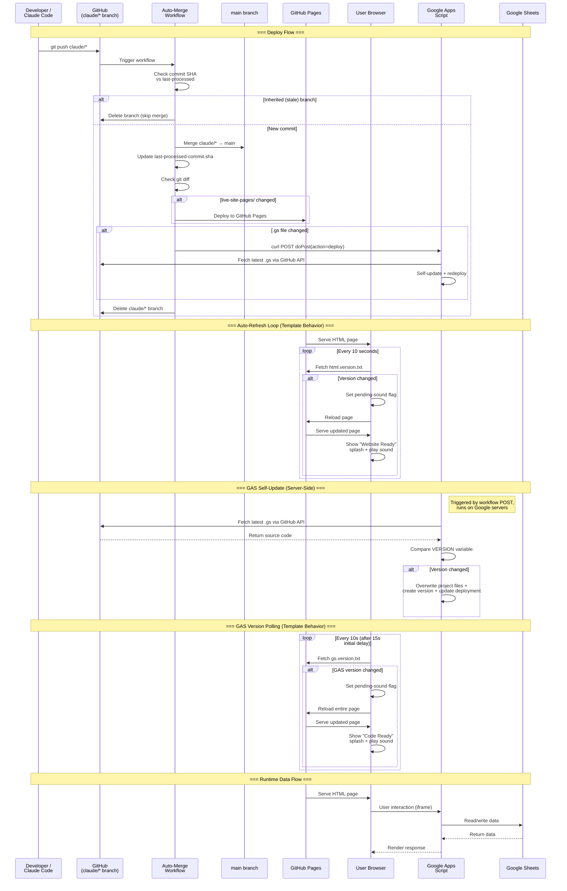
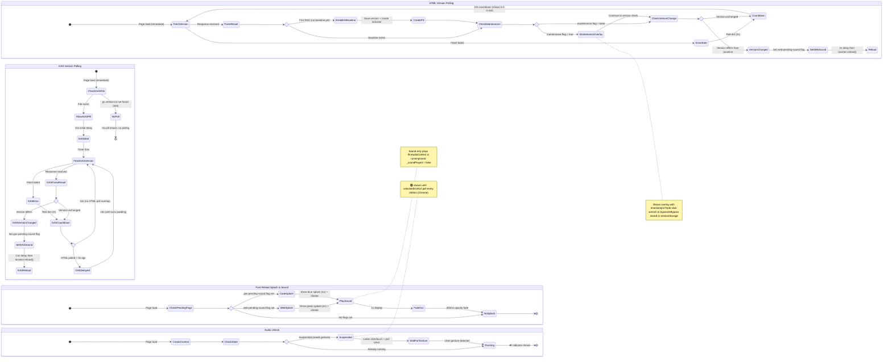
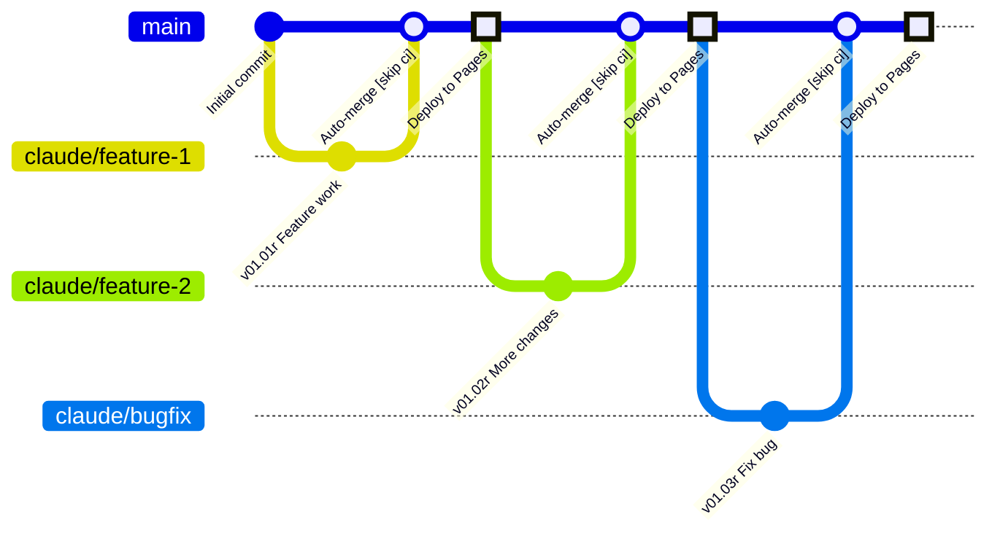
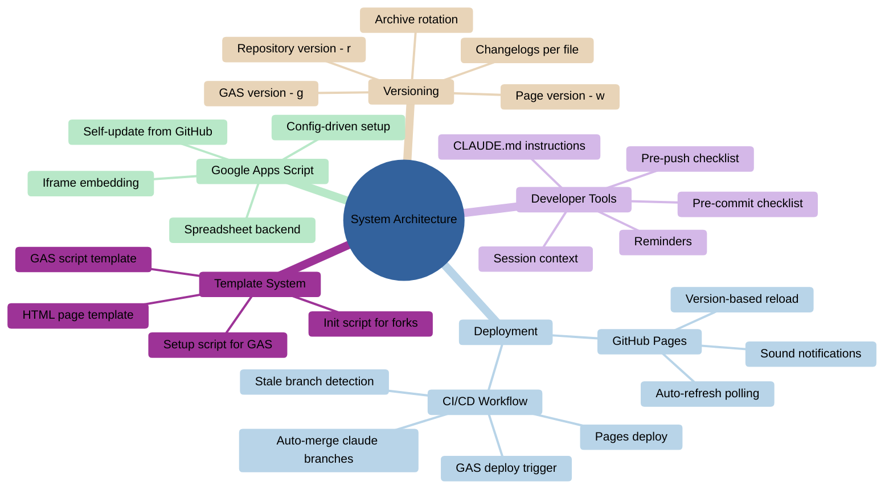
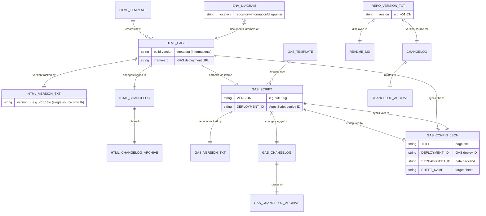
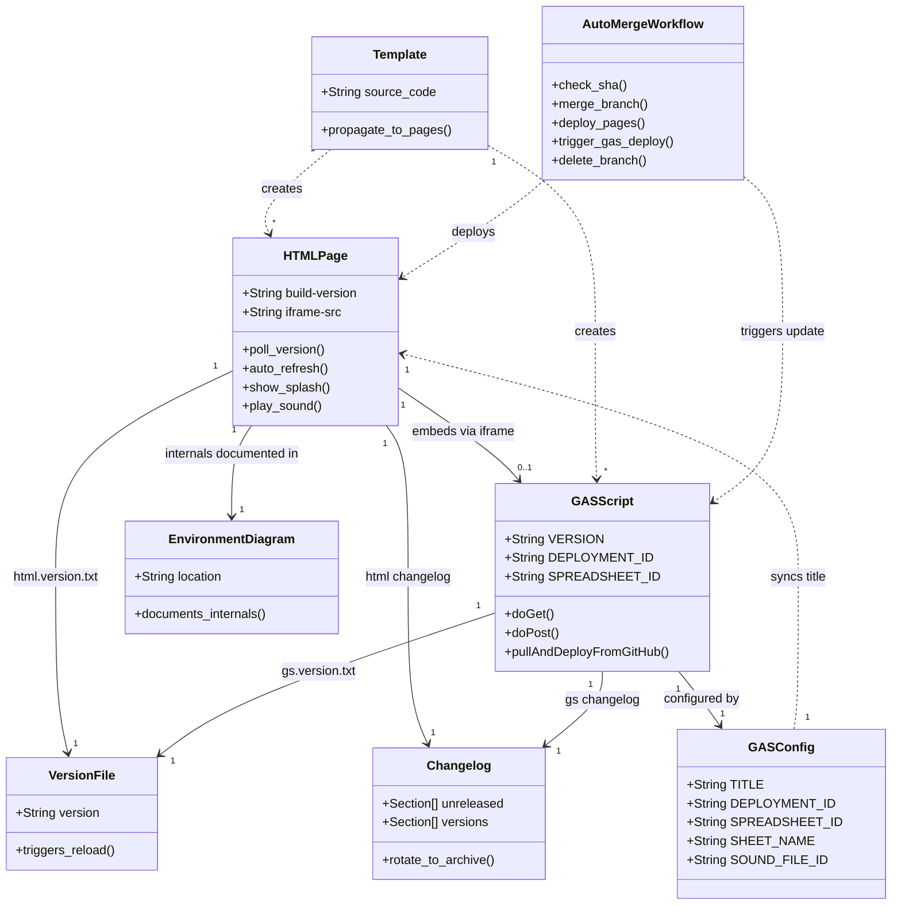

# Project Architecture

> **Scope** — this document covers the repo-wide architecture: how environments connect to each other and to shared infrastructure (CI/CD, GitHub Pages, templates, versioning, developer tools). It does **not** cover the internal processes of individual environments (auto-refresh polling, GAS self-update loops, page lifecycle states, etc.) — those are documented in per-environment diagrams under `repository-information/diagrams/`.

## 1. Flowchart — System Overview

> [Open in mermaid.live — Flowchart](https://mermaid.live/edit#pako:eNqtWG1v2zYQ_iuE-qXpKjvoS9oE6AbXVhyvSmJYTreiLgxaomU2tCiQklOvKbAfsV-4X7IjKcmyXhJvWL4EkJ577u7h3fHk75bPA2KdWaHA8QpN388iBH8yXZgHM2tCYi5pwsX2DElMZULWMcMJiQX_SvxEwOuZZazUX0AFPKU80ly75yXGAdkQxmMi0G9c3C4ZvysTqL-B8_FzGddFfYbTgKA-BDuzvuyj--8B7GtA9xlaCBz5qxoIKJFt_3w_s-JUwut7MNshSBS0BNsfdfsD9PeffyGcJtxeExES2zjrbNcMfc71-FJNYl-J8pvpZDQcOpPvM2sMsaCEozz6X2bWj2pyKuzcpJFH5_WJyHvkXfTm_Qun_wGo-3y9pol6NJtF7xDDMrHhzHwiJQnqfgrTHdvAcZ2pM_emPdfRx8FIQhCNVkTQhAS50rPoqbylMdLSHNWE3ye-4vfo0pkMFeGlMgA-yH-NaVSz1Did_c140FORXPTA7CYOQG5wu5-S7euEO3KFa0w7e003GJ2fA1F_RfxbFIJIAV0u6xUDqKxkGN0QG5qA2DEOiewif4WjkASqjMa9oePNz93eECj1azt7i96hRKTkIeJOKMtcw543Hzhj9_qT1jtmfKueoQ3FyE8FQ-Nrb1rj21mZ7MyxvZ-0qVkAdof6WPfskswYlLe5ftpeksCuWwDFWZWbU75vMW_vwSFNLtIFGitxkZFlTaKkPjV2tDv9ameXcKidMmUtW3f0UdWnC5bIo7rWvBUO-F1v5HGWqp6WHaibVbroUN5tnYpf2uPTMio_h-TvRBsqeKRyluipjvmofdq4lYMfXQ2c3yGd3aSCngvIt84qWTPVvS6OAhqFWox6_04db6pj3qdICOS8i6sgm8JzVAr4qKlcp2O3gTLE0s70s31BMNw5Ba3qgrF5h_rm3T7zA9XDecgI6sWxRJ4vaAwiHjK1qzqqNmvVMpSNbanEe1i3imF7GlCBAmbKhEieChh5_ymHq-tfnQ-fXHc_pk4Ewt5uGasP76vBPhScR4Hs1oAX00t3_tGZePtwdXz2hgipWqZuNfQabEL5gIX203cbvJgxynjY7KdqE8pWi_YzqM6SnA6mSvtpQLHvu76AcHtRMMRymj3rwWphrjVd8J3kW6KKXiWLlCeUG-tFJIK9SKBFuo5J0NCvY30Qh7vUHjPFteeWhu1fDx5vWFutk52vMk9B9a3UTVfkcGjfFu3OoyUNHxC47_ZuBs78slKq5nFnHag4sjChWyXcybo5ZF27yY3rVKqxk12NImVwzIoKszu8lTbjOIB-_AkOKFnZ0odFNUAa1bADfRi5bgsx7E6MGWYabfgtXsCwussWY2TeNkTqjK_rxyyKXf3BAx2MesNJ79JrM7ZptORijZVK3YBiOJG1iRCWcbs0vRAW_grawU9SQVCObMjfmU5HV8M2BUiSwP0joWx4pLyoleyZ2bcxAxWaylytlecjt1KR2a3cbV8Ntcz7GywKUyyCQ8vy8StkdDWazr3-ZDSuzH7TCLJLI5rYSm6ISAXEI5gqK54gUP0WqbcUM_qH1r_x_pyDoDfjZnJQM43tUmtmTlQn5l2wpFBjumMbPZQSQHZHb3L6MAKijloiLsKu3nBmEfxjWN1GL15oVqm_rPKGrOhZERaGSk4P3bPV30EqJrVvReROTz7Np29dY1OaRbltMRvNxai_Rxo0OMoX7P-XTd3whkzz5jRkvSCB1Is7XUJTkAbvxWb1qNHOiVoZc7gkYlMTqBlQuHoIVFrMCnmKD4tMHUHDECYLkoQt7dR8iTXq-i8Md9nlTZ1bQTVAk24VsPiMNMjyF53B3qmWljlUsRhksZnkwGwyopgzBmOnot8h8Iqah5jsaZv9xpJsoQvV7xLQOOzsySt8ehycPvc54-LsyRK-SEswfWIGd3KyWJzgFlyhoMGS5euXr49bsOXv-wJ_ik8L7uPj4zJe9auBLZf4zYuTFlhRCwX4zfGrly0xlHQ5hLuYLBnYJ6cvg7ctYH2bHwI01_MhyPJkNPA3b0-PT_1SdtZza03g8qSBdWZ9h8pfEdXIZzMrIEucMriOfwBGDVRvG_nWmfqN4LllWmJgrlDz8Mc_qB8PpA) — *interactive editor with pan, zoom, and export*

```mermaid
graph TB
    subgraph "Repository: saistemplateprojectrepo"
        direction TB

        subgraph "Developer Workflow"
            DEV["Developer / Claude Code"]
            CB["claude/* branch"]
            DEV -->|"push"| CB
        end

        subgraph "CI/CD — auto-merge-claude.yml [template]"
            direction TB
            TRIGGER{"Push to claude/*?"}
            CB --> TRIGGER
            TRIGGER -->|Yes| SHA_CHECK{"Commit SHA\n= last-processed?"}
            SHA_CHECK -->|Yes| DELETE_STALE["Delete inherited branch\n(skip merge)"]
            SHA_CHECK -->|No| MERGE["Merge into main"]
            MERGE --> UPDATE_SHA["Update\nlast-processed-commit.sha"]
            UPDATE_SHA --> DIFF["Check git diff"]
            DIFF -->|"live-site-pages/ changed"| PAGES_FLAG["pages-changed = true"]
            DIFF -->|".gs changed"| GAS_DEPLOY["Deploy GAS via curl POST"]
            GAS_DEPLOY --> DELETE_BR
            MERGE --> DELETE_BR["Delete claude/* branch"]
            PAGES_FLAG --> DEPLOY_PAGES
            TRIGGER -->|"Direct push to main"| DEPLOY_PAGES
        end

        subgraph "GitHub Pages Deployment"
            DEPLOY_PAGES["Deploy live-site-pages/ to\nGitHub Pages"]
            LIVE["Live Site\nShadowAISolutions.github.io/saistemplateprojectrepo"]
            DEPLOY_PAGES --> LIVE
        end

        subgraph "Environments (Pages)"
            direction LR
            INDEX["[template] index.html\n(Landing Page)"]
            TEST_PAGE["[template] testenvironment.html\n(Test Environment)"]
            GASTPL_PAGE["[template] gas-project-creator.html\n(GAS Project Creator)"]
        end

        subgraph "Google Apps Scripts [template]"
            direction LR
            GAS_INDEX["[template] index.gs"]
            GAS_TEST["[template] testenvironment.gs"]
        end

        subgraph "Shared Resources [template]"
            direction LR
            NOJEKYLL["[template] .nojekyll"]
            SND["[template] sounds/"]
            HTML_VERS["[template] html-versions/"]
            GS_VERS["[template] gs-versions/"]
            HTML_CL["[template] html-changelogs/"]
            GS_CL["[template] gs-changelogs/"]
        end

        subgraph "live-site-pages/templates/ [template]"
            TPL["[template] HtmlAndGasTemplateAutoUpdate.html.txt\n(HTML page template — never bumped)"]
            TPL_VER["[template] HtmlAndGasTemplateAutoUpdatehtml.version.txt"]
            GASTPL_CODE["[template] gas-project-creator-code.js.txt\n(GAS script template)"]
        end

        subgraph "Project Config [template]"
            CLAUDE_MD["[template] CLAUDE.md\n(project instructions)"]
            RULES["[template] .claude/rules/\n(always-loaded + path-scoped rules)"]
            SKILLS["[template] .claude/skills/\n(invokable workflow skills)"]
            REPO_VER["[template] repository.version.txt"]
            DIAGRAMS["[template] repository-information/diagrams/\n(per-environment architecture diagrams)"]
            SETTINGS["[template] .claude/settings.json\n(git * auto-allowed)"]
            SHA_FILE["[template] .github/last-processed-commit.sha\n(inherited branch guard)"]
        end

        subgraph "Scripts [template]"
            INIT_SCRIPT["[template] scripts/init-repo.sh\n(one-shot fork initialization)"]
            GAS_SETUP["[template] scripts/setup-gas-project.sh\n(GAS project file creation)"]
            INIT_SCRIPT -.->|"auto-detects org/repo\nreplaces 22 files"| CLAUDE_MD
        end
    end

    TPL -.->|"copy to create\nnew pages"| INDEX
    GASTPL_CODE -.->|"template source\n(setup-gas-project.sh)"| GAS_INDEX
    GASTPL_CODE -.->|"template source\n(setup-gas-project.sh)"| GAS_TEST
    INDEX -.->|"embeds via iframe"| GAS_INDEX
    TEST_PAGE -.->|"embeds via iframe"| GAS_TEST
    LIVE -.->|"serves"| INDEX
    LIVE -.->|"serves"| TEST_PAGE
    LIVE -.->|"serves"| GASTPL_PAGE
    GAS_DEPLOY -.->|"triggers self-update"| GAS_INDEX
    GAS_DEPLOY -.->|"triggers self-update"| GAS_TEST
    SHA_FILE -.->|"read by"| SHA_CHECK
    UPDATE_SHA -.->|"writes"| SHA_FILE
    HTML_VERS -.->|"version polling"| INDEX
    HTML_VERS -.->|"version polling"| TEST_PAGE
    HTML_VERS -.->|"version polling"| GASTPL_PAGE

    style DEV fill:#4a90d9,color:#fff
    style LIVE fill:#66bb6a,color:#fff
    style SHA_FILE fill:#ef5350,color:#fff
    style DELETE_STALE fill:#ef9a9a,color:#000
    style TPL fill:#ffa726,color:#000
    style GAS_INDEX fill:#ff7043,color:#fff
    style GASTPL_PAGE fill:#ffa726,color:#000
    style CLAUDE_MD fill:#ce93d8,color:#000
    style RULES fill:#ce93d8,color:#000
    style SKILLS fill:#ce93d8,color:#000
    style INIT_SCRIPT fill:#78909c,color:#fff
```

## 2. Sequence Diagram — Deploy & Runtime Flows

> [Open in mermaid.live — Sequence](https://mermaid.live/edit#pako:eNq9Vs1u2zgQfpWBTvYmittDL0YTwE3qOECTGHZaX3yhpZHEDUWqJGXXKHrdB9hH3CfZISnF_0h7aH0RZM7PN_PNN-L3KFEpRv3I4NcaZYI3nOWalXMJ9KuYtjzhFZMWbnAJzLgHClWhht77he5dXQtWpwjXFOXQ53bkXG65HdULb91JvHnvL1hoJpOie-gzGzqfQW1VfI86R-83U_o5E2p1aH7PuHQOpXuGoIdGY5aj2UAJ74dmH7RaGaqMDD-7Z_N-pK7B1EdTKhcIg6oyHuU00byyh-bTAtGaLY_wx1wG0wdlEdSSElJzz8NZHy4vL-m9EmoNQ6rcvbcOZBZfXd2O-pBzC1VtCmj7GgxuR3Q-G_bhSfM8p8Crnf7Nhs3xdYHJMySqLCnOdDTwVSwNCGZsXGmVoDGYBicmLNzJAjW3mELHWCawu9Pxl9AO2Q0KpLLCOZk_8wpKx2dDOQqD8ICrJvteBMdqHzz_L6XBf__862nes3WFfK5SRtl2ccch9IUp2BGXULtrYMqzbGPg6hR8ibGhQuPKTUoPkoLJvO3ETig_Sv2WKauOjJgvV6a7KS5yAxmnWTgdmqasD0mtBYwfp0-QqrEytsMSy5W8TH3C7q4beTTtH6Kltgtqigm5lpy10Abju6NuLt0URRbXoZtnoDGkOVHHPtl74m6Idh6vDbqX-wQzjTTLn5SqoPOEZeXwwwcs2JIr3d2WgG8vZW8k6oDrJcLo6f4TOM6ClXCRPlLCNbx9AwYTJdMtUhrnDYuha4UtxQU5Gerzhf1md4n7Eg6O87aJuAWMJEpN4DKPjaplCplg-Sm3BsiEdixLtyppfyfqDowdcziGqKB1Mo9muHAjTrlYup5HXvuGWk4MnAE91-DhHuH-pyh1O9JPU6PNjkeq4ylPcYdKH4L2VGFBZeCnsFlbVNBi_bK7vArOPUxdSwPEQbNOjY_cEPuLGqBV2c7-BG2tpataJzTML1-0LXlcq5IWO8KXj5Pp3eMDLJnmbCFwsyJPjsdWlEdCu3J7FGhX_Y2J9ZvAwJkvLtHo-tUMIHHRyDFIsURpf5GFFtJYCUFT-Jq0dkRjoMMyS4HfvjPAJbecCUJC09F9VUe5Oa0ih2v5B5VEXePE228VlLsD_S41TWoqoES4YZYd3Ad-bhlugPsh9DccLonb8EWBDs_o4td-n8O4thBcVb0wstSX5nMaDvflszl3IbZRTahSykk7vlLSYHQe0YWAPugpXT-_zyNbYInzqD-PUsxYLew8-kE2jD4N07VMor7VNZ5HgZnmmhr-_PE_DdFqhQ) — *interactive editor with pan, zoom, and export*

## 3. Template-Level Behaviors & Per-Environment Diagrams

The following behaviors are inherited by **all pages** via the HTML/GAS templates (`HtmlAndGasTemplateAutoUpdate.html.txt` and GAS script template). They are documented here because they are template-level — they only change when the templates change, not when individual environments change.

### Template-Level State Diagram

> [Open in mermaid.live — Template State Diagram](https://mermaid.live/edit#pako:eNqVV8Fu4zYQ_ZWBDoXTjdMku7kIaYBsttkesrtGnHQPVRHQEmURK5MCSSUxgpwL9Nx7f7Gf0CEpiZQt2VsDiWVx3sxwOPNm-BKlIqNRHClNNP3AyFKS1fTxNOGAn4xJmmomONzcJty9s4KQRL_efbqB36hUZnkmypLxZRIBUVDoVQkvTtp8fv_xD5hOL-Ca6rRoEDHMyJJCKUgGE7Za0Yyh2gMPCoUtekakordU1aWOAb8rwRUF9I-yR5rtAP4ipZBz43XsFiEnrAwhXsICrkTNdSaeuLGTQSY0TE7VQRsAH4TKuPSQFjT9BufnaSFYSi8uvFTgslUcyHuhUIl1F3UvSqaK90RRDKrxmkmlIbe-T7iARbMCa6oPxjVdmadPhHFNOeEpKmpVAn1mSqtwR1tmnQpJcaMzVpYxzMkjhccmsG8gtUvAeMZSooX0qjxo0I3tOK7M4o44bmqwagOQlww1GaEA9AVdL8k6djKNorwkS_gZtKzpuBJrvsmoq4LwJR1UkpNS9Ta3bXxU3ZXgmvGaghZdiDe2xgVGSrJloUHkgxubF-JJgWhMPTFdgGYrijFeVUnC7ySrSjpNS4b7epKUYzahucW6Ikrh-nv7gEciJGY946CoMo7M8QXW6vaxNY7uO7jeVm0EekAv3de3UYltRdfotlGU7cL1TGYenLE8x0fIpVh1VRRurA-0uuZUf6WLOXqCivAHPNHFtKKY9nw5Vea1TQCvIwBYBbfUsFwMpwoyak5GF5Qj82HVoKkjaZcnPXrp9j3AmyfHCtJufaLsoZ9Nj82JIVU1fPC6SdcfL-fDbL3EvwGytkeHoGukyr1kHQpb9GdhbMSwVEfN6RzpZ21yGHIbmMm743e7FJhcxt-OeezbbcoKZCwGn78Sht3h5ExhNJhmpHQh95hGxscVX3ShvcNqkZBj01Mb_cRLtZb-VzvahtuWM9aP2vVW-LsbEp7lw_6q7HtvjWwBvfS2zm2vdhTnKHxPjYab25JuCxMXgsJEU_sKswW0TrS1eXJ09v3V6WJNkLEf1JqnYzHuF3En7mW8hsFsNIVuur0dtCosp4baq4MxFYj-YPZgwtmhMFrn8FYBWYqee43kiG0Mx8Qon1rlFclMVHtRcCVu4cgZMf6GylSiISR-iKVurRuaGSakmVB66uIP86okqoAfwB6O4yXl3o1R08wd9DWesAr4afOUTAbsa1ChKmvAg7xkoMiIGIa3DsYj_QC7px5FX-HM3cKHs3Yn_LNowRj03LptxT2gc8-NznjSbZ3g6cBSUszxJsCTE3WA49wjW0gMWNiDWh8HdSxKnFb2qOgwLslIRr_Uhp6x1JiBBrzcLG5s7-3x8QonmoqkTK-RJjMa5l_gHaZGuP3-rBS6br0RvFyDsY9tIsfJ57LOmDAjGMUexRTImnOTuAnOVxk82FOZuWrpxrzBnLaK4J4jfXxzWUzsm6EktkNyY3QwgXsSPvHtPWWbjlL9vC_P_Q2nE_YSHm9nFheBGC5L9CJbdyEZkZ_XyuSwIZ7uEcmL0gwHDJxAa0l75OGFbDFhR74W8qMTjOEGOz0mqJ1Uf9Kixhb5xjHg_WV7NbVZ3sP1Hb9X2Mob08jsGu-xYVtq5Dx9_fvP33_5y4xjsfGUCvaLwD-dOLY_zUr8b44fjSXcuOscp0jdazi1-Ty5KnD-bOen1-gwwrEDLxQZXsNfkggb0IomUZxEGc0JdugkMjKk1mKOZBzF5rZyGNVV5m_s7uXrf_q5GsM) — *interactive editor with pan, zoom, and export*

### Per-Environment Diagrams

Environment-specific internals (page lifecycle states, maintenance mode, splash screens, environment-specific workflows) are documented in dedicated per-environment diagrams:

| Environment | Diagram |
|-------------|---------|
| Landing Page (index) | [`repository-information/diagrams/index-diagram.md`](diagrams/index-diagram.md) |
| Test Environment | [`repository-information/diagrams/testenvironment-diagram.md`](diagrams/testenvironment-diagram.md) |
| GAS Project Creator | [`repository-information/diagrams/gas-project-creator-diagram.md`](diagrams/gas-project-creator-diagram.md) |

## 4. Git Graph — Branching Strategy

> [Open in mermaid.live — Git Graph](https://mermaid.live/edit#pako:eNqVks1qwzAQhF9l2XPSxu7Nt0JoEmih0N6qHjbSxhb-kVGkNibk3SsqN6QkMY5Al9nRDB_aPUqjGDPMtVtYagvRQDjS1LV2oFUGAleNdpqqXhQYLWtLjSxAVuQV32-YnLc8Tfr3BcvSeHdtfBr_NUvuZomFp-iBb2PLv5JjTk26iVLNNuez3D7r0TszjY6PbalbkPrzmHVaOue2Mh04A6-U81YguK7lDJarxfI53PchyHQYMr0GmVp4MYFQFtT8lt4GmQ5AwhhKGIe59vlG7y4z_pudAT6EX9Q7CKaxbDFvCGwc2QU0nGDICr0qrPdeoCu4ZoGZQMUb8lXY5EPwUCh96xqJmbOeJ-hbRY7nmnJLdRQPP43zCFQ) — *interactive editor with pan, zoom, and export*

## 5. Architecture — System Topology (mermaid.live only)

> [Open in mermaid.live — Architecture](https://mermaid.live/edit#pako:eNp9UstugzAQ_BXLJ5CSH-CWh5QeGqlKWvUAOSx4A1YAo7WdKIry7zV2oKRSyml3dsY7HnzjhRLIEw5UVNJgYSzhPEcDWcvcV5KyHSPsVFTUyoo43UjzZnO2c5CWRtH1MGWWSpU1jlzfsVXfOVogaqSzLJAJPEeyNUgtmjhd4xlr1SEdnlk5QVtUkZD6FKerGqxAtvTYgcnWO3sWXBSdjrW6RD2AFKcLaxTbIpX4QtGAbB8Ltq78__gOStQT3484Pnr4haQEPZrZLPbsG3O26DrPDnk983WFaHQkwEAOGscY9x5_KctJXVw98fblWncbD4_xu9iTJZvP2WcSsg1wqIfJEGKYDd0w7QMLk74aUJ9MgH35u8Ub-HPUrh--Jy6bx_OBURDuP9jy4gmdz3iD5BYL92pvGTcVNpjxJOMCj2Brk_G744D76_trW_DEkMUZt53LE9cSSoImgPcfYI4D2A) — *interactive editor with pan, zoom, and export*
>
> *This diagram type (`architecture-beta`) is not supported by GitHub's mermaid renderer — use the link above to view it.*

## 6. C4 Context — System Boundaries (mermaid.live only)

> [Open in mermaid.live — C4 Context](https://mermaid.live/edit#pako:eNp1VMGO2jAQ_ZVRTrQCcemJG0uqZaVdFRGqvUSqnHgS3DW2ZTuwCK3Uj-gX9ks6trMBtoUL2J437_nNM6es1hyzWbb4stDK46svFdDHCy8RiqPzuIP-BP78-g2OibBnJPNorP6JtbdodKkSboXWaTXiuB9DmeW4R6kNWpjCQrKOI_XiWGbh8NkKjw4C_xhM57a08BrqWDf9DJVlqqbNMvv03j3p-XGnO8WZPY4Cc2h1L_yyq2BNSye8tkfCwClhzrjRQduXRupDgMw7rydNaFuE5347yVo8TBf5DHbhyJ3VCEXadkyoMXA0Uh8dGEYVY_BWtC1dG-7nBXSGkzFJ8wf2vnxQuwrrxLnUzjuQYo8T0o-TWDoF5sB55kUNYRcOwm-BBd0WG4tuC0ZLKVQ7sL3dMqrVupUYyeMvmobu-P9dapm7KJwb46CorTC-HxtWwIwB3FXIOXLYCwaisWxH_R3KZtJ7AI3VO-gvGzPyryl5NaK5o79kLOJGIsuZZ1Cx-gUVh0bb6LGLatzNW3999aPK6oNDG3p8p2-4S-vU9VEzPowveOhi7z0NUWgF9ZapeHTp9VUO1yhTxC8TtUoRroeAt8LHXA8hGhQH_Bk6BCNPwUro3rh57UmTuwHtZ7V5j2CKZmpQd1bC6luxucL2ZBf-FGj3pHu5eXrs07jZrIor0FDd8yUD09BvYWLpebhrJMj0kN485YMl3EW8YL56iB2ycUavj94ap_-lU5n5LQaaWZlxbFgnKYhvVBOmUxxVnc287XCcpdjlgrUkK22-_QUoHp5t) — *interactive editor with pan, zoom, and export*
>
> *This diagram type (`C4Context`) is not supported by GitHub's mermaid renderer — use the link above to view it.*

## 7. Mindmap — Concept Hierarchy

> [Open in mermaid.live — Mindmap](https://mermaid.live/edit#pako:eNp1VU2P2jAU_CtWKsRWWlp2QSrihqDaRdpKq4ZuL1wc-yVY-EvPDi1C_PfaIRUkIZY4MDN-tueNnVPCDIdkngwGJ6GFn5PT0O9AwXA-zKiD4SO5_P-gKGgmwQ2jxKJQFI9LIw0GYPjpW0YnfBrVNbWBv_5Kj6sRaZYyKmFcoTDLptnsij5VaDbjU7hBn2sUZuwGndQVeKPCtEIjdlvhjWYgx3c3UlFP_dRzPzXpp6Z3qbU-jPuIpz7iuY-Y9BGNxc_n82Cw1UporqjdahIGGuMfHtKj86DIAtlOeGC-RPj8-SKIYwVWmqMC7a9YHC_Cv5YZeacFuCYTx6L0ZoSQI7gdsUZKoYuu6gPQCaNHMWCcIEhDeVeVmlJzoo0XuWDUhwmtBZfrr8sV-W1wn0vzp2czCrAAwiQtOZAMqWa7extPfTCv5gmHaEhYsKurzh0E0Zwu-7JIa454FEUBeNW8GFOEJRbWOpIyFLZlbAoyH5WWUw8kR6Nqp1tHNjoXxYijOIAmDnxpW1UsAuVuB-BJRtkedMvZdY5UAQGVAeeN7tRd6XTsJ1jjhDd4JIeLhIwINjXRlhu21Yxoy5VslV_uqC5CBApHLCDJhYSmoEroAUJsPW02ZQWHMDHO2hgj2-l4W_xaff-iOBHaeSzZnQS9I4yYUUp4EmLB9lI431XYMoS5h0_BVcdiRvvw4rWdi_cuHPwKb0BZGVt8uX5N_evmxxux0Upfy7o-uio6PYJ1eMH_K3KD8bd37Q2HzNxqQtHkMQnXRFHBw4fgtE2qB3-bzLcJh5yW0m-Tc9DQcJ_So2bJPNgJj8klrCtBixCpC3j-B8UWx9w) — *interactive editor with pan, zoom, and export*

## 8. Entity Relationship — File Dependencies

> [Open in mermaid.live — ER Diagram](https://mermaid.live/edit#pako:eNqNVV2PojAU_SsNTzPJ6MxksvvgG5GushE0wJrdxIRUuGKzSElbnBj1v2_5cKzAGnm83HPPPefetkcjYjEYIwO4RUnCyW6VIfVNA2cWLswJRqfTYHA61YEl9nx77obB7wCN0MrYAxeUZUhyEv2FGK0PK-Mefjw13QmezScVOtqSLAGBUpYkCkyzfjA7oYnph_7Ysxc1LezWEAu0pwTRjWoZboBXkl7q0PTGU3uJq0qcSSJVC5KVJeoiGllToIw8Lr0f_6D0_4Dn7g97Ev70524NZ9mGJgXv8Ha03wQfkq5z6QZW8yiB4pBFCkZlCg34DrQ1uRq7J_yW18OL-Y3DDfrWtIvlghU8ArRh_ELekf2I5HvEHjYtB4eOVeFiKvKUHL4GpS1bgJ3FzAyaTT22rIo4VIQZfOo-tUEtk1qoGofdZWjZ5sQzHXTuG0vMomIHmRSqSQk8I6lAbNNqt8o-1oHyE5LTLEHrgqbx4OLvytiBJEiSBD3RTNm8I1LFSfp8EaFB6wM4EDxSOCUExZCn7FB2gn55swvirDWh-93t5doFDJMh2r-9D98_PtGTUD_VxjXDZxt18gq5fW4RaFZ2SzfEeum3b0mPKAsvZvM_DnaD0LZUupnnAvkRp7ls9CHb6mHWD0CXPrCDGVbVcpJAfX4eoL5aqlFq-f6i3FV_inEDiIma3bq8lLK4L7_KdE2n7EQSnoBEYgsgW3I6J-OhSX3_4K06-t52S6QsqnarPJyQM0El44eBtnSvcf0qidevusaL2k_1m8bq2ToqEVsoX4CRkg4bUqRKSZlDCsl8dd0YI7Uo8GIUuXIGmkeuDp7_AVo1I1o) — *interactive editor with pan, zoom, and export*

## 9. Class Diagram — Component Model

> [Open in mermaid.live — Class Diagram](https://mermaid.live/edit#pako:eNqtVdtu4jAQ_RXLT3spaPc1DyuhElokbmrYVqtlZRl7SKw6dmQ7dBHqv69DAsSQti-bp2TOnJnjuTh7zDQHHGEmqbVDQVND85VC_jlY0P1yOlnQFNC-tlbP18QZoVK0LoXkvS0YK7S6hsXGx4KeNayFFVpK0lA-fW4BtHSaGNgYsFkA2Ey_EFt4NaHdW3bE6lLxo_m1LfxukCTMiMJ1KX-MH5LxfHYNDOPFZP5rGs-WZDy8hpPFQzwYJvdxfIFzfQcukMf1QtvQVJRSDhQfQiH1bmR0fifcfbl-S_6tVhuRdslfjpeT-P-JP-IHZDaYdoRO5j9nQzIaT-ITNZD7WHd0JGTnpFzPiLenqbf6lktNu1t4m1GVeviiBsCcj_X7DyqVJwO1wDvhJqltgUY76oD4SaOGZWILnXkHfhSnYFJ40uZ5I_VLkJ9lwJ6JzWjQ27zyJ2tDFQvHlB-6TQq_QzYAmgqQlFpSO13wJLjLiIHMJeR-B1xnwf1eGAakWu72ABrtdTQVCBQFgWO1FUarHJRrboSuFFIz6sKmcs3KimWJUA6MorKdoH45XSgr_H2FUa_3o3lrj1CEMpfLftPBvvvr3iF_6_erj_PCRwjyNXCLtoI2t9AHuc-TVmdG7Gj4gNhRqgidDo-OBQHujXWos8z3C5Da6-O_zW0fILWX8t_mna-ZCLHDS2m82PXuRGzg2r3fPxJPFYmQ3SlmkRNONmU-DWab9CUkMQPew35AaPc0YFyvaEVqxa836l3vdvDjdYTKgvss-Ab7hc6p4P7XuF9hl4GfIRytMIcNLaVb4VfvU_2zEn96HDlTwg2uyc0g1MbXfze3PRE) — *interactive editor with pan, zoom, and export*

Developed by: ShadowAISolutions
