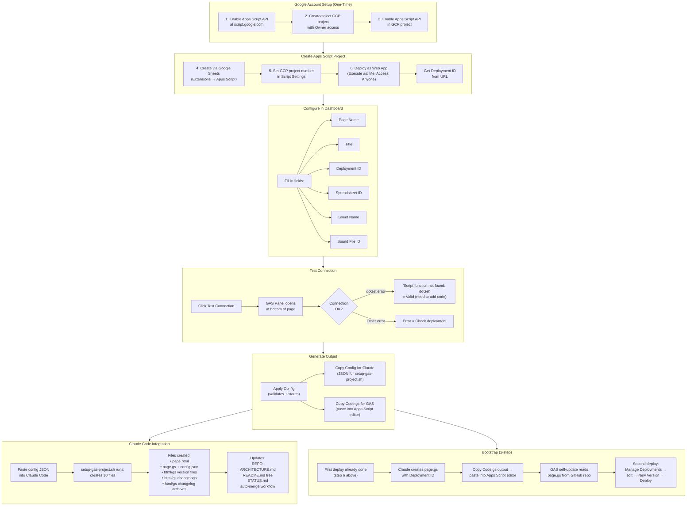

# gas-project-creator.html — User Flow Diagram

User workflow for creating and configuring a new GAS project using the dashboard.

> [Open in mermaid.live](https://mermaid.live/edit#pako:eNp9Vs1y2zYQfpUdHRp3aim1ZOegadKRaMVxKpsak04PdQ8QsZKYUAAHAO16Es_01AfoI_TR8iTdBShbpGzpQIHYH-x-u_uBXzuZltgZdhaFvstWwjhIxzcK6Ger-dKIcgUJuqr846ZzpvWyQBhlma6UC9twECvspvkaf7zp_BkM-ZcckcFRDyZKzNmmLC0kmclLB6PZ-S9z8044sH6jt_R-e5leN130yUW_B5FB4fC1xQIzB2fRDEqjP9OavdzlbgXxnUIDIsvQ2qaLAbkY7IsiV9seWylAt_uOwgh_gyBBJW9UC6AQIR0VFo1zZs94jhic401mcJsLqLFNVojOcmAHk78cKptrZeH7P_9u-2wiHTFMJz0ux3YqoKr1HE2dYx0M6bhcLZsgRQzSmx6cYlnoexAWfsc5n1eHgVlFQQo7hAs85OoTykMYqXutWkWPjrlLKI7gao3UJeen7GZh9Bqur6YtGDyyUQA4GoS_4z04a7XIl5XxUG_WQOmdCruaa2Fkw_97hvl9XhSsssixkHbYUhCkMRNLhEuxxpZsTrI0d0V7P6P9RoItuSR5UlJppeVq7ipw-L7Qz526YCHNlwSKHHeNPUgUOPzAIfpn5p_SP9E_Fy9jmKJ1hJ3i5GjJmCpqF-qzxkEpYxcVefYF9qpx852NEpgJhQXoklq2Hu65do6KrhdQEsBNq8FXX8DaIxvEv_1603nYUuFWelW37aJSXhGUphcGZwhSU6O9YtO38EkUuYQDhSjBaRBSArNasznTE_I4MUYbeAvRCikz-VjFVu4e5DT0ZTrYDpy3vvmzAdnXN4p0Rx67FfHRRn7ycjHiypWV80NDDMZcEHYa4cRcChrH4r4eAD-Xt5wzWVj4CazTBm0z3bjvh6TcGBFuBqJCVBK9_cckvvR7lmm8uxS2WzNHz65argZPriT2ltbbUdW9o1JYx0NIwG_zHsqcomo5CsDGfWrSeB-f-jB9A_LCHwvnyiGJd1owmh75IeYospAq5xaIj4La8tGyY4Seyx5MpeyQHWSeoC0c_Uz8UWCLN6eDwC-kEBSlN_r-93--5Xsrty4aG0suVoix99mGxmchK74m4S0aJvxwVltIl7NaYqGXL0tAmGyV3-7EybN0Xfpu8RFeTWZxd3QVfThPJ1F6fTXprWXYH51e8As4g75NknSUXie1WFROd9doiC7vtPnCXwztSgQKn9aMPq0pfbqH08daO-toSTE-ruGg36V6ls32GQc-N0RHsr6rCqbZeyIDFbqajeANiLm-bY3_uP_UT5uy1kV5_I54mdXHOyOg_aDy1czme4eg6em4Zkz6nll0K18V8JdF8BPaxN-XZ7n7UM1JWOqmC2ayBKmRZA2Er-qFUHyTPSVhN9FxGP4j4hLv4FPdZPwedFsg-5qNQwnHoYLj4_C3S2XhI9BXOXzM-OXmbg46T1e159P6AgqyzVsghkB-XhDWwZ2v2s72Y7d0DjvUlWuRS_qOpZuF2JevVbrrJS5EVRCdPpAOt29yr7LO0JkKDzsB-9NcUCOuw-bD_3RwcKQ) — *interactive editor with pan, zoom, and export*

## Key Design Notes

- **Bootstrap is 2-step** — the GAS web app needs a deployment ID to target itself, but the ID doesn't exist until after the first deploy. So: (1) deploy to get the ID, (2) add the ID to config, (3) re-deploy with the code that references itself
- **Config JSON** — the "Copy Config for Claude" button generates a JSON blob that `setup-gas-project.sh` consumes to scaffold all 10 files automatically
- **GAS Panel** — a collapsible bottom drawer that loads the GAS deployment in an iframe for testing the connection without leaving the page. Resizable via drag handle
- **Dashboard is a developer tool** — unlike `index.html` and `testenvironment.html` which are end-user facing, this page is used by the developer during project setup. It generates config and code, not content

Developed by: ShadowAISolutions
