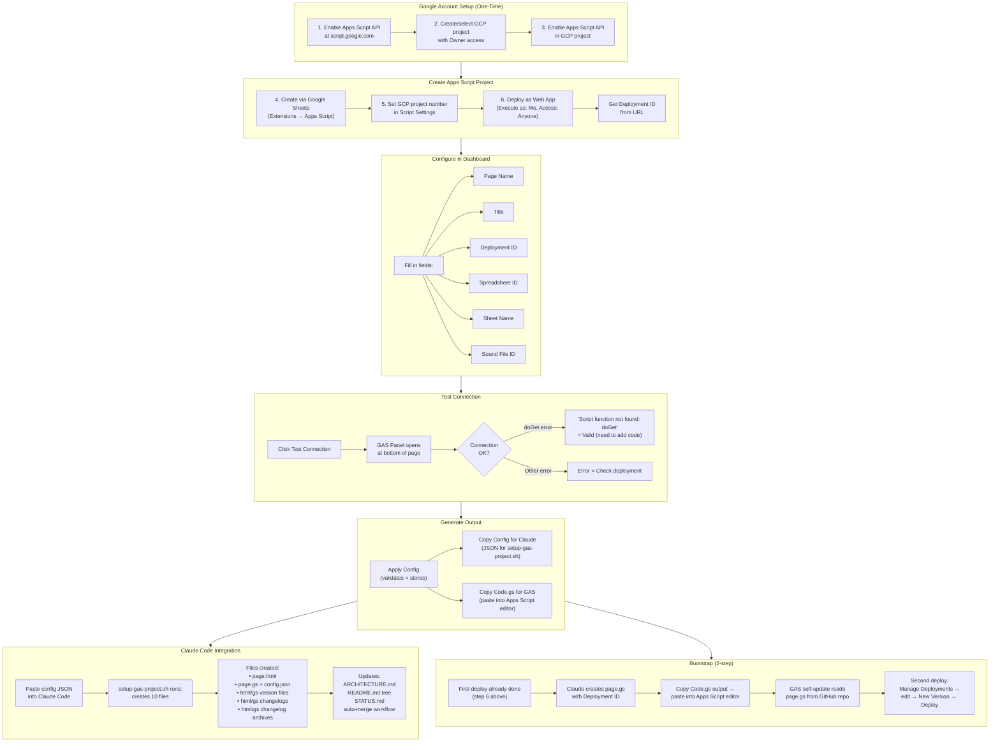

# gas-project-creator.html — User Flow Diagram

User workflow for creating and configuring a new GAS project using the dashboard.

> [Open in mermaid.live](https://mermaid.live/edit#pako:eNp9VsFy2zYQ_ZUdHRp3aim1JOegadKRaMVxKlsei04PdQ8QsaKYkAAHAO16Es_01A_oJ_TT8iXdBShbpGzpQIFY7GL37cMDv3YSLbEz6qxyfZeshXEQT24U0M9Wy9SIcg0LdFX5x03nVOs0Rxgnia6UC9NwMFfYjbMCf7zp_Bkc-bc4IoejHkyVWLJPWVpYJCYrHYwvz35ZmnfCgfUTvdTH7SW6aIboU4h-DyKDwuFrizkmDk6jSyiN_kxjjnKXuTXM7xQaEEmC1jZDDCjEYF8WmdqO2CoBut13lEb4GwQLKnmjWgCFDGmrMGjsc_lM5IjBGW4qg9tMQI3tYo3oLCd2MP3LobKZVha-__Pvdswm0hHDdNzjdmyXAqoqlmjqGutkaI3LVNoEKWKQ3vTgBMtc34Ow8Dsueb86DUwqSlLYEZzjIXefUB7BWN1r1Wp6NGSWUB4hVIHEkrMTDrMyuoDrq1kLBo9sFACOBuFvuAdnrVZZWhkP9WYMVN6JsOulFkY24r9nmN9nec5LVhnm0o5aCwStuBQpwoUosGVbki3OXN6eT2i-UWDLLsm-KKm10nI3dxdw-r7Rz-26YiOdLwmUOe46e5AocfiBU_TPxD-lf6J_rl7GMEbrCDvFxdGQMVVEF-JZY6OYsYvyLPkCe5cx-U7HC7gUCnPQJVG2PtxL7Rw1Xa-gJICbXoOvvoF1RHaY__brTedhawlT6VVN21Wl_EJQml4YnBFITUR7xa5v4ZPIMwkHClGC0yCkBFa1JjnjY4o4NUYbeAvRGqky-djFVu0e5DjwMh5sJ85T3_zegBzrG2W6Y5-7NenRxn78cjPmlSsr5w8NKRhrQZhppDPnVtBxzO_rA-DP5S3XTB4WfgLrtEHbLHfe94ek3DgRbgaiXFQSvf_HxfzCz1mW8W4qbLdWjp5dt0INnkJJ7KXW-1HXfaBSWMeHkIDf1j2UGWXVChSAnfeJpPN9eurT9ATkgd8WzpRDMu9QMJod-UPMWSShVK4tCB8ltRWj5ccIPVc9mErZEQdIvEBbOPqZ9CPHlm7OBkFfaEFYKL3T97__85TvrV2RNyZSblbIsffZBuKzkRe-JuMtGhb8sFfbSJezSjHX6csWECZZZ7c7efJZui49W3yG46vow1k8jeLrq2mvkDx1NR2fnPMLOIOeIYt4HF8varOonO4WaEgp77T5wh8L7SYE9Z7VYj6r1Xy2R84nWjvraEjpPY7hoN-lVpZN5kyClBtSIllfUzkr7D3pgAqEZid4A2Kpb1snf9J_otKmo3U_Hj8hXhb0yQ77tT-jfCuz-17-NyMNa7GkT5lVt_INAX9PhDiBIf6qPM3ch2pJxlI3Q7CILZA4JGsgfEPPheJL7KkIu8mO0_DfDxd4B59qfvF7WNsC2fdsElo4CR2cDMPfroqF7z_f5fAd44ebazmsebqlvZTWd0-wbd6CJgTd84YwDuF813amH9nSOewQKwuRSfqEpUuFhJdvVLrmJa5ElZOSPtAapu_iXiWdkTMVHnYC9ieZICIWYfLhf-TBb0E) — *interactive editor with pan, zoom, and export*

## Key Design Notes

- **Bootstrap is 2-step** — the GAS web app needs a deployment ID to target itself, but the ID doesn't exist until after the first deploy. So: (1) deploy to get the ID, (2) add the ID to config, (3) re-deploy with the code that references itself
- **Config JSON** — the "Copy Config for Claude" button generates a JSON blob that `setup-gas-project.sh` consumes to scaffold all 10 files automatically
- **GAS Panel** — a collapsible bottom drawer that loads the GAS deployment in an iframe for testing the connection without leaving the page. Resizable via drag handle
- **Dashboard is a developer tool** — unlike `index.html` and `test.html` which are end-user facing, this page is used by the developer during project setup. It generates config and code, not content

Developed by: ShadowAISolutions
