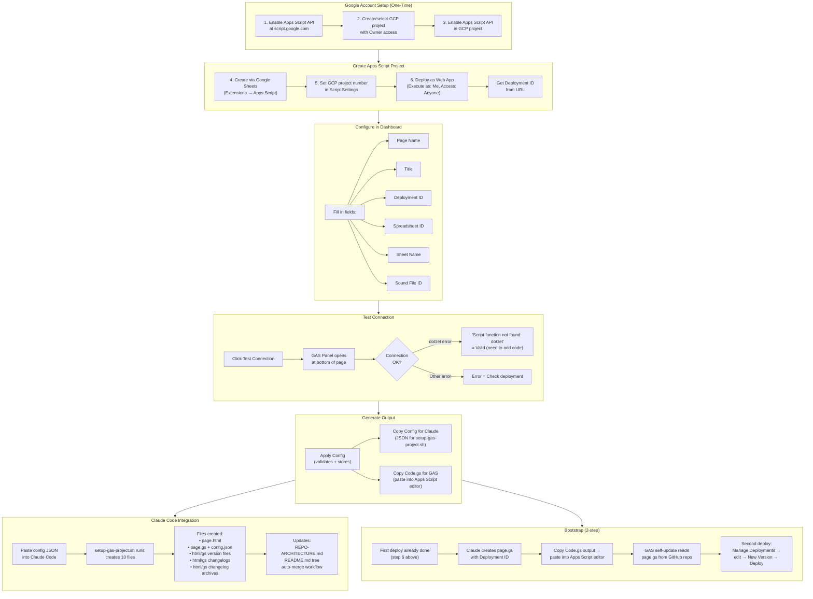

# gas-project-creator.html — User Flow Diagram

User workflow for creating and configuring a new GAS project using the dashboard.

> [Open in mermaid.live](https://mermaid.live/edit#pako:eNp9VsFy2zYQ_ZUdHRp3ajG1ZOegadKRaMVxKpsaS04PdQ8QsaKYUAAHAO16Es_01A_oJ_TT8iXdBShbpGzpQIFY7GL37cMDv3ZSLbEz6CwLfZeuhHEwH90ooJ-tFpkR5Qpm6Kryj5vOmdZZgTBMU10pF6bhIFHYnedr_PGm82dw5N_siByOIhgrsWCfsrQwS01eOhhOz39ZmHfCgfUTUebjRqleN0P0KEQvgtigcPjaYoGpg7N4CqXRn2nMUe5yt4LkTqEBkaZobTNEn0L092WRq-2IrRKg231HaYS_frCgkjeqBVDIkLYKg8Y-02cixwzO8aYyuM0F1NjOVojOcmIH478cKptrZeH7P_9ux2wiHTNMJxG3Y7sUUNV6gaausU6G1rhcZU2QYgbpTQSnWBb6HoSF33HB-9VpYFpRksIO4AIPufuE8gCG6l6rVtPjY2YJ5RFCrZFYcn7KYZZGr-H6atKCwSMbB4Djfvg73oOzVss8q4yHejMGKu9U2NVCCyMb8d8zzO_zouAlyxwLaQetBYJWTEWGcCnW2LItyDbPXdGeT2m-UWDLLsk-K6m10nI3dxdw-r7Rz-26ZCOdLwmUOe46e5AocfiBU_TP1D-lf6J_Ll_GcI7WEXaKi6MhY6qILsSzxkZzxi4u8vQL7F3G5DsbzmAqFBagS6JsfbgX2jlqul5CSQA3vfpffQPriOyQ_PbrTedhawlT6VVN22Wl_EJQml4YnAFITUR7xa5v4ZMocgkHClGC0yCkBFa1JjnnJxRxbIw28BbiFVJl8rGLrdo9yPPAy3l_O3Ge-ub3BuRY3yjTHXviVqRHG_vJy81IKldWzh8aUjDWgjDTSCfhVtBxLO7rA-DP5S3XTB4WfgLrtEHbLDfp-UNSbpwINwNxISqJ3v_jLLn0c5ZlvJsJ262VI7KrVqj-UyiJUWa9H3XdByqFdXwICfht3UOZU1atQAHYpEckTfbpqU_TE5AHfls4Vw7JvEPBeHLkDzFnkYZSubYgfJTUVoyWHyP0XPVgKmUHHCD1Am3h6GfSjwJbujnpB32hBWGh9E7f__7PUz5auXXRmMi4WSHH6LMNxGcjL3xNxls0LPhhr7aRLmeVYaGzly0gTLrKb3fy5LN0XXq2-AyvxtOkO7yKP5zPx_H8-mocrWWYH55e8As4g54monK6u0ZDCnmnzRf-SGiDH1R7Uov4pFbxyR4ZH2ntrKMhpfU4hoNel1pYNhkzChJuSIFkfT0VrKz3dP5VIDI7wRsQC33bOvGj3hOFNp2s-_D46fCykI92WK_92eTbmN338r4Z6bgWSfqEWXYr3wjw90OIE5jhr8iz3H2oFmQsdTMEi9cMiTuyBsI38kIovryeirCb7DgN_91wiXfwqeYVv4e1LZB9z0ahhaPQwdFx-NtVr_Dd57scvl_8cHMdhzVPt7OX0PrOCbbNW9CCoHfeEMYhnO_azvQjWzqHHWLlWuSSPl3pMiHB5ZuUrneJS1EVpKAPtIbpO7tXaWfgTIWHnYD9aS6IiOsw-fA_rkFscw) — *interactive editor with pan, zoom, and export*

## Key Design Notes

- **Bootstrap is 2-step** — the GAS web app needs a deployment ID to target itself, but the ID doesn't exist until after the first deploy. So: (1) deploy to get the ID, (2) add the ID to config, (3) re-deploy with the code that references itself
- **Config JSON** — the "Copy Config for Claude" button generates a JSON blob that `setup-gas-project.sh` consumes to scaffold all 10 files automatically
- **GAS Panel** — a collapsible bottom drawer that loads the GAS deployment in an iframe for testing the connection without leaving the page. Resizable via drag handle
- **Dashboard is a developer tool** — unlike end-user facing pages, this page is used by the developer during project setup. It generates config and code, not content

Developed by: ShadowAISolutions
