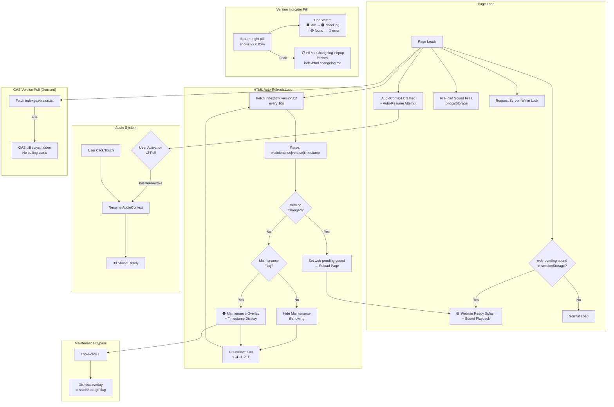

# index.html — Component Interaction Diagram

System architecture showing how the template subsystems interact on the landing page.

> [Open in mermaid.live](https://mermaid.live/edit#pako:eNqFVsFy40QQ_ZUunaBYi90QLi5qKcepsFu1CS7bYUPFHMZS25qyNCM0Izuuda4c4AZ747AUFy4c-SK-gE-gp0eyJNuEXDLT0_P6dc_rlt8FkY4x6AeLVG-iRBQWphczBfRnyvmyEHkCI7HEN1rE97PALcGtZ8F33sv9vVbStg_N0Sn0ei9hkqfCJMMEo9W7WbDBeS9HFUu17BldqviLefFSKjBojNRqYnVBeF_OgscGqoXgEHffotnBW5x7O1H458OH353BSIswRhFvqzsO_BOYuDgwSsV2LqJVh-Uh9I3ewY0uMpESrF-cTpxTG5Sx1FUZeD3UyuKDhWGBwmLsww9Kq3tjNGWGMLAWs9yehhuKKEEm68paYC-lyBX7K5micXhWQ6ojkVaVOo30Vqzo7aIV4Yzx-xKNhUlUICo-AXe0v0iPMVMHb-8oj3FRIJf31fT6TZ0F2whA553II526il2hjRKQKsaHxGZpuMbCvWpoH6zjjrTfwovn5ugusx6JwiAriv73IROSqqmEinBXAe2szCgZkR1EdxcY4hvvV6ut2rrYw0SoJcZdZbXdG2mNMfW6n6CFk4L9-4efKy9ukw6ZI0ynqWuXS83quknMgV2lYtml1Xg3pNj2NdWBZOwl_xu0gKA68pKb1mWCS2lI4tsOwwN4x--VjJHN7rlpDQcc5QJMojdUhA7S_prXL5XHxnqjCGS_hkvNb_95GJ6H4WdheBaGL47pVPS7OI1PA8dCIcX8t3irB7h9fb8XAHVGLCNBLQMjSXc74pEs3Qttrc56hVwmFnKyOdIuZwPru7vw7m5zdIu5UHoTS81uCIPW4Dd9Vsmfv4KMUwQnF36wyBWdilhriAfXghvcb9__BVgUujgZazdMZbTagZdyqpcjnZc5i-GXn4C7dH8EfObiLFxPoml1ZVQ7hVn8P2OAZlo922CyNTS8Osz2A5BLcTtYn5G8bw0WMIisXAtbNd_6zL9ZW-TOm7NKhLmg0cQ3cAe3Kq0nlx-ZrcHaCc7VuK_i8ebTqS6jhJw8HQZqBeQ9H_E3ggv3_sdqwLLpyWq0WuK-08Rwsc2FMU-LelrIPMWas9_1Ird1z_5H53LL12tMmkwaVphfgW66vfvlhAVNkyfT-GowqaY1repm8UP4o0v3xVP24w4bcuNh0Z3vS9Oe7icv8OuePz_n8RKjqkK65gKaTlsDCdtdFjcacqJAveGOCmtO5bBXWjMA9qY6qDdXw5m_hfUPheBZkCHlJ2P64UM6tQlmNLr7syDGhShTSuKRfAR96CZbFQV9W5T4LCjzmDr6UgoqX-aNj_8C8foVWA) — *interactive editor with pan, zoom, and export*

## Key Design Notes

- **No GAS project connected** — the `_e` variable is empty, so no iframe is injected. The GAS version poll fires once, gets a 404, and goes dormant
- **Version sourced from file** — no hardcoded version in HTML; `indexhtml.version.txt` is the single source of truth
- **Sound system** — uses localStorage caching of sound files + AudioContext for playback. UAv2 polling handles audio unlock when a GAS iframe covers the page (not applicable here since no GAS iframe)
- **Maintenance mode** — controlled by prepending `maintenance|` to the version file content. Bypass via hidden triple-click on the wrench emoji

Developed by: ShadowAISolutions
