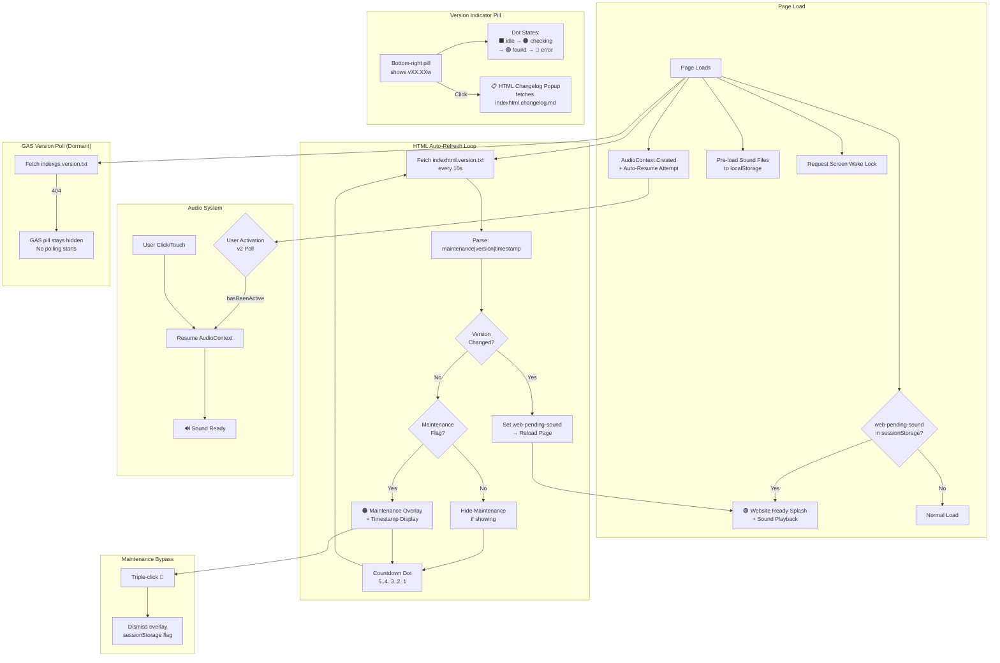

# index.html — Component Interaction Diagram

System architecture showing how the template subsystems interact on the landing page.

## Key Design Notes

- **No GAS project connected** — the `_e` variable is empty, so no iframe is injected. The GAS version poll fires once, gets a 404, and goes dormant
- **Version sourced from file** — no hardcoded version in HTML; `indexhtml.version.txt` is the single source of truth
- **Sound system** — uses localStorage caching of sound files + AudioContext for playback. UAv2 polling handles audio unlock when a GAS iframe covers the page (not applicable here since no GAS iframe)
- **Maintenance mode** — controlled by prepending `maintenance|` to the version file content. Bypass via hidden triple-click on the wrench emoji

Developed by: ShadowAISolutions
