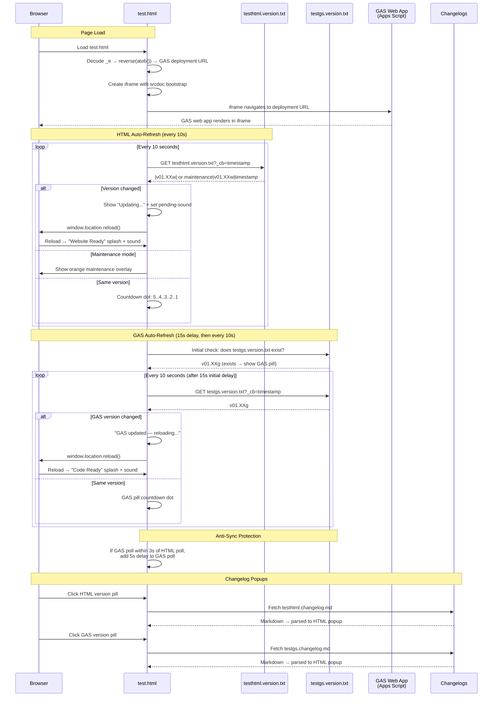

# test.html — GAS Integration Sequence Diagram

Sequence diagram showing the dual polling systems (HTML + GAS) and the iframe injection flow.

> [Open in mermaid.live](https://mermaid.live/edit#pako:eNq1lttuGjEQhl9ltFeggpU07c2qTURJmkYiVRQSmouVIrM7gJVd27UNBCWRetUHqPqEfZKO98AhbA5SVW5AnvH4n5nPY-6CWCUYhIHF71OUMR4KPjY8iyTQR3PjRCw0lw4-GTW3aLYNXy5Oe8AtOLSOTVyW1rgMKgdvZzM0VijJ3K3b9j1e-o7tC56dvnf1X99wCB2tPwzNfoO-LfRjI7Rrbm_q5lq7Ey7HmKqxjWTh81U5BEXnVYm2fF4hnPExQk_xpHArje39_cLsLY8z95alwyH6AsM1wp-fv8Cgzwgb3Klho9nM17z-BHWqFhmSwMvzXk2YrkFOAsWIeoMwF24C1sSJimGolLPOcL2xi4KGlbfkMzGm3VRVVXsSObdpT5lbmCuaU0W51qRYJiQZhCzDPVOwQVjA0Jk61T7HkUE7gYZPeQG7O7bsRqqUhqNyESzVRya2MK2nTcGOjy5qoTm4jocfncjIxDO9tnXQXhbsfrazy66u5vegDGRcSIeSE9_L9Zr9PHUwKI6BOCckWRm3WtKfqDlEwaVOuBNyzBiLAnhDCTnQVDRaals1lfUhlrWeC5moOUtVTFEoPUNU8qTR3Nz1GLvz3CvHJwoIfiuoGefIkwVpsDrlVHiSsnk8phbhdFUKyIjM59XlOSrjS7FexLzvKV88it33tJV9eqZwXZLlKGkJiXIhvGfsHWN7jL1lbHctYiU9__EUc8eDAtdN5HbfWwKdBLbATVDCYwSrS0KbT6RwgqfUb4xvQlKEdcMH8FZYd1BelzXMCprGRLl3sHlHrC-aF6VFmj4HPTT4yFEyXq4odeSym1vX4XjtOmxKe-oy1KjcJN0rnL2a9ijw_lMPOxJ4P35DQWpF_n-nvOvH6KsQfyWGVYcgXufxtQD6GDl9HelEu7-QMZwZssZueerGaSej4kBFB_rxTfN0z4IaFRPTL7f868WTBCp4_biu9jx9A7r-RlXPGZwpPdW2_q3qpiK-Kc6r-u7z3xDro31GF09WgzeugrOsLEi3t0LrlJubvHa-S_TQWqKDdJdZkZhKeb2adQhfEEPY_6OUoBVkaGiOJfSH5y4KaDbQexaEUZDgiE9TFwUP5MNplviGBqEzU2wFBfTlH6Ni8eEvPSfxRQ) — *interactive editor with pan, zoom, and export*

## Key Design Notes

- **GAS iframe injection** — the deployment URL is stored as a reversed+base64-encoded string in `_e`. The iframe uses `srcdoc` with a bootstrap script that reads the URL from `parent._r`, deletes it, then navigates — preventing the URL from being visible in page source
- **Dual polling** — HTML and GAS versions are polled independently with anti-sync protection (if polls align within 3s, GAS poll gets a 5s delay to re-stagger them)
- **Two splash screens** — green "Website Ready" for HTML version changes, blue "Code Ready" for GAS version changes
- **Audio unlock via UAv2** — since the GAS iframe covers the entire page, click events don't reach the parent document. The UAv2 poll detects `navigator.userActivation.hasBeenActive` (propagated from cross-origin iframe clicks) and unlocks AudioContext without needing a direct click on the parent

Developed by: ShadowAISolutions
