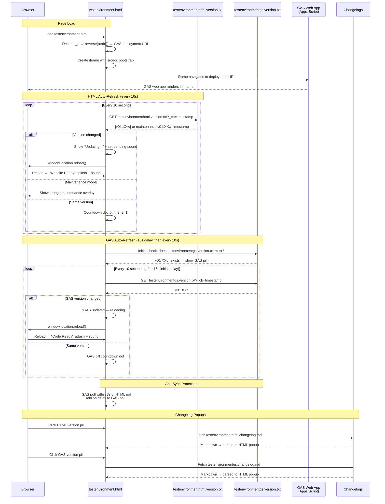

# testenvironment.html — GAS Integration Sequence Diagram

Sequence diagram showing the dual polling systems (HTML + GAS) and the iframe injection flow.

> [Open in mermaid.live](https://mermaid.live/edit#pako:eNq1VttuGjEQ_ZXRPoEKVtK0L6s2UUrSNFJSRZDQPKwUmd0BrOzarm0gKInUp35A1S_sl3S8FwJhQ5Cq8gKy53LOzJkx90GsEgzCwOL3CcoYjwQfGZ5FEuijuXEiFppLB5-Mmlk06xdfLs_PgFtwaB3KqTBKZigdG7ssrbHu19h6UzZFY4WSzN25dbeTOreRfcXpsOe9_Nc3HMCh1h8GZr9B3xZ6sRHaNdedOjmZzpjLEaZqZCNZ2HxVDkFRvqoSLU88hAs-QjhTPCnMysv2_n5x7W82lMYbLWyP0DcDbhD-_PwFBj05bHCnBo1mMz_zVBLUqZr7OHDVPasJ0zHICasYUh8RZsKNwZo4UTEMlHLWGa5XvChoWFlLPhUj8qZaq9pMZNwmn5JmmCOaUXG51oRYJgQZhCzDbahdPyyEczhxqt3FoUE7hoanPIfdHVs2JlVKw3F5CJbqIxNbXC3TpmAnx5evqergJh58dCIjK57ppSj99qJ2D9OdXXZ9PXsAZSDjQlJATmOxOK_x56mDfpEG4lw3ydPlWnd6YzWDKLjSCXdCjhhjUQBviJsDTfWjo7ZVE1kfYlH2mZCJmrFUxRSF6BnSKk8azVWv52Ls5la5kqKARsIK6ksXeTInDFannHpAUFbTY2oRzp9KARmJdDO6nKMyvhTLRcwlkPL5s9g9L7yyTxsK1yFYjkhLSJQL4T1j7xjbY-wtY7tLESvo-Y-X5HfSL5S7qr7d95Y0TwBb4MYo4bkaq3kh51MpnOAp9Rvj25AQ4SvbCfBOWHdQDtGS4gphjUj73sDmzbG-fh6fFmm6aRSgwYeOeHnkooSUM2iuDclJ_ZCsonxpRGoAr-rfg51uPQNR4O0nfgSQ5PjjNxT6rebhv2u_4_fsVsLfUpxVsyBeVum2svQxck0eSifavbmM4cLQbewWWVeynQ6LhIoS-v1OC3fPghoWK9Uft_xLx5MEKkn7fV75vDwXHT9n1dMHF0pPtK1_1zqpiG-LfFXfPf8VsD7aZ3TxuHYzx1UelpW16Zw9qeycm9u8jL5h9D5bEgpRKAkSropEPbBlPW6Pi4bhH1EFrSBDQzsvof9U91FAe4SewSCMggSHfJK6KHgkG057x7c5CJ2ZYCsoRqH871UcPv4F2_sbsQ) — *interactive editor with pan, zoom, and export*

## Key Design Notes

- **GAS iframe injection** — the deployment URL is stored as a reversed+base64-encoded string in `_e`. The iframe uses `srcdoc` with a bootstrap script that reads the URL from `parent._r`, deletes it, then navigates — preventing the URL from being visible in page source
- **Dual polling** — HTML and GAS versions are polled independently with anti-sync protection (if polls align within 3s, GAS poll gets a 5s delay to re-stagger them)
- **Two splash screens** — green "Website Ready" for HTML version changes, blue "Code Ready" for GAS version changes
- **Audio unlock via UAv2** — since the GAS iframe covers the entire page, click events don't reach the parent document. The UAv2 poll detects `navigator.userActivation.hasBeenActive` (propagated from cross-origin iframe clicks) and unlocks AudioContext without needing a direct click on the parent

Developed by: ShadowAISolutions
